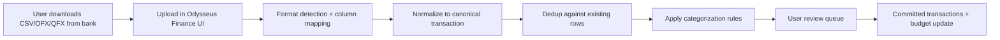

# Banking & budgeting for Odysseus — overview

## Executive summary

Odysseus is a self-hosted AI workspace (FastAPI, SQLite, owner-scoped multi-user auth, Fernet encryption for secrets). Adding banking and budgeting fits the product's "personal life OS" direction: email, calendar, notes, tasks, and documents already live here. A finance module would give users one private place to understand spending without sending credentials to Plaid or a third-party SaaS.

**Core constraint:** Users manually import bank data (CSV, OFX, QFX exports from Wells Fargo, Navy Federal, and other institutions). No live bank API or Plaid sync in scope.

That constraint aligns with Odysseus's self-hosted ethos: the user controls when data enters the system, from files they already download from their bank. Manual import is also how YNAB, Actual Budget, Goodbudget, and Tiller support privacy-conscious users.

## Competitor landscape (2025–2026)

| App | Positioning | Standout features | Import model |
|-----|-------------|-------------------|--------------|
| **YNAB** | Zero-based budgeting discipline | Envelope targets, age of money, loan planner, family sharing | Bank sync + file import (CSV/OFX/QFX) |
| **Monarch** | Couples + holistic finance | Flex vs category budgets, net worth, goals, subscription detection | Plaid aggregation |
| **Copilot** | Premium iOS UX + AI categorization | Adaptive budgets, visual dashboards, Mint CSV migration | Plaid + CSV import |
| **PocketGuard** | "How much can I spend?" | In My Pocket safe-to-spend, bill tracking | Bank sync |
| **Empower (Personal Capital)** | Free investment + net worth | Portfolio tracking, retirement planner | Bank sync |
| **Quicken Simplifi** | Spending plans + watchlists | Custom reports, projected cash flow | Bank sync |
| **Tiller** | Spreadsheet power users | CSV importer with column mapping, import tags, rollback | Auto feed + CSV |
| **Actual Budget** | Privacy-first envelope budgeting | Local-first, sync optional, rule-based categorization | File import, no Plaid required |
| **Goodbudget** | Digital cash envelopes | Envelope method, manual entry | Manual only |
| **Mint (discontinued)** | Free aggregation | Auto-categorization, bill reminders, credit score | Was Plaid; users migrating via CSV |

**Odysseus differentiation:** Self-hosted, no ads, no data resale, AI assistant already in-product for "why did I overspend on dining?" queries, and manual import as the primary path (not a fallback).

## Recommended phasing

### MVP (ship first)

1. **Financial accounts** — manual accounts (checking, savings, credit card, loan)
2. **Transaction import & parsing** — CSV/OFX/QFX upload, Wells Fargo + Navy Federal presets, dedup
3. **Transaction list** — search, filter, review/cleared state
4. **Categories + rules** — basic taxonomy, merchant rules for auto-categorization on import
5. **Category budgets** — monthly limits with spent/remaining (Monarch-style, simpler than full YNAB)
6. **Spending reports** — category breakdown, monthly trends

### Phase 2

7. **Envelope / zero-based budgeting** — assign dollars to categories (YNAB-style)
8. **Recurring bills & subscriptions** — detect from import history
9. **Goals & sinking funds** — vacation, emergency fund progress
10. **Net worth dashboard** — assets minus liabilities over time
11. **Split transactions** — Costco run across groceries + household

### Phase 3

12. **Cash-flow forecasting** — projected balance from bills + recurring
13. **Debt payoff planner** — avalanche/snowball scenarios
14. **Safe-to-spend** — PocketGuard-style single number
15. **Multi-account reconciliation** — mark cleared, statement period close
16. **Household sharing** — partner view (owner-scoped, Odysseus already has multi-user)
17. **AI finance insights** — agent tools over encrypted local data

## Manual import strategy

**Design principles (from Tiller, YNAB, Actual Budget):**

- **Import batches are first-class** — tag every row with `import_batch_id` so users can delete a bad upload
- **Idempotent dedup** — hash on `(account_id, date, amount, normalized_payee)` with fuzzy fallback
- **Bank presets** — Wells Fargo (signed amount), Navy Federal (split Debit/Credit), generic CSV mapper
- **OFX/QFX preferred when available** — structured FITID for dedup; no column guessing
- **No silent overwrite** — conflicts go to review queue
- **Balance optional** — running balance from CSV is informational; account balance is user-editable or computed

## Odysseus technical grounding

| Area | Current pattern | Finance module should |
|------|-----------------|----------------------|
| Database | SQLite + SQLAlchemy (`core/database.py`) | New tables with migrations |
| Encryption | `EncryptedText`, `src/secret_storage.py` Fernet | Encrypt payee, memo, account numbers |
| Multi-user | `owner` column on most models | All finance rows owner-scoped |
| Auth | `AuthManager`, 2FA, session cookies | Reuse; finance routes require auth |
| File import | Contacts CSV, memory JSON, calendar ICS | Similar upload → parse → validate flow |
| UI | Static JS modules (`static/js/`) | New `finance.js` module or tile |
| Backup | `scripts/odysseus-backup` snapshots `data/` | Finance data in `app.db`; document in backup guide |
| Agent | Tools in `src/agent_tools/` | Optional `finance_*` read-only tools (phase 3) |

## Success metrics

- User can import 90 days of Wells Fargo or Navy Federal transactions in under 5 minutes
- Duplicate rate after re-import < 1% with FITID or dedup hash
- Category assignment > 70% automatic via rules after 2 import cycles
- Budget view loads in < 500ms for 10k transactions (indexed queries)
- Zero finance data in logs, agent prompts, or unencrypted columns

## Open questions

- **UI surface:** New top-level "Finance" tile vs. subsection under Documents/Notes?
- **CalDAV/email tie-in:** Link recurring bills to calendar reminders (phase 3)?
- **Export:** QIF/OFX export for tax prep?
- **Mobile:** Responsive web first; native later?

## Related documents

- [Feature inventory](01-feature-inventory.md)
- [Manual import pipeline](02-manual-import.md)
- [Security standards](security/financial-data-security.md)
- Individual feature plans in [features/](features/)
