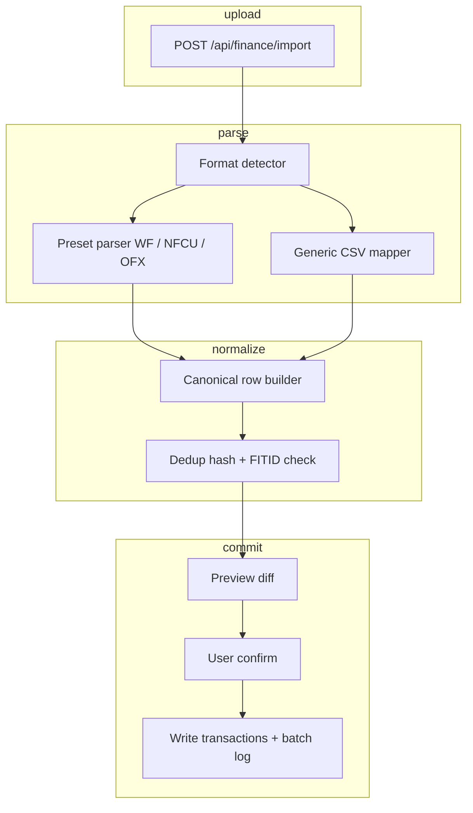

# Manual import pipeline design

Design for importing banking data from Wells Fargo, Navy Federal, and generic CSV/OFX/QFX exports. **No live bank API or Plaid sync.**

## User workflow

1. User logs into bank website (desktop browser recommended for Navy Federal)
2. Navigates to Account Activity / Transaction History
3. Selects date range (note institution limits: Wells Fargo ~18 months, Navy Federal ~90–180 days per export)
4. Downloads **CSV**, **QFX**, or **OFX**
5. In Odysseus Finance → Import, selects target account (or creates one)
6. Uploads file; system detects format and maps columns
7. Reviews preview (new, duplicate, conflict rows)
8. Confirms import; transactions appear in register

## Supported formats (priority order)

| Format | Why prioritize | Dedup key |
|--------|----------------|-----------|
| **QFX/OFX** | Structured; includes FITID | `fitid` + account |
| **CSV (bank preset)** | Most common user export | Content hash |
| **CSV (generic mapper)** | Fallback for any institution | Content hash |

## Institution presets

### Wells Fargo

**Export path:** Account Activity → Download Account Activity → Comma Separated (CSV) or Quicken (QFX)

**Typical CSV columns:**

- `Date` — MM/DD/YYYY
- `Amount` — signed decimal (negative = outflow)
- `Description` or `Memo` — payee text
- Sometimes `Check Number`, `Balance`

**Parser notes:**

- Single signed `Amount` column (standard shape)
- Date parse: `%m/%d/%Y`
- Strip currency symbols and commas from amounts
- QFX preferred: includes `FITID` for reliable dedup

### Navy Federal (NFCU)

**Export path:** navyfederal.org (desktop) → Account → Transaction History → Export → CSV or QFX

**Typical CSV columns:**

- `Date`
- `No.` — internal reference (ignore or store as `external_id`)
- `Description`
- `Debit` — positive outflow
- `Credit` — positive inflow
- `Balance` — optional running balance

**Parser notes:**

- **Split Debit/Credit columns** — compute `amount = credit - debit` (or credit positive, debit negative per accounting convention; pick one and document)
- No signed Amount column; this trips naive parsers
- UTF-8 encoding; watch for Windows-1252 on older exports
- Credit card exports may have shorter history (~90 days) than checking (~180 days)
- Each account exports separately; user imports one file per Odysseus account

### Generic CSV

**Column mapping UI** (Tiller-inspired):

| Odysseus field | Required | Common bank headers |
|----------------|----------|-------------------|
| `date` | Yes | Date, Transaction Date, Posting Date |
| `amount` | Yes* | Amount, Transaction Amount |
| `debit` + `credit` | Yes* | Debit, Credit, Withdrawal, Deposit |
| `payee` | Yes | Description, Payee, Memo, Name |
| `memo` | No | Memo, Notes, Category (bank-side) |
| `check_number` | No | Check No., Check Number, No. |
| `balance` | No | Balance, Running Balance |

*Either signed amount OR debit+credit pair.

**Advanced options:**

- Reverse credit/debit polarity (some banks invert signs)
- Skip preamble rows (account summary headers before column row)
- Date format picker
- Decimal separator (`.` vs `,`)
- Encoding selector (UTF-8, Latin-1)

## Canonical transaction model (post-parse)

```python
# Conceptual — see feature plans for SQLAlchemy models
{
    "account_id": "uuid",
    "date": "2025-06-15",           # posting date
    "amount_cents": -4599,          # integer cents, outflow negative
    "payee": "WHOLE FOODS",
    "memo": "",
    "check_number": null,
    "fitid": "20250615001",         # from OFX, else null
    "import_batch_id": "uuid",
    "dedup_hash": "sha256(...)",
    "category_id": null,            # filled by rules or user
    "status": "pending_review",     # pending_review | cleared | reconciled
}
```

## Import pipeline architecture



## Dedup strategy

**Tier 1 — FITID match (OFX/QFX):** If `fitid` exists for account, skip as duplicate.

**Tier 2 — Content hash:**

```
hash = SHA256(account_id | date | amount_cents | normalize(payee))
```

Normalize payee: uppercase, strip punctuation, collapse whitespace.

**Tier 3 — Fuzzy match (review queue):** Same date, same amount, payee Levenshtein < 3 → flag as "possible duplicate" for user.

**Import batch tag:** Every imported row stores `import_batch_id`. User can delete entire batch (Tiller import tag pattern).

## API surfaces

| Endpoint | Method | Purpose |
|----------|--------|---------|
| `/api/finance/import/preview` | POST | Upload file, return parsed preview + stats |
| `/api/finance/import/commit` | POST | Confirm preview, write rows |
| `/api/finance/import/batches` | GET | List import history |
| `/api/finance/import/batches/{id}` | DELETE | Roll back batch |
| `/api/finance/import/presets` | GET | List bank presets (WF, NFCU, generic) |

## UI surfaces

- **Import wizard** — drag-drop zone, account picker, format auto-detect badge
- **Column mapper** — shown only for generic CSV; save mapping as user preset
- **Preview table** — color-coded: green=new, gray=duplicate, yellow=conflict
- **Import log** — batch list with row counts, date, delete action

## Implementation phases

### MVP

- QFX/OFX parser (use `ofxparse` or similar library; evaluate license)
- Wells Fargo + Navy Federal CSV presets
- Generic CSV mapper with saved mappings
- Dedup tiers 1–2
- Import batch create/delete

### Polish

- Fuzzy duplicate review (tier 3)
- Multi-account CSV split (one file, multiple accounts)
- Balance history import from CSV Balance column
- Scheduled import reminder (ntfy: "Export your bank CSV")

## Dependencies

- [account-aggregation.md](features/account-aggregation.md) — accounts must exist before import
- [import-dedup-review.md](features/import-dedup-review.md) — review queue UX
- [rules-auto-categorization.md](features/rules-auto-categorization.md) — post-import categorization

## Security considerations

- Uploaded files processed in memory or temp dir; **delete temp files immediately** after parse
- Never log raw file contents or account numbers
- Encrypt `payee`, `memo` at rest via `EncryptedText`
- Import endpoints require authenticated owner scope
- Rate-limit uploads (e.g., 10 files/hour/user)

## Open questions

- Support **PDF statement parsing**? High effort; defer unless strong user demand
- **QIF** format? Older banks; low priority
- Store original file blob encrypted for audit, or discard after parse?

## Effort estimate

**L** — parsing edge cases and institution presets dominate testing surface.
