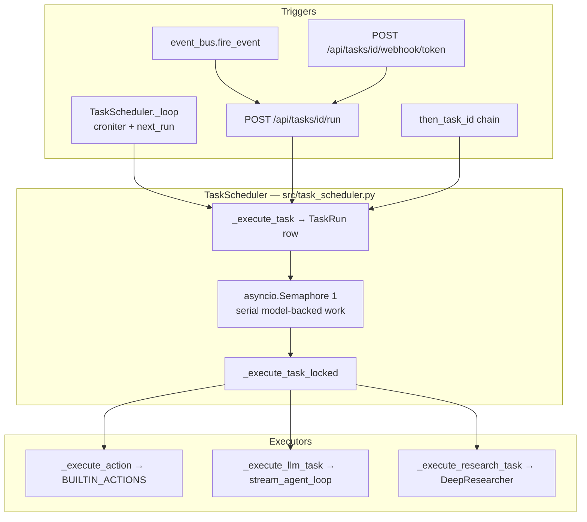

# Odysseus tasks & jobs system — performance tracking findings

**Date:** 2026-06-27  
**Branch:** `feat/performance-tracking`  
**Source:** Agent 2 exploration (task systems)  
**Scope:** Task scheduler, background jobs, asyncio loops, event bus, agent loops, cron/CLI drivers, execution models

---

## Architecture summary

Odysseus does **not** use Celery, APScheduler, or RQ. Background work runs inside the **asyncio** event loop of the FastAPI/uvicorn process, with a few **external cron escape hatches**.



### Core components

| Component | Path | Role |
|-----------|------|------|
| Central scheduler | `src/task_scheduler.py` | `TaskScheduler` — cron, event, webhook, manual dispatch |
| Persistence | `core/database.py` | `ScheduledTask` + `TaskRun` rows in SQLite |
| Event triggers | `src/event_bus.py` | `fire_event(name, owner)` → matching tasks |
| Startup wiring | `app.py` | `_startup_event` / `_lifespan` starts scheduler + loops |
| Task API / CLI | `routes/task_routes.py`, `scripts/odysseus-tasks` | CRUD, run-now, webhook, notifications |
| Agent execution | `src/agent_loop.py` | `stream_agent_loop` (no `agents/` package) |
| Detached bash jobs | `src/bg_jobs.py`, `src/bg_monitor.py` | `subprocess.Popen` + poll → auto-continue |
| Deep research | `src/deep_research.py`, `services/research/research_handler.py` | Scheduled + UI research |

### Concurrency model

- **Serial** execution for model-backed scheduled tasks: `asyncio.Semaphore(1)` on `TaskScheduler`.
- Pure housekeeping actions can bypass the model slot.
- Each dispatch uses `asyncio.create_task(self._execute_task(...))`.
- **No multi-process worker pool** for scheduled tasks. `uvicorn --workers N` would mean N independent schedulers unless gated by env vars.

### External cron flags

| Env var | Effect |
|---------|--------|
| `ODYSSEUS_INPROCESS_TASKS=0` | Skip in-process `TaskScheduler`; drive firing externally |
| `ODYSSEUS_INPROCESS_POLLERS=0` | Skip email poller; use `scripts/odysseus-mail poll-scheduled` |

Cron semantics come from **croniter** + `next_run` in SQLite, not from a third-party scheduler library.

---

## Task types

### 1. Scheduled tasks (`ScheduledTask.task_type`)

| Type | Executor | Path |
|------|----------|------|
| `llm` | Agent loop or simple LLM call | `src/task_scheduler.py` → `_execute_llm_task`, `_run_agent_loop` |
| `action` | Built-in action registry | `src/builtin_actions.py` → `BUILTIN_ACTIONS` |
| `research` | DeepResearcher (10 min cap) | `src/task_scheduler.py` → `_execute_research_task` |

#### Housekeeping defaults (`HOUSEKEEPING_DEFAULTS` in `src/task_scheduler.py`)

| Action | Trigger | Default schedule |
|--------|---------|------------------|
| `tidy_sessions` | event: `session_created` ×5 | — |
| `tidy_documents` | event: `document_created` ×5 | — |
| `consolidate_memory` | event: `memory_added` ×5 | — |
| `tidy_research` | event: `research_completed` ×5 | — |
| `audit_skills` | event: `skill_added` ×5 | — |
| `summarize_emails` | cron | `0 */2 * * *` (ship_paused) |
| `draft_email_replies` | cron | `0 */2 * * *` |
| `extract_email_events` | cron | `0 */1 * * *` |
| `classify_events` | cron | `0 6,18 * * *` |
| `check_email_urgency` | cron | `0 * * * *` |
| `sync_local_emails` | cron | `*/20 * * * *` |

#### User-facing built-in actions (`BUILTIN_ACTIONS` in `src/builtin_actions.py`)

`tidy_sessions`, `tidy_documents`, `consolidate_memory`, `tidy_research`, `summarize_emails`, `draft_email_replies`, `extract_email_events`, `classify_events`, `daily_brief`, `learn_sender_signatures`, `ssh_command`, `run_script`, `run_local`, `test_skills`, `audit_skills`, `check_email_urgency`, `cookbook_serve`, `sync_local_emails`

#### Infra-only loops inside scheduler (not user tasks)

- `_note_pings_loop` → `action_ping_notes` every 60s — `src/task_scheduler.py`
- `_event_pings_loop` (defined; calendar path consolidated into notes)

### 2. App startup asyncio loops (`app.py`)

| Loop | Interval | Path |
|------|----------|------|
| Background job monitor | 5s poll | `src/bg_monitor.py` |
| MCP connect | once | `app.py` `_startup_mcp_connections` |
| Tool index warmup | once | `app.py` `_warmup_tool_index` |
| Endpoint warmup/keepalive | 60s | `app.py` `_keepalive_loop` |
| Null-owner sweep | 1h | `app.py` `_null_owner_sweep_loop` |
| Nightly skill audit | ~02:00 local | `app.py` → `routes/skills_routes.run_scheduled_skill_audit` |
| Cookbook serve lifecycle | 60s | `src/cookbook_serve_lifecycle.py` |
| Upload cleanup | continuous | `app.py` via `upload_cleanup_func` |

### 3. Email pollers

| Poller | Cadence | Path |
|--------|---------|------|
| Scheduled email delivery | 30s | `routes/email_pollers.py` → `_scheduled_email_poller` |
| Auto-summarize pass (CLI/cron) | on-demand | `scripts/odysseus-mail poll-summary` |

### 4. Chat-adjacent background work

| Work | Path | Mechanism |
|------|------|-----------|
| Post-response memory/skill extraction | `routes/chat_helpers.py` | `_spawn_bg` → `_run_extraction_jobs_sequentially` |
| Webhooks | `src/webhook_manager.py` | `fire_and_forget` |
| Auto session naming | `routes/chat_helpers.py` | `_spawn_bg` |
| Teacher escalation | `src/teacher_escalation.py` | `asyncio.create_task` |
| Detached agent runs (SSE disconnect) | `src/agent_runs.py` | `asyncio.create_task(_drain)` |
| Deep research (UI) | `services/research/research_handler.py` | `asyncio.create_task(_run())` |

### 5. Agent bash background jobs

| Component | Path | Model |
|-----------|------|-------|
| Launch detached shell | `src/bg_jobs.py` | `subprocess.Popen` (setsid / `DETACHED_PROCESS`) |
| Auto-continue on finish | `src/bg_monitor.py` | asyncio poll → `stream_agent_loop` |

### 6. Event bus triggers (`fire_event`)

Events: `session_created`, `message_sent`, `memory_added`, `skill_added`, `document_created`, `document_updated`, `email_received`, `research_completed`

Emitters span `routes/session_routes.py`, `routes/chat_helpers.py`, `routes/memory_routes.py`, `routes/skills_routes.py`, `routes/document_routes.py`, `routes/email_routes.py`, `services/research/research_handler.py`, and others.

---

## Execution model

| Pattern | Where used |
|---------|------------|
| **async coroutines** | TaskScheduler, all startup loops, agent loop, research, email pollers |
| **`asyncio.create_task`** | Task dispatch, bg monitor, research, teacher escalation, chat `_spawn_bg`, `agent_runs` |
| **`asyncio.to_thread`** | IMAP sync, subprocess in builtin actions, email routes, null-owner sweep |
| **`subprocess.Popen` (detached)** | `src/bg_jobs.py` bash tool jobs |
| **`subprocess.run` via to_thread** | `action_ssh_command`, `action_run_script`, `action_run_local` in `src/builtin_actions.py` |
| **`ThreadPoolExecutor`** | `src/service_health.py` bounded fan-out probes only |
| **`FastAPI BackgroundTasks`** | Rare (e.g. `routes/codex_routes.py` email send shim) |
| **External cron / CLI** | `scripts/odysseus-mail`, `scripts/odysseus-tasks` (read/manage DB, no executor) |

---

## Lifecycle: define → queue → start → complete / fail

### Define

- DB row: `ScheduledTask` (`core/database.py`)
- Triggers: `schedule` (once / daily / weekly / monthly / cron via **croniter**), `event`, `webhook`
- API: `POST /api/tasks` (`routes/task_routes.py`)
- Defaults seeded per owner: `TaskScheduler.ensure_defaults`

### Queue

- Due tasks: `next_run <= now` polled in `_check_due_tasks`
- Manual / webhook / event: `run_task_now` adds to `_executing` set
- **TaskRun** created with `status="queued"` before semaphore wait

### Start

- `status` → `"running"`, `started_at` reset to actual start
- `_set_run_progress(run_id, message)` for live Activity UI text
- Cancellation: `stop_task` cancels asyncio task + `_mark_run_aborted`

### Complete / fail

| Outcome | TaskRun.status | Notes |
|---------|----------------|-------|
| Success | `success` | `next_run` recomputed; optional notification |
| Error | `error` | `run.error` populated |
| No-op | `skipped` | `TaskNoop` exception |
| Deferred | run row **deleted** | `TaskDeferred`; `next_run` pushed forward |
| User stop | `aborted` | `asyncio.CancelledError` |
| Stale on restart | `aborted` | Startup sweep in `TaskScheduler.start` |

### TaskRun schema hooks (mostly unused today)

`TaskRun` columns in `core/database.py`: `tokens_used`, `steps` (JSON tool log), `model` (populated on success). `tokens_used` and `steps` are defined but not consistently written during execution.

---

## Existing hooks

Instrumentation-ready surfaces already in the codebase:

| Hook | Location | Notes |
|------|----------|-------|
| **TaskRun lifecycle** | `core/database.py`, `src/task_scheduler.py` | queued / running / success / error / aborted / skipped + timestamps |
| **`_set_run_progress(run_id, message)`** | `src/task_scheduler.py` | Live progress into `TaskRun.result` (Activity panel) |
| **`progress_cb` on builtin actions** | `src/task_scheduler.py` → `_execute_action` | Email tasks pass callback from scheduler |
| **`fire_event(name, owner)`** | `src/event_bus.py` | Cross-cutting triggers (not metrics today) |
| **`add_notification` / `GET /api/tasks/notifications`** | task routes | Completion toasts |
| **Unstructured logs** | `src/task_scheduler.py` | `logger.info(f"Task '{task.name}' completed (run {run_id})")` |
| **`_spawn_bg` + `_BG_TASKS` set** | `routes/chat_helpers.py` | Pattern for tracking fire-and-forget chat tasks |
| **`webhook_manager.fire_and_forget`** | `src/webhook_manager.py` | External event emission on chat complete |
| **GPU detection** | `services/hwfit/hardware.py` | `nvidia-smi` static hardware probe, not continuous sampling |
| **Probe timing template** | `src/service_health.py` | Bounded fan-out with timing budgets |

**No existing performance-tracking code** was found: no psutil sampler, no OpenTelemetry, no task↔GPU correlation.

---

## Recommended instrumentation

### Primary wrap point: `_execute_task_locked` (highest ROI)

Treat **`TaskScheduler._execute_task_locked`** in `src/task_scheduler.py` as the canonical **"Task B started"** boundary. All scheduled task types (cron, event, webhook, manual, chain) converge here after the semaphore.

```python
# Pseudocode — wrap the try/finally around _execute_task_locked body (~lines 756–1042)
async with task_instrumentation(run_id, task_id, task.name, task.action, task.task_type):
  ...
```

Responsibilities of `task_instrumentation`:

1. Set `contextvars` for `run_id`, `task_id`, `task_name`, `task_type`, `trigger`
2. Emit `task.run.lifecycle` events (started / completed / failed)
3. Start per-run resource aggregation (peak CPU/RAM/GPU)
4. On exit: write aggregates to `TaskRun` (new `metrics_json` column or reuse `steps`)
5. Clear contextvars in `finally`

This single wrap captures **all** scheduled task types without touching every executor.

### Secondary wrap points

| Location | Why |
|----------|-----|
| `_spawn_bg` in `routes/chat_helpers.py` | Memory/skill extraction jobs |
| `start_bg_monitor` loop in `src/bg_monitor.py` | Detached bash follow-ups |
| `ResearchHandler.start_research` in `services/research/research_handler.py` | UI deep research |
| `agent_runs.start` in `src/agent_runs.py` | Live chat agent runs |
| Each `app.py` startup loop | Infra CPU baseline |
| `stream_agent_loop` in `src/agent_loop.py` | Per-round tool spans (child of task run) |

Use the same event schema with `source: "scheduled" | "chat" | "bg_job" | "research" | "infra"`.

### Patterns that fit existing conventions

1. **Context manager + `contextvars`** — propagate `run_id` / `task_id` into `stream_agent_loop`, builtin actions, and `progress_cb` without threading args everywhere.
2. **Extend `TaskRun`** — add `metrics_json` (or use `steps` column) for peak CPU/RAM/GPU, sample count, child span IDs. Populate `tokens_used` from agent loop metrics (field exists but is never written today).
3. **Reuse `progress_cb`** — append structured progress: `{"phase":"extract","pct":40}` alongside human text.
4. **Parallel sampler coroutine** — one process-wide `asyncio.create_task(resource_sampler_loop)` started in `app.py`, writing time-series to SQLite/JSON keyed by `active_run_id` from contextvar.
5. **Event bus extension** — optional `fire_event("task_run_started", owner, meta={run_id,...})` for subscribers without coupling scheduler to storage.
6. **Logging struct** — JSON log lines with `run_id`, `task_id`, `phase` for post-hoc grep; match existing `logger.info` style in `task_scheduler`.

### Avoid

- Wrapping every `asyncio.create_task` globally (startup noise, chat streams, webhooks)
- Celery/RQ unless cross-process isolation is required; current design is intentionally in-process + serial

---

## Event schemas

### Task lifecycle event

```json
{
  "event": "task.run.lifecycle",
  "ts": "2026-06-27T14:32:01.123Z",
  "run_id": "uuid",
  "task_id": "uuid",
  "task_name": "Email Local Sync",
  "task_type": "action",
  "action": "sync_local_emails",
  "owner": "alice",
  "phase": "started|queued|running|completed|failed|aborted|skipped|deferred",
  "trigger": "cron|event|webhook|manual|chain",
  "source": "scheduled|chat|bg_job|research|infra",
  "model": "qwen-…",
  "duration_ms": 45230,
  "error": null,
  "parent_run_id": null
}
```

### Resource sample event (correlation key = `run_id`)

```json
{
  "event": "task.run.resource_sample",
  "ts": "2026-06-27T14:32:05.000Z",
  "run_id": "uuid",
  "process": {
    "pid": 12345,
    "cpu_pct": 12.4,
    "rss_mb": 890,
    "threads": 42
  },
  "system": {
    "cpu_pct": 68.2,
    "ram_used_mb": 14320,
    "ram_total_mb": 32768
  },
  "gpu": [{
    "index": 0,
    "name": "RTX 4090",
    "util_pct": 94,
    "mem_used_mb": 22100,
    "mem_total_mb": 24576,
    "power_w": 380
  }]
}
```

### Agent child span (optional, nested under task LLM runs)

```json
{
  "event": "task.run.agent_step",
  "run_id": "uuid",
  "round": 3,
  "tool": "bash",
  "duration_ms": 8200,
  "exit_code": 0
}
```

### Correlation strategy

| Mode | Approach |
|------|----------|
| **Real-time** | UI polls `/api/tasks/runs/recent` + new `/api/diagnostics/task-metrics?run_id=` (or SSE stream) |
| **Post-hoc** | Join `TaskRun.started_at` / `finished_at` with resource sample timestamps on `run_id`; overlay on graphs as shaded intervals |
| **Logs** | Grep JSON lines where `run_id` matches |

Align `run_id` with the HTTP-layer `request_id` from `01-api-server-layer.md` when a task is triggered from an API call (manual run, webhook).

---

## CPU / GPU hog tier list

Code-analysis ranking of work likely to dominate CPU, GPU, and network.

### Tier 1 — sustained GPU/CPU + network

| Work | Why |
|------|-----|
| **`task_type=llm` with agent loop** | Multi-round inference + tools (`bash`, documents, search) — `src/task_scheduler.py` `_run_agent_loop` |
| **`task_type=research`** | Up to 600s, 8 rounds, concurrent extraction — `DeepResearcher` in `src/deep_research.py` |
| **`test_skills` / `audit_skills`** | Agent loop **per skill** — `src/builtin_actions.py` |
| **`cookbook_serve`** | Spawns vLLM/Ollama/diffusion servers — GPU saturation — `action_cookbook_serve` |
| **UI deep research** | Same engine as scheduled research — `services/research/research_handler.py` |
| **Live chat agent mode** | Same `stream_agent_loop` — `src/agent_loop.py` |

### Tier 2 — LLM + I/O heavy

| Work | Why |
|------|-----|
| `summarize_emails`, `draft_email_replies`, `check_email_urgency` | IMAP scan + LLM per message — `routes/email_pollers.py` via builtin actions |
| `extract_email_events`, `classify_events`, `learn_sender_signatures` | LLM over email/calendar batches |
| `consolidate_memory` | Vector/embed dedup — `action_consolidate_memory` |
| Post-chat memory/skill extraction | Sequential LLM after each 4th message — `routes/chat_helpers.py` |
| Teacher escalation | Extra full agent run — `src/teacher_escalation.py` |
| Nightly skill audit loop | Batch audit at 02:00 — `app.py` |

### Tier 3 — I/O / subprocess (moderate CPU, can spike disk/network)

| Work | Why |
|------|-----|
| `sync_local_emails` | Full IMAP mirror — `asyncio.to_thread(sync_all)` |
| `bg_jobs` detached bash | ffmpeg, pip, model downloads — subprocess |
| Tool index warmup | Loads embedding model + Chroma — `app.py` `_warmup_tool_index` |
| `action_run_script` / `ssh_command` | 120–300s subprocess cap |

### Tier 4 — light infra

`ping_notes`, scheduled email poller (SQLite + SMTP), cookbook lifecycle (HTTP shell exec), null-owner sweep, endpoint keepalive pings.

---

## Summary for `feat/performance-tracking`

| Priority | Action |
|----------|--------|
| 1 | Wrap `_execute_task_locked` with `task_instrumentation` context manager |
| 2 | Extend `TaskRun` with resource aggregates (`metrics_json` or `steps`) |
| 3 | Add process-wide `resource_sampler_loop` correlated via `contextvars.run_id` |
| 4 | Emit structured lifecycle events alongside existing `progress_cb` and `/api/tasks/runs` |
| 5 | Second tier: same schema for `_spawn_bg`, `agent_runs`, `bg_monitor` with `source` tag |

No Celery/APScheduler exists. Cron semantics come from **croniter** + **`next_run`** in SQLite, with **`ODYSSEUS_INPROCESS_TASKS`** and **`scripts/odysseus-mail`** as external-driver alternatives.

See also: `01-api-server-layer.md` for HTTP middleware, request IDs, and SSE stream instrumentation.
