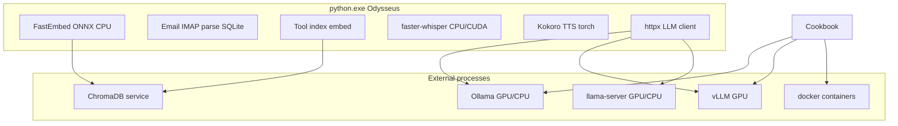

# Odysseus LLM inference, embeddings, and compute subsystems — performance tracking findings

**Date:** 2026-06-27  
**Branch:** `feat/performance-tracking` (from `Local-email-sync`)  
**Source:** Agent 3 exploration (LLM / AI / embeddings / GPU / sync)  
**Scope:** Ollama and remote LLM providers, embeddings, vector DB, email local sync, GPU/Ollama setup, subprocess binaries, CPU attribution for `python.exe`

---

## Executive summary

Odysseus has **no dedicated performance-tracking module** yet. Partial signals already exist: chat/agent metrics SSE, agent prep timings, Cookbook throughput parsing, and diagnostics endpoints. LLM token generation runs **mostly out-of-process** (Ollama, vLLM, llama-server). When `python.exe` hits 100% CPU, the likely culprits are **in-process** work: FastEmbed ONNX, email IMAP sync, tool-index embedding, RAG indexing, local STT/TTS, and scheduled background tasks.

---

## Integration map

### Core LLM layer

| Component | Path | Role |
|-----------|------|------|
| **LLM core** | `src/llm_core.py` | Single integration hub: provider detection (Ollama native `/api`, Ollama OpenAI-compat `/v1`, Anthropic, OpenAI-compat, Mistral, Copilot, ChatGPT-subscription), `llm_call`, `llm_call_async`, `stream_llm`, caching, host health, `note_model_activity()` |
| **Endpoint resolver** | `src/endpoint_resolver.py` | Builds chat/models URLs; Ollama-specific roots; subprocess for some probes |
| **Model context** | `src/model_context.py` | Context length discovery; local host detection (incl. Ollama `:11434`) |
| **Model discovery** | `src/model_discovery.py` | Port/host scan (`subprocess`: `tailscale status`), warmup ping URLs |
| **Agent loop** | `src/agent_loop.py` | `stream_agent_loop` — multi-round agent; prep timings; final metrics via `_compute_final_metrics` |
| **AI interaction** | `src/ai_interaction.py` | Model resolution, pipelines, session tools |
| **Context compactor** | `src/context_compactor.py` | Summarizes history via `llm_call_async` when near context limit |
| **Teacher escalation** | `src/teacher_escalation.py` | Fallback LLM + `stream_agent_loop` |
| **Task endpoint** | `src/task_endpoint.py` | `task_llm_call_async` with fallback for scheduled tasks |
| **Copilot** | `src/copilot.py` | GitHub Copilot request shaping |
| **ChatGPT subscription** | `src/chatgpt_subscription.py` | Codex/Responses API path inside `llm_core` |

**Callers of `llm_call_async` / `stream_llm` / `stream_agent_loop` (non-exhaustive):**

| Path | Use |
|------|-----|
| `routes/chat_routes.py` | Main chat SSE |
| `routes/email_routes.py`, `routes/email_pollers.py` | Summarize, style, auto-reply, calendar extract |
| `routes/calendar_routes.py`, `routes/session_routes.py`, `routes/webhook_routes.py` | Domain-specific LLM |
| `services/memory/memory_extractor.py` | Post-chat memory extraction + audit |
| `src/deep_research.py`, `src/research_handler.py` | Research pipelines |
| `src/task_scheduler.py` | Scheduled agent runs |
| `mcp_servers/email_server.py` | MCP email tools |
| `src/session_actions.py`, `src/bg_monitor.py` | Session and background LLM |

### Ollama-specific behavior

| Path | Behavior |
|------|----------|
| `src/llm_core.py` | Native Ollama: `POST /api/chat` streaming (~line 1970+); usage from `prompt_eval_count` / `eval_count` (no `gen_tps` unless llama.cpp timings on OpenAI-compat path) |
| `src/llm_core.py` | OpenAI-compat Ollama `/v1/chat/completions` — same SSE path as llama.cpp/vLLM; `timings` → `gen_tps` / `prefill_tps` |
| `routes/cookbook_helpers.py` | `scan_ollama()`, `scan_ollama_api()`, `ollama pull`, `ollama serve` port binding |
| `routes/cookbook_routes.py` | Download/serve lifecycle; `docker exec` fallback for `ollama-rocm` / `ollama-test` |
| `scripts/setup-ollama-gpu.ps1`, `scripts/start-ollama-gpu.ps1` | Windows AMD: `OLLAMA_GPU_OVERIDE=vulkan`, `OLLAMA_HOST=0.0.0.0:11434` |
| `docker-compose.gpu-nvidia.yml` | `OLLAMA_BASE_URL`, `host.docker.internal:11434`, Docker socket for Cookbook |

**Gap:** Ollama metrics API (`GET /api/ps`, `/api/show`) is **not used anywhere** in the repo today.

### Embeddings and vector stores

| Component | Path | Backend |
|-----------|------|---------|
| **Embedding clients** | `src/embeddings.py` | HTTP (`EMBEDDING_URL`, default Ollama `:11434/v1/embeddings`) or **FastEmbed ONNX** (CPU) |
| **Embedding lanes** | `src/embedding_lanes.py` | Separate Chroma collections per lane (`fastembed` vs `custom`) |
| **Chroma client** | `src/chroma_client.py` | HTTP to `CHROMADB_HOST:CHROMADB_PORT` (default `localhost:8100`) |
| **RAG** | `src/rag_vector.py` | Chunk + embed + Chroma; hybrid vector/keyword |
| **Memory vectors** | `src/memory_vector.py` | Per-memory embed + Chroma |
| **Tool index** | `src/tool_index.py` | Embeds tool descriptions for agent tool RAG |
| **Embedding admin** | `routes/embedding_routes.py` | FastEmbed model download/cache |
| **MCP RAG server** | `mcp_servers/rag_server.py` | `add_directory` triggers indexing |

Startup warmup (`app.py`): `asyncio.to_thread(get_tool_index)` + `get_tools_for_query("warmup", 8)` — first-process cost is **FastEmbed + Chroma + embed batch**.

### GPU and model serving (mostly out-of-process)

| Component | Path | Notes |
|-----------|------|-------|
| **HWFit hardware probe** | `services/hwfit/hardware.py` | `nvidia-smi` via `subprocess`; ROCm/Metal/WMI fallbacks |
| **Cookbook GPU API** | `routes/cookbook_routes.py` `GET /api/cookbook/gpus` | `nvidia-smi` query + process list; Metal fallback on macOS |
| **Cookbook serve parsing** | `routes/cookbook_helpers.py` `_parse_serve_phase` | Parses vLLM/llama.cpp log lines for `tps`, `reqs`, KV cache % |
| **Cookbook routes** | `routes/cookbook_routes.py` | Spawns vLLM, llama-server, ollama, docker; SSH remote serve |
| **Diffusion server** | `scripts/diffusion_server.py` | Separate **torch** process for image gen |
| **Image models registry** | `services/hwfit/image_models.py` | VRAM estimates for diffusers models |
| **Docker GPU** | `docker-compose.gpu-nvidia.yml`, `docker/gpu.nvidia.yml`, `docker/gpu.amd.yml` | NVIDIA/AMD overlays |
| **GPU check scripts** | `scripts/check-docker-gpu.sh`, `check-docker-amd-gpu.sh` | Pre-flight |

**No `psutil`, `py3nvml`, or `pynvml` in Python code.** GPU visibility is subprocess `nvidia-smi` only (`core/platform_compat.py` documents intentional avoidance of extra deps).

### Speech, vision, and image

| Component | Path | Compute |
|-----------|------|---------|
| **STT** | `services/stt/stt_service.py` | `faster-whisper` (CTranslate2); optional CUDA via torch probe |
| **TTS** | `services/tts/tts_service.py` | Kokoro-82M (torch CUDA if available) |
| **Image gen MCP** | `mcp_servers/image_gen_server.py` | HTTP to image endpoint |
| **Faces** | `services/faces/__init__.py` | Standalone worker (stub header only in tree) |

### Email local store and sync

| Component | Path | Role |
|-----------|------|------|
| **Local store** | `routes/email_local_store.py` | SQLite `data/email_store.db` (WAL); IMAP sync, backfill, flag sync, attachment store |
| **HTTP API** | `routes/email_routes.py` | `POST /local/sync`, `GET /local/list`, `/local/status` via `asyncio.to_thread` |
| **Scheduled task** | `src/builtin_actions.py` `action_sync_local_emails` | Cron every 20 min (`task_scheduler.py` `HOUSEKEEPING_DEFAULTS`) |
| **Agent tool** | `src/tool_implementations.py` | `do_sync_local_emails` |
| **Settings** | `src/settings.py` | `email_local_sync_*` batch sizes, attachment budgets |
| **CLI** | `scripts/odysseus-mail` | Same helpers as HTTP routes |
| **Pollers** | `routes/email_pollers.py` | 30-min auto-summarize (LLM + IMAP); scheduled SMTP poller |

### SQLite and app metadata

| Store | Path |
|-------|------|
| Main app DB | `core/database.py` → `data/app.db` (SQLAlchemy) |
| Email local | `routes/email_local_store.py` → `data/email_store.db` |
| Scheduled email | `routes/email_helpers.py` `SCHEDULED_DB` |
| Stats API | `GET /api/db/stats` via `get_detailed_stats()` in `diagnostics_routes.py` |

### Subprocess and external binaries

| Binary / pattern | Where invoked |
|------------------|---------------|
| **ollama** | `cookbook_routes.py`, `cookbook_helpers.py` (list/pull/serve) |
| **docker** | `cookbook_routes.py` (serve, ollama in container, GPU images) |
| **nvidia-smi** | `hwfit/hardware.py`, `cookbook_routes.py`, `cookbook_helpers.py`, `shell_routes.py` |
| **vllm / llama-server** | Cookbook serve (`subprocess.Popen`, detached) |
| **tailscale** | `model_discovery.py` |
| **npx / MCP servers** | `mcp_manager.py`, `builtin_mcp.py` |
| **bash/python tools** | `agent_tools/subprocess_tools.py`, `bg_jobs.py`, `builtin_actions.py` |
| **SSH** | `core/platform_compat.run_ssh_command`, Cookbook remote |
| **vault** | `src/tools/vault.py` async subprocess |
| **diffusion_server.py** | Separate Python+torch process (not child of main app unless launched manually) |

---

## Resource-intensive operations

### High impact (likely to saturate CPU in `python.exe`)

| Operation | Trigger | Why CPU-bound in Python |
|-----------|---------|-------------------------|
| **FastEmbed encode** | RAG query, memory add/search, tool-index retrieval, startup warmup | ONNX inference on CPU (`embeddings.py`); batch size `EMBEDDING_BATCH_SIZE` (default 8) |
| **Email local sync** | Cron `sync_local_emails` (*/20), manual sync, agent tool | `asyncio.to_thread(sync_all)` — IMAP FETCH (50-UID chunks), RFC822 parse, attachment extract, SQLite writes (`email_local_store.py`) |
| **Tool index / MCP reindex** | Every agent turn (with timeout) | `asyncio.to_thread(tool_idx.index_mcp_tools)` + `get_tools_for_query` |
| **RAG directory indexing** | `add_directory`, personal docs | Batch embed + Chroma upsert (`rag_vector.add_documents_batch`) |
| **Memory extractor** | Every 4th chat message pair | Extra `llm_call_async` + vector upsert (`chat_helpers.py` queues background job) |
| **Memory audit / consolidate** | Scheduled `consolidate_memory` | LLM over full memory list (30–120s noted in code) |
| **Context compaction** | Context > 85% | Full-history summarization LLM call |
| **Deep research** | User trigger | Many LLM rounds + `asyncio.to_thread` web fetches (`deep_research.py`) |
| **Email auto-summarize poller** | Every 30 min | IMAP scan + multiple `llm_call_async` per mailbox (`email_pollers.py`) |
| **faster-whisper STT** | Mic upload | Local ASR if `stt_provider=local` |
| **Kokoro TTS** | TTS request | torch inference if `tts_provider=local` |
| **Model discovery warmup** | Startup + 60s keepalive | Thread pool HTTP pings |
| **Search fan-out** | `web_search` tool | `ThreadPoolExecutor` in `services/search/core.py` |

### Medium impact

- Chroma HTTP round-trips (network + serialization; embed still local if FastEmbed lane)
- PDF/document parsing in agent tools
- Session export, backup import
- `grep`/`glob` over large workspaces (`filesystem_tools.py` via `to_thread`)

### Low impact in Python (GPU elsewhere)

- **Ollama / vLLM / llama-server decode** — separate OS processes; Python only streams HTTP
- **Cookbook model download** — separate subprocess; HF transfer

---

## GPU vs CPU bound work



| Workload | Typical bound | Process |
|----------|---------------|---------|
| Chat/agent LLM | GPU (if configured) or CPU in Ollama | `ollama`, `vllm`, `llama-server` |
| Embeddings via `EMBEDDING_URL` | GPU if Ollama/vLLM embed model on GPU | Ollama/vLLM |
| Embeddings FastEmbed fallback | **CPU** (ONNX) | `python.exe` |
| Email sync | **CPU + I/O** (network IMAP, disk SQLite) | `python.exe` worker thread |
| Tool RAG | **CPU** embed + Chroma HTTP | `python.exe` + Chroma container |
| STT local | CPU or GPU (CTranslate2) | `python.exe` |
| TTS local | GPU if CUDA else CPU | `python.exe` |
| Image diffusion | **GPU** | `diffusion_server.py` subprocess |
| Cookbook serve | **GPU** | child process |

**Implication for `python.exe` at 100%:** The spike is almost never LLM token generation itself unless you're on FastEmbed, local STT/TTS, or heavy sync/indexing. Check Task Manager for sibling `ollama.exe`, `vllm`, `llama-server` separately.

---

## Existing metrics and gaps

### What exists today

| Signal | Location | Fields |
|--------|----------|--------|
| Chat/agent metrics SSE | `chat_routes.py`, `agent_loop._compute_final_metrics` | `response_time`, `time_to_first_token`, `input_tokens`, `output_tokens`, `tokens_per_second`, `tps_source`, `prefill_tps`, `context_percent`, `usage_source`, `agent_prep_time`, `agent_prep_breakdown`, `tool_events` |
| Usage event (stream) | `llm_core.stream_llm` | `gen_tps`, `prefill_tps` from llama.cpp `timings` |
| Agent prep event | `agent_loop.py` | SSE `type: agent_prep` — `request_setup`, `tool_selection`, `prompt_build`, `context_trim` |
| Agent timing log | `agent_loop.py` | `[agent-timing] prep_done model=... prep={...}` at INFO |
| LLM async duration | `llm_core.llm_call_async` | `LLM async call to ... succeeded in X.XXs` at INFO |
| Cookbook throughput | `cookbook_helpers._parse_serve_phase` | `tps`, `reqs`, `pct` from serve logs → `list_served_models` API |
| Model activity | `llm_core.note_model_activity` | In-process last-use timestamp per URL\|model (not exported) |
| Service health | `src/service_health.py` + `GET /api/diagnostics/services` | Subsystem ok/degraded/down (no latency histograms) |
| DB/RAG stats | `GET /api/db/stats`, `GET /api/rag/stats` | Counts only |
| Email sync summary | `sync_account_folder` return dict | `new`, `backfilled`, `flags_updated`, `backfill_complete`, errors (no timings) |

### Gaps to close on `feat/performance-tracking`

| Gap | Impact |
|-----|--------|
| No unified performance event store | Cannot query or correlate spikes across subsystems |
| No GPU sampling loop | Cannot tie LLM wait time to VRAM/utilization |
| No per-operation CPU attribution | `python.exe` at 100% with no caller label |
| No Ollama `/api/ps` integration | Missing running-model VRAM and processor data |
| No embedding batch metrics | FastEmbed cost invisible except via CPU |
| No sync phase timings | Email backfill duration unknown |
| No `asyncio.to_thread` wrapper | Thread-pool work (sync, tool index) untracked |
| No ContextVar operation stack | Async + thread calls cannot share a trace ID |

---

## Recommended instrumentation per subsystem

### LLM inference

Wrap `llm_core.stream_llm`, `llm_call_async`, `llm_call` with a single recorder. When provider is Ollama, poll `GET {root}/api/ps` for `size_vram` and `processor` to correlate Python wait time vs GPU load. For llama.cpp/vLLM, keep parsing `timings` (already done); optionally scrape serve stderr via existing Cookbook tail machinery.

### Embeddings

Instrument `EmbeddingClient._post_embeddings`, `FastEmbedClient.encode`, `embedding_lanes.encode` with lane, backend, batch size, char count, dimension, and caller (`tool_index`, `rag_vector`, `memory_vector`, `warmup`).

### Vector DB (Chroma)

Wrap `chroma_client` operations and `collection.add/query` with operation type, collection name, doc count, latency, and health flag.

### Email local sync

Instrument `sync_account_folder` / `sync_all` with per-phase timings: `imap_connect`, `uid_search`, `fetch_rfc822`, `parse_store`, `flag_sync`, `attachment_extract`, plus counts and backfill status.

### GPU (optional sidecar / admin poll)

Reuse Cookbook's `nvidia-smi` query shape from `cookbook_routes.py`; sample on interval or on-demand when LLM is active. **py3nvml** would avoid subprocess overhead but conflicts with the current "no new deps" stance in `platform_compat.py`; prefer subprocess sampling at 5–10s intervals for admin diagnostics only.

### Background tasks and pollers

Emit at start/end of each `builtin_actions` handler and `email_pollers` pass with `task_name`, `owner`, `duration_ms`, `outcome`.

### Process-level attribution (cross-cutting)

Adopt a **ContextVar stack** (pattern exists in `src/user_time.py`):

```python
# Conceptual — not in repo yet
_perf_operation: ContextVar[list[str]]  # stack of operation names/ids
```

Set on: HTTP request, agent turn, `asyncio.to_thread` entry, scheduled task. Log `operation_id` on every `[agent-timing]` line and new `perf` events.

---

## Attributing high CPU `python.exe` to a specific Odysseus operation

### Immediate diagnostics (no code changes)

1. **Enable DEBUG logs** — `LOG_LEVEL=DEBUG` surfaces `[agent-timing]`, skill-extract gates, embedding lane resets.
2. **Check `data/logs/app.log`** via `GET /api/diagnostics/logs` (admin).
3. **Correlate time with scheduled tasks** — `sync_local_emails` */20, email summarize */2h, `consolidate_memory`, skill audit ~02:00.
4. **Split processes** — if CPU is `ollama.exe` not `python.exe`, attribution is Cookbook/chat LLM not Python embed/sync.
5. **Admin health** — `GET /api/diagnostics/services` for Chroma/email/provider degradation.

### Code-level attribution (recommended for feat branch)

| Technique | Purpose |
|-----------|---------|
| **ContextVar operation stack** | Propagate `operation_id` through async + thread pool |
| **`asyncio.to_thread` wrapper** | Log `thread_start`/`thread_end` with `caller`, `func`, `duration_ms` (email sync, tool index, grep) |
| **Structured perf log channel** | JSON lines to `data/logs/perf.jsonl` or ring buffer exposed at `GET /api/diagnostics/perf` |
| **Sampling profiler hook** | Admin-only `py-spy record` or `tracemalloc` snapshot trigger (dev builds) |
| **Windows thread name** | `threading.current_thread().name = f"odysseus:{op}"` in wrapped `to_thread` |

### `python.exe` attribution checklist

When `python.exe` hits 100%, walk this list in order:

| # | Check | What to look for |
|---|-------|------------------|
| 1 | **Process identity** | Confirm CPU is `python.exe` (Odysseus), not `ollama.exe`, `vllm`, or `llama-server` |
| 2 | **Scheduled task window** | `sync_local_emails` every 20 min; email summarize every 30 min; `consolidate_memory`; skill audit ~02:00 |
| 3 | **Email local sync backfill** | Large mailbox, `backfill_batch=200`, attachment extraction (`email_local_sync_max_attachment_bytes` up to 50MB/file) |
| 4 | **First agent message after restart** | Tool index warmup if pre-warm failed (`app.py` `_warmup_tool_index`) |
| 5 | **RAG `add_directory`** | Large tree — batch embed every chunk |
| 6 | **Memory consolidate / audit** | Long LLM + embed loop (30–120s in code comments) |
| 7 | **Concurrent load** | Email poller + sync + chat competing for GIL + CPU despite async |
| 8 | **FastEmbed on tool selection** | Repeated encode of user message + tool descriptions every agent turn |
| 9 | **Local STT/TTS** | `stt_provider=local` or `tts_provider=local` during voice use |
| 10 | **Deep research** | Many LLM rounds + threaded web fetches |
| 11 | **Log correlation** | `[agent-timing]`, `LLM async call to ... succeeded in`, embedding lane DEBUG lines |
| 12 | **Admin endpoints** | `/api/diagnostics/services`, `/api/db/stats`, `/api/rag/stats` for subsystem state at spike time |

---

## Event and metric schemas

### Unified envelope

```json
{
  "v": 1,
  "event": "<subsystem>.<action>",
  "ts": "2026-06-27T12:00:00.000Z",
  "operation_id": "8f3c...",
  "parent_operation_id": null,
  "trace": ["http:POST /chat", "agent_loop:round_1"],
  "owner": "admin",
  "session_id": "optional",
  "subsystem": "llm|embedding|chroma|email|gpu|task|mcp",
  "duration_ms": 1234,
  "status": "ok|error|timeout",
  "meta": {}
}
```

### Event types to implement

| Event | Key `meta` fields |
|-------|-------------------|
| `llm.inference` | provider, model, tokens, tps, ttfb_ms, endpoint_host, caller |
| `llm.stream.chunk` | optional high-res stream profiling (sample 1/N chunks) |
| `embedding.batch` | lane, backend, batch_size, chars, dim, caller |
| `chroma.op` | collection, op, count, healthy |
| `email.sync` | account, folder, phase timings, counts, backfill_complete |
| `email.imap` | connect/fetch sub-ops |
| `agent.prep` | mirrors existing `agent_prep` SSE fields |
| `task.run` | action, schedule, duration, outcome |
| `gpu.sample` | nvidia-smi snapshot, process list |
| `process.cpu` | optional `psutil` Process.cpu_percent per thread (if dep approved) |
| `subprocess.spawn` | cmd basename, pid (cookbook, mcp, bg_jobs) |

### `llm.inference` detail schema

```json
{
  "event": "llm.inference",
  "ts": "ISO8601",
  "operation_id": "uuid",
  "parent_operation_id": "uuid|null",
  "subsystem": "llm",
  "provider": "ollama|openai|anthropic|...",
  "endpoint_host": "127.0.0.1:11434",
  "model_requested": "qwen2.5",
  "model_actual": "qwen2.5",
  "stream": true,
  "session_id": "...",
  "owner": "...",
  "caller": "agent_loop|email_poller|memory_extractor|...",
  "latency_ms": {
    "ttfb": 420,
    "total": 12500
  },
  "tokens": {
    "prompt": 8192,
    "completion": 256,
    "source": "real|estimated"
  },
  "throughput": {
    "gen_tps": 78.91,
    "prefill_tps": 512.34,
    "tps_source": "backend|computed"
  },
  "status": "ok|error",
  "error_class": "timeout|connection_refused|..."
}
```

### `embedding.batch` detail schema

```json
{
  "event": "embedding.batch",
  "subsystem": "embedding",
  "lane": "fastembed|custom",
  "backend": "http|onnx",
  "url": "local://fastembed",
  "model": "sentence-transformers/all-MiniLM-L6-v2",
  "batch_size": 8,
  "text_count": 8,
  "total_chars": 4200,
  "dimension": 384,
  "latency_ms": 145,
  "caller": "tool_index|rag_vector|memory_vector|warmup"
}
```

### `email.sync` detail schema

```json
{
  "event": "email.sync",
  "subsystem": "email_local_store",
  "owner": "...",
  "account_id": "...",
  "folder": "INBOX",
  "phases_ms": {
    "imap_connect": 120,
    "uid_search": 45,
    "fetch_rfc822": 8200,
    "parse_store": 3100,
    "flag_sync": 200,
    "attachment_extract": 1500
  },
  "counts": {
    "uids_fetched": 200,
    "messages_new": 15,
    "attachments_saved": 3,
    "attachments_skipped_bytes": 2
  },
  "backfill_complete": false,
  "error": null
}
```

### `gpu.sample` detail schema

```json
{
  "event": "gpu.sample",
  "source": "nvidia-smi",
  "gpus": [{"index": 0, "util_pct": 92, "used_mb": 14000, "total_mb": 16384}],
  "processes": [{"pid": 1234, "name": "ollama", "used_mb": 12000}]
}
```

### Storage and export options

- **Ring buffer in memory** + admin SSE stream (matches `agent_runs` replay pattern).
- **Append-only `perf.jsonl`** under `data/logs/` with rotation.
- **SQLite table** `perf_events` in `app.db` for querying by time/subsystem (heavier).
- **Prometheus**: only if you add `prometheus_client` — not present today.

---

## Tools reference

| Tool | Current use | Recommended use |
|------|-------------|-----------------|
| **nvidia-smi** | HWFit, Cookbook `/api/cookbook/gpus` | Periodic GPU metrics; map PIDs to ollama/vllm |
| **Ollama `/api/ps`** | Not used | Running models, VRAM, processor % |
| **Ollama `/api/show`** | Not used | Model parameter size, context |
| **psutil** | Not in codebase | `python.exe` CPU%, RSS, thread enumeration; attribute by thread name |
| **py3nvml / pynvml** | Not in codebase | Lower-overhead GPU metrics vs subprocess |
| **httpx timing** | Implicit in logs | `latency_ms` per LLM request |
| **Existing SSE** | `agent_prep`, `metrics`, `usage` | Extend frontend perf panel |

---

## Priority implementation order

| Priority | Item | Rationale |
|----------|------|-----------|
| **1** | ContextVar + `asyncio.to_thread` wrapper | Fixes attribution gap for email sync and tool index (highest unexplained CPU) |
| **2** | `perf.jsonl` emitter in `llm_core`, `embeddings`, `email_local_store.sync_account_folder` | Structured record of the three hottest subsystems |
| **3** | Admin `GET /api/diagnostics/perf` | Tail recent events + optional live SSE |
| **4** | Ollama `/api/ps` poller | When local Ollama endpoint configured; correlates wait vs VRAM |
| **5** | GPU sample endpoint | Factor out `_run_nvidia_smi` from `cookbook_routes.py` |
| **6** | Frontend perf panel | Surface `agent_prep_breakdown` and new perf stream (partial UI exists for chat metrics) |

---

## Key file index

| Area | Paths |
|------|-------|
| **LLM** | `src/llm_core.py`, `src/agent_loop.py`, `routes/chat_routes.py` |
| **Embeddings** | `src/embeddings.py`, `src/embedding_lanes.py`, `src/chroma_client.py` |
| **RAG / memory** | `src/rag_vector.py`, `src/memory_vector.py`, `src/tool_index.py` |
| **Email sync** | `routes/email_local_store.py`, `routes/email_routes.py`, `src/builtin_actions.py` |
| **GPU / Ollama** | `scripts/setup-ollama-gpu.ps1`, `scripts/start-ollama-gpu.ps1`, `services/hwfit/hardware.py`, `routes/cookbook_routes.py` |
| **Diagnostics** | `routes/diagnostics_routes.py`, `src/service_health.py` |
| **Metrics tests** | `tests/test_chat_metrics.py` |
| **Startup load** | `app.py` (tool index warmup, endpoint keepalive) |
