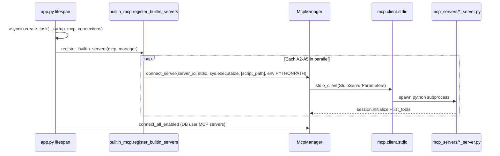

# Builtin MCP children (A2–A5)

Branch: `feat/performance-tracking`  
Scope: Python stdio MCP servers in `mcp_servers/` — **not** NPX Playwright (`builtin_browser`, doc `06-node-ollama-external.md`).

Parent process: **A1** (uvicorn). These are up to four additional `python.exe` children spawned at startup and kept alive for the server lifetime.

---

## Process inventory

| ID | `server_id` | Entry file | MCP server name | Primary tool(s) | Agent traffic path |
|----|-------------|------------|-----------------|-----------------|-------------------|
| **A2** | `image_gen` | `E:/odysseus/mcp_servers/image_gen_server.py` | `image_gen` | `generate_image` | Fence block → `_MCP_TOOL_MAP` → `mcp.call_tool` → **A2** |
| **A3** | `memory` | `E:/odysseus/mcp_servers/memory_server.py` | `memory` | `manage_memory` | Agent uses native `manage_memory` → **in-process A1** (`do_manage_memory`). A3 spawned but usually idle for agent work |
| **A4** | `rag` | `E:/odysseus/mcp_servers/rag_server.py` | `rag` | `manage_rag` | `do_manage_rag` exists in A1; not wired in `tool_execution`. A4 spawned; agent rarely hits it |
| **A5** | `email` | `E:/odysseus/mcp_servers/email_server.py` | `email` | 14 tools (see below) | Native function schemas in `tool_schemas.py` → `mcp__email__*` → **A5** |

**Disable switch:** `ODYSSEUS_DISABLE_MCP=1` skips all of A2–A5 (`src/builtin_mcp.py`).

**Task Manager (native Windows):** 1× `python.exe -m uvicorn app:app` + up to 4× children whose command line contains `mcp_servers\<name>_server.py`.

| Child | Cmdline filter (PowerShell / Task Manager) |
|-------|---------------------------------------------|
| A2 | `image_gen_server.py` |
| A3 | `memory_server.py` |
| A4 | `rag_server.py` |
| A5 | `email_server.py` |

Docker: same scripts under `/app/mcp_servers/` inside the `odysseus` container.

---

## Entry files and runtime shape

All four share the same MCP stdio bootstrap:

```172:178:E:/odysseus/mcp_servers/image_gen_server.py
async def run():
    async with stdio_server() as (read_stream, write_stream):
        await server.run(read_stream, write_stream, server.create_initialization_options())

if __name__ == "__main__":
    asyncio.run(run())
```

Each inserts the repo root on `sys.path` and imports Odysseus modules (`src.*`, `core.*`).

| Server | Notable work inside child | CPU/RAM profile |
|--------|---------------------------|-----------------|
| **A2** | `httpx` POST to image API (300s read timeout); optional gallery DB write | Low idle; burst on `generate_image` (mostly I/O wait) |
| **A3** | `MemoryManager` + optional `MemoryVectorStore` (Chroma/embed on add/search) | Low idle; medium on `search` if vector store healthy |
| **A4** | `get_rag_manager()` + `PersonalDocsManager`; `add_directory` calls `index_personal_documents` | Low idle; **high** on directory index (embed + Chroma) |
| **A5** | IMAP/SMTP (`imaplib`, `smtplib`), SQLite email cache, ~2.3k LOC | Low idle; medium on `list_emails` / `read_email` / `search_emails`; `EMAIL_SOCKET_TIMEOUT` default 20s |

**A5 tools:** `list_email_accounts`, `list_emails`, `read_email`, `search_emails`, `send_email`, `draft_email`, `reply_to_email`, `draft_email_reply`, `ai_draft_email_reply`, `download_attachment`, `archive_email`, `delete_email`, `mark_email_read`, `bulk_email`.

---

## Spawn chain (builtin → mcp_manager)



### Registration (`src/builtin_mcp.py`)

- Registry: `_BUILTIN_SERVERS` maps `server_id` → `(relative script, display name)`.
- Spawn argv: `command=sys.executable`, `args=[absolute script_path]`, `env={"PYTHONPATH": base_dir}`.
- Python builtins connect in parallel via `asyncio.gather`.
- NPX `builtin_browser` runs after a 3s delay (out of scope for A2–A5).

### Stdio connect (`src/mcp_manager.py` `_connect_stdio`)

1. `StdioServerParameters(command, args, env={**os.environ, **env})`
2. `stdio_client(server_params)` → `ClientSession` → `initialize()` → `list_tools()`
3. State stored: `_sessions`, `_stacks` (AsyncExitStack), `_tools`, `_connections[server_id]` with `status`, `name`, `transport`, `tool_count`, optional `identity` from env hints.

### Startup timing (`app.py`)

MCP bootstrap is **non-blocking**: `_startup_mcp_connections` is a background task so the UI is not held on slow connects. Do **not** wrap stdio connect in `asyncio.wait_for` (anyio cancel-scope bug documented in `app.py` and `builtin_mcp.py`).

### Shutdown

`app.py` lifespan shutdown calls `mcp_manager.disconnect_all()` → `stack.aclose()` per server.

---

## PID tracking (gap + recommendation)

**Today:** `McpManager` does **not** record child PIDs. `_connections` has no `pid` field. The MCP SDK spawns the subprocess inside `stdio_client`; Odysseus only holds streams and `ClientSession`.

**Recommended hooks (implementation later):**

1. **`_connect_stdio` after `stdio_client` enters** — inspect transport/stack for a `.process` or subprocess handle (MCP SDK version-dependent). Store:
   ```python
   self._connections[server_id]["pid"] = proc.pid
   self._connections[server_id]["spawned_at"] = time.time()
   self._connections[server_id]["command_line"] = [command, *args]
   ```
2. **`disconnect_server`** — clear PID; emit `mcp_child_stopped`.
3. **Periodic sampler** (parent A1 task) — `psutil.Process(pid)` for CPU%, RSS; correlate with `server_id`.
4. **Fallback attribution** — scan process tree from uvicorn PID for cmdline matching `mcp_servers\\*_server.py` when PID was not captured.

**Expose for ops:** extend `GET /api/mcp/servers` status payload with `pid`, `rss_mb`, `cpu_percent` (sampled).

---

## py-spy per child

Builtin MCP children run **trusted** Odysseus code (not agent-submitted). py-spy is appropriate without the sandbox restrictions needed for B1 agent `python` tool.

| When | Command (Windows, admin for attach) |
|------|-------------------------------------|
| Steady-state idle check | `py-spy top --pid <A5_PID>` |
| Capture hot path during email burst | `py-spy record -o a5_email.svg --pid <A5_PID> --duration 30` |
| RAG index spike | Attach to A4 during `manage_rag` `add_directory` |

**Attribution workflow**

1. Task Manager: multiple `python.exe` → match cmdline to A2–A5.
2. If PID unknown, use parent sampler or `/api/mcp` status once PID logging lands.
3. py-spy on the matching child; parent A1 py-spy shows asyncio waiting on `session.call_tool`, not the heavy work (work runs in child for A2/A5; A3/A4 often idle).

**Frozen portable (`Odysseus.exe`):** same four scripts still spawn as separate interpreters if MCP enabled; py-spy attach behavior matches native venv.

---

## Tool latency hooks: `mcp_manager._do_call`

**Current code** — no timing, no events:

```480:506:E:/odysseus/src/mcp_manager.py
    async def _do_call(self, session, tool_name: str, arguments: Dict) -> Dict:
        """Execute a single MCP tool call and return result dict."""
        result = await session.call_tool(tool_name, arguments)
        output_parts = []
        images = []
        for content in result.content:
            ...
        return result_dict
```

**Recommended wrap** (in `call_tool` and/or `_do_call`):

```python
t0 = time.perf_counter()
try:
    result = await session.call_tool(tool_name, arguments)
    err = None
except Exception as e:
    err = e
    raise
finally:
    emit_mcp_tool_event(
        server_id=server_id,
        tool_name=tool_name,
        qualified_name=qualified_name,
        duration_ms=round((time.perf_counter() - t0) * 1000, 2),
        exit_code=0 if not err else 1,
        is_error=getattr(result, "isError", False) if result else True,
        child_pid=self._connections.get(server_id, {}).get("pid"),
        argument_keys=sorted(arguments.keys()),  # never log secrets (passwords, bodies)
    )
```

**Also instrument:**

| Location | Why |
|----------|-----|
| `call_tool` outer try/except | Distinguish first failure vs post-reconnect retry |
| `_reconnect_builtin` | `mcp_reconnect_started` / `mcp_reconnect_finished` with `success`, `duration_ms` |
| `_connect_stdio` | `mcp_child_spawned` with `tool_count`, `duration_ms` for connect+initialize |
| `tool_execution.execute_tool_block` | Propagate `session_id`, `owner`, `request_id` into MCP events via `contextvars` |

**Call graph for agent-visible latency:**

```
execute_tool_block
  → mcp.call_tool("mcp__email__list_emails", args)   # A5
  → mcp.call_tool("mcp__image_gen__generate_image")  # via _call_mcp_tool for fence tools
```

`manage_memory` native calls **bypass** A3; tag those as `subsystem: "memory_inprocess"` to avoid false "MCP child" attribution.

---

## Reconnect behavior

### Automatic (builtin crash recovery)

```454:477:E:/odysseus/src/mcp_manager.py
        try:
            result = await self._do_call(session, tool_name, arguments)
        except Exception as e:
            # Auto-reconnect for builtin servers whose subprocess may have died
            if self.is_builtin(server_id):
                logger.warning(f"MCP call failed for {qualified_name}, attempting reconnect: {e}")
                reconnected = await self._reconnect_builtin(server_id)
                if reconnected:
                    session = self._sessions.get(server_id)
                    if session:
                        try:
                            result = await self._do_call(session, tool_name, arguments)
```

- Applies to `image_gen`, `memory`, `rag`, `email`, and `builtin_*` IDs (`is_builtin`).
- **`_reconnect_builtin`** only rebuilds entries in `_BUILTIN_SERVERS` (A2–A5). It does **not** handle NPX `builtin_browser`.
- Flow: `disconnect_server` → `connect_server` with same `sys.executable` + script path + `PYTHONPATH`.
- On failure: `{"error": "MCP server crashed and reconnect failed: {server_id}", "exit_code": 1}`.
- **No reconnect** for user DB-registered MCP servers on call failure (error returned immediately).

### Manual reconnect

| Path | Behavior |
|------|----------|
| Admin UI / `POST /api/mcp/servers/{id}/reconnect` | `disconnect_server` + `connect_server` from DB row (`routes/mcp_routes.py`) |
| Agent `manage_mcp` action `reconnect` | Same; passes full `name/transport/command/args/env/url` (`admin_tools.py`) |
| Builtin A2–A5 | Not in DB; manual reconnect only via auto-reconnect or app restart |

### Performance implications

- Reconnect = full subprocess respawn + `initialize` + `list_tools` (100ms–several seconds).
- Emit `mcp_reconnect` events; count retries per `server_id` to detect crash loops.
- First call after reconnect pays double latency if the first `_do_call` failed after spawn died mid-flight.

---

## Recommended events

Align with existing `[agent-timing]` logs in `src/agent_loop.py` and chat `metrics` SSE. Suggested JSON schema (structured log or internal event bus):

### `mcp_child_spawned`

```json
{
  "event": "mcp_child_spawned",
  "server_id": "email",
  "display_name": "Built-in: Email",
  "pid": 12345,
  "transport": "stdio",
  "tool_count": 14,
  "connect_duration_ms": 842,
  "ts": "2026-06-27T12:00:00Z"
}
```

### `mcp_tool_call`

```json
{
  "event": "mcp_tool_call",
  "server_id": "email",
  "tool_name": "list_emails",
  "qualified_name": "mcp__email__list_emails",
  "duration_ms": 1240,
  "exit_code": 0,
  "is_error": false,
  "child_pid": 12345,
  "reconnect_attempted": false,
  "session_id": "abc",
  "owner": "alice",
  "argument_summary": {"folder": "INBOX", "max_results": 20}
}
```

### `mcp_reconnect`

```json
{
  "event": "mcp_reconnect",
  "server_id": "email",
  "trigger": "auto|manual",
  "success": true,
  "duration_ms": 1100,
  "prior_pid": 12345,
  "new_pid": 12401,
  "error": null
}
```

### `mcp_child_stopped`

```json
{
  "event": "mcp_child_stopped",
  "server_id": "rag",
  "pid": 12348,
  "reason": "shutdown|disconnect|crash"
}
```

### High-value dimensions to tag

| Dimension | Use |
|-----------|-----|
| `server_id` | Dashboard partition A2–A5 |
| `tool_name` | Top latency / error tools |
| `duration_ms` | Histograms, SLA alerts |
| `child_pid` | Join to py-spy / psutil |
| `reconnect_attempted` | Crash detection |
| `session_id` / `owner` | Tie to chat turn |
| `subsystem` | `mcp_child` vs `memory_inprocess` for `manage_memory` |

### Alert thresholds (starting points)

| Signal | Threshold | Likely cause |
|--------|-----------|--------------|
| `mcp_tool_call` p95 `email` + `list_emails` | > 5s | IMAP latency, large mailbox |
| `mcp_tool_call` `image_gen` + `generate_image` | > 60s | Upstream image API |
| `mcp_tool_call` `rag` + `manage_rag` + `add_directory` | > 30s | Embedding/indexing |
| `mcp_reconnect` rate | > 3 / 10 min per `server_id` | Child crash loop |
| A3/A4 RSS steady | > 200MB each | Lazy-init Chroma/embed loaded in idle child |

---

## CPU attribution cheat sheet

| Symptom | Likely process | Confirm |
|---------|----------------|---------|
| Spike during image gen | A2 or upstream API (child waiting on I/O) | `mcp_tool_call` `image_gen`; py-spy on A2 shows httpx wait |
| Spike during "check email" | A5 | `mcp__email__*` events; py-spy on `email_server.py` |
| Spike during "remember this" | **A1**, not A3 | `manage_memory` in-process; A3 idle |
| Spike during RAG folder add | A4 (if MCP used) or **A1** if API path | Check which path fired |
| Four extra python.exe at idle | A2–A5 baseline | ~50–150MB each after first tool lazy-init |

---

## Related files

| File | Role |
|------|------|
| `E:/odysseus/src/builtin_mcp.py` | Registry, spawn args, `ODYSSEUS_DISABLE_MCP` |
| `E:/odysseus/src/mcp_manager.py` | Connect, `call_tool`, `_do_call`, `_reconnect_builtin`, `is_builtin` |
| `E:/odysseus/app.py` | Startup task, shutdown `disconnect_all` |
| `E:/odysseus/src/tool_execution.py` | `_MCP_TOOL_MAP`, `mcp__email__` dispatch |
| `E:/odysseus/src/tool_schemas.py` | Email native schemas → `mcp__email__*` |
| `E:/odysseus/src/ai_interaction.py` | In-process `do_manage_memory` (not A3) |
| `E:/odysseus/routes/mcp_routes.py` | Admin reconnect API |
| `E:/odysseus/mcp_servers/*.py` | Child entrypoints |

---

## Implementation status

| Capability | Status |
|------------|--------|
| Spawn A2–A5 at startup | Implemented |
| PID in `_connections` | **Not implemented** |
| `_do_call` latency / events | **Not implemented** |
| Auto-reconnect on crash | Implemented (A2–A5 only via `_reconnect_builtin`) |
| py-spy / psutil child sampling | **Ops manual**; hooks recommended above |

No dedicated performance-tracking module exists on this branch yet; this doc is research for instrumentation work.
