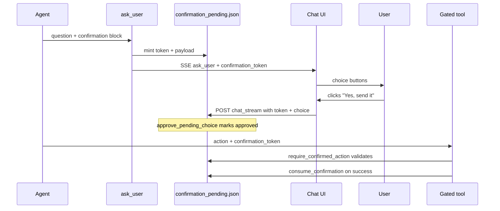

# User confirmation gates

Odysseus can require a **real user click** before privileged agent tools run (create finance categories, send SMS, send email, etc.). The flow is modular: core chat code handles tokens; each plugin registers which actions need them.

## End-to-end flow



## Core modules (shared — do not fork per plugin)

| Module | Role |
|--------|------|
| `src/confirmation_gates/core.py` | Registry, mint, approve, validate, consume |
| `src/confirmation_gates/store.py` | Durable pending tokens (`data/confirmation_pending.json`) |
| `src/agent_tools/interaction_tools.py` | `ask_user` mints token when `confirmation` is present |
| `routes/chat_routes.py` | Binds user click → `approve_pending_choice`, injects hint for model |
| `static/js/chatRenderer.js` | Sends `confirmation_token` + `confirmation_choice` with the next message |

Plugins only touch **registration** and **one guard** inside their tool.

## Plugin integration (3 steps)

### 1. Register your gate at startup

Create e.g. `integrations/phonepi/confirmation_gate.py`:

```python
from typing import Any, Optional
from src.confirmation_gates import ToolGateRegistration, register_tool_gate


def _validate_send_sms(payload: dict[str, Any], tool_args: dict[str, Any]) -> Optional[str]:
    if str(payload.get("to") or "") != str(tool_args.get("to") or ""):
        return "Confirmed phone number does not match"
    if str(payload.get("body") or "").strip() != str(tool_args.get("body") or "").strip():
        return "Confirmed message body does not match"
    return None


def register_phonepi_confirmation_gate() -> None:
    register_tool_gate(
        ToolGateRegistration(
            domain="phonepi",
            tool_name="manage_phonepi",   # your agent tool name
            description="SMS/call actions that need explicit approval",
            actions={
                "send_sms": _validate_send_sms,
                "place_call": _validate_send_sms,  # reuse or split validators
            },
            default_approve_labels=[
                "Yes, send it",
                "Send SMS",
                "Yes",
            ],
            ttl_seconds=600,
        )
    )
```

Call `register_phonepi_confirmation_gate()` from your plugin's `setup_*_routes()` (same pattern as finance).

### 2. Guard the tool action

Inside your tool implementation:

```python
from src.confirmation_gates import consume_confirmation, require_confirmed_action

async def do_manage_phonepi(content, owner=None, session_id=None):
    args = parse_args(content)
    action = args["action"]

    gate_err = require_confirmed_action(
        session_id=session_id,
        owner=owner,
        domain="phonepi",
        tool_name="manage_phonepi",
        action=action,
        tool_args=args,
        confirmation_token=args.get("confirmation_token"),
    )
    if gate_err:
        return {"error": gate_err, "exit_code": 1}

    # ... perform the action ...

    token = str(args.get("confirmation_token") or "").strip()
    if token and session_id:
        consume_confirmation(token=token, session_id=session_id, owner=owner)
```

- If the action is **not** registered in your gate, `require_confirmed_action` returns `None` (no-op).
- Only registered actions are blocked without a valid token.

### 3. Teach the agent to use `ask_user` with `confirmation`

```json
{
  "question": "Send this SMS to Mom?",
  "options": [
    {"label": "Yes, send it"},
    {"label": "No, cancel"}
  ],
  "confirmation": {
    "domain": "phonepi",
    "tool": "manage_phonepi",
    "action": "send_sms",
    "payload": {
      "to": "+15551234567",
      "body": "Running late, be there in 10"
    },
    "approve_labels": ["Yes, send it", "Send SMS"]
  }
}
```

After the user clicks an approve label:

1. UI posts `confirmation_token` + `confirmation_choice` with their message.
2. Server marks the token approved and appends a system hint telling the model which token to pass.
3. Agent calls the tool with the **same payload** plus `confirmation_token`.

## Validator contract

`PayloadValidator = Callable[[dict, dict], Optional[str]]`

- First arg: frozen payload from `ask_user` `confirmation.payload`
- Second arg: normalized tool args at execution time
- Return `None` if OK, or an error string if the tool call diverged from what the user approved

Keep validators **strict on fields that matter** (recipient, amount, subject) and ignore helper fields (`action`, `confirmation_token`).

## Security properties

| Property | How |
|----------|-----|
| User must click | Token only becomes `approved` when UI sends token + matching choice label |
| Session scoped | Token records `session_id` + `owner` |
| Single use | `consume_confirmation` deletes token after success |
| TTL | Default 10 minutes; expired tokens pruned on read |
| Payload binding | Per-action validator compares approved vs actual args |

What this does **not** stop: a malicious local model from hallucinating a token string (it won't exist in the store). This stops **unapproved** and **wrong-args** execution.

## Finance reference implementation

- Gate: `integrations/finance/confirmation_gate.py`
- Tool guard: `src/tools/finance.py` → `create_category`
- Registered in: `integrations/finance/routes.py` → `setup_finance_routes()`

## Testing

See `tests/test_confirmation_gates.py` and `tests/test_finance_agent_tools.py`.

```bash
python -m pytest tests/test_confirmation_gates.py tests/test_finance_agent_tools.py -v
```

## Playground / multi-branch merges

Branches only need to:

1. Add their `confirmation_gate.py` + one `register_*()` call at route setup.
2. Add `require_confirmed_action` / `consume_confirmation` in gated tool paths.
3. Document the `ask_user` `confirmation` shape for their agents.

No changes to `chat.js`, `chat_routes.py`, or `ask_user` are required per plugin.
