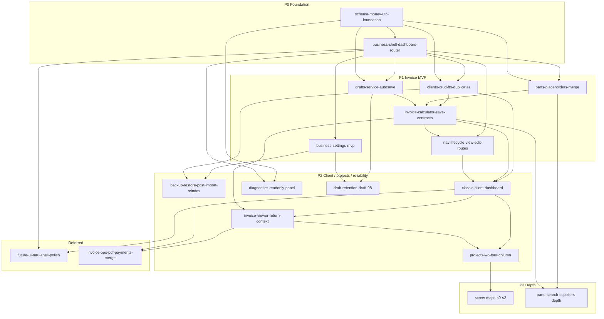

# Fill-the-gap roadmap

Recommended implementation order for the 18 per-issue plans in this folder.

Aligns with [`../synthesis/MASTER-MIGRATION-PLAN.md`](../synthesis/MASTER-MIGRATION-PLAN.md) ease-of-use order: **quote fast → client loop → shop flow → bench docs → polish → integrations**.

Canonical ids and deps: [`gap-manifest.json`](gap-manifest.json). Index: [`README.md`](README.md).

---

## Recommended order (high level)

1. **P0** — Schema + Business shell (blocks everything user-facing).
2. **P1 start (parallel)** — Clients, parts, drafts, settings as soon as shell mounts routes.
3. **P1 join** — Invoice calculator (needs clients + parts + drafts), then nav lifecycle View/Edit contracts.
4. **P2 client loop** — Classic dashboard → invoice viewer return context.
5. **P2 branches** — Projects/WO (after Classic + viewer); backup/reindex (after settings + clients); diagnostics and DRAFT-08 in parallel when capacity allows.
6. **P3** — Screw maps (after projects); parts depth (after P1 parts + calculator).
7. **Deferred** — Future UI / MRU polish; invoice PDF/email/payments/merge.

---

## Dependency graph

### Text edges (same graph)

| Plan | Depends on |
|------|------------|
| `schema-money-utc-foundation` | — |
| `business-shell-dashboard-router` | schema |
| `clients-crud-fts-duplicates` | schema, shell |
| `parts-placeholders-merge` | schema, shell |
| `drafts-service-autosave` | schema, shell |
| `business-settings-mvp` | shell |
| `invoice-calculator-save-contracts` | clients, parts, drafts |
| `nav-lifecycle-view-edit-routes` | shell, calculator |
| `classic-client-dashboard` | clients, calculator, nav |
| `invoice-viewer-return-context` | classic, calculator |
| `projects-wo-four-column` | classic, viewer |
| `backup-restore-post-import-reindex` | settings, clients |
| `diagnostics-readonly-panel` | schema, shell |
| `draft-retention-draft-08` | drafts, settings |
| `screw-maps-s0-s2` | projects |
| `parts-search-suppliers-depth` | parts, calculator |
| `future-ui-mru-shell-polish` | classic, shell |
| `invoice-ops-pdf-payments-merge` | viewer, backup |

---

## Phase groups

### P0 — Foundation (serial then shell)

1. `schema-money-utc-foundation` (**M**)
2. `business-shell-dashboard-router` (**M**) — can scaffold UI after migrate API merges

### P1 — Invoice MVP

| Order | Id | Effort | Notes |
|------:|----|--------|-------|
| 1–4 parallel | `clients-crud-fts-duplicates`, `parts-placeholders-merge`, `drafts-service-autosave`, `business-settings-mvp` | M / M / M / S | Settings soft-depends on money helpers; can ship local bps convert if schema lags |
| 5 | `invoice-calculator-save-contracts` | **L** | Join point for the shop quote loop |
| 6 | `nav-lifecycle-view-edit-routes` | **M** | Hardens View/Edit + same-surface lifecycle before Classic |

### P2 — Client workspace, projects, reliability

| Track | Id | Effort |
|-------|----|--------|
| Client loop (serial) | `classic-client-dashboard` → `invoice-viewer-return-context` | L → M |
| Shop flow | `projects-wo-four-column` | L (after viewer) |
| Reliability (parallel) | `backup-restore-post-import-reindex` | M |
| Ops polish (parallel) | `diagnostics-readonly-panel` | S MVP |
| Drafts safety (parallel) | `draft-retention-draft-08` | M |

### P3 — Depth

- `screw-maps-s0-s2` (**L**) after projects
- `parts-search-suppliers-depth` (**L**) after P1 parts + calculator (can run beside projects if capacity allows)

### Deferred

- `future-ui-mru-shell-polish` (**L**) — after Classic; session recent-6 in Classic is enough for MVP
- `invoice-ops-pdf-payments-merge` (**L** epic) — after viewer + backup; not in 90-day parity stack

---

## Parallelizable tracks

After **P0 shell** is green:

| Track | Plans | Purpose |
|-------|-------|---------|
| **A — Clients** | `clients-crud-fts-duplicates` | Typeahead + CRUD for calculator and Classic |
| **B — Parts** | `parts-placeholders-merge` | Line items + placeholders + merge |
| **C — Drafts** | `drafts-service-autosave` | Autosave files + list UI |
| **D — Settings** | `business-settings-mvp` | Tax / currency / autosave knobs |

After **P1 calculator + nav** and **Classic**:

| Track | Plans | Purpose |
|-------|-------|---------|
| **E — Return loop** | `invoice-viewer-return-context` | Save-as-new → viewer → Back |
| **F — Projects** | `projects-wo-four-column` → `screw-maps-s0-s2` | Accept → WO → project → maps |
| **G — Reliability** | `backup-restore-post-import-reindex` | ZIP/JSON + BUG-018 reindex |
| **H — Light ops** | `diagnostics-readonly-panel`, `draft-retention-draft-08` | Health panel + opt-in retention |
| **I — Parts depth** | `parts-search-suppliers-depth` | FTS / suppliers / history / triage |

Do **not** parallelize calculator against unfinished clients/parts/drafts APIs. Do **not** start Classic before nav lifecycle contracts exist (or ship nav stubs in the same sprint as Classic start).

---

## Critical UX contracts (span multiple plans)

Fail QA / CI if any of these regress. Full checklist: MASTER §6.

| Contract | Primary plans |
|----------|---------------|
| Money in integer cents; UTC DB timestamps | `schema-money-utc-foundation`, calculator, parts, invoices |
| Append-only migrations + checksum mismatch refuse | `schema-money-utc-foundation`, diagnostics |
| Single-writer / detach handlers only on reference change | `business-shell-dashboard-router`, `nav-lifecycle-view-edit-routes` |
| Dashboard cards stay live after back / cache re-select | shell, nav, Classic |
| Matches before Add New; debounce + abort search | `clients-crud-fts-duplicates`, calculator |
| Classic is the only Client Dashboard default; overlay search; clear ≠ deselect; recent-6 when empty | `classic-client-dashboard` (+ MRU polish later) |
| View → read-only viewer; Edit → navigate to calculator | `nav-lifecycle-view-edit-routes`, Classic, viewer |
| Edit save: same id/name; preserve status / finalized / sent_at | `invoice-calculator-save-contracts` |
| Save-as-new → name → new id → viewer → Back to Classic (client selected, list refresh) | calculator, `invoice-viewer-return-context`, Classic |
| Placeholder orphan cleanup **after** re-insert on update | `parts-placeholders-merge`, calculator |
| Create ≥1 line; edit may save empty header | calculator |
| Autosave: debounce + concurrency lock + leave flush | `drafts-service-autosave`, calculator |
| DRAFT-08 default off; no silent startup purge | drafts, `draft-retention-draft-08`, settings |
| Post-import / restore: reindex clients before claiming search works | `backup-restore-post-import-reindex`, clients |
| Create-from-invoice: shared path; blank Device ID refused; HW/SW/Other | `projects-wo-four-column` |
| Project detail = four-column only; screw map above photos when eligible | projects, `screw-maps-s0-s2` |

---

## Suggested first sprint (P0 + start of P1)

**Goal:** Install opens a real schema and shop home; start the three domain APIs settings needs for the calculator join.

| Slot | Plan | Effort | Exit for sprint |
|------|------|--------|-----------------|
| 1 | `schema-money-utc-foundation` | M | Migrations `0002`–`0015` applied; money/UTC tests green; install no longer empty-touch |
| 2 | `business-shell-dashboard-router` | M | Four cards + Back/Home + placeholder module routes |
| 3a | `clients-crud-fts-duplicates` | M | Start CRUD + FTS5 search API (UI can be thin) |
| 3b | `parts-placeholders-merge` | M | Start parts service + search (merge UI can trail) |
| 3c | `drafts-service-autosave` | M | Start DraftService + routes (list UI can trail) |
| 3d | `business-settings-mvp` | S | Tax/currency/autosave GET/PUT + Settings view |

**Sprint done when:** Business opens a dashboard (not a stub), schema version is queryable, and at least one of tracks A–D has a green API PR. Calculator and Classic stay **out** of sprint 1.

**Next sprint (preview):** Finish any unfinished A–D slices → `invoice-calculator-save-contracts` → `nav-lifecycle-view-edit-routes`.

---

## 90-day stack (from MASTER)

1. P0–P1 (foundation + invoice MVP)
2. P2 Classic + viewer return loop
3. P2 projects/WO
4. P2 backup / diagnostics / DRAFT-08 as capacity allows
5. P3–deferred only after the shop loop is solid
