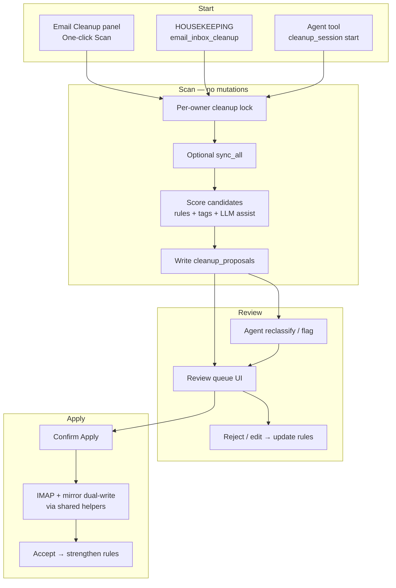

# feat: Controlled inbox cleanup with review UI and learned rules

## Goal Capsule

**Objective:** Give Odysseus a sync-style Email Cleanup system that can scan whole mailboxes in one click, propose mark-read / archive / delete actions with clear per-email review, apply only what the user (or an explicit confirmed batch) approves, and learn sender/keyword preferences from corrections so future cleanups need less guesswork. The agent co-reviews proposals with the tool instead of blindly bulk-deleting.

**Authority:** This plan > prior chat recommendations. Product intent from the Jul 2026 cleanup incident retrospective and the user’s “controlled one-click + learn + AI co-review” brief.

**Stop when:** A user can start cleanup for one or all accounts, see every proposed action with enough context to accept/reject, apply safely, see learning update rules, and the agent can inspect/reclassify proposals without exceeding delete caps on raw `bulk_email`.

---

## Product Contract

### Problem frame

Chat-driven cleanup with `read_local_emails` + `bulk_email` failed in practice: oversized deletes (161 Trash), stale UID lists, unread/offset confusion, deferred mark-read, and no durable preference learning. Local Email Sync already shows the right job shape (owner lock, Activity log, API, settings). Cleanup needs the same shape plus a **proposal review surface** and a **rules memory**.

### Actors

- A1. Mailbox owner — starts cleanup, reviews proposals, corrects bad guesses
- A2. Agent — co-reviews proposals, challenges uncertain items, never silently empties an inbox
- A3. Cleanup engine — scans local mirror, scores candidates, writes proposals, applies approved actions via dual-write

### Requirements

| ID | Requirement |
|----|-------------|
| R1 | One-click (or Tasks Run) starts a cleanup **scan** across selected accounts; scan never deletes. |
| R2 | Every candidate shows enough context to decide: account, from, subject, date, snippet, proposed action, reason/rule, confidence. |
| R3 | User can accept, reject, or change action (delete / archive / mark_read / keep) per email or by filtered multi-select. |
| R4 | Apply runs only on accepted items; soft-delete to Trash by default; hard caps on apply batch size. |
| R5 | Rejects and action changes update learned rules (sender/domain + optional keyword patterns). |
| R6 | High-confidence repeats of learned rules can auto-propose the same action, still visible in the queue unless user enables auto-apply for that rule class. |
| R7 | Agent tools can list/reclassify/comment on proposals and request apply of already-accepted items; agent cannot bypass the review queue for whole-inbox delete. |
| R8 | Raw `bulk_email` delete/junk remains capped so chat cleanup cannot recreate the 161-delete failure. |
| R9 | `read_local_emails` exposes unread/filter so agents and scanners don’t fake “unread” via offset. |
| R10 | Cleanup is foreground-safe like Email Local Sync (can run while email UI is open). |

### Key flows

**F1 — One-click controlled cleanup**
1. User opens Email → Cleanup (or Tasks → Email Cleanup → Run).
2. Engine scans local mirror (optional sync-first).
3. Proposals appear in a review queue, grouped by proposed action.
4. User accepts/rejects/edits; Apply executes dual-write IMAP + mirror.
5. Corrections feed rule learning.

**F2 — Agent co-review**
1. User asks agent to help clean inbox.
2. Agent starts or attaches to a cleanup session / reads open proposals.
3. Agent reclassifies uncertain items or asks the user about edge cases.
4. User confirms in UI (or accepts agent-suggested batch); Apply runs.

**F3 — Learned Domino’s-style rule**
1. User rejects delete on Domino’s receipt; accepts delete on Domino’s promo.
2. Engine stores: sender domain + keywords (`order`, `confirmation`, `receipt` → keep/mark_read; `free`, `deal`, `offer` → delete).
3. Next scan auto-proposes accordingly with reason citing the rule.

### Acceptance examples

- AE1. Start cleanup on Main → ≥1 proposal rows with from/subject/action/reason → Accept 3 deletes → Trash count +3 on IMAP and local; rejected items remain in inbox.
- AE2. Reject delete on a receipt from a spammy domain → next scan proposes mark_read or keep for similar receipt subjects.
- AE3. Agent calls `bulk_email` with 200 delete UIDs → tool rejects with cap error; agent directed to cleanup queue.
- AE4. `read_local_emails(filter=unread)` returns only unread rows.

### Scope boundaries

**In scope**
- Safety rails on existing tools
- Cleanup sessions + proposals store
- Review UI in email library
- Housekeeping task + HTTP API + agent tools
- Learned rules from approve/reject
- Agent co-review loop

**Deferred**
- Fully silent auto-delete with no queue (even for “trusted” rules — auto-**propose** only in v1)
- Cross-account smart folders / Gmail labels creation
- Training a separate ML model; v1 is rules + LLM assist on scan
- Mobile-specific layout polish beyond usable queue

**Outside**
- Changing Local-only dual-write semantics
- Replacing Email Tags / urgency scanner (cleanup may **read** tags, not replace them)

### Product Contract preservation

Product Contract created in this bootstrap from the user’s Jul 2026 brief; no prior brainstorm file.

---

## Planning Contract

### Assumptions

- Local mirror is the scan source of truth; run incremental sync before scan when stale or on user toggle.
- Soft-delete (Trash) is the only default destructive action in v1.
- Primary review surface is the Email Library Cleanup panel (chat cannot show hundreds of emails clearly).
- Learning storage is a dedicated rules table, not `manage_memory` alone (memory may mirror a human-readable summary).
- Finance-style confirmation gates may not exist in this branch; use server-side caps + UI confirm + optional `ask_user` for ambiguous agent reclassify.

### Key technical decisions

| ID | Decision | Rationale |
|----|----------|-----------|
| KTD1 | Mirror Local Sync architecture: owner lock, `TaskNoop` when busy, Activity summary, settings, foreground-safe | Proven job pattern; user already thinks in “Email Local Sync” terms |
| KTD2 | Propose → Review → Apply pipeline; scan never mutates mail | Prevents another 161-delete disaster |
| KTD3 | Persist proposals in SQLite (`email_store.db` or app DB) keyed by session | Survives refresh; agent + UI share state |
| KTD4 | Learned rules table: `(owner, match_type, match_value, action, keywords?, confidence, evidence_count)` | Executable, queryable; better than skill prose for Domino’s promo vs receipt |
| KTD5 | Cap raw `bulk_email` delete/junk at 25; cleanup Apply uses same helper with higher cap only for **already-accepted** proposal IDs | Stops chat abuse; allow efficient apply of reviewed sets |
| KTD6 | Agent co-review via tools on proposals, not free-form bulk UID lists for whole-inbox cleanup | Two “eyes”: rule engine + LLM, user still owns apply |
| KTD7 | Expose `filter` on `read_local_emails` matching UI (`unread`/`all`/…) | Unblocks correct agent paging |

### High-level technical design

**Proposal row shape (directional):**
`session_id, account_id, folder, uid, message_id?, from_addr, subject, date_epoch, snippet, proposed_action, reason, confidence, rule_id?, status(pending|accepted|rejected|applied|skipped), agent_note?`

**Rule match order:** exact sender → sender domain → keyword+domain → keyword-only → LLM/heuristic default. Receipt keywords override promo defaults for the same sender (explicit conflict rule).

### Alternatives considered

| Approach | Why not |
|----------|---------|
| Chat-only cleanup with better prompts | Cannot show every email clearly; still repeats UID disasters |
| Silent auto-delete after learning | User explicitly wants visibility and control |
| Skills-only learning (`personal-email-cleanup` prose) | Good for procedure; bad for executable sender/keyword rules |
| Reuse only `email_tags` spam_verdict | Useful signal; not a full propose/apply/learn loop |

### Sequencing

1. Safety rails (caps + unread filter) — ship first; protects today
2. Sessions + proposals + scan + review UI + apply
3. Rule learning from feedback
4. Agent co-review tools + domain prompt + skill sync notes

---

## Implementation Units

### U1. Safety rails on existing email tools

**Goal:** Stop catastrophic chat deletes and enable correct unread listing.

**Requirements:** R8, R9

**Dependencies:** none

**Files:**
- `mcp_servers/email_server.py` (bulk delete/junk cap; structured ok/missing UIDs)
- `src/tool_schemas.py` / `src/tool_index.py` (document caps; `read_local_emails.filter`)
- `src/tool_implementations.py` (pass `filter_` into `query_local_emails`)
- `src/agent_loop.py` (email domain rules: ≤25 deletes; use cleanup for whole-inbox; transactional = mark_read)
- `tests/test_bulk_email_uid_cap.py` (new)
- `tests/test_read_local_emails_filter.py` (new)

**Approach:**
- Reject `bulk_email` delete/junk when `len(uids) > 25` with message pointing at Email Cleanup.
- Return `matched_uids` / `missing_uids` / `imap_ok` in bulk results when feasible.
- Add `filter` enum to `read_local_emails` wired to existing `query_local_emails(..., filter_=)`.
- Soften “one bulk_email for the whole set” prompt language for cleanup intents.

**Test scenarios:**
- Happy: delete 10 UIDs succeeds; delete 26 UIDs returns error, no IMAP call.
- Happy: `filter=unread` excludes `is_read=1` rows.
- Edge: empty uids / `all_unread` still allowed but document interaction with cap.
- Error: partial match returns missing UIDs list.

**Verification:** Cap and filter tests pass; agent docs mention cleanup for large jobs.

---

### U2. Cleanup session + proposal persistence

**Goal:** Durable propose/review/apply state shared by UI, task, and agent.

**Requirements:** R1, R2, R10

**Dependencies:** none (can parallel U1)

**Files:**
- `routes/email_local_store.py` or new `routes/email_cleanup_store.py` (schema + CRUD)
- `src/settings.py` (`email_cleanup_*` settings)
- `tests/test_email_cleanup_store.py` (new)

**Approach:**
- Tables: `cleanup_sessions` (owner, status, accounts, created_at, summary), `cleanup_proposals` (row shape above), reuse owner scoping like `messages`.
- Per-owner non-blocking lock for scan (mirror `_owner_sync_all_lock`).
- Session statuses: `scanning` → `ready` → `applying` → `done` / `cancelled`.

**Test scenarios:**
- Happy: create session, insert proposals, list by status.
- Edge: second scan while busy returns busy/`TaskNoop`.
- Owner isolation: owner B cannot see owner A proposals.

**Verification:** Store tests green; lock behavior matches sync busy pattern.

---

### U3. Scan engine (rules + tags + optional LLM assist)

**Goal:** Produce proposals without mutating mail.

**Requirements:** R1, R2, R6

**Dependencies:** U2

**Files:**
- `routes/email_cleanup_scan.py` (new) or section in `email_cleanup_store.py`
- `src/builtin_actions.py` (`action_email_inbox_cleanup` scan phase)
- `src/task_scheduler.py` (HOUSEKEEPING entry; `_FOREGROUND_SAFE_ACTIONS`; likely `_MODEL_BACKED_ACTIONS` if LLM used)
- `routes/email_helpers.py` (read `email_tags` as input signal)
- `tests/test_email_cleanup_scan.py` (new)

**Approach:**
- Candidate query: unread (default) or all in window; per-account; exclude already-proposed open UIDs.
- Score order: learned rules → email_tags spam/marketing → heuristics (promo vs receipt) → optional LLM batch for undecided only.
- Never auto-apply in scan; write `pending` proposals with reason + confidence.
- Budget: max proposals per run (setting), wall-clock like sync.

**Test scenarios:**
- Happy: promo sender → propose delete; PayPal receipt → propose mark_read or keep.
- Edge: receipt keywords on promo domain → keep/mark_read wins.
- Edge: urgent/security senders never propose delete.
- Integration: tags `marketing` boosts delete confidence.

**Verification:** Scan creates proposals only; inbox unchanged.

**Execution note:** Characterization fixtures for Domino’s promo vs order subjects before tuning heuristics.

---

### U4. Review UI + Apply API

**Goal:** User clearly sees every email and controls accept/reject/apply.

**Requirements:** R2, R3, R4

**Dependencies:** U2, U3

**Files:**
- `routes/email_routes.py` — `/api/email/cleanup/sessions`, `.../proposals`, `.../decide`, `.../apply`
- `static/js/emailApi.js`
- `static/js/emailLibrary.js` (Cleanup panel / modal; reuse list row + bulk bar patterns)
- `static/style.css`
- `mcp_servers/email_server.py` or shared apply helper (dual-write)
- `tests/test_email_cleanup_apply.py` (new)
- `tests/test_email_cleanup_ui.js` or DOM smoke if repo pattern exists

**Approach:**
- Queue UI: filters by proposed action; row shows from/subject/date/snippet/reason/confidence; actions Accept / Reject / Change action.
- Multi-select accept/reject within filter.
- Apply: confirm dialog (`styledConfirm`); execute only `accepted` proposals; soft-delete; batch via dual-write helpers; mark `applied` / error detail.
- Apply cap: e.g. 100 accepted per click (reviewed), still soft-delete only.

**Test scenarios:**
- Happy: accept 2 delete + 1 mark_read → apply updates IMAP mock + mirror + statuses.
- Error: apply with zero accepted → no-op message.
- Edge: reject does not mutate mail; status `rejected`.
- Integration: partial IMAP failure still mirrors and records per-row outcome.

**Verification:** Manual pass on Local only + live account; automated apply tests with mocks.

---

### U5. Learned cleanup rules from feedback

**Goal:** Domino’s-style preferences become durable executable rules.

**Requirements:** R5, R6

**Dependencies:** U4

**Files:**
- `routes/email_cleanup_rules.py` (new) or store module
- Wire into U3 scorer
- Optional: append short preference line via `manage_memory` on notable corrections
- `static/js/settings.js` or Cleanup panel “Rules” tab (list/edit/disable)
- `tests/test_email_cleanup_rules.py` (new)

**Approach:**
- On reject of proposed delete: create/strengthen keep or mark_read rule for sender/domain + extract keywords from subject when discriminative.
- On accept: strengthen matching rule confidence / evidence_count.
- On change action: store the chosen action as the rule outcome.
- Rules UI: list, disable, delete; never silent auto-apply in v1 (auto-propose only).

**Test scenarios:**
- Happy: reject delete on receipt → next scan proposes mark_read for similar subject from same sender.
- Happy: accept delete on promo → confidence increases; still appears in queue.
- Edge: conflicting rules resolve via receipt-override precedence.
- Error: disabled rule ignored by scorer.

**Verification:** Two-scan fixture proves learning without LLM.

---

### U6. Agent co-review tools + prompts + skill note

**Goal:** Agent and tool share the queue; agent helps decide, user still sees everything.

**Requirements:** R7

**Dependencies:** U4, U5

**Files:**
- `src/tool_schemas.py` — `cleanup_email` or split tools: `cleanup_session`, `cleanup_proposals`, `cleanup_decide`
- `src/tool_implementations.py` / `src/tool_execution.py` / `src/tool_index.py`
- `src/agent_loop.py` — domain rules for cleanup co-review
- Docs note for user skill path: sync procedure into `data/skills/email/personal-email-cleanup/SKILL.md` (runtime data; may live outside repo)
- `tests/test_cleanup_email_tools.py` (new)

**Approach:**
- Tools: `start` (scan), `status`, `list_proposals` (filter/limit), `decide` (accept/reject/reclassify with reason), `apply` (only accepted; still server-checked).
- Agent must not call raw `bulk_email` delete for “clean whole inbox”; domain rule routes to cleanup tools.
- Co-review: agent lists uncertain (low confidence) proposals, argues, updates `agent_note` / reclassifies; user applies in UI or confirms apply.

**Test scenarios:**
- Happy: list pending proposals returns capped page with reasons.
- Happy: decide reclassify delete→mark_read updates row.
- Error: apply without accepted IDs fails.
- Policy: large bulk_email delete still blocked (U1).

**Verification:** Tool tests + prompt regression for email domain string.

---

## Verification Contract

- Unit/integration: new `tests/test_email_cleanup_*.py`, `tests/test_bulk_email_uid_cap.py`, `tests/test_read_local_emails_filter.py`
- Manual: Local only mode — scan Main → review → apply → confirm Trash + mirror; reject receipt → rescan learns
- Manual: Agent “clean my unread” → uses cleanup tools, not 100+ UID bulk delete
- Regression: existing `tests/test_bulk_email_local_mirror.py`, local sync foreground gate tests still pass

## Definition of Done

- [ ] U1–U6 landed with tests listed above
- [ ] Cleanup panel usable for one-account full unread pass
- [ ] Learning changes next scan without editing skills by hand
- [ ] Raw bulk delete cap enforced
- [ ] Agent co-review path documented in domain rules
- [ ] No silent whole-inbox auto-delete path in v1

## Risks and mitigations

| Risk | Mitigation |
|------|------------|
| LLM scan cost/latency | Cap undecided batch; rules/tags first; budget seconds |
| Rule overfit (one reject kills all Domino’s) | Keyword split promo vs receipt; evidence_count thresholds |
| Queue overload (thousands unread) | Paginate; max proposals/run; prioritize newest unread |
| IMAP/local drift on apply | Reuse dual-write helpers; per-row outcomes; suggest sync |
| Agent bypass via many small bulk deletes | Cap + rate note; domain rule; optional session-scoped delete budget |

## Phased delivery

| Phase | Units | User-visible outcome |
|-------|-------|----------------------|
| P0 | U1 | Safer chat cleanup immediately |
| P1 | U2–U4 | One-click scan + review + apply |
| P2 | U5 | Learns from corrections |
| P3 | U6 | Agent co-review on the same queue |

## Sources and research

- Incident retrospective: Personal-account 161-delete, offset/unread confusion, deferred mark-read, garbage FTS, skill edit path
- Local sync patterns: `routes/email_local_store.py`, `src/builtin_actions.py`, `src/task_scheduler.py` (`sync_local_emails`, `_FOREGROUND_SAFE_ACTIONS`)
- Dual-write: `mcp_servers/email_server.py` `_mirror_local`
- Urgency/tags signals: `email_tags`, `urgent_email_prompt`, `action_check_email_urgency`
- Pending approve pattern: `routes/email_routes.py` agent_draft `/pending`
- Explore agents: local sync architecture; preference-learning patterns

## Deferred to follow-up

- Auto-apply for high-confidence rules (user opt-in)
- Dedicated mobile cleanup UX
- Export/import of cleanup rules
- Full rewrite of `personal-email-cleanup` skill in repo templates (runtime skill lives under `data/skills/`)
