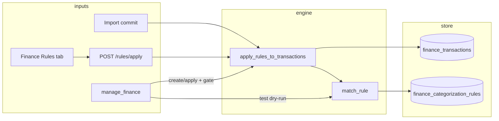

# feat: Enhanced auto-categorization rules (HomeBank Assign port)

## Goal Capsule

Port HomeBank Assign’s match/action richness into Odysseus `FinanceCategorizationRule` so the AI finance agent can create, dry-run, and apply durable merchant rules — not just one-off categorizations. Keep scope to category (+ optional payee rewrite later); defer tags and paymode until those domains exist.

---

## 1. Benefit verdict (AI finance agent)

**Verdict: Yes — port it.**

**Why it helps the agent**

- Today the agent can `categorize_transaction` (one row) or `create_rule` (payee regex → category, no confirm, no test, no list, no retroactive apply). After import, most uncategorized spend still needs manual or per-row agent work.
- HomeBank Assign proves the durable loop: match payee/memo (substring/regex) + optional amount → set category (and related fields), with overwrite flags and re-run on existing txns.
- Agent value peaks when rules are **inspectable, testable, and reversible**: propose pattern from a txn → dry-run sample → user confirms → persist → apply to uncategorized (or overwrite with explicit gate).
- Spending reports and budgets only work if categories stick; rules are the compounding lever after each import.

**What not to copy blindly**

| HomeBank | Odysseus today | Port? |
|----------|----------------|-------|
| Match payee **or** memo | Payee only (`apply_rules_to_transactions`) | **Yes** |
| Contains / “exact” / regex | Always `re.search`, fallback substring | **Yes** (explicit `match_mode`) |
| Amount exact (`ASGF_AMOUNT`) | None | **Yes**, prefer **min/max cents** (research doc) over HB exact-only |
| Actions: payee, category, paymode, tags | Category only | **Category yes**; payee rename optional Phase 2; **paymode/tags no** (no columns / tags feature not shipped) |
| Overwrite flags per field | Skip if `category_id` set | **Yes** (`overwrite_category`) |
| Position-ordered multi-match apply | First match wins by priority | Keep **first match wins**; do not port HB’s multi-rule accumulate |
| Split memo rules | No splits | **Defer** |
| Full Assign UI | No rules UI in finance panel | **Yes** (rules tab) |
| Import + manual re-assign | Import only | **Yes** (`apply-all` + agent) |

---

## 2. Problem frame & current state

### HomeBank (source)

- Model: `Assign` in `hb-assign.h` — `field` (0 memo / 1 payee), `search`, flags (`ASGF_EXACT`, `ASGF_REGEX`, `ASGF_AMOUNT`, `ASGF_DOCAT`/`OVWCAT`, …), `kpay`/`kcat`/`paymode`/`tags`, `pos`.
- Engine: `transaction_auto_assign` in `hb-assign.c` — sorted by position; match text + optional amount; apply actions with empty-or-overwrite semantics; skip reconciled when locked; split path memo-only.
- Text match: casefold contains unless “exact” (case-sensitive substring via `g_strrstr`); regex via `g_regex_match_simple`.
- Triggers: import (`hb-import.c`) and account UI re-assign (`dsp-account.c`).

### Odysseus (target)

- Model: `FinanceCategorizationRule` — `pattern`, `category_id`, `priority` only (`integrations/finance/models.py`).
- Engine: `apply_rules_to_transactions` — payee-only, `re.search` / substring fallback, **never** overwrites existing category (`integrations/finance/services/categories.py`).
- Import: called after commit in `import_service.py`.
- API: `GET/POST/DELETE /rules` — pattern + category + priority (`routes.py`).
- Agent: `manage_finance` → `create_rule` only; **not** confirmation-gated; no `list_rules` / `test_rule` / `apply_rules` (`src/tools/finance.py`, `src/tool_schemas.py`).
- UI: finance panel has transactions/categories/budget/reports — **no rules surface** (`integrations/finance/static/js/index.js`).
- Research target already sketched richer columns in `Banking Research/features/rules-auto-categorization.md`.

---

## 3. Product requirements (bootstrap)

| ID | Requirement |
|----|-------------|
| R1 | Rules match on **payee and/or memo** with modes: `contains`, `exact`, `regex`. |
| R2 | Optional **amount range** (`amount_min_cents`, `amount_max_cents`); either bound nullable. |
| R3 | Optional **account** filter (`account_id`). |
| R4 | Action: set **category** (required). Optional Phase 2: set/normalize **payee**. |
| R5 | `overwrite_category` (default false): only fill empty categories unless true. |
| R6 | `enabled` + `priority` (higher wins; first match stops). Optional `name`/`notes`. |
| R7 | Run on **import commit** (existing hook) and **retroactive apply** (uncategorized by default; overwrite only when flagged + confirmed). |
| R8 | Agent can **list / create / update / delete / test (dry-run) / apply** rules via `manage_finance`. |
| R9 | Mutating create/update/delete/apply (especially overwrite) use **confirmation gates**. |
| R10 | UI Rules tab: CRUD, priority, dry-run preview, “Apply to uncategorized”. |

**Non-goals (this plan)**

- Tags / paymode / splits / transfer-child sync.
- ML / cloud auto-categorization.
- Multi-rule accumulate (HB applies every matching rule’s actions); Odysseus stays first-match-wins.
- Importing HomeBank `.xhb` assign rules (follow-up).

---

## Assumptions

- SQLite plugin DB uses `create_all` + additive column migration helper (same pattern as other finance schema growth); no Alembic required unless repo later standardizes it.
- Priority convention stays **higher `priority` wins** (current code), not HB position order — document in UI/tool copy.
- ReDoS: regex match uses a small timeout or length cap; invalid regex rejected at create/update, not silently demoted to substring at apply time (change from today’s fallback).

---

## 4. High-level technical design



**Match semantics (directional)**

```
for rule in rules ordered by priority DESC, created_at ASC:
  if not enabled: continue
  if account_id and tx.account_id != account_id: continue
  if amount bounds and amount_cents outside: continue
  text = payee and/or memo per match_field
  if match_mode(text, pattern): return rule  # first wins
```

---

## 5. Key technical decisions

1. **Extend `FinanceCategorizationRule` in place** rather than new `finance_rules` table — preserves existing rows (`pattern` → treat as payee + regex/contains compatible); add columns with safe defaults.
2. **Explicit `match_mode`** (`contains` | `exact` | `regex`) instead of HB flag bits — clearer for agent schemas.
3. **`match_field`**: `payee` | `memo` | `payee_or_memo` (OR either field matches).
4. **Amount range in cents**, not float dollars; signs follow stored `amount_cents` (expenses negative). Document in tool description.
5. **Dry-run returns structured preview** (tx id, payee, amount, current category, proposed category) capped (e.g. 50) — never mutates.
6. **Confirmation gates** for `create_rule`, `update_rule`, `delete_rule`, `apply_rules` when `overwrite=true` or bulk apply count > N (recommend gate all applies with sample count in payload).
7. **Invalid regex fails closed** at write and at match (skip rule + log); remove silent substring fallback for broken regex.

---

## 6. Implementation units

### U1. Extend rule model + migration

**Goal:** Persist enhanced rule fields without breaking existing patterns.

**Requirements:** R1–R6

**Dependencies:** none

**Files:**
- `integrations/finance/models.py`
- `integrations/finance/database.py` (or small `schema_migrate.py` if preferred)
- `integrations/finance/install.py` (ensure migrate on install/activate)
- `tests/test_finance_categorization_rules.py` (new)

**Approach:**
- Add columns: `name` (nullable), `match_field` (default `payee`), `match_mode` (default `contains` for new; migrate existing → `regex` to preserve `re.search` behavior **or** document one-time migration to `contains` if patterns were literal substrings — **prefer keep existing as `regex`** for behavioral continuity), `amount_min_cents`, `amount_max_cents`, `account_id` (nullable FK), `overwrite_category` (bool default false), `enabled` (bool default true), `notes` (nullable).
- Keep `pattern`, `category_id`, `priority`.
- Additive SQLite `ALTER TABLE` for existing DBs.

**Test scenarios:**
- Fresh install creates full schema.
- Existing DB with old rules migrates; old pattern still categorizes same payees.
- Default values leave prior API creates working.

**Verification:** install/uninstall fixtures pass; old rule rows still apply.

---

### U2. Match engine rewrite

**Goal:** Single pure matching + apply path used by import, API, and tools.

**Requirements:** R1–R5, R7

**Dependencies:** U1

**Files:**
- `integrations/finance/services/categories.py` (split optional: `services/rules_engine.py`)
- `tests/test_finance_categorization_rules.py`

**Approach:**
- Extract `rule_matches(rule, tx) -> bool` and `apply_rules_to_transactions(..., *, overwrite=None, dry_run=False) -> ApplyResult`.
- `ApplyResult`: `matched_count`, `updated_count`, `previews[]`.
- Honor `overwrite_category` per rule; call-site `overwrite` force flag for retroactive admin apply.
- First match wins; skip disabled; skip reconciled only if product later adds lock — **defer** (status exists as string; no HB-style lock yet).

**Test scenarios:**
- Happy: payee contains `COSTCO` → Groceries.
- Exact vs contains case folding.
- Regex with IGNORECASE.
- Memo-only and payee_or_memo.
- Amount min/max inclusive boundaries; income positive vs expense negative.
- Account filter.
- Existing category skipped unless overwrite.
- Invalid regex skipped / rejected.
- Priority ordering.

**Verification:** unit tests cover matrix above; import still categorizes new rows.

---

### U3. API: CRUD + test + apply

**Goal:** HTTP surface matches research doc.

**Requirements:** R7, R10 (backend)

**Dependencies:** U2

**Files:**
- `integrations/finance/routes.py`
- `tests/test_finance_rules_api.py` (new) or extend existing finance route tests

**Approach:**
- Extend `RuleCreate` / add `RuleUpdate` with new fields.
- `GET /rules` returns full fields.
- `PATCH /rules/{id}`
- `POST /rules/test` — body: sample payee/memo/amount/account **or** `transaction_id`; returns match + which rule.
- `POST /rules/apply` — body: `{ account_id?, uncategorized_only: true, overwrite: false, dry_run: true|false, limit? }`.
- `POST /rules/from-transaction/{id}` — seed pattern from payee, category optional.

**Test scenarios:**
- CRUD owner isolation.
- Test endpoint does not mutate.
- Apply dry_run vs commit counts.
- from-transaction creates sensible default contains rule.

**Verification:** API tests green; OpenAPI/docs optional.

---

### U4. Agent tools + confirmation gates

**Goal:** Agent can build and verify rules safely.

**Requirements:** R8, R9

**Dependencies:** U3

**Files:**
- `src/tools/finance.py`
- `src/tool_schemas.py`
- `src/agent_loop.py` (manage_finance help text)
- `src/tool_index.py` (one-line capability blurb)
- `integrations/finance/confirmation_gate.py`
- `tests/` for gate + tool actions (follow existing finance gate tests if any)

**Approach — actions on `manage_finance`:**

| Action | Mutates? | Gate? |
|--------|----------|-------|
| `list_rules` | no | no |
| `test_rule` | no | no |
| `create_rule` | yes | **yes** |
| `update_rule` | yes | **yes** |
| `delete_rule` | yes | **yes** |
| `apply_rules` | yes if not dry_run | **yes** when not dry_run |

**Schemas (directional):** see §7.

**Example workflows:** see §7.

**Verification:** tool enum updated; gated actions reject without token; dry-run apply works without gate.

---

### U5. Finance UI Rules tab

**Goal:** Human CRUD parity with agent.

**Requirements:** R10

**Dependencies:** U3

**Files:**
- `integrations/finance/static/js/index.js`

**Approach:**
- New tab “Rules”: table (priority, field, mode, pattern, amount, category, enabled), form, Test button (calls `/rules/test`), Apply uncategorized button (`dry_run` preview then confirm).
- Transaction row affordance: “Create rule” → opens form prefilled.

**Test scenarios:** Manual / light Playwright if finance UI tests exist; else smoke checklist in Verification Contract.

**Verification:** Rules visible after create; apply updates uncategorized list.

---

### U6. Docs + research alignment

**Goal:** Keep Banking Research + plugin README accurate.

**Dependencies:** U2–U5

**Files:**
- `Banking Research/features/rules-auto-categorization.md` (mark shipped vs deferred)
- `integrations/finance/README.md` if it documents API

**Test expectation:** none — docs only.

---

## 7. AI tool access design

### Confirmation model

Reuse `integrations/finance/confirmation_gate.py` + `ask_user` confirmation blocks (same as `create_category`):

- Payload should include human-readable summary: pattern, match_field/mode, category name, estimated match count when applying.
- `apply_rules` with `dry_run: true` never gated.
- `apply_rules` with `dry_run: false` gated; payload includes `matched_count` / sample payees from a prior dry-run when available.

### Tool schemas (directional, extend `manage_finance`)

```json
{
  "action": "create_rule",
  "name": "Costco groceries",
  "pattern": "COSTCO",
  "match_field": "payee",
  "match_mode": "contains",
  "category_id": "Groceries",
  "priority": 100,
  "amount_min_cents": null,
  "amount_max_cents": null,
  "account_id": null,
  "overwrite_category": false,
  "confirmation_token": "..."
}
```

```json
{
  "action": "test_rule",
  "pattern": "COSTCO",
  "match_field": "payee",
  "match_mode": "contains",
  "category_id": "Groceries",
  "sample_limit": 20
}
```
Returns: matching historical txs (id, date, payee, amount, current category) + count.

```json
{
  "action": "apply_rules",
  "uncategorized_only": true,
  "overwrite": false,
  "dry_run": true,
  "account_id": null,
  "limit": 200
}
```

### Example agent workflows

1. **From a messy import**
   - `list_transactions` (uncategorized / search)
   - Propose: “COSTCO* → Groceries”
   - `test_rule` → show user N matches
   - `ask_user` confirm → `create_rule` + token
   - `apply_rules` dry_run → confirm → `apply_rules` commit

2. **Subscription amount band**
   - Pattern `NETFLIX`, `amount_min_cents=-1599`, `amount_max_cents=-999`, category Subscriptions
   - Dry-run ensures grocery “Netflix gift card” of −5000 does not match

3. **Memo-only ACH**
   - `match_field: memo`, `pattern: "PAYROLL"`, category Income

4. **Tighten after false positive**
   - `update_rule` to `match_mode: regex`, pattern `^COSTCO\\b`, re-test, apply only uncategorized

---

## 8. Phased delivery

| Phase | Units | Ships |
|-------|-------|-------|
| **P0** | U1, U2, U3 (test+apply), U4 | Agent + API enhanced rules; import uses new engine |
| **P1** | U5, U6 | Rules UI + docs |
| **P2 (follow-up)** | — | Tags action, payee rewrite, HB file import, reconciled lock |

---

## 9. File touch list (summary)

| Area | Paths |
|------|-------|
| Model/DB | `integrations/finance/models.py`, `database.py`, `install.py` |
| Engine | `integrations/finance/services/categories.py` (± `rules_engine.py`) |
| Import | `integrations/finance/services/import_service.py` (hook stays; signature may grow) |
| API | `integrations/finance/routes.py` |
| Agent | `src/tools/finance.py`, `src/tool_schemas.py`, `src/agent_loop.py`, `src/tool_index.py` |
| Gates | `integrations/finance/confirmation_gate.py` |
| UI | `integrations/finance/static/js/index.js` |
| Tests | `tests/test_finance_categorization_rules.py`, `tests/test_finance_rules_api.py` |
| Docs | `Banking Research/features/rules-auto-categorization.md` |

---

## 10. Risks & open questions

**Risks**

- **Behavioral change:** existing rules treated as regex may over-match vs user mental model of “contains”; mitigate by documenting migration and UI mode picker.
- **ReDoS** on user/agent regex; need timeout/length limits.
- **Amount sign confusion** for agent (expenses negative); schema descriptions must be explicit.
- **Bulk overwrite** can trash manual categories; gate + dry-run mandatory.
- **Priority inversion** vs research doc (“lower number = higher priority”) — code today is higher-wins; **keep code**, fix research doc.

**Open questions**

1. Migrate legacy `pattern` as `regex` (behavior-preserving) or `contains` (safer for agent-created literal strings)? **Recommendation: regex** for old rows; new `create_rule` defaults to `contains`.
2. Should `create_rule` from agent default to apply-after-create on uncategorized, or always require separate `apply_rules`? **Recommendation: separate** (safer).
3. Gate threshold: always gate `create_rule`, or only when regex / overwrite? **Recommendation: always gate creates/updates/deletes** for parity with categories.
4. Account-scoped rules: FK enforce delete behavior when account removed?
5. Phase 2 payee-normalization action — needed for OFX ugly payees before tags land?

---

## 11. Effort & priority

| | |
|--|--|
| **Effort** | **M** (P0); **M→L** if P0+P1 in one pass |
| **Priority** | **High** for AI finance agent — highest leverage after import parsing; unblocks compounding categorization |

---

## Scope Boundaries

### In scope
- Enhanced match fields/modes, amount range, account filter, overwrite flag, enabled, priority
- Engine + import + retroactive apply + dry-run
- Agent tool actions + confirmation
- Rules UI tab

### Deferred to follow-up
- Tags on rules (depends on tags feature)
- Paymode / splits / HB file import
- ML suggestions

### Outside product identity
- Replacing user rules with opaque cloud ML as the only path

---

## Verification Contract

- Unit matrix for match engine (U2 scenarios).
- API: test does not write; apply dry_run vs commit; owner isolation.
- Tool: list/test ungated; create/apply gated.
- Import regression: new txns still auto-categorize.
- Manual: Rules tab CRUD + apply uncategorized.

## Definition of Done

- P0 units merged with tests green.
- Agent can complete workflow: discover uncategorized → test → confirm create → dry-run apply → apply.
- Legacy rules still categorize after migration.
- Research doc updated for shipped vs deferred.
