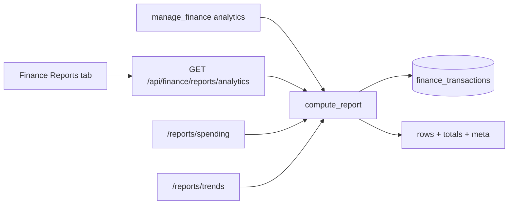

# feat: Multi-dimensional reports & analytics

**Target repo:** odysseus-finance

---

## Goal Capsule

- **Objective:** Give the AI finance agent (and UI) a single pivotable analytics surface: group spending/income by category, payee, account, month, or year over arbitrary date ranges, with structured results the agent can reason over.
- **Authority:** Prefer existing finance plugin patterns (`integrations/finance/services/reports.py`, `manage_finance`, `/api/finance/reports/*`). HomeBank `report_compute` is the behavioral reference, not a line-by-line port.
- **Done when:** Agent can answer cross-dimensional questions (payee × range, account × month, income vs expense) without scraping 50-row transaction lists; API and Reports tab expose the same engine; tests cover service + tool contracts.
- **Out:** Full HomeBank chart suite, PDF print, forecast, balance-over-time, tags/split-aware reporting (until those models exist), custom report builder UI.

---

## Benefit verdict (AI finance agent)

**Yes — ship this.**

Reasoning:

- Odysseus already positions agent Q&A as a differentiator (`Banking Research/01-feature-inventory.md`: "Summarize my dining spend last quarter").
- Today `manage_finance` only supports category totals for one calendar month (`spending_report`) and coarse 6-month income/spending totals (`trends`). Natural questions ("top merchants last quarter", "what did Checking spend vs credit card in June", "income vs expense YTD") force `list_transactions` (cap 50) or incomplete answers.
- HomeBank's `report_compute(grpby, intvl, filter, …)` proves the right abstraction: one engine, many pivots. Porting that shape into Python/SQL unlocks agent reasoning with small structured payloads instead of raw ledgers.
- Read-only analytics have low trust risk (no confirmation gate) and high action/context parity payoff.

---

## Product Contract

### Problem frame

Users and the agent need flexible answers about where money went and came from. Current reports are fixed two-views (category-for-month + N-month totals). HomeBank supports pivot by category/payee/account/tag/month/year with expense/income/total and time intervals. Odysseus should adopt a simplified multi-dimensional engine without copying the full GTK report UI.

### Requirements

- R1. One shared report engine aggregates `finance_transactions` by a chosen dimension over a date range.
- R2. Supported group dimensions in v1: `category`, `payee`, `account`, `month`, `year`.
- R3. Supported amount modes: `expense` (outflows), `income` (inflows), `net` (income − expense), and optionally dual columns for both expense and income when mode is `both`.
- R4. Filters: `from`/`to` (inclusive dates or `YYYY-MM`), optional `account_id`(s), optional `category_id`, optional payee substring.
- R5. HTTP API exposes the engine; UI Reports tab consumes it; `manage_finance` exposes the same parameters with token-safe caps (top N rows + summary totals).
- R6. Results include row label/id, `amount_cents` (and dual columns when requested), `transaction_count`, plus a response-level `total_*` and applied filter echo for agent reasoning.
- R7. Existing `spending_report` / `trends` / `/reports/spending` / `/reports/trends` keep working (thin wrappers or aliases over the new engine).

### Actors

- A1. End user — Reviews Reports tab; asks chat finance questions.
- A2. AI agent — Calls `manage_finance` for aggregates; prefers reports over listing transactions.
- A3. Plugin DB — Owner-scoped `finance_transactions` / accounts / categories.

### Key flows

- F1. User asks "top payees last 90 days" → agent calls analytics report → summarizes top rows.
- F2. User opens Finance → Reports → picks range + group-by → sees table (charts later).
- F3. Agent compares two months of category spend via two report calls or one call with `group_by=month` + category filter.

### Acceptance examples

- AE1. `group_by=payee`, `amount_type=expense`, `from=2026-01-01`, `to=2026-03-31`, `limit=10` returns ≤10 payee rows sorted by spend descending plus `total_expense_cents`.
- AE2. `group_by=account`, month `2026-06` returns per-account expense/income matching SQL sums for that owner.
- AE3. Empty range returns empty rows with totals zero and a clear message; invalid `group_by` returns tool/API error.
- AE4. Legacy `spending_report` for `2026-06` still matches current category monthly behavior.

### Scope boundaries

**In scope**

- Pivot engine, API, agent tool params, Reports tab controls (date range + group-by + amount type), CSV export of the current result set, tests.

**Deferred for later**

- Tag dimension (depends on tags feature; research doc Phase 2).
- Split-aware aggregation (depends on split transactions).
- Transfer exclusion / transfer detection.
- Materialized `finance_monthly_summary` table.
- Day/week/fortnight intervals; stacked 100% charts; PDF.
- YoY compare helper endpoint (can be two agent calls first).
- Balance / net-worth time series (separate feature).

**Outside this product's identity**

- Full HomeBank custom report builder and print pipeline.
- Third-party BI / spreadsheet sync.

---

## Planning Contract

### Assumptions

- No tags or splits tables exist today; do not block v1 on them. Design `group_by` as an enum so `tag` can be added later.
- Transfer exclusion is undefined in the finance plugin; v1 includes all signed amounts (document this). Follow-up when transfer detection lands.
- Agent responses stay text-formatted like other `manage_finance` actions, but include a machine-friendly summary block (totals + top rows) suitable for reasoning.
- Chart library choice is polish-only; v1 UI can ship tables first (matches current Reports tab).

### Key technical decisions

| ID | Decision | Rationale |
|----|----------|-----------|
| KTD1 | Single `compute_report(...)` in `services/reports.py`; thin wrappers for legacy month/category and trends | Matches HomeBank `report_compute` one-engine model; avoids duplicate SQL |
| KTD2 | Extend `manage_finance` with action `analytics` (aliases: `report`, `pivot`); keep `spending_report` / `trends` as convenience wrappers | Primitive tool first; avoids proliferating tools; agent already knows `manage_finance` |
| KTD3 | Cap agent rows at 25 (configurable via `limit`, max 50); always return totals for the full filtered set | Prevents token blowup on payee cardinality |
| KTD4 | No new DB tables in v1; SQLAlchemy `group_by` + `func.sum` on live transactions | Matches Banking Research MVP; summary table only if perf becomes an issue |
| KTD5 | Date range via `from`/`to` (or `month` shorthand); intervals for time-series columns: `none` \| `month` \| `quarter` \| `year` | HomeBank has day→year; simplify to what agents ask for |
| KTD6 | Matrix mode (group_by × interval) deferred to phase 2; v1 is single-axis pivot + optional time series when `group_by` is month/year | Reduces complexity; agent can compose two calls |
| KTD7 | Charts and CSV export after engine + agent path | Agent value does not depend on charts |

### HomeBank parity vs simplify

| HomeBank | Odysseus v1 | Notes |
|----------|-------------|-------|
| GRPBY category/payee/account/month/year | Yes | Core |
| GRPBY tag / accgroup / type | No / later | No tags; type ≈ amount_type filter |
| INTVL day/week/fortnight | No | Rare for agent |
| INTVL month/quarter/year | Yes (as group_by or later matrix) | |
| TYPE expense/income/total | Yes (`expense`/`income`/`net`/`both`) | |
| Charts (pie/col/stack/stack100) | Later | Tables first |
| Export/print chart | CSV of table only | |
| Forecast / balance flags | No | Separate features |
| Filter widget (full HB filter) | Subset: dates, account, category, payee | |

### High-level technical design



Directional query shape (not implementation):

```
compute_report(owner, group_by, amount_type, date_from, date_to,
               account_ids?, category_id?, payee_contains?, limit?)
  -> { meta, totals, rows[{ key, label, expense_cents?, income_cents?,
       amount_cents, transaction_count }] }
```

### Alternative approaches considered

1. **Only enrich UI charts; leave agent on current tools** — Rejected; agent is the primary Odysseus differentiator for this feature.
2. **Separate `manage_finance_report` tool** — Rejected; schema sprawl; existing tool already owns finance reads.
3. **Materialized summary from day one** — Deferred; premature until import volume proves need.

---

## AI tool access design

### Action

Add to `manage_finance`:

- `analytics` (preferred)
- Aliases: `report`, `pivot`, `breakdown`

Keep:

- `spending_report` → `analytics` with `group_by=category`, `amount_type=expense`, `month=…`
- `trends` → monthly income/spending series (existing shape) implemented via engine or thin dedicated helper

### Schema additions (parameters)

| Param | Type | Required | Description |
|-------|------|----------|-------------|
| `action` | enum + `analytics` | yes | Existing actions unchanged |
| `group_by` | `category` \| `payee` \| `account` \| `month` \| `year` | for analytics | Default `category` |
| `amount_type` | `expense` \| `income` \| `net` \| `both` | no | Default `expense` |
| `from` | `YYYY-MM-DD` or `YYYY-MM` | no | Range start (month → first day) |
| `to` | `YYYY-MM-DD` or `YYYY-MM` | no | Range end (month → last day) |
| `month` | `YYYY-MM` | no | Shorthand: sets from/to to that month |
| `account_id` | string | no | Id or prefix (same as list_transactions) |
| `category_id` | string | no | Id/prefix/name resolve |
| `payee` / `search` | string | no | Payee contains filter |
| `limit` | int | no | Max rows returned (default 25, max 50) |
| `months` | int | no | Still used by `trends` |

Update `src/tool_schemas.py`, `src/tool_index.py`, and `src/agent_loop.py` manage_finance prompt block.

### Example queries → tool calls

1. "Where did my money go in June?"
   `{"action":"spending_report","month":"2026-06"}` (unchanged)

2. "Top merchants last quarter"
   `{"action":"analytics","group_by":"payee","amount_type":"expense","from":"2026-01-01","to":"2026-03-31","limit":10}`

3. "Income vs spending by month this year"
   `{"action":"analytics","group_by":"month","amount_type":"both","from":"2026-01","to":"2026-12"}`

4. "How much did I spend from checking in May?"
   `{"action":"analytics","group_by":"category","amount_type":"expense","month":"2026-05","account_id":"<checking-prefix>"}`

5. "Dining spend YTD"
   `{"action":"analytics","group_by":"month","amount_type":"expense","from":"2026-01","to":"2026-07","category_id":"Dining"}`

### Response shape (agent reasoning)

Text response (consistent with current tool style) plus enough structure that the model can cite numbers:

```
Analytics: expense by payee | 2026-01-01..2026-03-31
Total expense: -$4,210.55 (128 tx) | showing top 10 of 47
- Costco: -$820.00 (12 tx)
- Amazon: -$610.40 (28 tx)
…
```

Internal/dict fields available to the tool before formatting (for tests and future JSON mode):

```json
{
  "meta": {
    "group_by": "payee",
    "amount_type": "expense",
    "from": "2026-01-01",
    "to": "2026-03-31",
    "row_count_total": 47,
    "row_count_returned": 10
  },
  "totals": {
    "expense_cents": -421055,
    "income_cents": 0,
    "net_cents": -421055,
    "transaction_count": 128
  },
  "rows": [
    {
      "key": "Costco",
      "label": "Costco",
      "amount_cents": -82000,
      "expense_cents": -82000,
      "income_cents": 0,
      "transaction_count": 12
    }
  ]
}
```

Sign convention: match existing tool formatting (`_fmt_cents`); store expense as negative or as positive spent with explicit field names — pick one and document in service docstring. Recommendation: keep `expense_cents` / `spent_cents` as positive magnitudes in analytics rows (like current `spending_by_category.spent_cents`) and format with a leading minus in text; keep `income_cents` positive.

### Agent prompt guidance

- Prefer `analytics` / `spending_report` for totals; use `list_transactions` only for specific rows.
- When user asks "top X" / "by merchant" / "by account" / "over a range", use `analytics`.
- When row_count_total > returned, say so and offer to filter further.

---

## Implementation Units

### U1. Report compute engine

**Goal:** Implement `compute_report` and migrate `spending_by_category` / `monthly_trends` to share it (or call into it).

**Requirements:** R1–R4, R7

**Dependencies:** None

**Files:**

- `integrations/finance/services/reports.py` (modify)
- `tests/test_finance_reports.py` (create)

**Approach:**

- Parse date bounds helper extending `month_bounds`.
- SQL group expressions per `group_by`; join category/account for labels; payee group on `payee` (empty → "Unknown").
- Apply amount_type filters (`amount_cents < 0`, `> 0`, or both aggregates).
- Sort by absolute amount descending; apply limit only to returned rows; compute totals over unscoped aggregate or window.

**Patterns to follow:** Existing `spending_by_category` / `monthly_trends` in the same module; owner scoping everywhere.

**Test scenarios:**

- Happy: category expense for a known month matches seeded txs.
- Happy: payee grouping aggregates two txs to same payee.
- Happy: account grouping with account filter returns one account.
- Happy: month group_by across a quarter returns three rows.
- Edge: empty DB / empty range → empty rows, zero totals.
- Edge: uncategorized txs appear under Uncategorized.
- Error: invalid group_by raises/returns clear error at API/tool boundary.
- Integration: `monthly_trends` wrapper still returns income_cents / spending_cents keys.

**Verification:** Unit tests green; legacy helpers used by routes still importable with same signatures.

---

### U2. HTTP API for analytics

**Goal:** Expose analytics endpoint; keep legacy routes.

**Requirements:** R5, R7

**Dependencies:** U1

**Files:**

- `integrations/finance/routes.py` (modify)
- `tests/test_finance_routes.py` (modify)

**Approach:**

- `GET /api/finance/reports/analytics` with query params mirroring tool params.
- `/reports/spending` and `/reports/trends` remain; implement via engine where practical.
- Auth via existing `require_user`.

**Test scenarios:**

- Happy: analytics returns meta/totals/rows for seeded owner.
- Happy: spending + trends endpoints unchanged shape.
- Error: other owner's data never appears.
- Edge: missing dates default to current month for category expense.

**Verification:** Route tests pass; OpenAPI/manual smoke of analytics query.

---

### U3. `manage_finance` analytics action + schemas/prompts

**Goal:** Agent can call multi-dimensional reports with capped, reasoned responses.

**Requirements:** R5, R6

**Dependencies:** U1

**Files:**

- `src/tools/finance.py` (modify)
- `src/tool_schemas.py` (modify)
- `src/tool_index.py` (modify)
- `src/agent_loop.py` (modify manage_finance help block)
- `tests/test_finance_agent_tools.py` (modify)
- `integrations/finance/README.md` (modify — brief AI section)

**Approach:**

- Parse new params; resolve category/account like existing helpers.
- Format text response from engine result; include total vs shown count.
- Aliases and wrapper behavior for `spending_report` / `trends`.

**Test scenarios:**

- Happy: analytics payee report returns expected lines.
- Happy: spending_report still works for month.
- Happy: limit caps rows but totals reflect all.
- Edge: plugin inactive still returns install error.
- Error: invalid group_by → exit_code 1 with message.

**Verification:** Agent tool tests pass; schema enum includes `analytics`.

---

### U4. Reports tab UI controls

**Goal:** User can pick range, group-by, and amount type; table renders engine output; optional CSV download of current view.

**Requirements:** R5

**Dependencies:** U2

**Files:**

- `integrations/finance/static/js/index.js` (modify)
- Optional small CSS in existing finance styles if present

**Approach:**

- Replace hard-coded current-month + 6-month tables with controls + one results table.
- Default view: category expense for current month + secondary trends section (can remain).
- CSV: client-side from current rows or `Accept` download endpoint — prefer client-side from fetched JSON to avoid new endpoint.

**Test scenarios:**

- Test expectation: none for pure UI wiring — verify manually / existing visual smoke if any.
- Prefer a lightweight route test already covering API; optional Playwright only if repo already uses it for finance.

**Verification:** Manual: change group-by to payee and see rows update; CSV downloads.

---

### U5. Charts polish (optional same PR or follow-up)

**Goal:** Simple bar/pie for category and bar for time series.

**Requirements:** Polish only

**Dependencies:** U4

**Files:**

- `integrations/finance/static/js/index.js` (modify)
- Chart dependency only if already in repo; otherwise CSS bars or defer

**Approach:** Check existing chart deps in Odysseus static assets; reuse if present. Do not add heavy chart frameworks without repo precedent.

**Test expectation:** none — visual polish.

**Verification:** Charts render for category and month group_by without breaking table.

---

## Phased delivery

| Phase | Units | Outcome |
|-------|-------|---------|
| 1 — Agent-ready core | U1, U2, U3 | Agent answers multi-dimensional questions |
| 2 — UI parity | U4 | Reports tab uses same engine |
| 3 — Polish | U5, CSV niceties | Charts; optional summary table if slow |

---

## File touch list (summary)

| Path | Role |
|------|------|
| `integrations/finance/services/reports.py` | Engine |
| `integrations/finance/routes.py` | API |
| `integrations/finance/static/js/index.js` | Reports UI |
| `integrations/finance/README.md` | Agent docs |
| `src/tools/finance.py` | Tool actions |
| `src/tool_schemas.py` | Schema |
| `src/tool_index.py` | Tool blurb |
| `src/agent_loop.py` | Prompt examples |
| `tests/test_finance_reports.py` | New service tests |
| `tests/test_finance_routes.py` | API tests |
| `tests/test_finance_agent_tools.py` | Tool tests |
| `Banking Research/features/spending-reports.md` | Optional status note after ship |

No migration scripts expected (no new tables). Plugin DB schema unchanged.

---

## Verification Contract

- `pytest tests/test_finance_reports.py tests/test_finance_routes.py tests/test_finance_agent_tools.py` (or project-equivalent finance test selection)
- Manual agent prompts: top payees in a range; spending by account; income vs expense by month
- Confirm legacy spending/trends UI/API still work

---

## Definition of Done

- [ ] `compute_report` supports category/payee/account/month/year + amount types + date range filters
- [ ] `/api/finance/reports/analytics` live; legacy endpoints preserved
- [ ] `manage_finance` `analytics` documented in schema, index, and agent prompt
- [ ] Reports tab can change group-by and date range against the API
- [ ] Tests for engine + routes + tool cover AE1–AE4 intent
- [ ] README AI section mentions multi-dimensional analytics examples

---

## Risks & open questions

### Risks

| Risk | Mitigation |
|------|------------|
| High payee cardinality blows tokens | Hard limit + total row_count; suggest filters |
| Transfers inflate expense/income | Document inclusion; defer exclusion until transfer detection |
| Large histories slow without summary table | Owner+date index already exists; add summary later if needed |
| Sign convention confusion (spent vs negative) | Document in service + tool formatter; tests lock behavior |
| Agent picks `list_transactions` instead of analytics | Prompt/tool_index guidance + examples |

### Open questions

| # | Question | Blocking? | Default assumption |
|---|----------|-----------|-------------------|
| Q1 | Should `both` return dual columns or two separate calls? | No | Dual columns in one response |
| Q2 | Parent category rollup vs leaf-only? | No | Leaf (current behavior); parent rollup later |
| Q3 | Normalize payee names (Amazon.com vs AMAZON)? | No | Exact payee string; rules/normalization later |
| Q4 | Include charts in same PR as agent path? | No | Phase 3 / optional U5 |
| Q5 | JSON response mode for tools later? | No | Text now; keep internal dict for tests |

---

## Effort & priority

| | Verdict |
|--|---------|
| **Effort** | **M** (phase 1 agent+API); **M→L** if charts + matrix mode + CSV polish bundled |
| **Priority** | **High** for the AI agent track — unlocks the inventory's "agent-assisted finance Q&A" differentiator; UI can trail by one phase |

Rough sizing: Phase 1 ~2–4 focused days; Phase 2 ~1–2 days; Phase 3 charts variable.

---

## System-wide impact

- **Agent surface:** Extends existing tool; no new confirmation gates (read-only).
- **Plugin boundary:** Stays inside finance plugin services/routes/static.
- **Data:** Read-only aggregates; no PII beyond payee labels already available via transactions.
- **Parity:** UI and agent share one engine (KTD1).

---

## Sources & research

- HomeBank: `src/hb-report.h`, `src/hb-report.c` (`report_compute`), `src/rep-stats.c`, `src/rep-time.c`, `src/list-report.c`
- Odysseus: `integrations/finance/services/reports.py`, `integrations/finance/routes.py`, `integrations/finance/models.py`, `integrations/finance/static/js/index.js`, `src/tools/finance.py`, `src/tool_schemas.py`, `Banking Research/features/spending-reports.md`, `Banking Research/01-feature-inventory.md`
- External research: skipped — strong local + HomeBank prior art
