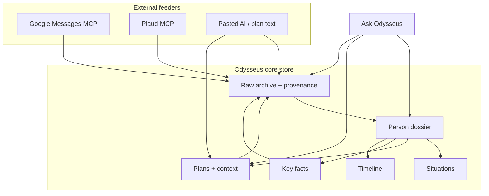
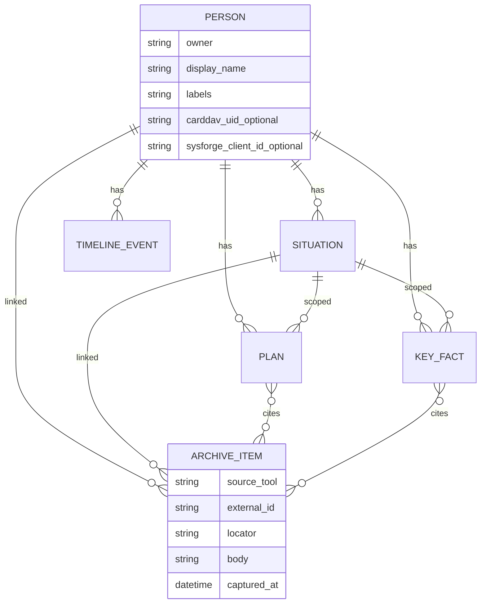
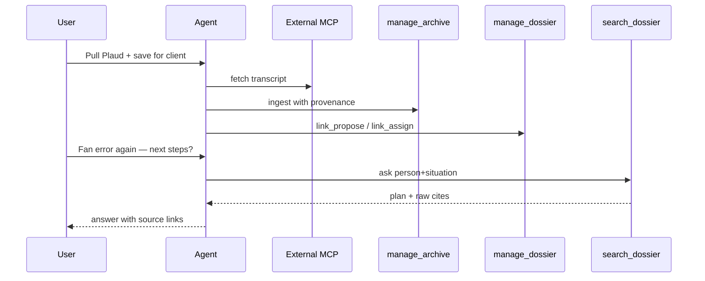

# People dossier and conversation archive - Plan

## Goal Capsule

- **Objective:** Give Odysseus a trustworthy, person-centered place for conversation-derived knowledge so you can ask about a person or situation and get answers with citeable sources, without clogging general memory.
- **Product authority:** This Product Contract. Adjacent surfaces (CardDAV contacts, Keep-style notes, flat memory, SysForge plugin shell) stay separate until this contract says otherwise.
- **Planning authority:** Planning Contract KTDs and Implementation Units below. Prefer existing host patterns (SQLAlchemy + `_migrate_*`, FTS5 like `search_chats`, `manage_*` tools) over new frameworks.
- **Stop conditions:** Stop if scope expands into replacing Google Messages/Plaud UIs, dumping archives into flat memory, or a second SysForge-only people identity. Surface blockers instead of guessing.
- **Open blockers:** None.
- **Execution profile:** Phased units U1→U7; agent tools and ask/cite before heavy UI. Test-first on archive FTS, cite payloads, and memory soft-redirect.
- **Tail ownership:** Implementer lands units in dependency order; progress tracked outside this file.

## Product Contract

### Summary

Build a **dossier-first** people system in Odysseus where friends and clients share one person record (label differs). Each person holds sorted sections for identity, situations, plans, key facts, timeline, and linked raw items. A **raw conversation archive** (messages, transcripts, pasted AI convos) is the citation backbone, with tool provenance. Odysseus answers with source links. External apps (Google Messages, Plaud, other MCPs) stay external and feed the archive; Odysseus owns store + ask/cite, not those readers.

### Problem Frame

Today, useful detail about people lives in texts, visit transcripts, and other AI chats. Dumping that into general Odysseus memory scatters it and fails trust. The workaround is manual digging through texts and transcripts. House sitting and repair visits are examples of a broader need: any person + situation where plans and raw context must stay findable and citeable.

### Key Decisions

- **Dossier home + archive backbone (A + B rules).** The person record is where info is sorted and browsed. The raw archive is source of truth for citations. Plans and facts must keep citeable links and enough “how we got here” context.
- **One people system.** Friend vs client is a label on the same person model, not two products. SysForge repair-shop clients use the same person record with richer use of the same slots.
- **Ready means complete.** Day-one scope includes people + situations, raw archive with provenance, citeable plans, ask-with-sources, and the friend/client label. Not a thin one-case demo.
- **Core store + ask/cite only.** Odysseus does not replace Google Messages, Plaud, or similar as day-to-day readers. Those tools feed the archive.
- **Not general memory.** This material does not live primarily in flat durable-fact memory. Person/situation questions prefer this system when both could answer.

### Actors

- **A1. You (owner):** Create/link people and situations, save or confirm plans, assign or correct links, ask Odysseus, browse dossiers when needed.
- **A2. Odysseus (agent):** Propose links, offer to save plans from conversation, retrieve and answer with citations, write into the archive when feeding from tools.
- **A3. External feeders:** Google Messages MCP, Plaud MCP, pasted other-AI convos, and similar sources that supply raw material (out of product identity as apps Odysseus replaces).

### Visualizations

### Requirements

**People and situations**

- R1. Odysseus provides a first-class **Person** record used for both friends and clients, distinguished by a label (or equivalent), not by separate products.
- R2. **Situations** (cases, jobs, house sits, repairs, and similar) are first-class and **linked** to people. Both person-first and situation-first navigation/query must work.
- R3. A person dossier exposes sorted locations for at least: contact/identity, situations, plans, raw archive links, key facts, and timeline. Friend and client share the same layout; unused slots may stay empty.
- R4. When SysForge repair-shop clients exist, a client **is** this same person record (with business fields using the shared slots), not a duplicate people system.

**Raw archive and provenance**

- R5. Odysseus owns a **raw archive** for messages, transcripts, and pasted external AI conversations (and similar artifacts), stored in Odysseus-controlled data, not only left in external apps.
- R6. Every archived item records **provenance**: originating tool/source, and enough locator detail to point at the specific message/line/chunk used in an answer.
- R7. Inbound raw items can be **linked** to a person and/or situation by user assignment, by Odysseus proposal with user confirmation, or by later correction.

**Plans and facts**

- R8. **Plans** are first-class citeable records on a person (and linkable to a situation). They may originate from Odysseus conversations, from pasted other-AI conversations or plan text, or from explicit user save.
- R9. When a plan is saved (user-initiated or after Odysseus offers to save), Odysseus stores the plan **plus** how it was reached and relevant supporting context so meaning is not reduced to a naked bullet list.
- R10. Saved plans and key facts remain **citeable** in answers, and citations can point to the plan/fact **and** underlying raw archive lines when those exist.
- R11. **Key facts** are short durable bits on the person/situation (schedules, equipment details, preferences, and similar), distinct from freeform notes elsewhere in Odysseus and from general memory.

**Ask and cite**

- R12. You can ask Odysseus about a person or situation (plans, next steps, facts) and receive an answer that includes **source links** back to the plan and/or raw items and provenance used.
- R13. For person/situation questions this system can answer, Odysseus prefers this store over general flat memory so that material does not clog memory as the primary path.

**Scope of product boundary**

- R14. Odysseus provides the core store, dossier surfaces as needed for sorting, and ask/cite behavior. It does **not** need to replace external message/transcript apps as primary readers.
- R15. Feeding the archive may happen when the agent uses an external MCP (or paste) and then saves into the Odysseus store. A full Odysseus inbox UI that replaces those apps is out of scope.

### Key Flows

- F1. Save a plan from conversation
  - **Trigger:** A plan is agreed in an Odysseus chat, or you ask to save one.
  - **Actors:** A1, A2
  - **Steps:** Odysseus offers to save or you command save; you confirm person/situation if needed; system stores plan + how-we-got-here context + links to source turns/raw items when available.
  - **Outcome:** Citeable plan on the person/situation.
  - **Covered by:** R8, R9, R10

- F2. Import a plan or convo from another AI
  - **Trigger:** You paste a full convo or plan text and tell Odysseus to save it.
  - **Actors:** A1, A2
  - **Steps:** Content lands in raw archive and/or as a plan; linking to person/situation via assign or propose-and-confirm; provenance notes the paste/import path.
  - **Outcome:** Plan and/or raw item available for later ask/cite.
  - **Covered by:** R5, R6, R7, R8, R9

- F3. Ingest raw messages or transcripts via external tool
  - **Trigger:** You (or the agent at your request) pull from Google Messages, Plaud, or similar MCP and save into Odysseus.
  - **Actors:** A1, A2, A3
  - **Steps:** Raw items written to archive with tool provenance; Odysseus proposes person/situation links or you assign; corrections allowed later.
  - **Outcome:** Searchable, citeable raw items on the right dossiers.
  - **Covered by:** R5, R6, R7, R14, R15

- F4. Ask with sources
  - **Trigger:** You ask e.g. next steps for a client situation, or a fact for a friend situation.
  - **Actors:** A1, A2
  - **Steps:** Odysseus retrieves from dossier/archive (not primarily general memory); answers with plan/facts as appropriate; includes source links and provenance.
  - **Outcome:** You can act without manually hunting texts/transcripts, and can open cited sources to verify.
  - **Covered by:** R12, R13, R10, R6

### Acceptance Examples

- AE1. Covers R12, R10, R6
  - **Given:** A client person has a saved repair plan linked to a situation, backed by a Plaud transcript chunk in the raw archive.
  - **When:** You ask what the next steps were if the fan error returns.
  - **Then:** Odysseus returns the plan substance and cites the plan plus the transcript provenance (tool + locator), without requiring you to open files first to get a usable answer.

- AE2. Covers R8, R9, F2
  - **Given:** You paste another AI’s conversation that contains a plan for a friend situation.
  - **When:** You tell Odysseus to save the plan for that person/situation.
  - **Then:** A citeable plan exists with supporting context from the paste, and the paste is retained in the raw archive with import provenance.

- AE3. Covers R7, R13
  - **Given:** New Google Messages content is saved into the archive and Odysseus proposes the wrong person.
  - **When:** You correct the link.
  - **Then:** Later asks use the corrected person/situation, and this material is not treated as the primary general-memory store for that question.

- AE4. Covers R1, R3, R4
  - **Given:** The same human is both someone you socialize with and a repair-shop client.
  - **When:** You open their dossier.
  - **Then:** One person record appears with friend/client labeling (or equivalent) and the shared section layout; SysForge client use does not create a second people identity.

### Success Criteria

- You stop defaulting to manual digs through texts/transcripts for person/situation questions this system covers, because answers include openable sources.
- Plans keep enough context that “next steps” answers are usable without re-reading the entire original thread.
- General memory is not the dumping ground for these back-and-forths.
- The feature set above (R1–R15) is present before calling the product ready; house sitting and fan-repair are examples, not the only supported cases.

### Scope Boundaries

**In scope**

- Person + situation model, dossier sections, raw archive, plans/facts, timeline, ask/cite with provenance, link propose/assign/correct, paste import, agent-mediated feed from external MCPs into the Odysseus store.
- Host `app.db` schema, agent tools, HTTP API for dossier browse/citation open, and a light dossier UI enough to sort sections and open sources.

**Deferred for later**

- Full Odysseus UI that replaces reading messages/transcripts inside Google Messages, Plaud, or similar.
- Exact SysForge business field catalog beyond same person record + nullable SysForge client link.
- Classic Client Dashboard four-column port.
- Forced merge of CardDAV contacts into Person (optional link only in this plan).

**Outside this product's identity**

- Building or owning the external Google Messages / Plaud (or similar) apps themselves.
- Using flat general memory as the primary store for this class of knowledge.

### Deferred to Follow-Up Work

- SysForge Clients CRUD/FTS and Classic dashboard (migration-audit track); wire via shared person id when that lands.
- Optional Chroma semantic layer on archive after FTS5 cite path is solid.
- Rich Obsidian-style project notes from SysForge roadmap (P4).

### Dependencies / Assumptions

- External MCPs (or paste) can supply raw text Odysseus can store; those connectors are not built as part of this product’s identity.
- “Feed the archive” includes agent-mediated save after tool use, not only a dedicated import wizard.
- Existing Odysseus notes, session `search_chats`, and CardDAV contacts remain; this product is additive and becomes the preferred path for person/situation conversation knowledge.
- SysForge plugin today is install/status shell only; client parity lands later onto this same person model per R4.

### Outstanding Questions

**Resolve Before Planning**

- None.

**Deferred to Planning** — resolved in Planning Contract

- D1 → KTD-3 (optional CardDAV link; no merge).
- D2 → KTD-2 (ask/cite + light browse; Classic dashboard deferred).
- D3 → KTD-4 (provenance field set).
- D4 → KTD-5 (timeline auto + manual).
- D5 → KTD-6 (soft memory redirect).

### Sources / Research

- Current memory is a flat durable-facts store (`src/memory.py`), not person-dossier oriented.
- CardDAV contacts exist (`routes/contacts/`) and are distinct from future SysForge clients.
- SysForge plugin is install/status only today (`integrations/sysforge/`).
- Notes are a separate Keep-style feature (`Note` model / notes routes).
- `search_chats` searches Odysseus session transcripts, not a person dossier archive (`src/tools/search.py`).
- Host migrations: SQLAlchemy models + idempotent `_migrate_*` in `core/database.py` (no Alembic on host).
- FTS5 + bm25 cite pattern: `src/session_search.py`, `_migrate_chat_messages_fts` in `core/database.py`.
- Tool wiring: `src/tool_schemas.py` → `src/tools/*` → `src/tool_execution.py` → `src/agent_loop.py` domain map / `src/tool_index.py`.

---

## Planning Contract

### Assumptions

- Owner-scoped rows on every dossier/archive table, matching Notes/sessions.
- Agent may call external MCPs then `manage_archive` / `manage_dossier`; no dedicated Odysseus inbox UI.
- Friend and client share section layout; empty sections are fine.
- Day-one storage is host `app.db`, not `integrations/sysforge` SQL migrations.

### Product Contract preservation

Product Contract requirements R1–R15, flows, and AEs unchanged. Outstanding Questions D1–D5 resolved into KTDs below.

### Key Technical Decisions

- **KTD-1. Host `app.db` as day-one store.** Dossier and archive tables live beside Notes/sessions via SQLAlchemy + `_migrate_*`. SysForge plugin DB stays separate; a nullable `sysforge_client_id` (or equivalent) on Person reserves R4 without porting Clients in this plan.
- **KTD-2. Ask/cite and agent tools before Classic UI.** Ship `manage_dossier`, `manage_archive`, `search_dossier`, HTTP read/write for sections and citation open, plus a light dossier browse UI. Defer Classic Client Dashboard.
- **KTD-3. CardDAV is optional link, not merge.** Person may store an optional contact reference; address-book CRUD stays on `manage_contact`.
- **KTD-4. Provenance minimum fields.** Archive items require `source_tool` (or `paste`/`import`), `external_id` when available, `locator` (line/chunk/message id), `captured_at`, and body text. Citation payloads expose these plus a stable openable archive item id.
- **KTD-5. Timeline is mostly derived.** Auto-append events on archive ingest, plan save, fact save, and link changes; allow manual timeline notes. Do not require a separate manual timeline for every ingest.
- **KTD-6. Soft memory redirect.** Agent domain rules and tool descriptions route person/situation knowledge to dossier tools; do not hard-delete or block all `manage_memory` use. Prefer dossier for AE3-style questions.
- **KTD-7. FTS5 for archive retrieval first.** Mirror `session_search` FTS5 + sanitize + bm25 + snippets. Optional vector layer is follow-up only.
- **KTD-8. Three agent tools for parity.** `manage_dossier` (person/situation/plan/fact/timeline/link), `manage_archive` (ingest/get/list), `search_dossier` (ask/search with citations). Wire through existing schema → tools → execution → agent_loop → tool_index path.

### High-Level Technical Design

### Implementation constraints

- No Alembic on host; new tables via models + `create_all`; alters via guarded `_migrate_*`.
- Never edit applied SysForge numbered SQL migrations; any SysForge bridge SQL is a new file later.
- Owner filter on every query.
- Do not store dossier archives primarily in `manage_memory` / `memory.json`.
- Keep citation open path working without the Classic dashboard.

### Sequencing

1. U1 schema  
2. U2 archive + FTS + `manage_archive`  
3. U3 dossier entities + `manage_dossier`  
4. U4 `search_dossier` ask/cite  
5. U5 agent wiring + soft memory redirect  
6. U6 HTTP API  
7. U7 light dossier UI  

U4–U5 can overlap slightly after U3, but agent wiring should not ship before cite payloads exist.

### Alternative Approaches Considered

| Approach | Why not chosen |
|----------|----------------|
| SysForge plugin DB as day-one home | Plugin is status shell; host patterns for tools/FTS are ready; R4 needs shared identity later, not day-one Clients port |
| Archive-only with no dossier sections | Fails “many sorted locations” and SysForge-ready person record |
| Extend flat memory with tags | Weak provenance/trust; ROADMAP already flags memory/context bloat |
| Full Classic Client Dashboard in this plan | Out of scope for ready ask/cite; deferred follow-up |

### Risks & Dependencies

| Risk | Mitigation |
|------|------------|
| Agent keeps writing person knowledge to memory | KTD-6 + domain map tests in U5 |
| Tools lag UI so agent cannot see UI-only saves | U5/U6 ship agent tools and API together for parity |
| FTS query injection / brittle queries | Reuse `_sanitize_fts_query` pattern from session search |
| SysForge later creates duplicate clients | Nullable link field + AE4 tests; document single-identity rule |
| Provenance incomplete from MCP payloads | Require source_tool + body; allow external_id/locator null with warnings in tool result |
| Archive holds sensitive personal/client content | Owner-scope all queries; treat archive body as untrusted for prompt injection (ROADMAP); do not auto-pin raw archive into global memory |
| Link propose wrongly attaches messages to the wrong person | Always require confirm or easy correct (R7); AE3 tests cover correction path |

### External research

Skipped. Local patterns for SQLAlchemy host migrations, FTS5 session search, and `manage_*` tools are strong enough; no unsettled external library choice.

---

## Implementation Units

### U1. Dossier and archive schema

- **Goal:** Persist Person, Situation, Plan, KeyFact, TimelineEvent, ArchiveItem, and link fields in host `app.db` with owner scoping and migration hooks.
- **Requirements:** R1, R2, R3, R4, R5, R6, R11
- **Dependencies:** None
- **Files:**
  - Modify: `core/database.py`
  - Test: `tests/test_dossier_schema.py`
- **Approach:** Add SQLAlchemy models with TimestampMixin; labels for friend/client; optional `carddav_uid` and `sysforge_client_id`; archive provenance columns per KTD-4; plan fields for summary, how-we-got-here context, and source archive refs; call `_migrate_*` from `init_db` for any alters/FTS stubs needed by U2.
- **Patterns to follow:** `Note`, `Session`, `ChatMessage`, existing `_migrate_*` guards.
- **Execution note:** Prefer schema tests that create an in-memory engine and assert columns/FKs before tool work.
- **Test scenarios:**
  - Creating a person with friend and client labels succeeds for one owner.
  - Situation links to person; plan/fact can scope to situation.
  - Archive item persists provenance fields; missing `source_tool` is rejected (valid values include tool names and paste/import per KTD-4).
  - Optional CardDAV and SysForge ids nullable.
  - Owner isolation: owner A cannot load owner B rows via the data-access helpers introduced here (or document that isolation is enforced at service layer in U2/U3 and test there — prefer helpers in U1 if introduced).
- **Verification:** Models create on blank DB; migration idempotent on second `init_db`; unit tests green.

### U2. Raw archive ingest and FTS

- **Goal:** Ingest raw messages/transcripts/pastes with provenance and retrieve snippets via FTS5.
- **Requirements:** R5, R6, R7, R14, R15
- **Dependencies:** U1
- **Files:**
  - Create: `src/tools/archive.py` (or `services/dossier/archive.py` + thin tool)
  - Modify: `core/database.py` (FTS virtual table + triggers)
  - Modify: `src/tool_schemas.py`, `src/tools/__init__.py`, `src/tool_implementations.py`, `src/tool_execution.py`
  - Test: `tests/test_manage_archive.py`, `tests/test_archive_search.py`
- **Approach:** `manage_archive` actions `ingest`, `get`, `list`. Ingest accepts paste or tool-fed payload; stores body + provenance; supports person/situation ids when known, else unlinkable until U3 link actions. FTS mirrors `session_search` sanitize + bm25 + snippet.
- **Patterns to follow:** `src/tools/search.py`, `src/session_search.py`, `_migrate_chat_messages_fts`.
- **Execution note:** Start with failing FTS ingest/search tests modeled on `tests/test_session_search.py`.
- **Test scenarios:**
  - Ingest Plaud-like payload stores source_tool, locator, body.
  - Paste import provenance is `paste`/`import` and listable by owner.
  - FTS finds keyword in transcript; returns snippet + archive id.
  - Ingest without person still stores; later linkable.
  - Invalid/empty body fails clearly.
  - Covers AE2 raw half: pasted convo retained in archive.
- **Verification:** Tool wired; FTS tests pass; no dependency on external MCP being online.

### U3. Dossier CRUD, plans, facts, timeline, links

- **Goal:** Create and update people, situations, plans (with context), key facts, timeline events, and link assign/propose/correct.
- **Requirements:** R1, R2, R3, R7, R8, R9, R10, R11
- **Dependencies:** U1, U2
- **Files:**
  - Create: `src/tools/dossier.py` (and optional `services/dossier/`)
  - Modify: `src/tool_schemas.py`, `src/tools/__init__.py`, `src/tool_implementations.py`, `src/tool_execution.py`
  - Test: `tests/test_manage_dossier.py`
- **Approach:** `manage_dossier` action namespaces for person, situation, plan, fact, timeline, link. Plan save stores summary + how-we-got-here + optional archive cite ids. Link propose returns candidates; assign/correct update archive/person/situation links and emit timeline events (KTD-5).
- **Patterns to follow:** `src/tools/notes.py` action CRUD; contacts in-process helpers.
- **Test scenarios:**
  - Create person with client label; add situation; save plan with context; fact on situation.
  - Propose link then correct wrong person; subsequent list-by-person reflects correction (Covers AE3 link half).
  - Paste path: ingest archive then save plan citing it (Covers AE2).
  - Same person can hold friend+client labels without duplicate rows (Covers AE4 identity).
  - Timeline shows auto events after plan save and archive link.
- **Verification:** Tool actions cover F1–F3 data writes; tests green.

### U4. Ask/cite search

- **Goal:** Answer person/situation questions from dossier + archive with citation payloads.
- **Requirements:** R10, R12, R13
- **Dependencies:** U2, U3
- **Files:**
  - Create: `src/tools/dossier_search.py` (or extend dossier module)
  - Modify: tool schema/execution/shim files as in U2/U3
  - Test: `tests/test_search_dossier.py`
- **Approach:** `search_dossier` retrieves plans/facts first, then archive FTS within person/situation scope; returns answerable structured hits: plan/fact text + cite list (`kind`, id, source_tool, locator, snippet, open ref). Prefer scoped search when person/situation ids provided.
- **Patterns to follow:** `search_chats` citation link shape; memory hybrid only as optional later — FTS first.
- **Execution note:** Write AE1-shaped integration test before implementing ranking details.
- **Test scenarios:**
  - Covers AE1: plan + Plaud archive cite returned for “next steps / fan error” style query on client situation.
  - Empty dossier returns explicit empty/no-hit, not memory fallback inside this tool.
  - Situation-first query without person id still finds linked plans when situation known.
  - Citations include provenance fields required by KTD-4.
- **Verification:** AE1 automated at tool layer; cite payload documented in tool result schema.

### U5. Agent domain wiring and soft memory redirect

- **Goal:** Make dossier tools discoverable and preferred for person/situation knowledge vs flat memory.
- **Requirements:** R12, R13, R15
- **Dependencies:** U2, U3, U4
- **Files:**
  - Modify: `src/agent_loop.py`, `src/tool_index.py`, `src/agent_tools/__init__.py`, `src/tool_security.py` (if allowlists)
  - Test: `tests/test_dossier_agent_routing.py` (and/or extend existing tool registry tests)
- **Approach:** Add domain map entries and intent keywords; update agent instructions so other-person conversation knowledge uses dossier tools; user-self facts still memory; phones/emails still contacts. Soft redirect: guidance + tool descriptions, not hard ban on `manage_memory`.
- **Patterns to follow:** Existing memory vs contacts vs notes boundaries in `agent_loop.py`.
- **Test scenarios:**
  - Domain selection includes dossier tools for “client plan / house sitting / transcript” style intents.
  - Tool index descriptions mention provenance/cite.
  - Registry shim exports new tools (mirror `tests/test_tool_implementations_shim.py`).
  - Documented soft-redirect behavior: person-situation prompt prefers `search_dossier` over `manage_memory` in routing unit (string/domain assertions acceptable).
- **Verification:** New tools appear in agent tool pipeline; routing tests green.

### U6. HTTP API for dossier browse and citation open

- **Goal:** Expose owner-scoped REST (or existing route style) to list/get dossier sections and open archive cites used by UI and manual verification.
- **Requirements:** R3, R6, R12, R14
- **Dependencies:** U1–U4
- **Files:**
  - Create: `routes/dossier/` (or `routes/people/`) + wire in `app.py`
  - Test: `tests/test_dossier_routes.py`
- **Approach:** Endpoints for person list/get (sections), situation get, plan/fact get, archive get by id, search endpoint optional if tool covers agent path. Auth/owner same as notes routes.
- **Patterns to follow:** `routes/note_routes.py`, contacts route gating.
- **Test scenarios:**
  - Owner can get person dossier with empty sections present as empty lists.
  - Archive get returns provenance for citation open.
  - Other owner receives 404/403 consistent with notes.
  - Friend+client labels visible on get (AE4 API half).
- **Verification:** Route tests green; mounted only when app starts normally.

### U7. Light dossier browse UI

- **Goal:** Minimal UI to open a person, see section slots, open a cited archive item, and correct a link — enough to stop file-hunting without Classic dashboard.
- **Requirements:** R3, R7, R12, R14
- **Dependencies:** U6
- **Files:**
  - Create/modify: `static/js/` dossier module, nav entry in `static/app.js` / `static/index.html` as needed
  - Test: light JS-free API reliance plus optional smoke; or `tests/` HTTP-level if no frontend harness — prefer API-backed smoke documented in Verification Contract
- **Approach:** Person list + detail with section panels (identity, situations, plans, facts, timeline, raw links). Citation click opens archive snippet view. Link correct control calls API. Match existing vanilla JS SPA patterns; no new frontend framework.
- **Patterns to follow:** Notes UI simplicity; plugin modal restraint — keep host-native.
- **Test expectation:** Prefer Playwright/manual smoke checklist in Verification Contract if no JS test harness; API coverage remains authoritative for data.
- **Test scenarios:**
  - Manual/smoke: open person → see sections → open cite → see provenance.
  - Manual/smoke: correct wrong person link on archive item; reload shows correction.
  - Covers AE4 UI half: one person record with labels.
- **Verification:** Smoke checklist completed; no Classic dashboard layout required.

---

## Verification Contract

### Automated

- Run dossier-focused pytest modules:
  - `tests/test_dossier_schema.py`
  - `tests/test_manage_archive.py`
  - `tests/test_archive_search.py`
  - `tests/test_manage_dossier.py`
  - `tests/test_search_dossier.py`
  - `tests/test_dossier_agent_routing.py`
  - `tests/test_dossier_routes.py`
- Also run existing shim/registry tests touched by tool wiring (`tests/test_tool_implementations_shim.py` and related).
- Prefer repo’s normal pytest invocation from project root (same as other `tests/test_*.py` work).

### Acceptance mapping

| AE | Proved by |
|----|-----------|
| AE1 | U4 `test_search_dossier` + U7 smoke open cites |
| AE2 | U2 ingest + U3 plan save tests |
| AE3 | U3 link correct + U5 soft redirect assertions |
| AE4 | U3 labels + U6/U7 single person record |

### Manual smoke

1. Ingest a paste and a fake Plaud-shaped transcript for a client person/situation.
2. Save a plan with how-we-got-here context.
3. Ask Odysseus for next steps; confirm answer includes openable sources.
4. Mis-link then correct; re-ask uses corrected person.
5. Confirm a friend+client labeled person shows one dossier with all section slots.

### Out of verification scope

- Live Google Messages / Plaud MCP connectivity (stub payloads in tests).
- Classic Client Dashboard parity.
- SysForge Clients CRUD.

---

## Definition of Done

### Global

- R1–R15 satisfied by shipped units U1–U7.
- AE1–AE4 covered by automated and/or smoke checks above.
- Person/situation knowledge path does not require general memory as primary store.
- Product Contract scope boundaries honored (no feeder-app replacement; no second people identity).
- Plan-relative tests listed in Verification Contract pass.

### Per-unit

- U1: schema + migration tests pass.
- U2: archive ingest/FTS/tool tests pass.
- U3: dossier CRUD/link/plan tests pass.
- U4: ask/cite AE1 tool test passes.
- U5: routing/registry tests pass.
- U6: route ownership/citation tests pass.
- U7: smoke checklist complete for browse + cite open + link correct.
