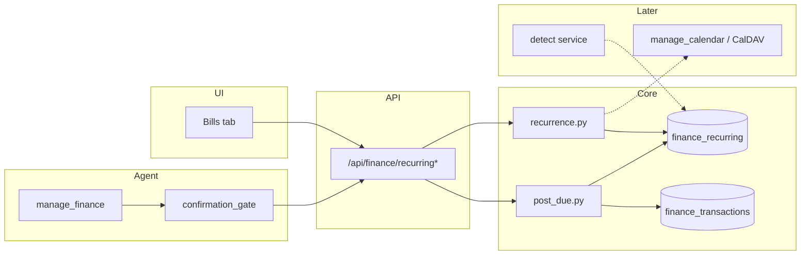

# feat: Scheduled / recurring transactions & bills

**Target repo:** odysseus-finance  
**Product Contract preservation:** Bootstrap from Banking Research + HomeBank archive model; no prior unified Product Contract.

---

## Goal Capsule

Ship owner-scoped recurring bill / scheduled transaction templates in the Finance plugin so users and the AI agent can list upcoming obligations, create/edit schedules, optionally auto-post due instances into the ledger, and hook due dates into calendar reminders later.

**Authority:** This plan > `Banking Research/features/recurring-bills.md` for implementation shape; HomeBank is parity reference, not a line-by-line port.

**Stop when:** Manual CRUD + upcoming expansion + agent actions + optional auto-post (opt-in) work end-to-end with tests; detection and CalDAV writeback remain deferred follow-ups unless already stubbed as hooks.

---

## Benefit verdict (AI finance agent)

**Yes — port this feature.**

Reasoning:

1. **Agent blind spot today.** `manage_finance` covers accounts, transactions, spending, budgets, categories, and rules. It cannot answer "what bills are due this week?" or "how much am I committed to this month?" Those are high-frequency finance questions.
2. **Unlocks Phase 2–3 research tracks.** Cash-flow forecast (`Banking Research/features/cash-flow-forecasting.md`), safe-to-spend, and subscription rollups all require confirmed recurring outflows as first-class data. Without templates, forecasts invent numbers from history alone.
3. **Calendar leverage already exists.** Odysseus has CalDAV sync, `manage_calendar` with RRULE, and note reminders. Bill due dates are a natural `event_type=bill` (or finance-owned reminder) surface; research already lists "Calendar bill reminders" as an Odysseus-unique opportunity (Phase 3).
4. **Auto-post closes the import-only gap.** HomeBank posts scheduled templates into the ledger on open / hub action. Odysseus is import-first; users still need planned future cash movements before the bank CSV arrives. Soft-posting (status=`scheduled` / uncleared) plus later import dedup is the Odysseus-shaped equivalent.
5. **Confirmation-gate pattern already proven.** Category creates use `ask_user` + `confirmation_token`. Money-moving auto-post and schedule creates fit the same gate model (`docs/CONFIRMATION_GATES.md`).

---

## Product Contract

### Problem frame

Users track recurring rent, utilities, subscriptions, and paychecks. HomeBank models these as archive templates with recurrence, weekend rules, limits, an upcoming hub, and auto-post. Odysseus Finance has accounts/transactions/budgets but no `finance_recurring` table and no agent actions for bills.

### Actors

- **A1.** End user (owner-scoped finance data)
- **A2.** AI finance agent via `manage_finance`
- **A3.** Background scheduler (optional auto-post / reminder housekeeping)

### Requirements

- **R1.** Manual CRUD for recurring templates: account, payee, amount (cents), category, frequency, interval, next due date, active flag, subscription flag.
- **R2.** Expand templates into an upcoming list (this month / next 30 / 60 / 90 days) with late-count when due date is past.
- **R3.** Optional auto-post of due instances into `finance_transactions` with clear lineage (`recurring_id`, status distinguishing planned vs bank-cleared).
- **R4.** Agent can list upcoming, create/edit/pause schedules, and request post of due items under confirmation gates where money or schedule mutations occur.
- **R5.** Extension hooks for calendar reminders and pattern-detection suggestions without requiring those features in MVP.
- **R6.** Owner isolation and plugin-gated routes (same as existing finance).

### Key flows

- **F1.** User creates rent schedule → sees it on Bills tab → next 30 days list shows due date + amount.
- **F2.** Agent: "What bills are due in the next two weeks?" → `list_upcoming` → natural-language summary with totals.
- **F3.** Due date arrives → auto-post (if enabled) or agent `post_due` after confirmation → ledger row appears; `next_due_date` advances.
- **F4.** Import later arrives with same payee/amount/date → dedup or match against posted scheduled txn (follow-up hardening; MVP records lineage only).

### Acceptance examples

- **AE1.** Monthly rent $1,200 on the 1st → upcoming for current month shows one row; after post, next due is next month 1st.
- **AE2.** Weekly gym $15 every 7 days → next 30 days shows ~4–5 occurrences without mutating the template until posted/skipped.
- **AE3.** Inactive / paused schedule never appears in upcoming or auto-post.
- **AE4.** Agent create without confirmation token is rejected for gated actions.

### Scope boundaries

**In scope (MVP):** Manual CRUD, recurrence engine (simple + biweekly/quarterly aliases), upcoming expansion, Bills UI tab, agent actions, opt-in auto-post (due-date mode), confirmation gates, config flags, calendar hook stubs.

**Deferred to follow-up:**

- Auto-detect from transaction history (`POST /recurring/detect`) — research MVP polish
- Relative dates ("2nd Tuesday") — HomeBank `TF_RELATIVE` / ordinal / weekday
- Complex HomeBank post modes (`ARC_POSTMODE_PAYOUT`, `ARC_POSTMODE_ADVANCE`) — start with due-date only
- Template splits / internal transfer templates (`kxferacc`)
- Full CalDAV writeback of bill events (Phase 3 research)
- Variable-amount subscriptions and zombie detection (subscription-tracking.md polish)
- Import matching against scheduled posts

**Outside identity:** Live bank sync / Plaid; automatic bill pay at the bank.

---

## Planning Contract

### Assumptions

- Finance plugin remains optional; recurring tables live in `finance.db` via SQLAlchemy `create_all` (current pattern in `integrations/finance/database.py` — no Alembic yet). New columns on existing tables use a small additive migrate helper if needed.
- Amounts stay integer cents; payee stays plaintext like transactions (research suggested encrypt payee — defer unless finance encryption lands first).
- `manage_tasks` remains for AI job schedules; bill recurrence is finance domain only — never overload `ScheduledTask` for ledger bills.

### Key technical decisions

| ID | Decision | Rationale |
|----|----------|-----------|
| **KTD1** | New `FinanceRecurring` model + `services/recurrence.py` | Matches Banking Research `finance_recurring`; isolates date math from routes/tools |
| **KTD2** | Simplify vs HomeBank: port day/week/month/year + `every`, weekend before/after/skip, occurrence limit; **skip** relative ordinals and payout/advance post modes in MVP | Relative + post-mode complexity is high; most bills are calendar-day monthly/weekly |
| **KTD3** | Upcoming = expand-on-read (no materialize table) for display; materialize only on post | Avoid sync bugs; forecast can later materialize `finance_scheduled_items` |
| **KTD4** | Auto-post creates `FinanceTransaction` with `status=scheduled` (or `pending`) + `recurring_id` FK; advance `next_due_date` + decrement limit | HomeBank posts real txns; Odysseus needs distinction from bank-cleared imports |
| **KTD5** | Extend `manage_finance` actions rather than a new tool | Agent already routes finance intent to `manage_finance`; keeps tool index simple |
| **KTD6** | Gate: create/update/delete/pause, `post_due`, `post_all_due`; **not** gate `list_*` / `upcoming` | Reads are safe; money/schedule writes need click-approve |
| **KTD7** | Calendar: optional `calendar_event_uid` / `remind_days_before` columns + service stub `sync_bill_reminders()` calling existing calendar create path later | Research Phase 3; hooks without blocking MVP |
| **KTD8** | Auto-post runner as finance builtin action or plugin hook on task_scheduler housekeeping, **default off** in config | Prevent surprise ledger writes |

### HomeBank parity vs simplify

| HomeBank | Odysseus MVP | Later |
|----------|--------------|-------|
| Archive = template + optional recur | `FinanceRecurring` always scheduled (templates without recur out of scope) | One-shot "templates" if needed |
| `AUTO_FREQ_DAY/WEEK/MONTH/YEAR` + `rec_every` | Same + aliases `biweekly` (`week`×2), `quarterly` (`month`×3) | — |
| `TF_RELATIVE` ordinal/weekday | Skip | Port if users demand "2nd Friday" |
| Weekend: possible / before / after / skip | Port | — |
| `TF_LIMIT` remaining posts | Port as `remaining_count` nullable | — |
| End-of-month `daygap` | Use `dateutil.relativedelta` + clamp day | Match HomeBank gap if bugs appear |
| Upcoming filters 30/60/90/month | Port as query params | — |
| `scheduled_post_all_pending` + post modes | Due-date mode only (`max_post_date = today` or today+N config) | Payout/advance modes |
| Hub post-all UI | Bills tab "Post due" + agent `post_all_due` | — |
| Transfer archives / splits | Skip | After split-transactions feature |

### High-level technical design



**Recurrence advance (directional):** on successful post, set `next_due_date = next_occurrence(current)`; if `remaining_count` was set, decrement; at 0 set `is_active=false`.

**Weekend adjust:** when computing the ledger post date (not necessarily the series date), apply before/after/skip like HomeBank `scheduled_get_txn_real_postdate` / `scheduled_nextdate_weekend_adjust`.

---

## Implementation Units

### U1. Data model and recurrence engine

**Goal:** Persist recurring templates and compute next/upcoming dates correctly.

**Requirements:** R1, R2, R6

**Dependencies:** None

**Files:**

- `integrations/finance/models.py` (add `FinanceRecurring`)
- `integrations/finance/services/recurrence.py` (new)
- `integrations/finance/database.py` (ensure `create_all`; optional column migrate helper)
- `tests/test_finance_recurrence.py` (new)

**Approach:**

- Columns (aligned with research, extended for HomeBank-useful fields):
  - `id`, `owner`, `account_id`, `payee`, `memo`, `category_id`, `amount_cents`
  - `frequency` ∈ `daily|weekly|monthly|yearly` (store aliases as every-N of base)
  - `every` (int ≥ 1), `next_due_date`, `weekend_rule` ∈ `none|before|after|skip`
  - `remaining_count` (nullable), `is_subscription`, `is_active`, `auto_detected` (default false)
  - `last_posted_at`, `calendar_event_uid` (nullable stub), `remind_days_before` (nullable)
  - timestamps via `TimestampMixin`
- Index `(owner, next_due_date)`, `(owner, is_active)`
- Pure functions: `advance_due_date`, `iter_upcoming(horizon)`, `post_date_with_weekend`, `is_postable`

**Patterns:** `FinanceCategoryBudget` owner + cents conventions; HomeBank `hb-archive.c` date advance for weekend/limit semantics.

**Test scenarios:**

- Monthly every 1 from Jan 31 → Feb clamps to last day, then Mar 31 when using month-end policy (document chosen clamp policy in code comments)
- Weekly every 2 → intervals of 14 days
- Upcoming 30 days expands without mutating stored `next_due_date`
- Weekend `before` on Saturday → Friday post date
- Limit 1: after advance, inactive
- Inactive / zero amount / missing account → not postable

**Verification:** Unit tests pass for all scenarios above.

---

### U2. REST API for recurring CRUD + upcoming + post

**Goal:** HTTP surface for UI and tools.

**Requirements:** R1–R3, R6

**Dependencies:** U1

**Files:**

- `integrations/finance/routes.py`
- `integrations/finance/services/post_recurring.py` (new)
- `tests/test_finance_routes.py` (extend)
- `tests/test_finance_recurring_routes.py` (new if file size warrants)

**Approach:**

- `GET /api/finance/recurring` — list (filter `active`, `subscription`)
- `POST /api/finance/recurring` — create
- `PATCH /api/finance/recurring/{id}` — update / pause (`is_active`)
- `DELETE /api/finance/recurring/{id}`
- `GET /api/finance/recurring/upcoming?days=30` — expanded occurrences + monthly committed total
- `POST /api/finance/recurring/{id}/post` — post one due instance if `next_due <= max_date`
- `POST /api/finance/recurring/post-due` — post all postable with `next_due <= today` (or `?through=`)
- Posted txn: copy payee/amount/category/account; set `recurring_id`; status `scheduled`; recompute dedup_hash including recurring id + due date to avoid double-post
- Add nullable `recurring_id` on `FinanceTransaction` (migration helper)

**Test scenarios:**

- CRUD owner isolation (other owner 404)
- Upcoming returns sorted dates and sum of expenses
- Post advances `next_due_date` and creates one txn
- Double-post same day is idempotent or rejected
- Post inactive returns 400

**Verification:** Route tests green; plugin inactive → 404.

---

### U3. Bills UI tab

**Goal:** User-visible list, create/edit, upcoming, post due.

**Requirements:** R1, R2, R3

**Dependencies:** U2

**Files:**

- `integrations/finance/static/js/index.js`
- `integrations/finance/README.md` (agent + bills blurb)

**Approach:**

- New tab `bills` beside Budget/Reports
- List: payee, amount, frequency label, next due, subscription badge, active toggle
- Modal form for create/edit (reuse account/category selectors)
- Upcoming panel (next 30 days) + "Post due" button
- Monthly committed total card

**Test expectation:** none for pure UI — smoke via manual or existing panel load patterns; prefer API tests for behavior.

**Verification:** Panel loads with tab; create shows in list and upcoming.

---

### U4. Agent tool actions + confirmation gates

**Goal:** AI can query and mutate schedules safely.

**Requirements:** R4

**Dependencies:** U2

**Files:**

- `src/tool_schemas.py` (`manage_finance` enum + params)
- `src/tools/finance.py`
- `src/tool_index.py` / `src/agent_loop.py` (finance blurb mentions bills)
- `integrations/finance/confirmation_gate.py`
- `tests/test_finance_agent_tools.py`

**Approach — actions:**

| Action | Gate? | Behavior |
|--------|-------|----------|
| `list_recurring` | No | Active/inactive filter |
| `list_upcoming` | No | `days` default 30; return rows + totals |
| `create_recurring` | Yes | After `ask_user` confirmation |
| `update_recurring` | Yes | Edit fields / pause / resume |
| `delete_recurring` | Yes | Soft-prefer deactivate; hard delete allowed |
| `post_due` | Yes | Single id or all due |

**Schemas (directional):** extend existing `manage_finance` params with `frequency`, `every`, `next_due_date`, `amount_cents` / `amount_dollars`, `payee`, `weekend_rule`, `remaining_count`, `is_subscription`, `recurring_id`, `days`, `through`.

**Example queries:**

- "What bills are due in the next 14 days?"
- "Add a $45 Netflix subscription monthly on the 15th"
- "Pause my gym membership schedule"
- "Post all bills that are due today" (requires confirmation)

**Test scenarios:**

- `list_upcoming` returns formatted dollars and dates
- Gated action without token fails with clear error
- Gated action with matching token succeeds and consumes token
- Plugin inactive returns install hint

**Verification:** Agent tool tests cover list + gated create/post.

---

### U5. Opt-in auto-post + calendar hooks

**Goal:** Background due posting and stub for reminders.

**Requirements:** R3, R5

**Dependencies:** U2

**Files:**

- `integrations/finance/database.py` / `config.json` keys: `auto_post_enabled`, `auto_post_through_days`
- `integrations/finance/services/auto_post.py` (new)
- `src/builtin_actions.py` or finance install hook registering scheduled action (only if plugin active)
- `integrations/finance/services/bill_reminders.py` (stub: no-op or create local calendar event when `remind_days_before` set — feature-flagged)
- `tests/test_finance_auto_post.py` (new)

**Approach:**

- Default `auto_post_enabled=false`
- When enabled, daily housekeeping posts due items per owner with finance plugin installed
- Reminder stub: document API; if implemented, call calendar create with `event_type=bill` and optional RRULE mirroring frequency — prefer **one-shot next-due event refresh** over full RRULE in first pass to avoid dual sources of truth

**Test scenarios:**

- Disabled: runner no-ops
- Enabled: posts due, advances dates
- Reminder stub does not crash when calendar plugin paths missing

**Verification:** Auto-post tests; config default remains off.

---

## Phased delivery

| Phase | Units | Outcome |
|-------|-------|---------|
| **P0** | U1–U2 | Data + API |
| **P1** | U3–U4 | UI + agent |
| **P2** | U5 | Auto-post + reminder hooks |
| **Follow-up** | — | Detect, relative dates, CalDAV bidirectional, import match, forecast materialization |

---

## AI tool access design

### Design principles

1. Read actions are ungated and cheap (upcoming expansion).
2. Any write that creates ledger money or durable schedule state requires `ask_user` confirmation + `confirmation_token`, matching category creates.
3. Prefer listing before mutating (agent should `list_recurring` / `list_upcoming` to resolve ids).
4. Do not invent detection in the agent loop — detection is a separate API later; agent can still create manual schedules.

### Confirmation payload (directional)

```json
{
  "domain": "finance",
  "tool": "manage_finance",
  "action": "create_recurring",
  "payload": {
    "payee": "Landlord",
    "amount_cents": 120000,
    "frequency": "monthly",
    "every": 1,
    "next_due_date": "2026-08-01",
    "account_id": "abc123…"
  }
}
```

Validators compare payee, amount, frequency, next_due_date, account_id (prefix match ok).

### Example agent turns

1. User: "Am I going to make rent this month?"  
   Agent: `list_upcoming` days=30 → summarize rent line + account balance from `list_accounts`.

2. User: "Track Spotify as $11.99 on the 3rd each month."  
   Agent: `ask_user` confirmation → `create_recurring` with token.

3. User: "Mark everything due today as paid in the ledger."  
   Agent: `list_upcoming` days=0 or through=today → `ask_user` listing items → `post_due` / `post_all_due`.

---

## File touch list (summary)

| Path | Change |
|------|--------|
| `integrations/finance/models.py` | `FinanceRecurring`; txn `recurring_id` |
| `integrations/finance/database.py` | init / migrate helpers |
| `integrations/finance/services/recurrence.py` | new |
| `integrations/finance/services/post_recurring.py` | new |
| `integrations/finance/services/auto_post.py` | new |
| `integrations/finance/services/bill_reminders.py` | stub |
| `integrations/finance/routes.py` | recurring endpoints |
| `integrations/finance/confirmation_gate.py` | gate actions |
| `integrations/finance/static/js/index.js` | Bills tab |
| `integrations/finance/README.md` | docs |
| `src/tools/finance.py` | actions |
| `src/tool_schemas.py` | schema |
| `src/tool_index.py`, `src/agent_loop.py` | prompts |
| `src/builtin_actions.py` / scheduler hook | optional auto-post |
| `tests/test_finance_recurrence.py` | new |
| `tests/test_finance_recurring_routes.py` | new |
| `tests/test_finance_agent_tools.py` | extend |
| `tests/test_finance_auto_post.py` | new |
| `Banking Research/features/recurring-bills.md` | optional status note after ship |

---

## Risks & open questions

### Risks

- **Double counting:** Auto-posted scheduled txn + later bank import of the same charge inflate spend unless dedup/match lands. Mitigate: default auto-post off; status=`scheduled` excluded from spending reports until cleared (decide explicitly in U2 reports filter).
- **End-of-month drift:** HomeBank `daygap` is subtle; wrong clamp frustrates rent-on-31st users. Mitigate: document policy + tests.
- **Dual calendars:** Syncing bills to CalDAV with RRULE duplicates recurrence logic. Mitigate: MVP stub; later one-shot next-due refresh.
- **Agent over-posting:** Confirmation gate mandatory for post actions.
- **Plugin lifecycle:** Auto-post must no-op when finance uninstalled.

### Open questions

| # | Question | Blocking? | Default if deferred |
|---|----------|-----------|---------------------|
| Q1 | Should `scheduled` status txns count in spending reports and budgets? | Soft-blocking for U2 | **Exclude** until status → `cleared` |
| Q2 | Soft-delete (deactivate) vs hard delete for agent `delete_recurring`? | No | Deactivate by default; hard delete with flag |
| Q3 | Encrypt payee on recurring (research)? | No | Match transactions plaintext until finance-wide encryption |
| Q4 | Ship detection in same epic as manual CRUD? | No | **No** — follow-up |
| Q5 | Auto-post through today only vs N days advance? | No | Today only; config `auto_post_through_days` default 0 |

---

## Effort & priority

| Dimension | Rating | Notes |
|-----------|--------|-------|
| **Effort** | **L** | Recurrence correctness + API + UI + agent gates + optional auto-post; detection/CalDAV out |
| **Priority** | **P1** | Phase 2 in feature inventory; unblocks forecast/safe-to-spend; high agent value |
| Research estimate was **M** for MVP manual+detect | Raise to **L** when including HomeBank-grade weekend/limit, auto-post, and full agent gates |

**Suggested sequencing vs other finance work:** After import + categories + budgets (done); before cash-flow forecast and safe-to-spend; subscription UI can be a thin filter on this table (S follow-up).

---

## Verification Contract

- `pytest tests/test_finance_recurrence.py tests/test_finance_recurring_routes.py tests/test_finance_agent_tools.py tests/test_finance_auto_post.py -q`
- Manual: install finance plugin → Bills tab → create monthly bill → upcoming → post due → txn appears with scheduled status
- Agent smoke: ask upcoming bills; create with confirmation

---

## Definition of Done

- [ ] U1–U4 complete with listed tests
- [ ] U5 either shipped with default-off auto-post or explicitly deferred in README with hook stubs only
- [ ] Spending reports policy for `scheduled` status documented and tested
- [ ] README documents agent actions and confirmation requirement
- [ ] No detection/CalDAV required for merge

---

## Sources & research

- HomeBank: `src/hb-archive.h`, `src/hb-archive.c` (recurrence, weekend, limit, post-all), `hub-scheduled` / `list-scheduled` (upcoming hub)
- Odysseus: `integrations/finance/models.py`, `routes.py`, `src/tools/finance.py`, `confirmation_gate.py`, `src/tool_schemas.py`
- Banking Research: `features/recurring-bills.md`, `subscription-tracking.md`, `cash-flow-forecasting.md`, `01-feature-inventory.md` (Phase 2 bills; Phase 3 CalDAV)
- Calendar: `src/tools/calendar.py` (RRULE / reminders), CalDAV sync modules
