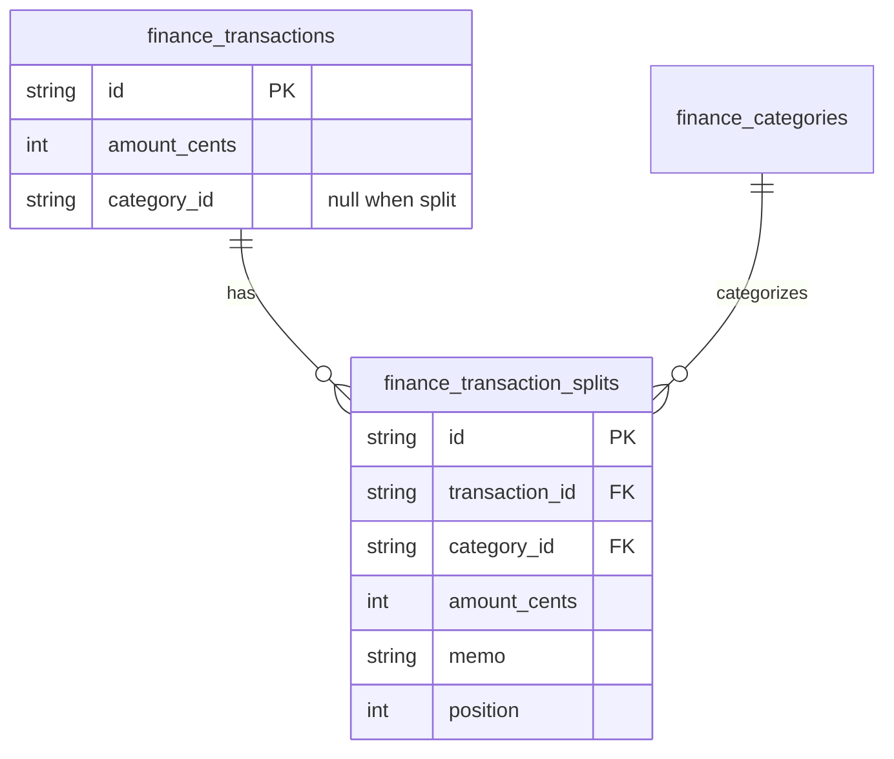
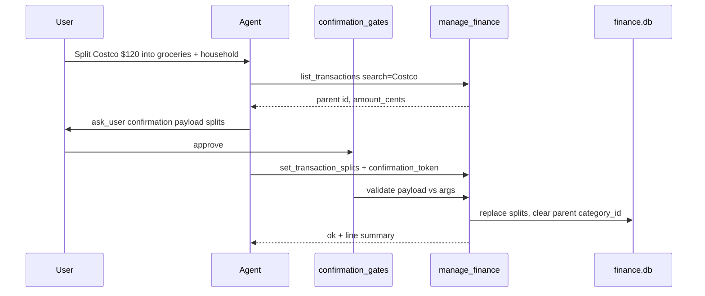

# feat: Split transactions for accurate category budgets

**Target repo:** odysseus-finance
**HomeBank reference:** `homebank/src/hb-split.h`, `hb-split.c`, `ui-txn-split.c` (max 62 lines; `OF_SPLIT` flag; reports unroll splits)

---

## Goal Capsule

**Objective.** Let one imported bank payment be divided across multiple category/amount lines so Costco-style receipts and mixed-merchant purchases roll into the right budgets, and so the AI finance agent can propose and apply those splits via `manage_finance`.

**Authority.** Product intent from `Banking Research/features/split-transactions.md` and Phase 2 inventory (`Banking Research/01-feature-inventory.md`). HomeBank semantics are the behavioral reference for validation and report unrolling, not a byte-for-byte port.

**Stop when.** Parent amount stays bank-truth; splits persist and validate; spending/budget reports allocate via splits; UI can create/edit/clear; agent can read/propose/apply with confirmation; tests cover model, reports, routes, and tool gates.

---

## Product Contract

### Problem frame

Odysseus stores one `category_id` per `finance_transactions` row. Mixed-merchant purchases force a single category, which corrupts monthly budgets and agent answers like "how much on groceries?" HomeBank solves this with up to 62 split lines (`TXN_MAX_SPLIT`) attached to the parent txn; reports (`rep-budget.c`, `rep-stats.c`) iterate splits when `OF_SPLIT` is set.

### Actors

- A1. Household user — imports CSV/OFX, categorizes in Finance panel, reviews budgets.
- A2. AI finance agent — uses `manage_finance` to answer spending questions and mutate categories (today: whole-txn only).

### Requirements

- R1. Parent transaction keeps bank-imported `amount_cents` unchanged (dedup/hash identity unchanged).
- R2. Child split rows store `category_id`, signed `amount_cents`, optional `memo`, and display `position`.
- R3. Sum of split `amount_cents` must equal parent `amount_cents` (exact integer cents).
- R4. When splits exist, parent `category_id` is null; spending/budget aggregation uses split lines, not the parent category.
- R5. User can create, edit, and clear splits from the Finance transactions UI.
- R6. Agent can list splits, propose a full split set, apply with confirmation, and clear with confirmation.
- R7. Soft line limit of 62 (HomeBank parity); MVP UI targets 2–8 lines comfortably.
- R8. Import and dedup remain parent-only; splits never affect `dedup_hash`.
- R9. `categorize_transaction` / PATCH category on a split parent is rejected until splits are cleared (or auto-clears — see KTD-4).

### Key flows

- F1. Manual split: open register → Split → enter N category/amount lines → save → budgets update.
- F2. Agent-assisted split: user asks to split Costco → agent reads txn → proposes lines → `ask_user` confirmation → `set_transaction_splits`.
- F3. Unsplit: clear splits → parent becomes uncategorized (or prior single category restored only if we store it — deferred; default to null).

### Acceptance examples

- AE1. Parent −$120.00 with splits −$80 Groceries + −$40 Household → spending report shows $80 / $40; parent row shows "Split".
- AE2. Agent proposes those lines; user approves; tool succeeds; second apply with same token fails (consumed).
- AE3. Sum mismatch (−$79 + −$40) → API/tool error; no partial write.
- AE4. Filter by category Groceries returns the parent txn (or a split-aware list annotation) so the Costco row remains findable.

### Scope boundaries

**In scope**

- Data model, report aggregation, REST + `manage_finance`, Finance panel split editor, confirmation gate, tests.

**Deferred to follow-up**

- Split templates / percentage helpers / tag-level splits (research "Polish").
- Rules that auto-apply multi-line splits on import.
- Restoring pre-split single category on unsplit.
- Receipt OCR → auto-propose (agent may use memo/payee heuristics only).

**Out of scope**

- Changing import parsers or bank sync.
- Envelope/zero-based budgeting redesign.
- Cross-account splits or transfer splits.

### Benefit verdict (AI finance agent)

**Yes — port this.**

Without splits, the agent’s core value (accurate category spending and budget pacing) is wrong for every mixed-merchant purchase. Categorize-whole-txn is already shipped; splits are the missing allocation primitive. Competitors (YNAB, Monarch, Actual) treat this as table stakes. Agent-native propose-and-confirm is a stronger differentiator than UI-only splits.

---

## Planning Contract

### Assumptions

- A1. Confirmation is required for `set_transaction_splits` and `clear_transaction_splits` (budget-affecting mutation), mirroring `create_category`.
- A2. Duplicate categories on multiple lines are allowed (HomeBank allows same `kcat` with different memos); no UNIQUE(transaction_id, category_id).
- A3. Split amounts use the same sign convention as the parent (expenses negative).
- A4. Plugin DB uses `create_all` / additive migration helper if needed; no Alembic in finance plugin today (`integrations/finance/database.py`).

### Key technical decisions

- KTD-1. **Child table, not child transactions.** `finance_transaction_splits` FK → parent. Account balance stays `SUM(parent.amount_cents)`. Matches research doc and HomeBank (splits are not separate register rows).
- KTD-2. **Reports unroll splits.** Rewrite `spending_by_category` to allocate outflows from split rows when present; exclude parent from category group when split. Transaction counts: count distinct parents contributing to a category (document in API).
- KTD-3. **Replace-all split write.** `PUT` / tool `set_transaction_splits` replaces the full set atomically; no partial line PATCH in MVP.
- KTD-4. **Reject single-category mutate while split.** PATCH/`categorize_transaction` returns 400/error if splits exist; client must `clear` first. Avoids silent budget corruption.
- KTD-5. **Filter semantics.** `list_transactions?category_id=` matches parents whose `category_id` equals OR any split line matches. Annotate `is_split` / `splits` summary in list payloads.
- KTD-6. **Max 62 lines** enforced server-side; UI may soft-cap UX at fewer.

### High-level technical design





**Budget impact.** `spending_by_category` / `/budgets` / `spending_report` / `budget_status` all share one helper — update once. Account balance and monthly trends (gross in/out) ignore category splits.

### Alternatives considered

| Approach | Why not |
|----------|---------|
| Separate child transactions in register | Breaks bank amount / dedup; confuses reconciliation |
| JSON column on parent | Harder to query/filter by category; weaker integrity |
| Agent-only splits, no UI | Violates agent/UI parity; users need visual edit |

---

## Implementation Units

### U1. Split data model and service

**Goal.** Persist splits with validation and cascade-safe ownership.

**Requirements.** R1–R4, R7–R8

**Dependencies.** None

**Files.**
- `integrations/finance/models.py` (modify)
- `integrations/finance/services/splits.py` (create)
- `integrations/finance/database.py` (modify if explicit migrate helper needed)
- `tests/test_finance_splits.py` (create)

**Approach.**
- Add `FinanceTransactionSplit` with `id`, `transaction_id`, `category_id`, `amount_cents`, `memo`, `position`.
- Relationship on `FinanceTransaction` with `cascade="all, delete-orphan"`.
- Service: `get_splits`, `replace_splits(tx, lines)`, `clear_splits(tx)` — validate count ≤ 62, all categories owned, amounts non-zero, sum == parent, same sign as parent (or allow mixed only if sum matches — prefer same-sign for MVP).
- On replace: delete existing, insert new, set `tx.category_id = None`.
- On clear: delete rows; leave `category_id` null.
- Ensure `init_finance_db` creates table for existing installs.

**Patterns to follow.** `FinanceCategorizationRule` / `FinanceCategoryBudget` column styles; cents integers.

**Test scenarios.**
- Happy: two lines summing to parent → persist; parent category null.
- Edge: exactly 62 lines OK; 63 rejected.
- Edge: zero-amount line rejected.
- Error: sum mismatch rejected; no leftover rows.
- Error: foreign category id rejected.
- Integration: deleting parent cascade-deletes splits.

**Verification.** Unit tests pass; new table present after `init_finance_db`.

---

### U2. Report and list aggregation

**Goal.** Budgets and spending use split allocation; category filter finds split parents.

**Requirements.** R4, AE1, AE4

**Dependencies.** U1

**Files.**
- `integrations/finance/services/reports.py` (modify)
- `integrations/finance/routes.py` (modify list/filter helpers)
- `integrations/finance/services/categories.py` (modify merge path if it remaps `category_id` only — also remap split rows)
- `tests/test_finance_splits.py` (extend)
- `tests/test_finance_routes.py` (extend)

**Approach.**
- `spending_by_category`: for month outflows, use split amounts when parent has splits; else parent `category_id` as today.
- Uncategorized = parents with no splits and null category, plus any? (no uncategorized split lines — category required on each line).
- List filter: OR match on split.category_id.
- Category merge in `categories.py` must update split `category_id` when remapping duplicates.

**Patterns to follow.** Existing `spending_by_category` structure; HomeBank unroll in `rep-budget.c`.

**Test scenarios.**
- Happy: AE1 amounts appear under two categories; parent alone does not double-count.
- Edge: mixed month of split + unsplit txns aggregates correctly.
- Integration: `/reports/spending` and `/budgets` return split-aware totals.
- Integration: category filter returns Costco parent when only a split matches.

**Verification.** Route tests for spending + list filter green.

---

### U3. REST API for splits

**Goal.** HTTP surface for UI and parity with tool.

**Requirements.** R2–R5, R9

**Dependencies.** U1, U2

**Files.**
- `integrations/finance/routes.py` (modify)
- `tests/test_finance_routes.py` (extend)

**Approach.**
- `GET /api/finance/transactions/{tx_id}/splits`
- `PUT /api/finance/transactions/{tx_id}/splits` body `{ "splits": [{ "category_id", "amount_cents", "memo?" }] }`
- `DELETE /api/finance/transactions/{tx_id}/splits`
- Extend `_transaction_dict` with `is_split: bool`, optional `split_count`, and when loading detail/list optionally `splits` summary (`category_name` + cents).
- PATCH category while `is_split` → 400 with clear message.

**Test scenarios.**
- Happy: PUT then GET returns ordered lines; DELETE clears.
- Error: PUT sum mismatch 400.
- Error: PATCH category on split parent 400.
- Security: other owner’s tx_id → 404.

**Verification.** Route tests pass.

---

### U4. Finance panel split editor

**Goal.** Users can split from the transactions tab without the agent.

**Requirements.** R5, F1

**Dependencies.** U3

**Files.**
- `integrations/finance/static/js/index.js` (modify)
- Manual smoke via Finance panel (no JS test harness required for MVP)

**Approach.**
- On split parents: category column shows "Split (N)" + Edit button; disable single `<select>` or replace it.
- Modal/inline editor: rows of category select + amount (dollars) + optional memo; running remainder; Save calls PUT; Clear calls DELETE.
- After save, refresh list and keep search state.

**Patterns to follow.** Existing category `<select>` and `_api` helpers in the same file.

**Test expectation:** none — UI smoke; behavior covered by route tests.

**Verification.** Manual: split Costco-like row; budget tab reflects new categories.

---

### U5. `manage_finance` split actions + confirmation

**Goal.** Agent read/propose/apply/clear with gated confirmation.

**Requirements.** R6, F2, AE2, A1

**Dependencies.** U1, U2, U3

**Files.**
- `src/tools/finance.py` (modify)
- `integrations/finance/confirmation_gate.py` (modify)
- `src/agent_loop.py` (modify `manage_finance` TOOL_SECTIONS blurb)
- `src/tool_index.py` (modify `manage_finance` description if needed)
- `docs/CONFIRMATION_GATES.md` (modify — finance section)
- `tests/test_finance_agent_tools.py` (extend)
- `tests/test_confirmation_gates.py` (extend if gate registration tested)

**Approach.**
- Actions:
  - `get_transaction_splits` — `{ transaction_id }` → lines + parent total + remainder 0.
  - `set_transaction_splits` — `{ transaction_id, splits: [{ category_id|category, amount_cents|amount_dollars, memo? }], confirmation_token }`
  - `clear_transaction_splits` — `{ transaction_id, confirmation_token }`
- Resolve categories via existing `_resolve_category`.
- Gate registration for `set_transaction_splits` / `clear_transaction_splits`: validator binds `transaction_id` (prefix OK) and normalized split lines (category id/name + amount_cents).
- Proposal UX (prompt text): agent shows human-readable table in `ask_user` question; `confirmation.payload` holds machine args.
- `list_transactions` / spending responses: mark split parents (`Split: Groceries $80 + Household $40`).
- `categorize_transaction` on split parent → error pointing to clear/set.

**Response shapes (directional).**

```text
set_transaction_splits success:
  response: "Split [Costco] -$120.00 into 2 lines:\n- Groceries -$80.00\n- Household -$40.00"
  exit_code: 0

get_transaction_splits:
  response: multiline summary OR structured fields in addition to response string
  (prefer keeping string response parity with other finance actions; include ids in brackets)

gate failure:
  error: "This action requires user confirmation via ask_user…"
```

**How the agent proposes splits.**
1. `list_transactions` / search payee.
2. Optionally `list_categories`.
3. Draft lines that sum to parent (cents).
4. `ask_user` with `confirmation: { domain: finance, tool: manage_finance, action: set_transaction_splits, payload: { transaction_id, splits: [...] } }`.
5. On approve, call tool with `confirmation_token`.

**Test scenarios.**
- Happy: AE2 confirmation flow.
- Error: set without token blocked.
- Error: token payload amount differs from tool args → reject.
- Happy: clear with confirmation.
- Integration: after set, `spending_report` reflects split categories.
- Error: categorize_transaction while split → error.

**Verification.** Agent tool tests + confirmation tests green.

---

### U6. Docs and install touch-ups

**Goal.** Keep research + plugin docs aligned.

**Requirements.** Traceability

**Dependencies.** U1–U5

**Files.**
- `Banking Research/features/split-transactions.md` (mark shipped decisions / link plan)
- `integrations/finance/README.md` (mention splits + agent actions)

**Test expectation:** none — docs only.

**Verification.** README lists new actions; research doc points at plan.

---

## Verification Contract

- `python -m pytest tests/test_finance_splits.py tests/test_finance_routes.py tests/test_finance_agent_tools.py tests/test_confirmation_gates.py tests/test_finance_categories.py -v`
- Manual Finance panel: split, budget refresh, clear, re-categorize.
- Agent path: propose Costco split → approve → spending_report.

## Definition of Done

- All units U1–U6 complete or explicitly deferred with reason.
- R1–R9 satisfied; AE1–AE4 covered by automated or documented manual checks.
- No double-counting in spending/budget.
- Confirmation required for set/clear; docs updated.
- Import/dedup unchanged.

---

## Risks and open questions

| Risk / question | Severity | Notes |
|-----------------|----------|-------|
| Double-count if reports forget to skip split parents | High | Single helper; characterization tests first |
| Category merge misses split FKs | Medium | Extend `categories.py` remap in U2 |
| Sign / refund splits (negative parent already expense; positive refund) | Medium | Open: allow mixed-sign lines if sum matches? Prefer same-sign MVP |
| Transaction count meaning after splits | Low | Decide: distinct parents vs line count; document in API |
| Restore previous category on unsplit | Low | Deferred; leave uncategorized |
| Agent hallucinated split amounts | Medium | Confirmation payload binding mitigates apply; not propose quality |
| Soft vs hard 62 cap vs UX for huge receipts | Low | Enforce 62; UI can start at 5 rows |
| List payload size if always embedding full splits | Low | Summary fields on list; full on GET splits |

**Open (deferred, non-blocking).** Percentage split helper; templates; auto-split rules; receipt OCR.

---

## Effort and priority

- **Effort:** M (matches `Banking Research/features/split-transactions.md`; cross-cuts model, reports, UI, agent gate — not L unless templates/rules included).
- **Priority:** Phase 2 / **High for agent accuracy** — after solid categorization + budgets (already present), before envelopes/net-worth polish that assume trustworthy category totals.

---

## File touch list (summary)

| Path | Change |
|------|--------|
| `integrations/finance/models.py` | Add split model + relationship |
| `integrations/finance/services/splits.py` | New validation/replace/clear |
| `integrations/finance/services/reports.py` | Unroll splits in spending |
| `integrations/finance/services/categories.py` | Remap splits on merge |
| `integrations/finance/routes.py` | GET/PUT/DELETE splits; list annotations |
| `integrations/finance/confirmation_gate.py` | Gate set/clear |
| `integrations/finance/static/js/index.js` | Split editor UI |
| `integrations/finance/database.py` | Ensure table create |
| `integrations/finance/README.md` | Document actions |
| `src/tools/finance.py` | New actions + list annotations |
| `src/agent_loop.py` | Tool prompt |
| `src/tool_index.py` | Tool blurb |
| `docs/CONFIRMATION_GATES.md` | Finance examples |
| `Banking Research/features/split-transactions.md` | Link decisions |
| `tests/test_finance_splits.py` | New |
| `tests/test_finance_routes.py` | Extend |
| `tests/test_finance_agent_tools.py` | Extend |
| `tests/test_confirmation_gates.py` | Extend |
| `tests/test_finance_categories.py` | Merge+split if needed |

---

## Sources and research

- Origin: `Banking Research/features/split-transactions.md`, `Banking Research/00-overview.md` (Phase 2 item 11), `Banking Research/01-feature-inventory.md`
- HomeBank: `hb-split.h` (`TXN_MAX_SPLIT 62`), `hb-split.c`, `ui-txn-split.c`, `hb-transaction.h` (`OF_SPLIT`, `GPtrArray *splits`), report unroll in `rep-budget.c`
- Odysseus: `integrations/finance/models.py` (no split today), `services/reports.py` (parent-only group_by), `src/tools/finance.py`, `confirmation_gate.py`, `static/js/index.js` (single category select)

**Product Contract preservation.** Bootstrap from research + codebase; no prior requirements-only unified plan. Research MVP (manual split, sum validation, reports) preserved; agent confirmation design added as Odysseus-specific (A2).
