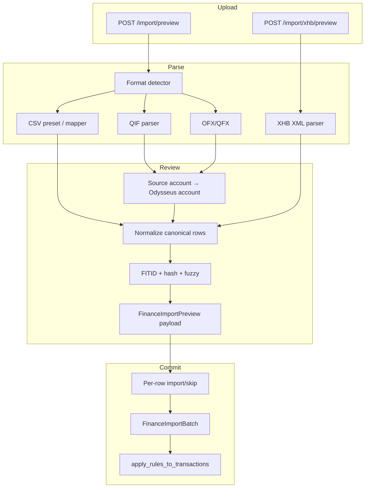

# feat: Import pipeline & migration (QIF, CSV mapper, .xhb, review queue)

**Target repo:** odysseus-finance
**HomeBank reference:** homebank `src/` (read-only port inspiration)

## Goal Capsule

Close the gap between Odysseus Finance's bank import MVP (CSV presets + OFX/QFX, FITID/hash dedup, preview→commit) and HomeBank's richer import wizard plus native file migration, so users can bring any bank CSV, QIF exports, and existing HomeBank `.xhb` books into Odysseus with a trustworthy review step.

Authority: this plan; `Banking Research/02-manual-import.md`; existing code in `integrations/finance/services/parsers.py` and `import_service.py`. Stop when formats parse, mapping persists, review queue supports per-row decisions, `.xhb` migrates accounts/categories/transactions, and agent tools are advisory/diagnostic with gated commit only.

---

## Product Contract

### Summary

Odysseus already imports Wells Fargo / Navy Federal CSV and OFX/QFX with preview and hard dedup. Gaps: no QIF; generic CSV mapping exists only as a partial parser path (no API/UI or saved presets); no HomeBank `.xhb` migration; review is binary new/duplicate with no per-row toggle or fuzzy queue. HomeBank supplies QIF, FITID-aware OFX, per-row `to_import`, in-file + destination similarity (with day gap), and account mapping — but its CSV path is a fixed 8-column HomeBank format, not a Tiller-style bank column mapper. The mapper work comes from Odysseus research docs, not a literal HomeBank port.

### Requirements

- R1. Users can import QIF files through the same preview → review → commit path as CSV/OFX.
- R2. Users can map arbitrary CSV headers to Odysseus fields (date, amount or debit+credit, payee, memo, check_number, balance optional), with polarity reverse, preamble skip, date format, decimal separator, and encoding options; mappings can be saved and reused.
- R3. Users can import a HomeBank `.xhb` file into a new or empty Odysseus finance dataset (accounts, categories, payees-as-rules where applicable, transactions including splits when the data model supports them, categorization assignments).
- R4. Import preview classifies rows as `new`, `duplicate`, or `review` (fuzzy); users can toggle per-row include/skip before commit.
- R5. Multi-account source files (QIF account blocks, multi-account OFX) support mapping each source account to an Odysseus account (existing, create, or skip).
- R6. The AI finance agent can diagnose import issues, suggest column mappings, summarize previews/batches, and open the Import UI — but cannot silently write transactions without confirmation.
- R7. Existing Wells Fargo / Navy Federal / OFX behavior remains intact (regression).

### Actors

- A1. Finance user — monthly bank export → import.
- A2. HomeBank migrant — one-time `.xhb` migration.
- A3. AI finance agent — diagnose, suggest, confirm-gated assist.

### Key flows

- F1. Bank CSV (unknown bank) → detect generic → column mapper → preview with review queue → commit.
- F2. QIF upload → account map → preview → commit.
- F3. `.xhb` upload → migration preview (entity counts) → confirm → write accounts/categories/transactions.
- F4. Agent: user reports "import failed / wrong amounts" → agent inspects last preview/errors or mapping → suggests fix → directs to UI or gated commit.

### Acceptance examples

- AE1. A CSV with Debit/Credit columns and non-English headers maps once, saves as a user preset, and reimports next month without remapping.
- AE2. Re-importing an overlapping QFX marks FITID matches as duplicate; same-day same-amount different payee lands in `review`, not auto-skip.
- AE3. A HomeBank `.xhb` with 3 accounts and categorized transactions creates matching Odysseus accounts and categorized rows; opening balances preserved.
- AE4. Agent asked "why did my Navy Federal import flip signs?" explains Credit Debit Indicator handling and does not auto-commit a corrected reimport without confirmation.

### Scope boundaries

**In scope**

- QIF parser; wire mapping through preview API; mapper UI; fuzzy review + per-row actions; account mapping for multi-account files; `.xhb` importer (core entities); agent diagnostic/suggest/gated tools.

**Deferred to follow-up**

- PDF statement OCR; storing encrypted original file blobs; multi-account single-CSV split by account column; full HomeBank filters/reports/groups/templates migration; investment/security QIF blocks.

**Out of scope**

- Live bank APIs / Plaid; rewriting OFX parsing away from `ofxparse` unless blocked; porting HomeBank's fixed 8-column CSV as the primary bank format (optional secondary preset only if needed for HB CSV exports).

---

## Planning Contract

### Assumptions

- Generic CSV mapper is product-required even though HomeBank does not implement Tiller-style mapping; research doc `Banking Research/02-manual-import.md` is authoritative for mapper fields.
- `.xhb` migration is opt-in one-shot into the current owner's finance DB; empty-DB or "merge with conflict report" is preferred over silent overwrite of existing transactions.
- Split transactions in `.xhb` map only if split support lands first or in a coordinated unit; otherwise import parent amount + memo note of split categories (document choice at implement time).
- Agent never uploads arbitrary filesystem paths server-side without an existing document/upload id pattern already used elsewhere; prefer UI upload + agent analysis of `preview_id`.

### Key technical decisions

- KTD1. Extend `parse_upload` / `build_import_preview` to accept `mapping`, `parse_options`, and `account_map` rather than forking a second pipeline. Rationale: current preview→commit with `FinanceImportPreview` TTL is the right seam.
- KTD2. Preview row status becomes a tri-state: `new` | `duplicate` | `review`. Commit payload accepts per-row actions `{ row_index, action: import|skip }` (merge deferred). Rationale: matches HomeBank `to_import` + research `import-dedup-review.md`.
- KTD3. Fuzzy review uses same date ± `day_gap` (default 0–2 days, configurable) + equal `amount_cents` + payee similarity (normalized equality first; optional Levenshtein ≤ 3 later). Do not auto-skip fuzzy matches. Rationale: HomeBank `opt_daygap` + destination similar.
- KTD4. QIF: port field semantics from `hb-import-qif.c` (D/T/P/M/N/L/C/R, `!Type:`, `!Account`, splits via `S`/`$`/`E` if present) into Python; do not FFI into HomeBank. Rationale: license-clean reimplementation from observed behavior + QIF public grammar.
- KTD5. `.xhb`: parse with Python `xml.etree` / streaming markup mirroring `hb-xml.c` element set (`account`, `cat`, `pay`, `asg`, `ope`, `cur`, `properties`); map Julian dates and float amounts to ISO date + integer cents. Version gate: support recent HomeBank file versions used in the wild; reject ancient versions with a clear upgrade message.
- KTD6. Agent tools: add read-only `inspect_import_preview`, `suggest_csv_mapping`, `list_import_errors`; add confirmation-gated `commit_import_preview` only when `preview_id` already exists from a user upload. Do not add free-form file-path import for the agent. Rationale: matches README "import is UI-only" for file acquisition while enabling diagnosis.

### High-level technical design

### Alternative approaches considered

| Approach | Why not |
|----------|---------|
| Shell out / bind to HomeBank C importers | Platform fragility; GPL coupling; poor web UX |
| Full silent agent auto-import from chat attachments | High financial risk; confirmation gate pattern already used for categories |
| Only ship `.xhb`, skip mapper | Leaves non-WF/NFCU banks broken; research marks mapper as MVP |

### Phased delivery

1. **Phase A — Mapper + review queue** (unblocks most monthly users)
2. **Phase B — QIF + account mapping**
3. **Phase C — `.xhb` migration**
4. **Phase D — Agent diagnostic/suggest tools + gated commit**

---

## Implementation Units

### U1. Wire generic CSV mapping + parse options through API

**Goal:** Make `parse_generic_csv`'s `mapping` and advanced options reachable from preview; persist saved mappings.

**Requirements:** R2, R7

**Dependencies:** none

**Files:**

- `integrations/finance/services/parsers.py` (modify)
- `integrations/finance/services/import_service.py` (modify)
- `integrations/finance/routes.py` (modify)
- `integrations/finance/models.py` (add `FinanceCsvMapping` or store in plugin config JSON)
- `tests/test_finance_parsers.py` (modify)
- `tests/test_finance_routes.py` (modify)

**Approach:**

- Extend `parse_upload` / `build_import_preview` with optional `mapping: dict[str,str]`, `options: { date_format, encoding, skip_rows, reverse_polarity, decimal_separator }`.
- Add `GET/POST /api/finance/import/mappings` for named user presets.
- Keep auto-detect presets; when `csv_generic` or client sends mapping, use mapper path.
- Improve header heuristics for debit/credit-only banks (research doc NFCU Debit/Credit shape vs current indicator-based NFCU sample).

**Patterns to follow:** Existing `ImportCommitBody` pydantic models in `routes.py`; owner-scoped rows like `FinanceImportBatch`.

**Test scenarios:**

- Happy path: mapping `{date, debit, credit, payee}` produces correct signed cents.
- Edge: `skip_rows=2` ignores preamble; reverse polarity flips signs.
- Error: missing required date/amount fields returns structured errors, no crash.
- Regression: Wells Fargo / Navy Federal presets unchanged when mapping omitted.

**Verification:** Unit tests green; preview API returns mapped rows for a synthetic European-style CSV.

---

### U2. Richer review queue + per-row commit actions

**Goal:** Tri-state preview and per-row include/skip at commit (HomeBank-style control without GTK).

**Requirements:** R4

**Dependencies:** U1 (shares preview payload shape)

**Files:**

- `integrations/finance/services/import_service.py` (modify)
- `integrations/finance/routes.py` (modify)
- `integrations/finance/static/js/index.js` (modify)
- `tests/test_finance_routes.py` (modify)
- `Banking Research/features/import-dedup-review.md` (align notes if behavior locked)

**Approach:**

- After FITID/hash exact matches → `duplicate`.
- Else if fuzzy match against existing account txs → `review` with `matched_transaction_id` optional.
- Commit body: `row_actions: [{index, action}]` defaulting to import all `new`, skip `duplicate`, skip `review` unless user opts in.
- UI: color-coded table; checkboxes for include; filters new/dup/review; show first N with "load more" if needed.

**Patterns to follow:** HomeBank `to_import` / `is_dst_similar` / `is_imp_similar` semantics in `hb-import.c`; research preview `{ new, duplicate, review }`.

**Test scenarios:**

- Happy: exact FITID → duplicate skipped on commit.
- Edge: same amount+date, different payee → `review`; commit without action skips it; with `import` inserts.
- Integration: batch rollback still deletes only imported rows.

**Verification:** UI can toggle a review row and commit produces expected counts.

---

### U3. QIF parser + multi-account mapping

**Goal:** Parse QIF into canonical rows; map source accounts before commit.

**Requirements:** R1, R5

**Dependencies:** U2 (preview statuses), U1 optional

**Files:**

- `integrations/finance/services/parsers.py` or `integrations/finance/services/qif_parser.py` (create)
- `integrations/finance/services/import_service.py` (modify)
- `integrations/finance/routes.py` (modify)
- `integrations/finance/static/js/index.js` (modify)
- `tests/test_finance_qif.py` (create)
- `tests/fixtures/finance/synthetic_qif/` (create)

**Approach:**

- Detect `.qif` / `!Type:` header.
- Parse bank/cash/ccard transaction blocks; account blocks for names; ignore security/prices initially.
- Options: date order guess, memo/payee swap (HomeBank `opt_qifswap` / `opt_qifmemo`), amount invert.
- Preview returns `source_accounts[]`; client posts `account_map: { source_key: target_account_id|"create"|"skip" }` before or with commit.

**Patterns to follow:** `hb-import-qif.c` field letters and block types; Odysseus `ParsedTransaction` finalize/dedup_hash.

**Test scenarios:**

- Happy: single-account QIF → N transactions.
- Happy: multi-account QIF with two `!Account` sections maps to two Odysseus accounts.
- Edge: European vs US date ambiguity flagged when both valid.
- Error: truncated file / missing amounts → row errors, partial preview.

**Verification:** Synthetic QIF fixtures commit with correct amounts and payees.

---

### U4. HomeBank `.xhb` migration importer

**Goal:** One-shot migration of a HomeBank XML book into Odysseus finance data.

**Requirements:** R3

**Dependencies:** U2 for preview confirm pattern; split support coordination if required

**Files:**

- `integrations/finance/services/xhb_import.py` (create)
- `integrations/finance/services/import_service.py` or dedicated migrate service (modify/create)
- `integrations/finance/routes.py` (modify: `/import/xhb/preview`, `/import/xhb/commit`)
- `integrations/finance/static/js/index.js` (modify: migration tab/section)
- `tests/test_finance_xhb_import.py` (create)
- `tests/fixtures/finance/synthetic_xhb/` (create minimal `.xhb`)

**Approach:**

- Parse elements: `properties`, `cur`, `account`, `cat`, `pay`, `asg`, `ope` (and splits via `scat`/`samt`/`smem` when supported).
- Julian day → `date`; float money → cents via Decimal.
- Category parent/child via HomeBank key hierarchy.
- Assign rules (`asg`) → `FinanceCategorizationRule` patterns where field is payee/memo search.
- Preview returns counts + sample rows + warnings (unsupported filters/groups/templates skipped).
- Safety: refuse commit if target owner already has transactions unless `mode=merge` with explicit confirmation and dedup.

**Patterns to follow:** `hb-xml.c` load handlers; Odysseus models in `models.py`.

**Test scenarios:**

- Happy: minimal `.xhb` with 1 account, 2 cats, 3 opes → matching rows.
- Edge: unknown category key on ope → uncategorized + warning.
- Error: corrupt XML / unsupported version → clear HTTP 400.
- Safety: non-empty DB without merge flag → rejected.

**Verification:** Round-trip fixture import; balances match HomeBank opening + sums within 1 cent.

**Execution note:** Start with characterization fixtures derived from a tiny hand-written `.xhb`, not a real user file in git.

---

### U5. Mapper + review UI polish

**Goal:** Usable Import tab for mapper and review without requiring agent help.

**Requirements:** R2, R4

**Dependencies:** U1, U2

**Files:**

- `integrations/finance/static/js/index.js` (modify)
- Optional CSS under plugin static if existing pattern exists

**Approach:**

- When format is `csv_generic` or user selects Generic, show column dropdowns populated from detected headers + advanced options.
- Save mapping button → U1 presets API.
- Preview table: status badges, checkbox column, bulk "import all review".

**Test expectation:** none — covered by route tests + light manual smoke; add a small JS-free API contract test if UI logic stays thin.

**Verification:** Manual smoke on WF, NFCU, and one generic debit/credit CSV.

---

### U6. AI tool access for import diagnosis and gated assist

**Goal:** Agent can help with imports without becoming an unsupervised writer.

**Requirements:** R6

**Dependencies:** U1–U2 (preview payload), U3–U4 optional for richer tips

**Files:**

- `src/tools/finance.py` (modify)
- `src/tool_index.py` (modify description)
- `integrations/finance/confirmation_gate.py` (modify)
- `integrations/finance/README.md` (modify)
- `tests/test_finance_agent_tools.py` (modify)

**Approach:** See AI tool access design below (also embedded in Appendix). Register `commit_import_preview` under confirmation gate with payload binding to `preview_id` + counts. Keep file bytes out of tool args.

**Test scenarios:**

- `suggest_csv_mapping` on header list returns required field coverage.
- `inspect_import_preview` returns counts without raw PII flood (truncate payees).
- `commit_import_preview` without token fails; with token matching preview_id succeeds once.
- Tool index text still steers file upload to UI / `open_panel finance`.

**Verification:** Agent tool tests pass; README matches policy.

---

## AI tool access design

### Agent may

| Action | Params | Confirmation |
|--------|--------|--------------|
| `list_import_batches` | optional `account_id` | No (existing) |
| `inspect_import_preview` | `preview_id` | No — returns format, counts, error samples, status histogram |
| `suggest_csv_mapping` | `headers: string[]`, optional `sample_rows` (≤5, redacted amounts ok) | No — returns proposed mapping + confidence notes |
| `explain_import_format` | `format` or `filename` + short header sniff text | No |
| `commit_import_preview` | `preview_id`, optional `row_actions` | **Yes** — confirmation gate; payload must include preview_id, new_count, review_count |
| `delete_import_batch` | `batch_id` | **Yes** — destructive rollback |
| Direct user to Import UI | via `ui_control` / existing open panel | No |

### Agent must not

- Accept raw filesystem paths or arbitrary remote URLs to pull bank files (SSRF / privacy).
- Bypass preview and write transactions from chat-invented rows.
- Auto-approve fuzzy `review` rows as imports without user-visible confirmation summary.
- Log or echo full account numbers / full file contents into chat.

### Example dialogues

1. User: "My CSV import said 40 errors." → `list_import_batches` / `inspect_import_preview` → explain date format → suggest remapping → open Finance Import.
2. User: "Map these headers: Booking Date, Withdrawal, Deposit, Details." → `suggest_csv_mapping` → user confirms in UI or gated commit after UI preview.
3. User: "Import the preview now." → ask_user confirmation block with counts → `commit_import_preview` + token.

---

## Verification Contract

- Parser unit tests: `tests/test_finance_parsers.py`, new QIF/XHB tests.
- Route/API: `tests/test_finance_routes.py` for preview/commit/mapping/xhb.
- Agent: `tests/test_finance_agent_tools.py` for new actions + gate refusals.
- Regression: existing WF/NFCU synthetic + optional private fixtures still pass.
- Manual: Import tab mapper + review on one real generic CSV (not committed).

---

## Definition of Done

- R1–R7 satisfied for phases A–D as merged (or explicitly deferred items listed in PR).
- No silent agent import path.
- Research docs `02-manual-import.md` / feature notes updated to match shipped behavior (mapper no longer "future only").
- Dedup + batch delete still work.

---

## Risks & open questions

| Risk / question | Severity | Notes |
|-----------------|----------|-------|
| `.xhb` version sprawl + upgrade paths in `hb-xml.c` | High | Gate supported versions; test 1–2 recent formats |
| Split transactions before split feature lands | Medium | Blocking for faithful migration; coordinate or degrade |
| Fuzzy dedup false positives | Medium | Default day_gap=0 or 1; never auto-import review |
| QIF date order ambiguity | Medium | Surface in preview; allow override |
| `ofxparse` maintenance | Low–Med | Already depended; out of scope unless blocked |
| NFCU CSV shape drift (indicator vs Debit/Credit columns) | Medium | Research doc and live samples differ; support both |
| Merge vs replace semantics for `.xhb` into non-empty DB | **Open (blocking for U4 UX copy)** | Default refuse; offer merge |
| Store original upload blob? | Open (deferred) | Research left open; default discard after parse |
| Should HomeBank 8-column CSV be a named preset? | Open (deferred) | Low priority vs bank mapper |

---

## Effort & priority

- **Effort:** L (parsers + UI mapper + review + `.xhb` + agent gates). Research docs previously called parsing XL; scoped phases keep shippable increments at L overall, M per phase.
- **Priority:** **High** for Phase A (mapper + review) — unblocks non-preset banks and safer reimports. **Medium** for QIF. **High for HomeBank migrants / Medium otherwise** for `.xhb`. **Medium** for agent tools (high leverage once previews exist).

---

## Appendix — codebase grounding

### Odysseus today

- Parsers: `integrations/finance/services/parsers.py` — WF, NFCU, generic (mapping arg unused by `parse_upload`), OFX via `ofxparse`.
- Pipeline: `integrations/finance/services/import_service.py` — preview TTL 2h, FITID + hash only, commit skips duplicates only.
- API/UI: `routes.py` preview/commit/batches; `static/js/index.js` simple preview table (first 100 rows).
- Agent: `src/tools/finance.py` — `list_import_batches` only for imports; README + `tool_index.py` mark CSV/OFX import UI-only.
- Gate: `confirmation_gate.py` — category create only today.

### HomeBank references

- `hb-import.h` / `hb-import.c` — GenTxn, FITID, duplicate + destination similar, daygap, apply.
- `hb-import-qif.c` — QIF blocks/fields.
- `hb-import-csv.c` — fixed 8-column HomeBank CSV (not bank mapper).
- `hb-import-ofx.c` — OFX + FITID.
- `ui-assist-import.c` — per-row toggle UI.
- `hb-xml.c` / `hb-xml.h` — `.xhb` load/save element handlers.

### Product research

- `Banking Research/02-manual-import.md`
- `Banking Research/features/transaction-import-parsing.md`
- `Banking Research/features/import-dedup-review.md`
