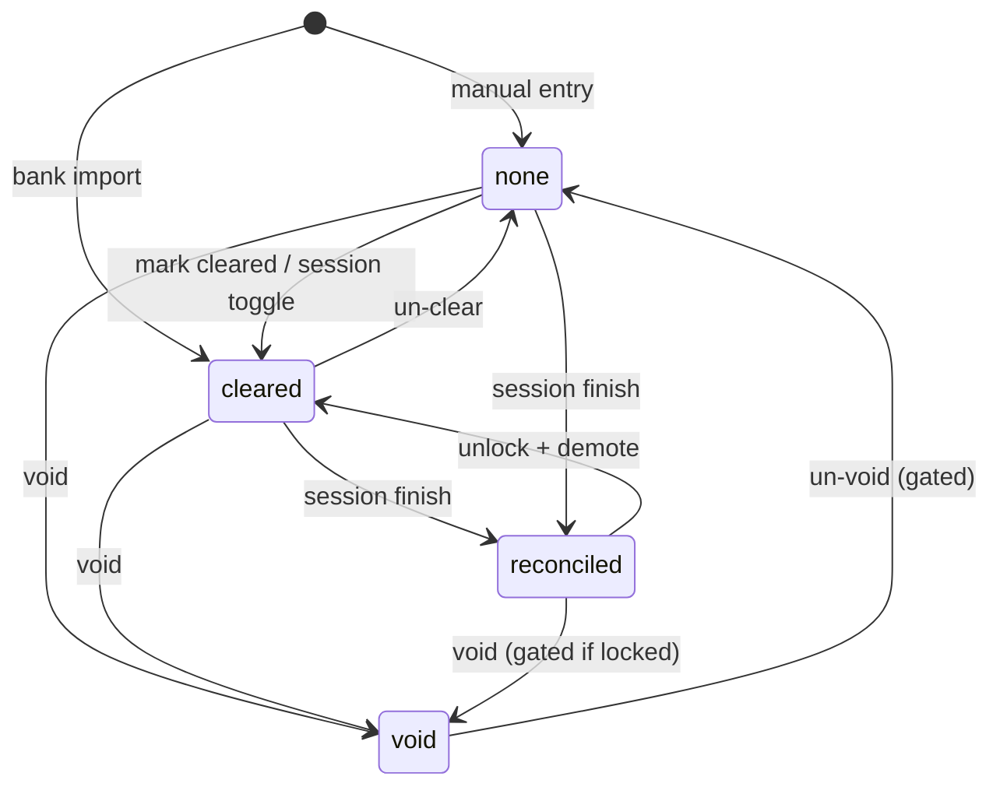

# feat: Reconciliation workflow (HomeBank port)

**Target repo:** odysseus-finance  
**Origin:** HomeBank `HbTxnStatus` / account `rdate`+`bal_recon` + Banking Research `features/multi-account-reconciliation.md`  
**Product Contract preservation:** N/A (bootstrap from port brief + Banking Research)

## Goal capsule

Give Odysseus a statement-period reconciliation loop: status model (`none` / `cleared` / `reconciled` / `void`), per-account reconciled balance + last reconcile date, optional edit-lock on reconciled rows, and session-based close so the AI finance agent can help match statements without silently rewriting locked history.

---

## 1. Benefit verdict for the AI finance agent

**Verdict: Yes — port it.**

**Reasoning**

- Without reconcile, the agent’s balances are “sum of all imported rows.” Imports default `status="cleared"` today; there is no bank-statement ground truth. Budgets, envelopes, cash-flow, and safe-to-spend all assume that ground truth (`Banking Research/features/budgeting-envelopes.md` calls reconciliation critical for manual-import apps).
- Reconciliation is high-value agent work: tedious check-off, difference hunting, unmatched reporting. That is a better agent job than category CRUD.
- HomeBank already proves a small status model + lock preference is enough for trust; Odysseus should add **sessions** (Banking Research / Quicken-style) so the agent has a structured object to drive, not a free-form register toggle like HomeBank’s manual doc workflow.
- Security research already requires confirmation gates on finance mutations and capped transaction dumps — reconcile finish / unlock / adjustment fit that pattern cleanly.

**What the agent gains**

| Capability | Without reconcile | With reconcile |
|---|---|---|
| Answer “does my balance match the bank?” | Guess from register sum | Diff vs statement in a session |
| Trust advice on spendable cash | Weak | Grounded in `bal_recon` / last close |
| Fix drift | Manual UI only | Guided unmatched + optional adjustment (gated) |

---

## 2. Current state (codebase-grounded)

### HomeBank

| Concept | Location | Behavior |
|---|---|---|
| Status enum | `hb-transaction.h` `HbTxnStatus` | `NONE`, `CLEARED`, `RECONCILED`, `VOID` |
| Void out of balances | `transaction_is_balanceable` | Void (and pending import/remind flags) excluded |
| Cleared vs bank balance | `hb-account.c` `account_balances_*` | `bal_recon` = initial + reconciled only; `bal_clear` includes cleared **and** reconciled |
| Last reconcile date | `Account.rdate` | Set when a txn transitions **to** reconciled (`ui-transaction.c`, `dsp-account.c` toggle) |
| Lock | `PREFS->safe_lock_recon` | Blocks edit/delete/assign of reconciled when on |
| Workflow | `doc/use-reconcile.html` | **No dedicated dialog** — filter unreconciled, mark R until bank balance matches statement |

### Odysseus today

| Surface | State |
|---|---|
| `FinanceTransaction.status` | Free `String`, default `"cleared"` (`integrations/finance/models.py`) |
| `PATCH /transactions/{id}` | Accepts any `status` string; no enum validation; no lock |
| Import commit | Always inserts `status="cleared"` |
| `account_balance_cents` | Opening + **all** txn amounts (no status filter; void would still count if introduced) |
| Account model | No `rdate` / `bal_recon` / reconcile prefs |
| Sessions | None |
| Agent `manage_finance` | Read + categorize/budget/rules/categories; **cannot set status or reconcile** |
| Confirmation gate | Only `create_category` / `create_categories` |

Research docs already specify the target shape: `finance_reconcile_sessions`, status `pending_review | cleared | reconciled`, session APIs, lock on finish (`Banking Research/features/multi-account-reconciliation.md`). Align HomeBank’s `none`/`void` with that doc by treating `none` ≈ uncleared register and `pending_review` as import-queue alias (optional alias, not a fifth lifecycle for MVP).

---

## 3. Product / technical design

### 3.1 Status model

Canonical statuses (store lowercase strings; validate at API + tool layer):

| Status | Meaning | In register balance? | In bank (`bal_recon`)? | Editable when lock on? |
|---|---|---|---|---|
| `none` | Entered / not on statement | Yes | No | Yes |
| `cleared` | Seen on statement / cleared check | Yes | No | Yes |
| `reconciled` | Included in a completed statement close | Yes | Yes | No (unless unlock) |
| `void` | Cancelled; keep row for audit | **No** | No | Prefer lock (same as reconciled) |

**Transitions (HomeBank-aligned toggles + session finish)**

```text
none ⇄ cleared ⇄ reconciled
any non-void → void (explicit; gated if already reconciled under lock)
void → none|cleared (un-void; gated if lock)
```

Session finish bulk-sets included txns to `reconciled`.

**Import default:** keep `"cleared"` for bank CSV/OFX (already posted). Manual entry / future pending imports may use `none` or `pending_review` (alias of `none` in filters if desired).

### 3.2 Account reconcile fields

Add to `FinanceAccount` (or compute on read; prefer **cached columns updated on status/session change** for list performance, HomeBank-style):

- `reconciled_balance_cents` — opening + sum(amount) where status=`reconciled` and not void
- `last_reconciled_at` / `last_reconciled_date` — date of last successful session finish (or first txn→reconciled if no session; prefer session)
- Pref: `lock_reconciled` (owner-scoped config in `finance` config JSON or column; default **true** for agent safety)

Also expose computed:

- `cleared_balance_cents` — opening + sum where status in (`cleared`,`reconciled`)
- `register_balance_cents` — opening + sum where status ≠ `void` (replace current all-rows sum)

### 3.3 Statement close (sessions)

Model (from Banking Research, refined):

```text
finance_reconcile_sessions
  id, owner, account_id
  statement_end_date
  statement_balance_cents
  starting_reconciled_cents   -- snapshot at start (expected: last bal_recon)
  status: in_progress | completed | cancelled
  difference_cents            -- statement - computed_included
  completed_at
```

Optional link: `FinanceTransaction.reconcile_session_id` set on finish (audit).

**Session algorithm**

1. **Start:** require account ownership; refuse if another `in_progress` for same account; snapshot `starting_reconciled_cents`; return uncleared candidates (`none`/`cleared`, date ≤ statement_end_date, optionally include older uncleared).
2. **Toggle include:** mark txn as “in session set” (either temp status `cleared` or session membership table). Prefer **membership + working status**: toggling sets working status to `cleared` if was `none`; finish promotes cleared-in-session to `reconciled`.
3. **Difference:** `statement_balance_cents - (starting_reconciled_cents + sum(included amounts))` must be `0` to finish (or post adjustment).
4. **Finish:** set included → `reconciled`; update account `reconciled_balance_cents` + `last_reconciled_date`; session → `completed`.
5. **Adjustment:** create balancing txn (payee “Reconciliation adjustment”, status `reconciled`, memo with session id) then finish — **confirmation-gated** for agent.

Credit cards: statement balance may be positive liability; use account_type copy (“statement balance owed”) but same math on signed `amount_cents`.

### 3.4 Lock rules

When `lock_reconciled` is on:

- Block PATCH of amount/date/payee/category/status on `reconciled` (and `void` if policy says so)
- Block delete
- Allow category-only edit? **No for MVP** (HomeBank locks any change); defer unlock-for-recategorize to polish
- Agent `categorize_transaction` must refuse reconciled with clear error
- Explicit `unlock_transaction` / finish-with-reopen is gated

### 3.5 API

| Method | Path | Notes |
|---|---|---|
| GET | `/api/finance/accounts/{id}/balances` | register / cleared / reconciled breakdown |
| PATCH | `/api/finance/transactions/{id}` | validate status enum; enforce lock |
| POST | `/api/finance/accounts/{id}/reconcile/start` | body: statement_end_date, statement_balance_cents |
| GET | `/api/finance/reconcile/{session_id}` | candidates, included, difference |
| POST | `/api/finance/reconcile/{session_id}/toggle/{txn_id}` | include/exclude |
| POST | `/api/finance/reconcile/{session_id}/finish` | require difference==0 |
| POST | `/api/finance/reconcile/{session_id}/adjustment` | create balancing txn + optional auto-finish |
| POST | `/api/finance/reconcile/{session_id}/cancel` | abandon in_progress |
| GET | `/api/finance/accounts/{id}/reconcile/history` | completed sessions |

### 3.6 UI

Finance panel tab or account action **Reconcile**:

1. Enter statement end date + ending balance  
2. Checklist of uncleared txns with running difference  
3. Finish when zero; show adjustment CTA if stuck  
4. Register columns: status icon (C/R/V); disable edit when locked  

Keep parity with existing vanilla JS panel (`integrations/finance/static/js/index.js`).

---

## High-level technical design



```mermaid
sequenceDiagram
  participant U as User/Agent
  participant API as /api/finance
  participant DB as finance.db
  U->>API: reconcile/start(statement_end, balance)
  API->>DB: create session in_progress
  API-->>U: candidates + difference
  loop match statement
    U->>API: toggle txn
    API-->>U: updated difference
  end
  alt difference == 0
    U->>API: finish (confirm if agent)
    API->>DB: txns reconciled; account rdate/bal_recon
  else difference != 0
    U->>API: adjustment (confirm) then finish
  end
```

---

## 4. AI tool access design

Extend `manage_finance` (do not invent a second finance tool). Follow aggregate-first + confirmation-gate patterns (`Banking Research/security/financial-data-security.md`, `integrations/finance/confirmation_gate.py`).

### Actions

| Action | Gate? | Purpose |
|---|---|---|
| `reconcile_status` | No | Account: register/cleared/reconciled balances, last reconcile date, open session if any |
| `reconcile_start` | Yes | Start session with statement_end_date + statement_balance_cents |
| `reconcile_preview` | No | List unmatched / candidates for open session (cap 50; filters required) |
| `set_transaction_status` | Soft* | Set `none`/`cleared`/`void` on unlocked rows; refuse `reconciled` except via finish |
| `reconcile_toggle` | No† | Include/exclude txn in open session |
| `reconcile_finish` | Yes | Close when difference==0 |
| `reconcile_adjustment` | Yes | Post balancing txn |
| `reconcile_cancel` | Yes | Abandon session |

\*Soft: no gate for `none`↔`cleared` on unlocked; gate for `void` and any demotion of `reconciled`.  
†Toggle is reversible within an open session; finish is the irreversible gate.

### Confirmation payload schemas (directional)

```json
{
  "tool": "manage_finance",
  "action": "reconcile_finish",
  "payload": {
    "session_id": "abc123…",
    "account_id": "…",
    "statement_end_date": "2026-06-30",
    "statement_balance_cents": 125043,
    "included_count": 42,
    "difference_cents": 0
  }
}
```

```json
{
  "tool": "manage_finance",
  "action": "reconcile_adjustment",
  "payload": {
    "session_id": "…",
    "amount_cents": -15,
    "payee": "Reconciliation adjustment",
    "auto_finish": true
  }
}
```

### Example agent flow

1. User: “Reconcile Checking to $1,250.43 as of June 30.”  
2. Agent: `reconcile_status` → shows last recon $1,100.00, register $1,248.10.  
3. Agent: `ask_user` + confirmation → `reconcile_start`.  
4. Agent: `reconcile_preview` → reports unmatched / suggests toggles (never dump >50).  
5. Agent: `reconcile_toggle` for clear matches; asks user on ambiguous amounts.  
6. When difference 0: confirmation → `reconcile_finish`.  
7. If $0.15 off: explain, confirmation → `reconcile_adjustment`.

### Prompt / schema touch points

- `src/tool_schemas.py` — enum + params (`session_id`, `statement_end_date`, `statement_balance_cents`, `transaction_id`, `status`, `confirmation_token`)
- `src/tools/finance.py` — action handlers
- `src/agent_loop.py` finance tool tip — when to reconcile vs spending_report
- `src/tool_index.py` embedding blurb
- `integrations/finance/confirmation_gate.py` — validators for finish/adjustment/cancel/void
- `integrations/finance/README.md` — agent capabilities

---

## 5. Implementation units

### U1. Status enum + balance helpers + lock enforcement

**Goal:** Canonical statuses; register/cleared/reconciled balances; PATCH rejects invalid/locked edits.  
**Files:** `integrations/finance/models.py`, `integrations/finance/services/balances.py` (new), `integrations/finance/services/import_service.py` (fix `account_balance_cents` or delegate), `integrations/finance/routes.py`, `tests/test_finance_routes.py`, `tests/test_finance_balances.py` (new)  
**Approach:** Validate status on write; void excluded from all balances; reconciled-only for bank balance; optional account cached columns updated in service helpers.  
**Test scenarios:** void excluded from register; cleared not in bal_recon; locked reconciled PATCH → 409; unlock path when pref off.

### U2. Reconcile sessions service + API

**Goal:** Start/toggle/finish/cancel/adjustment with difference math.  
**Files:** `integrations/finance/models.py`, `integrations/finance/services/reconcile.py` (new), `integrations/finance/routes.py`, `integrations/finance/database.py` (create tables), `tests/test_finance_reconcile.py` (new)  
**Dependencies:** U1  
**Test scenarios:** happy finish at 0; finish rejected when nonzero; second start blocked while in_progress; adjustment then finish; owner isolation; credit-card signed amounts.

### U3. Finance UI reconcile wizard

**Goal:** Statement entry, checklist, live difference, finish/adjust.  
**Files:** `integrations/finance/static/js/index.js`, finance CSS if any  
**Dependencies:** U2  
**Test expectation:** manual/browser smoke; optional lightweight JS-free API coverage already in U2.

### U4. Agent tools + confirmation gates

**Goal:** Agent can drive reconcile with gates on irreversible steps.  
**Files:** `src/tools/finance.py`, `src/tool_schemas.py`, `src/agent_loop.py`, `src/tool_index.py`, `integrations/finance/confirmation_gate.py`, `integrations/finance/README.md`, `tests/test_finance_agent_tools.py`  
**Dependencies:** U2  
**Test scenarios:** finish without token fails; finish with matching payload succeeds; preview capped at 50; set_transaction_status cannot force reconciled; categorize refuses locked reconciled.

---

## Phased delivery

| Phase | Scope | Ships |
|---|---|---|
| **MVP** | U1 + U2 + minimal UI toggle status + difference | Trustworthy balances + API close |
| **Agent** | U4 | “Help me reconcile” |
| **Polish** | Full wizard UX, session history UI, auto-suggest by amount/date, print report, CC copy | Banking Research polish |

---

## File touch list (summary)

```text
integrations/finance/models.py
integrations/finance/database.py
integrations/finance/routes.py
integrations/finance/services/balances.py          # new
integrations/finance/services/reconcile.py         # new
integrations/finance/services/import_service.py
integrations/finance/confirmation_gate.py
integrations/finance/static/js/index.js
integrations/finance/README.md
Banking Research/features/multi-account-reconciliation.md  # keep in sync
src/tools/finance.py
src/tool_schemas.py
src/agent_loop.py
src/tool_index.py
tests/test_finance_routes.py
tests/test_finance_balances.py                     # new
tests/test_finance_reconcile.py                    # new
tests/test_finance_agent_tools.py
```

---

## 6. Risks and open questions

### Risks

- **Silent status inflation:** Today everything is `cleared`; introducing `none`/`reconciled` without migration guidance confuses “bank balance.” Mitigation: treat existing `cleared` as uncleared-for-reconcile candidates; first reconcile establishes baseline.
- **Agent over-toggle:** Agent could clear wrong rows. Mitigation: finish/adjustment gated; preview capped; prefer ask_user on ambiguous matches.
- **Adjustment abuse:** Balancing txn can hide real missing transactions. Mitigation: distinct payee + session link + gate; surface in unmatched report.
- **Transfer pairs:** HomeBank optionally syncs xfer status. Odysseus has no strong xfer link yet (separate port). Reconcile one side only can desync. Defer sync; document risk.
- **Cached bal_recon drift** if updates miss a code path. Mitigation: recompute function + tests; optional nightly consistency check later.

### Open questions

1. Import default stay `cleared` or move new imports to `none` until user clears? (**Recommend:** stay `cleared` for bank files; session treats both `none` and `cleared` as eligible.)
2. Allow category edit on locked reconciled? (**Recommend:** no for MVP.)
3. Multi-currency / multi-account single session? (**Out of scope** — one account per session.)
4. Should `pending_review` be a real status or filter alias? (**Recommend:** alias of `none` until import-review queue ships.)
5. Credit-card statement balance sign convention in UI copy — confirm with first CC account type.

### Assumptions (planning bootstrap)

- Prefer Quicken-style **sessions** over HomeBank’s dialog-less workflow (better for agent).
- Lock default **on** for agent-facing safety.
- Void is in MVP status enum (HomeBank parity) even if UI void control is secondary.

---

## 7. Effort and priority

| | |
|---|---|
| **Effort** | **M** (matches Banking Research; U1–U4 ~3–5 focused days if xfer sync deferred) |
| **Priority** | **P1 / High** — foundational for trustworthy agent balances and for envelopes/cash-flow that depend on it; after import+accounts, before envelope budgeting polish |

**Depends on:** accounts + import (done).  
**Unblocks:** accurate cash-flow, safe-to-spend, envelope trust, agent “does this match my bank?”

---

## Scope boundaries

### In scope

- Status model, balances, lock, sessions, API, UI MVP, agent tools + gates

### Out of scope / deferred

- Live bank sync / OFX Direct
- Multi-account batch reconcile
- Printable PDF reconcile report
- Transfer status sync (until internal-transfer port lands)
- Remind status (HomeBank removed from primary enum)

### Outside product identity

- Third-party aggregator-driven auto-reconcile (Plaid)

---

## Sources

- HomeBank: `hb-transaction.h`, `hb-account.c`/`h`, `dsp-account.c`, `ui-pref.c`, `ui-transaction.c`, `doc/use-reconcile.html`
- Odysseus: `integrations/finance/models.py`, `routes.py`, `services/import_service.py`, `confirmation_gate.py`, `src/tools/finance.py`, `src/tool_schemas.py`
- `Banking Research/features/multi-account-reconciliation.md`, `budgeting-envelopes.md`, `security/financial-data-security.md`, `01-feature-inventory.md`
