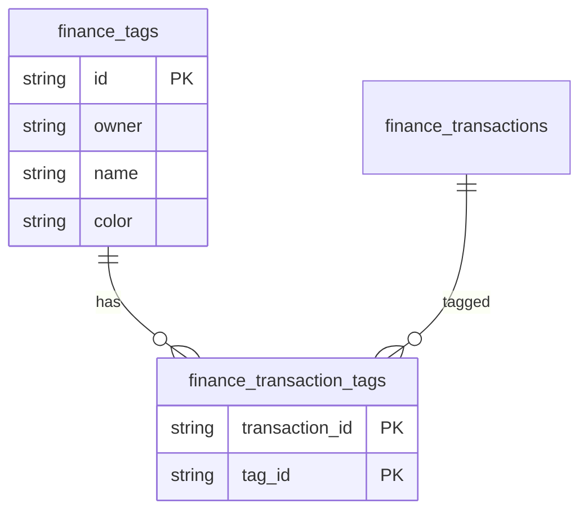
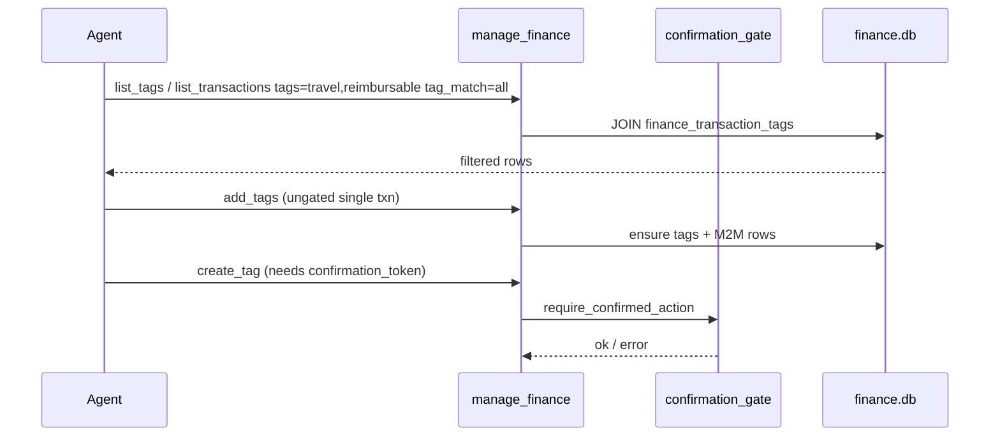

# feat: Transaction tags (HomeBank port)

## Goal Capsule

Port HomeBank-style multi-tags on transactions into the Odysseus Finance plugin so users and the AI agent can label, filter, and report across categories (e.g. `travel` + `reimbursable`).

**Benefit verdict (AI finance agent): Yes.** Categories are single-assignment hierarchy; tags are the cross-cutting dimension the agent needs for reimbursements, trips, tax flags, and multi-label spend questions. Without tags, the agent overloads categories or memo text and cannot answer "show travel that is reimbursable" cleanly.

---

## Product Contract

### Problem frame

Odysseus Finance has accounts, categories, budgets, rules, and transaction list/filter by account/category/month/payee. There is no tag model (`integrations/finance/models.py`). HomeBank stores a null-terminated `guint32 *tags` on each transaction (`hb-transaction.h`), a global tag registry (`hb-tag.c`), filter group `FLT_GRP_TAG` with include/exclude (`hb-filter.h/c`), and manage UI (`ui-tag.c`). Research note `Banking Research/features/tags-labels.md` already sketches M2M tables and MVP scope.

### Requirements

- R1. Owner-scoped tag registry with unique names; optional color.
- R2. Many-to-many assignment: a transaction may have zero or more tags.
- R3. Create tags on the fly when assigning (HomeBank `tags_parse` / `da_tag_append_if_new` behavior).
- R4. List/filter transactions by one or more tags; support AND (all) and OR (any) match modes.
- R5. Agent can list tags, add/remove tags on transactions, filter by tag, and get tag spending totals.
- R6. Mutating tag *creation* and bulk retag follow the existing finance confirmation-gate pattern where appropriate.
- R7. Transaction API/UI surfaces expose tags; spending report can group or filter by tag (polish).

### Scope boundaries

**In scope (MVP):** tag tables, CRUD API, assign/unassign on transactions, list filter by tag, agent tool actions, basic chips in Finance panel transactions tab.

**Deferred:** tag groups/namespaces (`work:`), bulk tag from search results UI, HomeBank CSV tag import/export, rule `action_tags` (depends on rules expansion in `Banking Research/features/rules-auto-categorization.md`), tag merge UI, unused-tag cleanup job.

**Out of scope:** Plaid sync; encrypting tag names (research: plaintext OK); HomeBank's hard cap of 32 tags per txn (use unbounded M2M with a soft UI limit, e.g. 20).

### Assumptions

- A1. Filter default for multiple tags in agent queries is **AND** (`match=all`); UI multi-select may default to OR to match HomeBank, but API exposes both.
- A2. Tag rename is case-preserving display with case-insensitive uniqueness per owner (mirror category name handling).
- A3. Spaces in new tag names are normalized to hyphens (HomeBank `#2018414` / `da_tag_consistency`), unless the caller passes an already-normalized name.
- A4. `categorize_transaction` stays ungated; single-txn `add_tags` / `remove_tags` stay ungated; `create_tag` alone and bulk `tag_transactions` require confirmation.

---

## Planning Contract

### Key Technical Decisions

| ID | Decision | Rationale |
|----|----------|-----------|
| KTD1 | Relational M2M (`finance_tags` + `finance_transaction_tags`), not JSON array on `finance_transactions` | Matches research doc; enables indexed filter/report joins; avoids HomeBank's 32-tag array limit |
| KTD2 | Soft schema via `FinanceBase.metadata.create_all` (existing plugin pattern in `database.py`); no Alembic for MVP | Plugin DB already uses create-all; additive tables are safe |
| KTD3 | Extend `manage_finance` actions rather than a new tool | Parity with categories/budgets; keeps tool index and confirmation domain `finance` |
| KTD4 | Gate `create_tag` / `create_tags` / `tag_transactions` (bulk); leave single-txn add/remove ungated | Mirrors `create_category` vs `categorize_transaction` in `confirmation_gate.py` / `src/tools/finance.py` |
| KTD5 | `tag` / `tags` query params on `GET /transactions` with `tag_match=all\|any` | Search-filter research already lists `tag=`; agent "travel + reimbursable" needs AND |
| KTD6 | Resolve tags by id, id prefix, or name (ilike), same as `_resolve_category` | Agent UX consistency |

### High-level technical design





### HomeBank → Odysseus mapping

| HomeBank | Odysseus |
|----------|----------|
| `Tag` hash table + key | `finance_tags` row (UUID id, owner) |
| `txn->tags` uint32 array | `finance_transaction_tags` |
| `tags_parse` space-split create-if-new | `ensure_tags` service helper |
| `FLT_GRP_TAG` OR match | `tag_match=any`; add `all` for agent |
| `ui-tag` manage dialog | API + optional Settings chips later; MVP inline on txn row |
| Assign rules `Archive.tags` | Deferred to rules `action_tags` |

---

## Implementation Units

### U1. Tag models and ensure helpers

**Goal:** Persist tags and M2M links; create-on-assign helper.

**Requirements:** R1, R2, R3

**Dependencies:** none

**Files:**
- `integrations/finance/models.py` (create `FinanceTag`, `FinanceTransactionTag`)
- `integrations/finance/services/tags.py` (create)
- `tests/test_finance_tags.py` (create)

**Approach:**
- `finance_tags`: `id`, `owner`, `name`, `color` (default like categories), timestamps; `UniqueConstraint(owner, name)` — normalize name before insert.
- `finance_transaction_tags`: composite PK `(transaction_id, tag_id)`, FKs with cascade delete from transaction and tag.
- Relationship on `FinanceTransaction.tags` via secondary table (optional for ORM convenience).
- `ensure_tag(db, owner, name_or_id) -> FinanceTag`; `set_transaction_tags` / `add` / `remove` helpers.
- Call `init_finance_db()` path already creates tables via metadata.

**Patterns to follow:** `FinanceCategory` owner scoping; `create_category_for_owner` uniqueness errors.

**Test scenarios:**
- Create two tags for owner A; owner B cannot see them via queries scoped by owner.
- Duplicate name (case-insensitive) for same owner raises / returns existing.
- Add two tags to a txn; remove one; delete tag cascades M2M rows.
- `ensure_tag` with spacey name stores hyphenated form.

**Verification:** New tests pass; existing finance DB install still creates schema.

---

### U2. REST API for tags and transaction tag assignment

**Goal:** CRUD tags; filter and patch transaction tags.

**Requirements:** R1–R4, R7 (API half)

**Dependencies:** U1

**Files:**
- `integrations/finance/routes.py`
- `tests/test_finance_routes.py` (extend)

**Approach:**
- `GET/POST /api/finance/tags`; `PATCH/DELETE /api/finance/tags/{id}` (rename, color, delete).
- `GET /api/finance/transactions` add `tag` (repeatable or comma-separated), `tag_match=all|any` (default `all`).
- `_transaction_dict` include `tags: [{id, name, color}, ...]`.
- `TransactionPatch` add optional `tag_ids: list[str] | null` (replace set) and/or `add_tag_ids` / `remove_tag_ids` — prefer replace-via-`tag_ids` plus dedicated `PUT /transactions/{id}/tags` for clarity: `PUT` body `{ "tag_ids": [...] }` or `{ "tags": ["travel","reimbursable"] }` with ensure-on-name.
- Owner checks on every tag id.

**Patterns to follow:** existing list_transactions filters; `_require_owned_category`.

**Test scenarios:**
- Filter `tag=travel&tag=reimbursable&tag_match=all` returns only intersection.
- `tag_match=any` returns union.
- PUT tags with new name creates tag and links.
- DELETE tag removes links; txn list no longer filters on it.
- Cross-owner tag id → 404.

**Verification:** Route tests green; OpenAPI-ish manual smoke via Finance panel later in U4.

---

### U3. Agent tool actions + confirmation + schemas

**Goal:** Full AI access: list/add/remove/filter/report with confirmation rules.

**Requirements:** R5, R6

**Dependencies:** U1, U2 (service layer sufficient; routes optional)

**Files:**
- `src/tools/finance.py`
- `integrations/finance/confirmation_gate.py`
- `src/tool_schemas.py`
- `src/tool_index.py` (description keywords)
- `tests/test_finance_agent_tools.py` (extend)

**Approach — new/extended `manage_finance` actions:**

| Action | Gated? | Behavior |
|--------|--------|----------|
| `list_tags` | No | All tags for owner with usage counts optional |
| `create_tag` / `create_tags` | Yes | Same ask_user + `confirmation_token` pattern as categories |
| `add_tags` | No | `transaction_id` + `tags: string[]` (names or ids); ensure-on-name |
| `remove_tags` | No | `transaction_id` + `tags` |
| `set_tags` | No (single txn) | Replace full set |
| `tag_transactions` | Yes | Bulk: `transaction_ids` + `tags` + `op: add\|remove\|set` |
| `list_transactions` | No | Extend with `tag`/`tags` + `tag_match` |
| `spending_by_tag` | No | Month + optional tag filter; sum amount_cents grouped by tag |

**Schema additions** (`tool_schemas.py`): `tags` (array of string), `tag`, `tag_match` enum `all|any`, `op`, `transaction_ids`.

**Confirmation payloads:** mirror category gate — validate name(s) / batch items for `create_tag(s)` and bulk `tag_transactions`.

**Example agent queries (expected tool use):**
1. "Tag my last Starbucks as reimbursable" → `list_transactions` search Starbucks → `add_tags` tags=`["reimbursable"]`.
2. "Show travel expenses that are reimbursable this month" → `list_transactions` month=YYYY-MM tags=`["travel","reimbursable"]` tag_match=`all`.
3. "How much did I spend on travel tags last month?" → `spending_by_tag` month=… tag=`travel`.
4. "Create a tag called tax-deductible" → `ask_user` confirmation → `create_tag` + token.
5. "Mark these three Amazon orders as business and reimbursable" → confirmation → `tag_transactions`.

**Patterns to follow:** `create_category` gate in `confirmation_gate.py`; `_resolve_category` for name/id resolution.

**Test scenarios:**
- `add_tags` without confirmation succeeds and list_transactions with tag filter finds it.
- `create_tag` without token fails with confirmation language.
- `list_transactions` with two tags and `tag_match=all` excludes txn missing one tag.
- Bulk `tag_transactions` without token blocked; with token applies to all ids.

**Verification:** Agent tool tests pass; tool enum lists new actions.

---

### U4. Finance panel UI — chips + filter

**Goal:** Visible tags on transaction rows; filter control.

**Requirements:** R4, R7 (UI)

**Dependencies:** U2

**Files:**
- `integrations/finance/static/js/index.js`
- Manual smoke (no dedicated JS test harness today)

**Approach:**
- Load tags once with transactions; render chips next to category select.
- Autocomplete / datalist for add; click chip to remove.
- Filter bar: multi-select tags + match mode toggle (All / Any).
- Keep UI minimal; no card chrome; reuse existing tab styles.

**Test expectation:** none automated — smoke: assign tag, refresh, filter shows subset.

**Verification:** Panel shows chips; filter query hits new API params.

---

### U5. Tag spending report (polish)

**Goal:** Report endpoint + agent action already stubbed in U3.

**Requirements:** R7

**Dependencies:** U1, U3

**Files:**
- `integrations/finance/services/reports.py`
- `integrations/finance/routes.py` (`GET /reports/spending-by-tag`)
- `integrations/finance/static/js/index.js` (optional Reports tab section)
- `tests/test_finance_routes.py` or reports unit test

**Approach:** Join txn→tags for month; group by tag_id; exclude income or follow spending_by_category sign convention (`spent_cents` negative expenses).

**Test scenarios:** Two tags on same txn count once per tag group (full amount attributed to each tag — document this double-count behavior; do not split unless splits exist).

**Verification:** Report totals match manual sum for single-tag txns; dual-tag attribution documented.

---

## Phased delivery

| Phase | Units | Outcome |
|-------|-------|---------|
| MVP | U1–U4 | Tags exist; UI + API + agent filter/assign |
| Polish | U5 + deferred bulk UI + rules `action_tags` | Reports and auto-tag on import |

---

## File touch list (summary)

| Path | Change |
|------|--------|
| `integrations/finance/models.py` | Tag + M2M models |
| `integrations/finance/services/tags.py` | New service |
| `integrations/finance/services/reports.py` | spending_by_tag |
| `integrations/finance/routes.py` | Tag routes, txn filter/patch |
| `integrations/finance/confirmation_gate.py` | Gate create/bulk tag actions |
| `integrations/finance/static/js/index.js` | Chips + filter |
| `src/tools/finance.py` | New actions + list_transactions filter |
| `src/tool_schemas.py` | Enum + params |
| `src/tool_index.py` | Description / keyword hints |
| `tests/test_finance_tags.py` | New |
| `tests/test_finance_routes.py` | Extend |
| `tests/test_finance_agent_tools.py` | Extend |
| `Banking Research/features/tags-labels.md` | Optional: mark shipped sections |

---

## AI tool access design (detail)

### Actions and confirmation

- **Read (no confirm):** `list_tags`, `list_transactions` (+ tag filters), `spending_by_tag`.
- **Single-txn write (no confirm):** `add_tags`, `remove_tags`, `set_tags` — same trust model as `categorize_transaction`.
- **Registry / bulk write (confirm):** `create_tag`, `create_tags`, `tag_transactions`.

### Argument shapes (directional)

```text
list_tags: { action }
create_tag: { action, name, color?, confirmation_token }
add_tags: { action, transaction_id, tags: ["travel","reimbursable"] }
remove_tags: { action, transaction_id, tags: ["reimbursable"] }
list_transactions: { action, month?, search?, tags: ["travel","reimbursable"], tag_match: "all"|"any", limit? }
spending_by_tag: { action, month, tag? }
tag_transactions: { action, transaction_ids: [...], tags: [...], op: "add"|"remove"|"set", confirmation_token }
```

### Agent query cookbook

| User says | Tool plan |
|-----------|-----------|
| "Tag that hotel charge as travel and reimbursable" | Find txn → `add_tags` with both names |
| "What's left to expense from the Denver trip?" | `list_transactions` tags=`travel,reimbursable` match=all + optional search Denver |
| "Total reimbursable spend in June" | `spending_by_tag` month=2026-06 tag=reimbursable |
| "Create tags business and personal" | Confirmation → `create_tags` |
| "Untag reimbursable from these" | `remove_tags` or gated bulk remove |

---

## Risks & open questions

| Risk / question | Impact | Mitigation / default |
|-----------------|--------|----------------------|
| AND vs OR default surprises HomeBank users | Medium | Expose `tag_match`; agent docs say AND for multi-tag phrases with "and"/"+" |
| Dual-tag report double-counts spend | Medium | Document attribution; later optional "primary tag" or split support |
| Tag name collision with category names | Low | Separate namespaces; resolve in tag actions only |
| Ungated `add_tags` lets agent spam labels | Low–Med | Soft limit per txn; optional later gate |
| Rules `action_tags` not in MVP | Low | Defer; import still category-only |
| Soft `create_all` won't alter existing DBs if we later add columns to old tables | Low for new tables | New tables fine; document if tags gain columns later |
| Should delete-tag require confirmation when usage > 0? | Open | Default: allow delete with cascade; return usage count in list_tags |
| Normalize spaces to hyphens vs allow spaces? | Open | Default: hyphenate (HomeBank parity) |
| Priority vs search-filter polish / split txns? | Open | Recommend tags MVP after current categorize/filter is stable — high agent leverage for S–M cost |

---

## Effort & priority

| | |
|--|--|
| **Effort** | **M** (MVP U1–U4 ≈ S–M; + U5 reports and confirmation edge cases → M). Research doc said S for data+filter alone; agent surface + confirmation + UI chips push it to M. |
| **Priority** | **High for agent usefulness; Medium for product roadmap.** Not in Banking Research MVP list (accounts/import/categories/budgets), but unblocks cross-cutting queries competitors treat as table stakes. Sequence after solid category/filter; before or alongside rules `action_tags`. |

---

## Verification Contract

- Unit/route/agent tests covering create, assign, AND/OR filter, gated create, ungated add_tags.
- Manual: Finance panel chip add → filter All → spending-by-tag (if U5).
- Agent smoke: natural language "travel + reimbursable" produces `tag_match=all` tool call.

## Definition of Done

- [ ] U1–U4 merged with tests green
- [ ] `manage_finance` schema/enum/docs mention tags
- [ ] Confirmation gate covers create/bulk only
- [ ] Research note or plan marked implemented for MVP
- [ ] U5 optional follow-up issue if not in same PR

## Sources & Research

- HomeBank: `src/hb-tag.h`, `src/hb-tag.c`, `src/ui-tag.h`, `src/hb-filter.h`, `src/hb-filter.c` (`filter_txn_tag_match` OR semantics), `src/hb-transaction.h` (`tags` field), assign tags in `hb-assign.h`
- Odysseus: `Banking Research/features/tags-labels.md`, `search-filter-transactions.md`, `rules-auto-categorization.md`, `integrations/finance/models.py`, `routes.py`, `src/tools/finance.py`, `confirmation_gate.py`, `src/tool_schemas.py`
