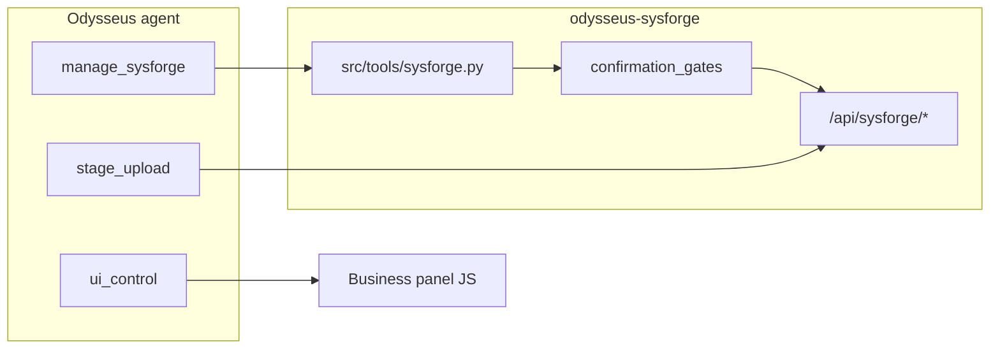

# Full SysForge Business AI tooling — master plan

## Promise

Odysseus agents get **one typed tool surface** (`manage_sysforge`) that covers every SysForge Business capability the plugin already exposes at `/api/sysforge/*`, plus upload and navigation bridges the JSON-only `app_api` path cannot reach. Shop owners can ask, preview, confirm, and commit without memorizing REST paths.

## Goal capsule

- **Objective:** Replace ad-hoc `app_api` loopback for Business with a finance-style `manage_sysforge` service layer, confirmation gates, and discovery so agents safely run the full shop loop (clients → invoices → payments → projects → parts → admin).
- **Authority:** This master plan + linked phase plans. Backend REST in `integrations/sysforge/` stays the execution layer; tools wrap it.
- **Stop conditions:** Do not split into three separate part/supplier/placeholder tools unless `manage_sysforge` schema size forces it after Phase 5. Do not re-port desktop Avalonia UI; wire existing plugin APIs.
- **Success:** Every inventory row in the parity checklist maps to at least one `manage_sysforge` action (or explicit `ui_control` / `stage_upload` companion). `app_api` blocks destructive SysForge writes after Phase 6.

## Architecture decisions (resolved)

| Decision | Verdict | Notes |
|----------|---------|-------|
| Tool shape | **Single `manage_sysforge`** | Mirror `manage_finance`; actions `{entity}_{verb}` |
| Rejected alternative | Three tools (`manage_parts`, etc.) | Only revisit if OpenAI enum exceeds practical limits post-Phase 5 |
| Transport | Hybrid | `manage_sysforge` + `stage_upload` + `ui_control open_panel business` |
| Deprecation | Gradual `app_api` block | Read-only SysForge via `app_api` until Phase 1 ships; block writes Phase 3+; full block Phase 6 |
| Money | Agent dollars → server cents | Accept `*_dollars` aliases; always return cents + formatted strings |
| Drafts | `DraftDocument` iteration | `invoice_validate` / `invoice_preview` before commit |
| Dossier link | `sysforge_client_id` on Person | `client_link_dossier` / `client_unlink_dossier` in Phase 1 |
| Risk tiers | T0–T4 | T0 read; T1 create/update; T2 financial; T3 irreversible; T4 admin/restore |
| Discovery | Four layers | Tool description → action enum → `action_help` → `ui_control` panel hints |

## Coverage map (feature → primary action)

| Domain | Representative actions | Phase |
|--------|------------------------|-------|
| Plugin status | `status`, `diagnostics` | 1 |
| Clients | `client_search`, `client_get`, `client_create`, `client_update`, `client_delete` | 1–3 |
| Client merge | `client_merge_preview`, `client_merge` | 3 |
| Dossier bridge | `client_link_dossier`, `client_unlink_dossier` | 1 |
| Drafts | `draft_list`, `draft_get`, `draft_save`, `draft_delete` | 2–3 |
| Invoices | `invoice_list`, `invoice_get`, `invoice_create`, `invoice_update`, `invoice_validate`, `invoice_preview` | 1–2 |
| Invoice ops | `invoice_accept`, `invoice_delete`, `invoice_email`, `invoice_pdf_fetch` | 3–4 |
| Devices | `invoice_devices_get`, `invoice_devices_set` | 2 |
| Payments | `payment_list`, `payment_record`, `payment_void` | 1, 3 |
| Outstanding | `outstanding_list` | 1 |
| Reports | `report_sales` | 1 |
| Parts | `part_search`, `part_get`, `part_create`, `part_update`, `part_delete` | 1–3 |
| Stock / price history | `part_stock_get`, `part_stock_set`, `part_price_history` | 2 |
| Placeholders | `placeholder_list`, `placeholder_convert`, `placeholder_merge_preview`, `placeholder_merge` | 2–3, 5 |
| Suppliers | `supplier_search`, `supplier_get`, `supplier_create`, `supplier_update`, `supplier_delete` | 1–3, 5 |
| Projects | `project_list`, `project_get`, `project_create_from_invoice`, `project_update`, `project_photo_add` | 2, 4 |
| Work orders | `work_order_get`, `work_order_from_estimate` | 2 |
| Screw maps | `screw_map_get`, `screw_map_image_add`, `screw_map_screw_upsert` | 4 |
| Settings | `settings_get`, `settings_update` | 6 |
| Backup | `backup_create`, `backup_list`, `backup_restore_preview`, `backup_restore` | 6 |
| Companion | `companion_status`, `companion_pair` | 6 |
| Navigation | `ui_control open_panel business` + `route` arg | 0 |

Full parity rows live in [appendix: parity checklist](#appendix-parity-checklist).

## Phased roadmap

| Phase | Focus | Est. duration | Depends on |
|-------|--------|---------------|------------|
| [0 — Contracts](2026-07-19-002-feat-sysforge-ai-phase-0-contracts-plan.md) | Schemas, panels, discovery, conventions | 3–5 days | — |
| [1 — Core reads + safe writes](2026-07-19-003-feat-sysforge-ai-phase-1-reads-plan.md) | Search/list/get, client CRUD, status | 5–8 days | 0 |
| [2 — Shop loop writes](2026-07-19-004-feat-sysforge-ai-phase-2-shop-loop-plan.md) | Invoices, drafts, devices, projects, WO | 8–12 days | 1 |
| [3 — Gates + destructive](2026-07-19-005-feat-sysforge-ai-phase-3-gates-plan.md) | Merge, void, delete, accept, email | 5–8 days | 2 |
| [4 — Upload bridge + media](2026-07-19-006-feat-sysforge-ai-phase-4-upload-media-plan.md) | Photos, screw maps, PDF to workspace | 5–7 days | 2 |
| [5 — Parts bulk](2026-07-19-007-feat-sysforge-ai-phase-5-parts-bulk-plan.md) | Import, enrich, supplier bulk | 6–10 days | 1, 3 |
| [6 — Admin + hardening](2026-07-19-008-feat-sysforge-ai-phase-6-admin-plan.md) | Settings, backup, companion, `app_api` block | 5–8 days | 3 |
| [7 — And more](2026-07-19-009-feat-sysforge-ai-phase-7-future-plan.md) | Aging, NL reports, batch, health digest | backlog | 1–6 |

**Total core (Phases 0–6):** ~6–10 engineering weeks sequential; Phases 1+4 can overlap after Phase 0.

## Open decisions (closed)

| Question | Resolution |
|----------|------------|
| One tool vs many for parts? | **One `manage_sysforge`** |
| How handle multipart? | **`stage_upload`** staging token → `manage_sysforge` commit action |
| Backup import path? | Phase 6: staged file + `backup_restore` with T4 gate; desktop ZIP bridge deferred |
| Project photo GET for vision? | Add `GET /projects/{id}/photos/{photo_id}/file` in Phase 4 |
| Parts PATCH/import/enrich API? | New endpoints in Phase 5; tool calls them with `dry_run` |
| `app_api` fate? | Allow reads through Phase 2; redirect agents via tool_index after Phase 1 |

## Files touched (cross-cutting)

| Area | Paths |
|------|-------|
| Tool implementation | `src/tools/sysforge.py` (new), `src/tool_implementations.py`, `src/tool_execution.py` |
| Schemas & discovery | `src/tool_schemas.py`, `src/tool_index.py`, `src/agent_loop.py` |
| Gates | `src/confirmation_gates/` (register SysForge actions) |
| Security | `src/tool_security.py` (block `app_api` SysForge writes) |
| Upload bridge | `src/tools/stage_upload.py` or extend existing staging |
| UI control | `src/tools/ui_control.py`, `integrations/sysforge/static/js/router.js` |
| Tests | `tests/test_manage_sysforge*.py`, extend `tests/test_sysforge_*.py` |
| Docs | This plan set; update `integrations/sysforge/README.md` |

## Success criteria

1. Agent completes scripted shop day without `app_api`: search client → draft invoice → add line items → save → record payment → open project.
2. Every T3+ action requires `confirmation_token` from `ask_user`; missing token returns gate error text agents can follow.
3. `tool_index` retrieval surfaces `manage_sysforge` for business keywords; `app_api` description no longer lists SysForge as primary path after Phase 6.
4. Parity checklist: 100% rows have planned action(s); zero "plugin-only UI" gaps without documented `ui_control` escape hatch.
5. Test suite: ≥1 integration test per phase acceptance criteria; gate tests for merge, delete, void, email, restore.

## Appendix: parity checklist

Every SysForge Business inventory feature mapped to tooling. `MS` = `manage_sysforge` action; `UI` = `ui_control`; `SU` = `stage_upload`.

### Plugin platform & shell

| Feature | Planned action(s) | Phase |
|---------|-------------------|-------|
| Plugin install / feature gate | `ui_control open_panel settings` (existing) | — |
| Business nav / dashboard | `UI open_panel business` + optional `route=dashboard` | 0 |
| Inner router views | `UI open_panel business route=<view>` | 0 |
| Toast feedback | Server returns `ui_hint` in tool response | 0 |
| Diagnostics panel | `MS diagnostics`, `UI route=diagnostics` | 1 |

### Clients

| Feature | Planned action(s) | Phase |
|---------|-------------------|-------|
| Client CRUD | `client_list`, `client_get`, `client_create`, `client_update` | 1 |
| Client search (FTS) | `client_search` | 1 |
| Recent clients | `client_recent` | 1 |
| Duplicate detection | `client_duplicates` | 1 |
| Client dashboard data | `client_get` + `invoice_list` filter | 1 |
| Client delete | `client_delete` (T3) | 3 |
| Client merge | `client_merge_preview`, `client_merge` (T3) | 3 |
| Touch / MRU | `client_touch` | 1 |
| Dossier link | `client_link_dossier`, `client_unlink_dossier` | 1 |
| Client acceptance dialog | `invoice_accept` flow (T2) | 3 |

### Invoices & calculator

| Feature | Planned action(s) | Phase |
|---------|-------------------|-------|
| Invoice list / get | `invoice_list`, `invoice_get` | 1 |
| Outstanding | `outstanding_list` | 1 |
| Sales report | `report_sales` | 1 |
| Calculator create | `invoice_validate`, `invoice_preview`, `invoice_create` | 2 |
| Calculator update | `invoice_update` | 2 |
| Save as new | `invoice_save_as_new` (T2) | 3 |
| Price compare | `invoice_price_compare` | 1 |
| Update prices preview/apply | `invoice_update_prices_preview`, `invoice_update_prices_apply` (T2) | 2–3 |
| Invoice delete | `invoice_delete` (T3) | 3 |
| PDF | `invoice_pdf_fetch` → workspace file | 4 |
| Email invoice | `invoice_email` (T3) | 3 |
| Invoice devices | `invoice_devices_get`, `invoice_devices_set` | 2 |
| Per-invoice JSON backup | `invoice_get` export slice; full backup via `backup_create` | 6 |

### Drafts

| Feature | Planned action(s) | Phase |
|---------|-------------------|-------|
| List / get drafts | `draft_list`, `draft_get` | 2 |
| Create / update draft | `draft_save` | 2 |
| Autosave | `draft_autosave` | 2 |
| Pin / rename | `draft_pin`, `draft_rename` | 2 |
| Delete draft(s) | `draft_delete` (T2) | 3 |
| Retention preview/cleanup | `draft_retention_preview`, `draft_retention_cleanup` (T2) | 6 |

### Payments

| Feature | Planned action(s) | Phase |
|---------|-------------------|-------|
| List payments | `payment_list` | 1 |
| Record payment | `payment_record` (T2) | 3 |
| Void payment | `payment_void` (T3) | 3 |

### Parts, suppliers, placeholders

| Feature | Planned action(s) | Phase |
|---------|-------------------|-------|
| Parts search / list | `part_search`, `part_list` | 1 |
| Part CRUD | `part_get`, `part_create`, `part_update`, `part_delete` (T3) | 1–3 |
| Stock | `part_stock_get`, `part_stock_set` | 2 |
| Price history | `part_price_history_list`, `part_price_history_add` | 2 |
| Usage | `part_usage` | 1 |
| FTS rebuild | `part_search_rebuild` (T2) | 5 |
| Bulk import | `part_import` with `dry_run` (T2) | 5 |
| Enrich from supplier | `part_enrich` with `dry_run` (T2) | 5 |
| Suppliers CRUD | `supplier_*` | 1–3 |
| Placeholder list | `placeholder_list`, `placeholder_groups` | 1 |
| Convert placeholder | `placeholder_convert` (T2) | 2 |
| Merge placeholders | `placeholder_merge_preview`, `placeholder_merge` (T3) | 3 |

### Projects & work orders

| Feature | Planned action(s) | Phase |
|---------|-------------------|-------|
| Projects hub | `project_hub`, `project_list` | 2 |
| Project get / patch | `project_get`, `project_update`, `project_status_set` | 2 |
| Notes | `project_notes_set` | 2 |
| Photos | `SU` + `project_photo_add`; `GET` serve Phase 4 | 4 |
| Create from invoice | `project_from_invoice_preflight`, `project_create_from_invoice` | 2 |
| Screw map | `screw_map_get`, `screw_map_create`, `screw_map_image_add`, screw CRUD actions | 4 |
| Work order get | `work_order_get` | 2 |
| WO from estimate | `work_order_from_estimate` | 2 |

### Admin & infrastructure

| Feature | Planned action(s) | Phase |
|---------|-------------------|-------|
| Settings get/put | `settings_get`, `settings_update` (T2–T4 by field) | 6 |
| Status / schema | `status` | 1 |
| Backup create/list | `backup_create`, `backup_list` | 6 |
| Backup restore | `backup_restore_preview`, `backup_restore` (T4) + `SU` | 6 |
| Companion pair/status | `companion_status`, `companion_pair` | 6 |
| Money cents convention | Enforced in tool layer | 0 |
| UTC timestamps | Pass-through ISO from API | 0 |

### Phase 7 backlog (optional)

| Feature | Planned action(s) | Phase |
|---------|-------------------|-------|
| Aging / collections | `report_aging` | 7 |
| Payment plans | `payment_plan_*` | 7 |
| NL sales questions | `report_sales` + agent summarization | 7 |
| Health digest | `health_digest` | 7 |
| Batch invoices | `invoice_batch_create` | 7 |

### Explicit UI-only escape hatches

| Feature | Escape hatch | When |
|---------|--------------|------|
| Calculator grid editing | `UI open_panel business route=calculator` | User asks to "use the screen" |
| Screw map canvas annotate | `UI route=screw-map project_id=` | Fine placement |
| Backup file pick (pre-Phase 6) | `UI route=settings` | Until `SU` lands |

---

**Phase plans:** [0](2026-07-19-002-feat-sysforge-ai-phase-0-contracts-plan.md) · [1](2026-07-19-003-feat-sysforge-ai-phase-1-reads-plan.md) · [2](2026-07-19-004-feat-sysforge-ai-phase-2-shop-loop-plan.md) · [3](2026-07-19-005-feat-sysforge-ai-phase-3-gates-plan.md) · [4](2026-07-19-006-feat-sysforge-ai-phase-4-upload-media-plan.md) · [5](2026-07-19-007-feat-sysforge-ai-phase-5-parts-bulk-plan.md) · [6](2026-07-19-008-feat-sysforge-ai-phase-6-admin-plan.md) · [7](2026-07-19-009-feat-sysforge-ai-phase-7-future-plan.md)
