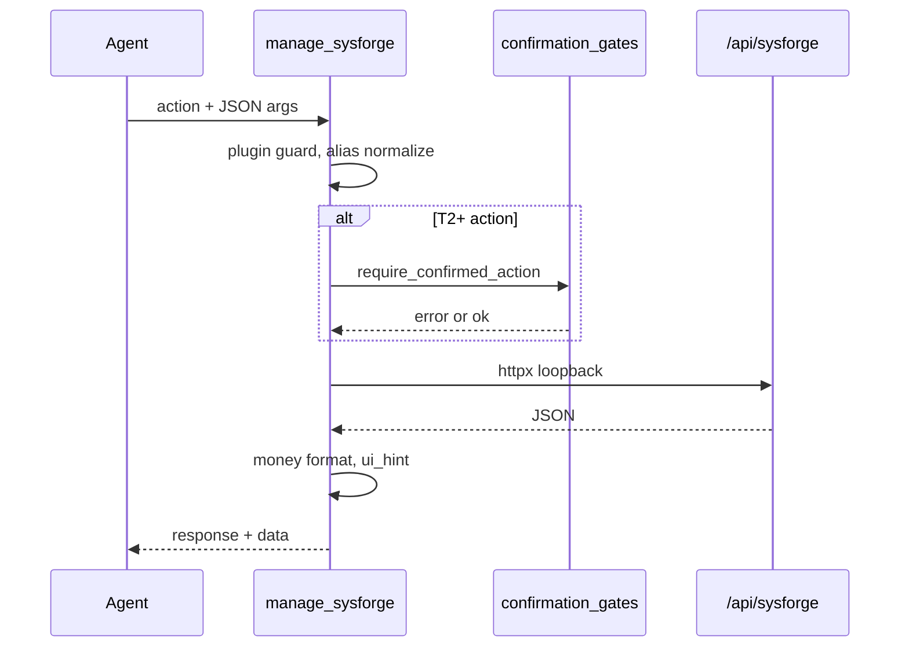

# Architecture implementation plan — `manage_sysforge`

## Promise

One typed agent surface (`manage_sysforge`) mirrors `manage_finance`, wraps `/api/sysforge/*`, and pairs with `stage_upload` + `ui_control open_panel business` for multipart and navigation gaps.

## Module layout

```
src/tools/
  sysforge_constants.py    # Action registry: phase, tier, REST map, help snippets
  sysforge.py                # do_manage_sysforge — router, HTTP, money, gates
  stage_upload.py            # Workspace file → upload_token (Phase 4+)
  _common.py                 # (existing) _INTERNAL_BASE, _internal_headers

src/confirmation_gates/
  sysforge.py                # T2–T4 validators (imported by plugin gate registrar)

integrations/sysforge/
  confirmation_gate.py       # register_sysforge_confirmation_gate() at route setup
  services/
    parts_import.py          # Phase 5 bulk import/enrich (dry_run + batch_id)
    reports.py                 # + aging_report() Phase 7
    projects.py                # + read_photo_file() Phase 4
  routes.py                    # photo file GET, bulk POST, aging GET, batch POST
  static/js/
    index.js                   # navigateBusiness(route, id) for ui_control
    router.js                  # applyFromHash supports ?view=&id= query deep links

src/tool_schemas.py            # manage_sysforge + stage_upload schemas
src/tool_index.py              # Business keyword cluster + domain map
src/agent_loop.py              # Cheat sheet + deprecate app_api for Business
src/tool_implementations.py    # re-export do_manage_sysforge
src/tool_execution.py          # dispatch branch
src/tool_security.py           # app_api SysForge block (writes Phase 3, all Phase 6)
src/tools/system.py              # app_api hint text
src/ai_interaction.py            # ui_control business panel aliases + route/id
static/js/chatStream.js          # open_panel business → openSysforge + navigate

tests/
  test_manage_sysforge_contracts.py
  test_manage_sysforge_phase1.py
  test_manage_sysforge_phase2.py
  test_manage_sysforge_gates.py
  test_manage_sysforge_media.py
  test_manage_sysforge_bulk.py
  test_manage_sysforge_admin.py
  test_manage_sysforge_phase7.py
  test_stage_upload.py
  test_app_api_sysforge_block.py
```

## How `manage_sysforge` mirrors finance

| Finance pattern | SysForge equivalent |
|-----------------|---------------------|
| `do_manage_finance` in `src/tools/finance.py` | `do_manage_sysforge` in `src/tools/sysforge.py` |
| Direct DB via `integrations/finance/database` | HTTP loopback to `/api/sysforge/*` via `_INTERNAL_BASE` |
| `is_plugin_active("finance")` guard | `is_plugin_active("sysforge")` guard |
| `confirmation_token` + `require_confirmed_action` domain `finance` | domain `sysforge` |
| `integrations/finance/confirmation_gate.py` registers at route setup | `integrations/sysforge/confirmation_gate.py` |
| Action enum in `tool_schemas.py` | Full action enum (single tool; no split parts tools) |
| `tool_index` keywords: budget, spending | keywords: client, invoice, outstanding, parts, shop |

## Request flow



## `stage_upload`

- **Tool:** `stage_upload` (separate function schema, not inside `manage_sysforge`).
- **Input:** `path` (agent workspace file), optional `purpose` (`project_photo`, `screw_map_image`, `parts_csv`, `backup_zip`).
- **Output:** `{ upload_token, filename, size_bytes, mime_type, expires_at }`.
- **Commit:** `manage_sysforge` actions accept `upload_token` and POST multipart to plugin routes internally.

## `ui_control` Business panels

`do_ui_control` gains panel aliases: `business`, `sysforge`, `shop`, `calculator`, `outstanding`, `parts`, `projects`, `drafts`, `diagnostics`, `settings-business`, etc.

**Payload:**

```json
{
  "ui_event": "open_panel",
  "panel": "business",
  "route": "invoices-outstanding",
  "entity_id": "42"
}
```

`chatStream.js` opens Business modal and calls `navigateBusiness(route, entity_id)`.

**Router contract:** `integrations/sysforge/static/js/router.js` `applyFromHash` reads `?view=` and `?id=` from location search when hash is `#sysforge/...`.

## Discovery layers

| Layer | Location | Content |
|-------|----------|---------|
| 1. Tool description | `tool_schemas.py`, `tool_index.py` | Domains list; prefer `manage_sysforge` over `app_api` |
| 2. Action enum | `tool_schemas.py` `manage_sysforge.parameters.action` | Grouped in description string |
| 3. `action_help` | `sysforge_constants.py` `ACTION_HELP` | Per-action tier, fields, examples |
| 4. Agent loop | `agent_loop.py` `TOOL_SECTIONS["manage_sysforge"]` | Shop-day cheat sheet |

**Domain map** (`tool_index.py` `DOMAIN_TOOL_MAP`): keywords `client`, `invoice`, `outstanding`, `parts`, `supplier`, `placeholder`, `project`, `screw`, `backup`, `shop`, `sysforge`, `business` → `manage_sysforge`.

## Money conversion

- **Input aliases:** `*_dollars` → `*_cents` via `round(d * 100)`; reject drift > 0.001.
- **Output:** Always attach `*_cents` (int) and `*_formatted` (`$1,234.56`) on money fields in `data`.
- **Source:** `integrations/sysforge/db/money.py` `to_cents` / `from_cents` for server-side; tool layer duplicates thin helpers for agent args.

## DraftDocument contract

Agent-facing shape (snake_case); tool converts to plugin camelCase on write:

```json
{
  "client_id": 1,
  "client_snapshot": "Maria Chen",
  "line_items": [
    {
      "part_id": 5,
      "sku": "SCR-001",
      "description": "Screen",
      "quantity": 1,
      "unit_price_cents": 8999,
      "supplier_id": null
    }
  ],
  "metadata": {
    "draft_name": "Maria - screen",
    "notes": "",
    "tax_rate_bps": 775,
    "shipping_cents": 0
  }
}
```

**Flow:** `invoice_validate` → `invoice_preview` → `invoice_create` / `invoice_update`.

## Confirmation gates — domain `sysforge`

Registered in `src/confirmation_gates/sysforge.py` + `integrations/sysforge/confirmation_gate.py`.

| Tier | Gate | Examples |
|------|------|----------|
| T0 | None | reads, previews |
| T1 | None | creates, draft_save |
| T2 | `confirmation_token` | payment_record, settings_update (tax), bulk commit |
| T3 | token + preview payload | merge, delete, void, email |
| T4 | token + confirm phrase | backup_restore, database_path |

## `app_api` redirect strategy

| Phase | Rule |
|-------|------|
| 0–2 | Reads allowed; soft hint in `app_api` description |
| 3+ | Block `POST`/`PUT`/`PATCH`/`DELETE` on `/api/sysforge/*` |
| 6 | Block all methods on `/api/sysforge/*` |

Error text: `Use manage_sysforge (action=...) instead of app_api for Business.`

## File map (implementation)

| File | Responsibility |
|------|----------------|
| `sysforge_constants.py` | `ALL_ACTIONS`, `ACTION_TIER`, `ACTION_PHASE`, `ACTION_HELP`, aliases |
| `sysforge.py` | `do_manage_sysforge`, `_sf_request`, handlers, dossier link |
| `stage_upload.py` | Token store + `do_stage_upload` |
| `confirmation_gates/sysforge.py` | Payload validators per gated action |
| `integrations/sysforge/services/parts_import.py` | dry_run import/enrich |
| `integrations/sysforge/services/reports.py` | `aging_report()` |
| `routes.py` | New endpoints listed in phase plans 4–7 |

## Tests strategy

- **Contracts:** plugin guard, money, `action_help`, reserved → `NotImplemented`.
- **Phase integration:** reuse `_install_active` + `TestClient` fixtures from `tests/test_sysforge_clients.py`.
- **Gates:** mirror `tests/test_finance_agent_tools.py` mint/approve/consume flow.
- **app_api:** `do_app_api` call assertions in `test_app_api_sysforge_block.py`.

## Definition of done (architecture)

1. Single `manage_sysforge` tool registered and dispatched.
2. All parity actions exist in enum (stub or live per phase).
3. Discovery layers 1–4 wired.
4. `ui_control business` + router deep link works.
5. Gate domain `sysforge` registered at plugin route setup.
6. This doc + phase plans 011–018 are consistent with master plan 001.

**Next:** [Phase 0 detailed](2026-07-19-011-feat-sysforge-ai-phase-0-detailed-plan.md) through [Phase 7](2026-07-19-018-feat-sysforge-ai-phase-7-detailed-plan.md).
