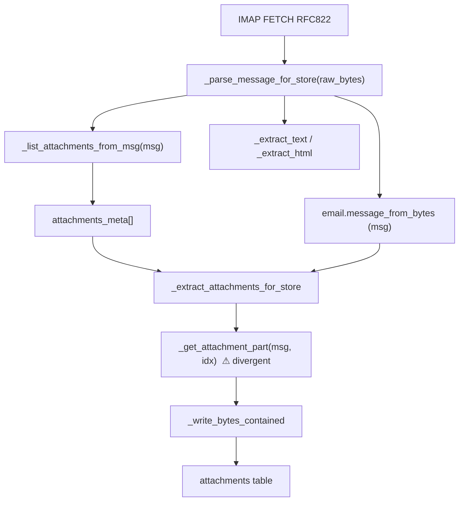
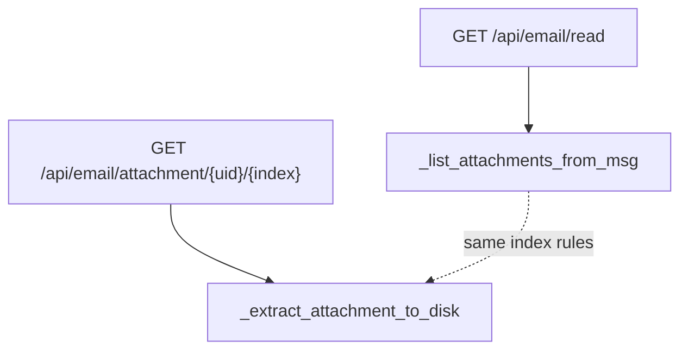

# Phase 0: Attachment indexer unification (local email sync)

**Status:** Implemented (Phase 0+1, 2026-07-01)

**Scope:** `routes/email_local_store.py`, `routes/email_helpers.py`, `tests/test_email_local_store_sync.py`

**Goal:** Make the local sync attachment indexer use the same MIME-part selection rules as the live IMAP reader (`_list_attachments_from_msg` / `_extract_attachment_to_disk`), fix `message/rfc822` drift, and stop decoding attachment payloads twice during sync (prep for Phase 1 parse-once pipeline).

## Implementation notes

| Shipped | Location / behavior |
|---------|---------------------|
| Shared `_iter_attachment_parts` iterator | `routes/email_helpers.py` |
| `_list_attachments_from_msg(..., include_payload=True)` carries decoded payloads | Used by legacy sync path in `_parse_message_for_store` |
| `_extract_attachment_to_disk` uses same iterator | `routes/email_helpers.py` |
| Removed divergent `_get_attachment_part` from local store | `_extract_attachments_for_store` reads `meta["_payload"]` or `attachment_parts` |
| `message/rfc822` attached `.eml` handling aligned with live reader | Via shared iterator rules |
| Tests | `tests/test_email_local_store_sync.py` (rfc822, parity, single-decode) |

| Deferred | Notes |
|----------|-------|
| `email_routes.py` `_attachment_bytes_from_msg` dedupe | Optional hygiene; still a local duplicate |
| `mcp_servers/email_server.py` older attachment loop | Separate cleanup track |

The sections below describe the original problem analysis and design.

---

## Problem summary

The local store sync path parses each fetched RFC822 message twice for attachments:

1. **List pass** — `_parse_message_for_store` → `_list_attachments_from_msg(msg)` walks the tree, decodes payloads for size metadata, and sets `has_attachments`.
2. **Extract pass** — `_extract_attachments_for_store` → `_get_attachment_part(msg, idx)` walks the tree again and decodes payloads a second time.

These two passes do **not** share the same part-selection rules. `_get_attachment_part` is a forked implementation in `email_local_store.py` that diverges from the canonical helpers. The worst failure mode is `message/rfc822` (attached `.eml` files): metadata lists the attachment, but extraction returns `no_payload` or picks the wrong part.

---

## Current data flow



**Live reader path (correct reference):**



---

## Root cause: rule drift

### Side-by-side comparison

| Rule | `_list_attachments_from_msg` (`email_helpers.py`) | `_get_attachment_part` (`email_local_store.py`) |
|------|---------------------------------------------------|---------------------------------------------------|
| Multipart container parts | Skip **unless** `message/rfc822` with `attachment` in CD or filename | **Always skip** `part.is_multipart()` |
| `text/plain` / `text/html` | Skip unless `attachment` in Content-Disposition | Same |
| `message/rfc822` payload | `get_payload(decode=True)`; fallback `part.as_bytes()` | `get_payload(decode=True)` only |
| `message/rfc822` filename | Append `.eml` when no extension | Use `ct.split("/")[-1]` → often `rfc822` |
| Generated filename ext | `eml` for rfc822 | `rfc822` or `bin` |
| `is_inline` | Recorded in metadata | Ignored (metadata preserved from list pass) |
| Index assignment | Sequential over filtered parts | Sequential over **different** filtered set |

### Concrete failure: attached `.eml`

A forwarded message often looks like:

```
multipart/mixed
  ├─ text/plain          (body)
  └─ message/rfc822      Content-Disposition: attachment; filename="Forwarded message"
       └─ (nested message parts — part.is_multipart() == True)
```

**List pass:** `is_attached_email` is true → the `message/rfc822` part is counted at index 1. Size comes from `as_bytes()` when `decode=True` returns `None`.

**Extract pass:** `part.is_multipart()` → `continue` → index 1 never matches the rfc822 part. Extraction either fails (`no_payload`) or returns a different part (e.g. a later non-multipart attachment), causing index drift for all following attachments.

### Secondary filename drift

Even when payload extraction accidentally succeeds, stored filenames can differ from the UI:

- List: `Forwarded message.eml`
- Extract: `attachment_1.rfc822` or `1_Forwarded message` (no `.eml`)

Local store then writes `{idx}_{safe_name}` using `part_name` from `_get_attachment_part`, which can override the correct metadata filename.

---

## Design: single attachment iterator

Introduce one canonical iterator in `email_helpers.py` and route all attachment indexing through it.

### Proposed API

```python
# routes/email_helpers.py

def _iter_attachment_parts(msg):
    """Yield (index, part, filename, payload_bytes) for each logical attachment.

    Rules (must match reader UI and download endpoints):
    - Skip multipart containers unless message/rfc822 attached email.
    - Skip text/plain and text/html unless Content-Disposition contains attachment.
    - Decode filename via _decode_header; append .eml for rfc822 without extension.
    - Resolve payload: get_payload(decode=True), then as_bytes() for rfc822.
    """
    ...
```

### Refactor targets

| Function | Change |
|----------|--------|
| `_list_attachments_from_msg` | Build metadata by iterating `_iter_attachment_parts`; **do not** call `get_payload` outside the iterator |
| `_extract_attachment_to_disk` | Find `index` via `_iter_attachment_parts`; write payload from yielded bytes |
| `_get_attachment_part` | **Delete** from `email_local_store.py` |
| `_extract_attachments_for_store` | Consume payload from listing pass (see below); no second walk |

### Payload carry-forward (double-decode fix)

Extend the sync-only listing path to retain decoded bytes once:

```python
# Internal shape during sync (not persisted to SQLite):
attachments_meta = [
    {
        "index": 0,
        "filename": "file.bin",
        "content_type": "application/octet-stream",
        "size": 100,
        "is_inline": False,
        "_payload": b"...",   # optional, sync-internal
    },
]
```

**Option A (recommended):** Add `_list_attachments_from_msg(msg, *, include_payload: bool = False)`. Default `False` preserves current public behavior for routes and MCP. Sync calls with `include_payload=True`.

**Option B:** Separate `_list_attachments_with_payload_from_msg` used only by `_parse_message_for_store`. Avoids a boolean on the hot public helper.

Either way, `_extract_attachments_for_store` uses `meta["_payload"]` when present and only falls back to `_iter_attachment_parts` lookup if missing (defensive, for direct callers in tests).

### Local-store write path stays hardened

Keep sync-specific concerns in `email_local_store.py`:

- `_safe_stored_attachment_name(idx, filename)` — Windows reserved names, `..`, etc.
- `_write_bytes_contained` — `O_NOFOLLOW`, path containment checks
- Budget / size gates (`max_attachment_bytes`, `attachment_budget_bytes`, `skipped_reason`)

Do **not** delegate disk writes to `_extract_attachment_to_disk`; only unify **which part** and **which bytes**.

---

## Implementation steps

### Step 1 — Add `_iter_attachment_parts` in `email_helpers.py`

1. Extract the loop body currently duplicated in `_list_attachments_from_msg` (lines 1254–1288) and `_extract_attachment_to_disk` (lines 1318–1351).
2. Centralize:
   - `is_attached_email` check
   - body-part skip (`text/plain`, `text/html`)
   - filename normalization (decode, `.eml` suffix, generated names)
   - payload resolution (`decode=True` → `as_bytes()` for rfc822)
3. Yield `(idx, part, filename, payload_or_empty_bytes)`.

**Acceptance:** Iterator unit-tested in isolation with synthetic `email.message` trees (plain attachment, inline image, attached rfc822, nested multipart forward).

### Step 2 — Refactor `_list_attachments_from_msg`

1. Replace inline loop with `_iter_attachment_parts`.
2. Add `include_payload: bool = False` (or companion function per Option A/B above).
3. When `include_payload=True`, set `meta["_payload"] = payload` (document as sync-internal; strip before any API serialization if needed).

**Acceptance:** Existing reader behavior unchanged when `include_payload=False`. No new keys in API responses.

### Step 3 — Refactor `_extract_attachment_to_disk`

1. Replace inline loop with `_iter_attachment_parts`.
2. Match by `idx == index`; write yielded payload.
3. Keep existing filename sanitization (`re.sub(r"[^\w\s\-.]", "_", ...)`) and `open(..., "wb")` behavior.

**Acceptance:** Download / attachment-as-doc routes still work; no change to on-demand extract dir layout.

### Step 4 — Wire sync path to unified indexer

In `email_local_store.py`:

1. **`_parse_message_for_store`:** Call `_list_attachments_from_msg(msg, include_payload=True)` (or equivalent).
2. **`_extract_attachments_for_store`:**
   - Remove `_get_attachment_part` import/call.
   - For each `meta`, use `payload = meta.get("_payload")`.
   - If `payload` is empty/None, log warning and set `skipped_reason="no_payload"` (should not happen after unification).
   - Use `meta["filename"]` for `_safe_stored_attachment_name` (not a re-derived `part_name`).
3. **Delete `_get_attachment_part`** entirely.

**Acceptance:** `test_attachment_written_and_oversized_skipped`, `test_upsert_message_unlinks_old_attachment_on_update`, `test_dotdot_attachment_name_rejected` still pass without modification.

### Step 5 — Add regression tests for rfc822 and index parity

New tests in `tests/test_email_local_store_sync.py` (see Test plan below).

### Step 6 — Optional hygiene (same PR or immediate follow-up)

- `email_routes.py` inline `_attachment_bytes_from_msg` (lines 1836–1857) duplicates the same loop for attachment-as-doc on `.eml`. Refactor to `_iter_attachment_parts` or a thin `_get_attachment_bytes_at_index(msg, index)` wrapper to prevent a fourth fork.
- `mcp_servers/email_server.py` has an older copy without rfc822 handling (lines 724–782). Track as separate cleanup; not blocking Phase 0.

---

## Test plan

### New tests (`tests/test_email_local_store_sync.py`)

#### `test_rfc822_attachment_listed_and_extracted`

Build a multipart message:

```python
outer = MIMEMultipart()
outer.attach(MIMEText("see attached", "plain"))
inner = MIMEMultipart("alternative")
inner.attach(MIMEText("inner body", "plain"))
inner["Subject"] = "Inner"
inner["From"] = "inner@example.com"
rfc822_part = MIMEMessage(inner)
rfc822_part.add_header("Content-Disposition", "attachment", filename="Forwarded")
outer.attach(rfc822_part)
```

Sync and assert:

- `has_attachments == 1`
- One attachment row: `filename` ends with `.eml`, `content_type == message/rfc822`
- `local_path` exists, file starts with valid RFC822 headers
- `extracted == 1`, `skipped_reason IS NULL`

#### `test_attachment_index_parity_with_helpers`

For a message with **two** attachments (e.g. `file.bin` + attached rfc822):

1. `atts = _list_attachments_from_msg(msg)` (helpers)
2. Sync via `sync_account_folder`
3. For each `att["index"]`, assert DB row `idx` matches and `filename` / `content_type` equal helpers metadata
4. Assert on-disk file size equals `att["size"]`

#### `test_rfc822_no_payload_regression_fixed`

Same fixture as first test but assert `skipped_reason` is **not** `no_payload` (today it would be).

#### `test_sync_uses_single_payload_decode` (lightweight)

Monkeypatch `email.message.Message.get_payload` with a counter wrapper. Sync one message with one attachment. Assert `get_payload(decode=True)` call count for attachment parts is **1**, not 2. (Exact count may include body extraction; scope assertion to attachment part or use a message with no text body in a separate part.)

### Existing tests — must remain green

| Test | Why it matters |
|------|----------------|
| `test_attachment_written_and_oversized_skipped` | Size gates still work with carried payload |
| `test_upsert_message_unlinks_old_attachment_on_update` | Re-sync replacement path |
| `test_dotdot_attachment_name_rejected` | `_safe_stored_attachment_name` still applied |
| `test_purge_unlinks_attachment_files` | File lifecycle unchanged |

### Helpers-level tests (new file or `tests/test_email_attachment_index.py`)

- Iterator yields correct count for: plain only, multipart + PDF, inline PNG, attached eml, TNEF-free mixed
- `_extract_attachment_to_disk` and `_list_attachments_from_msg` agree on index for each fixture

---

## Phase 1 prep notes (out of scope for Phase 0)

Phase 0 stops double **attachment** decode. Phase 1 should extend parse-once to the full message:

| Today (multiple walks) | Phase 1 target |
|------------------------|----------------|
| `email.message_from_bytes` once | Keep |
| `_extract_text` walks | Single walk producing body + attachment meta |
| `_extract_html` walks | Same |
| `_list_attachments_from_msg` walks | Same |
| Header decode | Once |

Phase 0 makes this easier by:

1. Proving `_iter_attachment_parts` can run inside a unified parse walk
2. Establishing `attachments_meta` with optional `_payload` as the handoff contract
3. Removing `_get_attachment_part` as a second indexer

**Do not** merge body extraction in Phase 0; scope creep risk is high.

---

## Risks and mitigations

| Risk | Mitigation |
|------|------------|
| API leaks `_payload` in JSON responses | Strip key in `get_local_email` / route serializers; never INSERT into SQLite |
| Memory pressure on large attachments | Size check in list pass **before** retaining payload; skip `_payload` when `size > max_attachment_bytes` |
| Behavior change for already-synced bad rows | No migration; re-sync or UIDVALIDITY purge fixes. Document that users may need one incremental sync |
| `include_payload` changes helper signature | Default `False`; only sync opts in |
| Filename on disk differs from IMAP extract dir | Expected: sync uses `{idx}_{safe}` prefix; live download uses sanitized original name. UI reads from DB `filename` column |

---

## Files touched (implementation checklist)

| File | Action |
|------|--------|
| `routes/email_helpers.py` | Add `_iter_attachment_parts`; refactor list + extract; optional `include_payload` |
| `routes/email_local_store.py` | Delete `_get_attachment_part`; use payload carry-forward; `include_payload=True` in parse |
| `tests/test_email_local_store_sync.py` | Add rfc822 + parity tests |
| `tests/test_email_attachment_index.py` (new) | Iterator + helper parity fixtures |
| `routes/email_routes.py` | Optional: dedupe inline eml bytes helper |
| `mcp_servers/email_server.py` | Follow-up only |

---

## Acceptance criteria

- [x] `_get_attachment_part` removed; no duplicate attachment iteration logic in `email_local_store.py`
- [x] `_list_attachments_from_msg` and `_extract_attachment_to_disk` share `_iter_attachment_parts`
- [x] Attached `message/rfc822` messages sync with `extracted=1` and `.eml` filename
- [x] Attachment index `N` in SQLite matches index `N` from `_list_attachments_from_msg` for all test fixtures
- [x] Sync decodes each attachment payload at most once (verified by test or documented call path)
- [x] All existing `test_email_local_store_sync.py` tests pass
- [x] No `_payload` persisted in `attachments` table or returned by public APIs

---

## Estimated effort

| Task | Size |
|------|------|
| `_iter_attachment_parts` + helper refactors | S–M |
| Sync path wiring + delete `_get_attachment_part` | S |
| New tests (rfc822, parity, decode count) | M |
| Optional `email_routes` dedupe | S |
| **Total** | **~1–2 days** |

---

## References (current code)

Attachment list (canonical):

```1254:1288:routes/email_helpers.py
    for part in msg.walk():
        if part.is_multipart():
            continue
        cd = str(part.get("Content-Disposition", "")).lower()
        ct = part.get_content_type()
        is_attached_email = ct == "message/rfc822" and ("attachment" in cd.lower() or part.get_filename())
        if part.is_multipart() and not is_attached_email:
            continue
        # ... filename + payload + append to attachments
```

Divergent local-store extractor:

```293:314:routes/email_local_store.py
def _get_attachment_part(msg, index: int):
    ...
    for part in msg.walk():
        if part.is_multipart():
            continue
        ...
        if idx == index:
            ...
            payload = part.get_payload(decode=True)
            return filename, payload
```

Sync double-pass entry points:

```236:237:routes/email_local_store.py
    attachments = _list_attachments_from_msg(msg)
    has_attachments = bool(attachments)
```

```355:356:routes/email_local_store.py
        part_name, payload = _get_attachment_part(msg, idx)
        if not payload:
```
