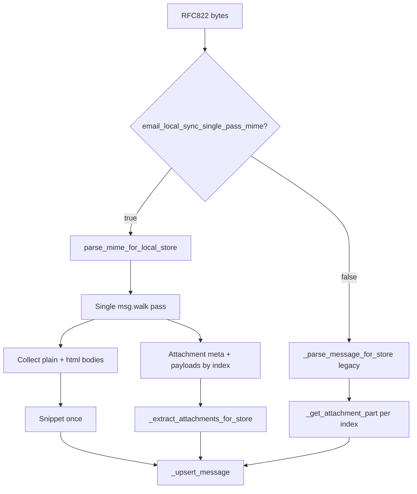

# Phase 1: single-pass MIME parsing for local email sync

**Status:** Implemented (Phase 0+1, 2026-07-01) — feature flag default **off**

Plan for optimizing the local email mirror sync path (`routes/email_local_store.py`) by parsing each RFC822 message once instead of walking the MIME tree multiple times.

## Implementation notes

| Shipped | Location / behavior |
|---------|---------------------|
| `parse_mime_for_local_store` single-pass parser | `routes/email_mime_parse.py` |
| Golden fixture tests | `tests/test_email_mime_parse_golden.py`, `tests/fixtures/email_mime/` |
| Settings flag `email_local_sync_single_pass_mime` (default `False`) | `src/settings.py` |
| Dispatch in `_parse_message_for_store` | `routes/email_local_store.py` |
| `attachment_parts` reuse in `_extract_attachments_for_store` | Skips re-walk when flag on |
| Flag-on parity integration test | `tests/test_email_local_store_sync.py` |

| Deferred | Notes |
|----------|-------|
| Default flag **on** (PR3) | Operators opt in via settings |
| Remove legacy multi-walk branch | Kept while flag defaults off |
| `_get_attachment_part` removal | Already removed in P0 attachments work |
| Per-batch settings cache in `_store_uids` | `load_settings()` per message acceptable for now |
| Performance benchmarking infrastructure | Optional follow-up |
| Broader parser unification with `/read` | Phase 2 |

The sections below describe the original design, rollout sequence, and acceptance criteria.

## Goals

| Goal | Success criterion |
|------|-------------------|
| Single tree walk per synced message | One `msg.walk()` (or equivalent) collects headers, bodies, attachment metadata, and attachment payloads |
| Payload reuse | `_extract_attachments_for_store` never calls `_get_attachment_part` when the single-pass parser already decoded payloads |
| Decode HTML once | HTML-only and `multipart/alternative` messages decode `text/html` once; plain-text fallback and snippet reuse that result |
| Safe rollout | `email_local_sync_single_pass_mime` feature flag defaults off; legacy path unchanged when disabled |
| Regression safety | Golden fixture tests lock behavior against the current sync parser **before** wiring into `_store_uids` |
| Isolate risk | **Do not modify** `routes/email_helpers.py` in the same PR series as this work |

## Non-goals (Phase 1)

- Changing `_extract_text`, `_extract_html`, `_list_attachments_from_msg`, or any other `email_helpers` function used by IMAP read routes, pollers, or AI pipelines
- Unifying sync parsing with the live `/read` path (that is a later phase)
- Removing `_get_attachment_part` entirely (keep as legacy fallback until the flag is default-on and stable)
- Performance benchmarking infrastructure (optional follow-up)
- Parsing RFC822 at FETCH time instead of store time

---

## Current state (pre-implementation baseline)

### Sync hot path

```
_store_uids
  └─ _parse_message_for_store(raw_bytes)
       ├─ email.message_from_bytes
       ├─ header decode (_decode_header, parseaddr, parsedate_to_datetime)
       ├─ _extract_text(msg)              ← walk #1
       ├─ _extract_html(msg)              ← walk #2
       ├─ _list_attachments_from_msg(msg) ← walk #3
       └─ snippet from body_text or tag-stripped body_html
  └─ _extract_attachments_for_store(parsed["msg"], attachments_meta, ...)
       └─ for each meta index:
            _get_attachment_part(msg, idx) ← walk #4 … #4+N
```

Relevant code today:

```221:256:routes/email_local_store.py
def _parse_message_for_store(raw_bytes: bytes) -> dict[str, Any]:
    msg = email.message_from_bytes(raw_bytes)
    ...
    body_text = _extract_text(msg) or ""
    body_html = _extract_html(msg) or ""
    snippet = (body_text or re.sub(r"<[^>]+>", "", body_html or ""))[:_SNIPPET_LEN]
    attachments = _list_attachments_from_msg(msg)
    ...
    return { ..., "attachments_meta": attachments, "msg": msg }
```

```293:314:routes/email_local_store.py
def _get_attachment_part(msg, index: int):
    ...
    for part in msg.walk():
        ...
        if idx == index:
            ...
            payload = part.get_payload(decode=True)
            return filename, payload
```

### Cost model

For a message with *A* attachment parts, the sync path currently performs **3 + A** full `walk()` traversals (4 + A if you count `message_from_bytes` building the tree once). Backfill batches of 200 messages with attachments dominate CPU during initial mirror builds.

### Redundant HTML work

`_extract_text` (in `email_helpers.py`) walks the tree and, when no `text/plain` part exists, converts the first `text/html` part to plain text:

```1373:1393:routes/email_helpers.py
def _extract_text(msg):
    if msg.is_multipart():
        text_parts = []
        for part in msg.walk():
            ...
            elif ct == "text/html" and not text_parts and "attachment" not in cd:
                ...
                raw_html = payload.decode(charset, errors="replace")
                text = re.sub(r"<br\s*/?>", "\n", raw_html, flags=re.I)
                text = re.sub(r"<[^>]+>", "", text)
                text = html.unescape(text)
                text_parts.append(text.strip())
```

`_extract_html` separately walks again and decodes the same HTML payload. The sync store persists **both** `body_text` and `body_html`, so HTML-only mail pays decode + tag-strip twice. Snippet generation may strip tags a third time when `body_text` is empty.

### Attachment indexing contract

Attachment metadata comes from `_list_attachments_from_msg` (`email_helpers.py`). Extraction uses `_get_attachment_part` (`email_local_store.py`). They are **almost** aligned but not identical:

| Case | `_list_attachments_from_msg` | `_get_attachment_part` |
|------|------------------------------|------------------------|
| Skip `text/plain` / `text/html` without `attachment` in CD | Yes | Yes |
| `message/rfc822` nested multipart | Walks into attached `.eml` when CD/filename indicate attachment | Skips all `part.is_multipart()` |
| `message/rfc822` payload | `get_payload(decode=True)` or `part.as_bytes()` fallback | `get_payload(decode=True)` only |
| Filename for attached `.eml` | Adds `.eml` when no extension | No `.eml` suffix logic |

**Phase 1 rule:** the new parser must follow `_list_attachments_from_msg` indexing and filename rules (metadata is authoritative). Payload bytes must match what `_get_attachment_part` returns **today** for the common cases covered by existing sync tests, and match `_list_attachments_from_msg` for `message/rfc822` edge cases (fixing the known divergence).

### Why not change `email_helpers` now

`email_helpers` is shared by:

- FastAPI `/read` and attachment download routes
- Background pollers (`email_pollers.py`)
- AI summarize/reply context (`_extract_attachment_text`, `_fetch_sender_thread_context`)
- MCP mail tooling

A behavior change there affects every mail surface at once. Phase 1 confines new logic to a **sync-only** module and gates it behind a flag.

---

## Target architecture

```
routes/email_mime_parse.py          ← new, sync-only
  parse_mime_for_local_store(raw_bytes) -> ParsedMimeForStore

routes/email_local_store.py         ← wiring only (when flag on)
  _parse_message_for_store          → dispatches to parse_mime_for_local_store
  _extract_attachments_for_store    → uses pre-decoded payloads when present
```



---

## New module: `routes/email_mime_parse.py`

### Public API

```python
@dataclass(frozen=True)
class AttachmentPart:
    index: int
    filename: str
    content_type: str
    size: int
    is_inline: bool
    payload: bytes | None  # decoded bytes; None only when legacy-equivalent would also fail

@dataclass(frozen=True)
class ParsedMimeForStore:
  # Header fields (same keys as _parse_message_for_store dict today)
    message_id: str
    in_reply_to: str
    references_hdr: str
    from_name: str
    from_addr: str
    to_addrs: str
    cc_addrs: str
    subject: str
    date_epoch: float
    date_raw: str
    body_text: str
    body_html: str
    snippet: str
    size: int
    has_attachments: bool
    attachments_meta: list[dict[str, Any]]   # same shape as _list_attachments_from_msg
    attachment_parts: dict[int, AttachmentPart]  # index → payload + filename for extraction

def parse_mime_for_local_store(
    raw_bytes: bytes,
    *,
    snippet_len: int = 300,
) -> ParsedMimeForStore:
    ...
```

Design notes:

- **No `msg` field on the result.** Callers that need the legacy `email.message.Message` keep using the old path when the flag is off. When the flag is on, attachment extraction reads `attachment_parts` instead of re-walking.
- Import **`_decode_header` only** from `email_helpers` (read-only helper; no behavior change to helpers).
- Reimplement body/attachment walk logic **inline** in this module, documented as a behavioral copy of the helpers listed above. Add a module docstring pointing to this plan and the golden fixtures as the contract.
- Keep `_SNIPPET_LEN = 300` in `email_local_store.py`; pass it into `parse_mime_for_local_store` so the constant stays in one place.

### Single-pass walk algorithm

Pseudocode for one `for part in msg.walk()` loop:

```
plain_parts: list[str] = []
html_payload: str | None = None   # first text/html body (decoded)
attachments: list[AttachmentPart] = []
att_idx = 0

for part in msg.walk():
    if part.is_multipart():
        # Mirror _list_attachments_from_msg: only continue past multipart
        # when it is NOT an attached message/rfc822
        if not is_attached_rfc822(part):
            continue

    cd = Content-Disposition lowercased
    ct = content_type

    if ct in (text/plain, text/html) and "attachment" not in cd:
        payload = decode_payload(part)
        if ct == text/plain and payload:
            plain_parts.append(decode_charset(payload, part))
        elif ct == text/html and html_payload is None and payload:
            html_payload = decode_charset(payload, part)
        continue

  # attachment branch — copy rules from _list_attachments_from_msg
    filename = resolve_filename(part, att_idx, ct)
    payload = decode_attachment_payload(part, ct)  # includes rfc822 as_bytes fallback
    size = len(payload) if payload else 0
    attachments.append(AttachmentPart(...))
    att_idx += 1

# Bodies
body_html = html_payload or ""
if plain_parts:
    body_text = "\n".join(plain_parts)
elif html_payload:
    body_text = html_to_plain(html_payload)   # once
else:
    body_text = decode_single_part_non_multipart(msg)  # mirror _extract_text else branch

# Snippet — no third HTML strip when body_text already derived from HTML
if body_text:
    snippet = body_text[:snippet_len]
elif body_html:
    snippet = html_to_plain(body_html)[:snippet_len]
else:
    snippet = ""

has_attachments = bool(attachments)
attachments_meta = [meta dict without payload for each attachment]
attachment_parts = {p.index: p for p in attachments}
```

### `html_to_plain` (sync-local)

Private function in `email_mime_parse.py`, must match `_extract_text` HTML fallback exactly:

```python
def _html_to_plain(raw_html: str) -> str:
    text = re.sub(r"<br\s*/?>", "\n", raw_html, flags=re.I)
    text = re.sub(r"<[^>]+>", "", text)
    return html.unescape(text).strip()
```

Do **not** import or call `_extract_text` inside the hot loop; that would re-walk. A golden test case `"html_only_alternative.eml"` locks byte-for-byte `body_text` parity with the legacy path.

### Header parsing

Reuse the same steps as `_parse_message_for_store` lines 223–232:

- `_decode_header` for Subject, From, To, Cc
- `email.utils.parseaddr` for from name/addr
- `email.utils.parsedate_to_datetime` with UTC assumption for naive datetimes
- `subject or "(no subject)"`
- `size = len(raw_bytes)`

---

## Payload reuse in `_extract_attachments_for_store`

### Extended signature (backward compatible)

```python
def _extract_attachments_for_store(
    msg,                          # legacy; may be None when payloads provided
    attachments_meta: list[dict],
    folder: str,
    uid: int,
    *,
    max_attachment_bytes: int,
    budget_state: dict[str, int],
    attachment_parts: dict[int, AttachmentPart] | None = None,
) -> list[dict[str, Any]]:
```

When `attachment_parts` is not `None`:

1. For each `meta["index"]`, look up `attachment_parts.get(idx)`.
2. Use `part.filename` (fallback `meta["filename"]`) and `part.payload` directly.
3. **Never call `_get_attachment_part`.**
4. Preserve all budget / size / `skipped_reason` / `_write_bytes_contained` behavior unchanged.

When `attachment_parts` is `None` (flag off or tests calling legacy path), keep today's `_get_attachment_part` loop.

### `_parse_message_for_store` dispatch

```python
def _parse_message_for_store(raw_bytes: bytes) -> dict[str, Any]:
    from src.settings import load_settings
    if load_settings().get("email_local_sync_single_pass_mime", False):
        parsed = parse_mime_for_local_store(raw_bytes, snippet_len=_SNIPPET_LEN)
        return {
            **parsed_header_fields_as_dict(parsed),
            "attachments_meta": parsed.attachments_meta,
            "attachment_parts": parsed.attachment_parts,  # new key
            # omit "msg" when single-pass
        }
    # existing legacy implementation unchanged
```

Update `_store_uids`:

```python
parsed = _parse_message_for_store(raw)
attachment_rows = _extract_attachments_for_store(
    parsed.get("msg"),
    parsed.get("attachments_meta") or [],
    folder, uid,
    max_attachment_bytes=max_attachment_bytes,
    budget_state=budget_state,
    attachment_parts=parsed.get("attachment_parts"),
)
```

---

## Feature flag: `email_local_sync_single_pass_mime`

| Property | Value |
|----------|-------|
| Key | `email_local_sync_single_pass_mime` |
| Default | `false` |
| Location | `src/settings.py` → `DEFAULT_SETTINGS` |
| Read site | `_parse_message_for_store` only (not `sync_all`; one choke point) |
| Env override | None in Phase 1 (follow existing `email_local_sync_*` pattern: settings.json only) |

Rollout sequence:

1. Ship module + golden tests with flag default **off** (no production behavior change).
2. Enable in dev/staging `data/settings.json`; run full sync on a real mailbox sample.
3. Flip default to **on** in a follow-up release after one stable cycle.
4. Remove legacy path in Phase 2 (separate plan).

Rollback: set flag to `false`; sync immediately reverts to multi-walk parsing with no schema migration.

---

## Golden fixture tests (before wiring)

### Principle

Build and land **`parse_mime_for_local_store` + fixtures + assertions** in a PR that does **not** change `_store_uids` behavior. Wiring is a second commit or PR after golden tests pass in CI.

### Directory layout

```
tests/fixtures/email_mime/
  README.md                          # how fixtures were produced
  plain_only.eml
  html_only_alternative.eml
  plain_and_html_alternative.eml
  single_attachment.eml
  multiple_attachments_order.eml
  inline_image_skipped.eml
  attached_message_rfc822.eml
  nested_multipart_related.eml
  rfc2047_subject_and_filename.eml
  charset_iso8859_plain.eml
  empty_body.eml
  text_plain_as_attachment.eml
  windows_reserved_filename.eml

tests/fixtures/email_mime/expected/
  plain_only.json
  ...  # one expected JSON per .eml
```

### Expected JSON schema (per fixture)

```json
{
  "body_text": "...",
  "body_html": "...",
  "snippet": "...",
  "subject": "...",
  "from_addr": "...",
  "has_attachments": false,
  "attachments_meta": [
    {"index": 0, "filename": "...", "content_type": "...", "size": 123, "is_inline": false}
  ],
  "attachment_payload_sha256": {"0": "hex..."}
}
```

Store SHA256 of attachment payloads instead of raw bytes in git. Optionally include `attachment_extract_filenames` for extraction tests.

### Test module: `tests/test_email_mime_parse_golden.py`

For each `*.eml` in `tests/fixtures/email_mime/`:

1. **Legacy baseline:** run current `_parse_message_for_store` + per-index `_get_attachment_part` to build baseline dict (test helper only).
2. **New parser:** `parse_mime_for_local_store(raw)`.
3. Assert equality on: `body_text`, `body_html`, `snippet`, header fields, `attachments_meta` (normalize list order by `index`).
4. Assert `attachment_parts[i].payload` SHA256 matches baseline payload hashes.

Additional tests:

- `test_golden_matches_legacy_baseline` — parametrized over all fixtures.
- `test_single_pass_does_not_call_walk_helpers` — monkeypatch `_extract_text`, `_extract_html`, `_list_attachments_from_msg` to raise if called from `parse_mime_for_local_store` (proves isolation).
- `test_extract_attachments_uses_payloads_not_get_attachment_part` — when `attachment_parts` passed, patch `_get_attachment_part` to raise.

### Generating fixtures

1. Hand-author minimal messages with `email.mime.*` (same style as `tests/test_email_local_store_sync.py::_make_message`).
2. For realism, add 1–2 fixtures exported from real mail with PII stripped (document provenance in `README.md`).
3. Generate `expected/*.json` with a one-off script `scripts/gen_email_mime_golden.py` (dev-only; not required in CI). Commit generated JSON so CI is deterministic.

### Coverage map

| Fixture | Exercises |
|---------|-----------|
| `plain_only` | Single-part text, snippet from plain |
| `html_only_alternative` | HTML decode once → body_text via `_html_to_plain` |
| `plain_and_html_alternative` | Both parts; plain wins for body_text |
| `single_attachment` | Index 0 payload reuse |
| `multiple_attachments_order` | Stable index ordering across parts |
| `inline_image_skipped` | Inline image in meta but not confused with body |
| `attached_message_rfc822` | `.eml` extension + `as_bytes` payload |
| `nested_multipart_related` | related + alternative nesting |
| `rfc2047_subject_and_filename` | `_decode_header` on filename/subject |
| `charset_iso8859_plain` | Non-UTF-8 charset decode |
| `empty_body` | No crash; empty snippet |
| `text_plain_as_attachment` | CD `attachment` on text/plain |
| `windows_reserved_filename` | Meta filename preserved; store sanitization stays in `_extract_attachments_for_store` |

---

## Implementation sequence

### PR 1 — parser + golden tests (no wiring)

| Step | Action |
|------|--------|
| 1 | Add `routes/email_mime_parse.py` with `parse_mime_for_local_store` |
| 2 | Add fixtures + `tests/test_email_mime_parse_golden.py` |
| 3 | Add `scripts/gen_email_mime_golden.py` (optional helper) |
| 4 | CI green; **no** changes to `_store_uids` / default settings |

### PR 2 — flag + wiring

| Step | Action |
|------|--------|
| 1 | Add `email_local_sync_single_pass_mime: False` to `DEFAULT_SETTINGS` |
| 2 | Dispatch in `_parse_message_for_store` |
| 3 | Extend `_extract_attachments_for_store` with `attachment_parts` |
| 4 | Add integration test in `tests/test_email_local_store_sync.py`: sync with flag on matches flag off for `_make_message` scenarios |
| 5 | Document flag in this plan file (rollout section) |

### PR 3 — enable by default (later)

- Flip default to `True` after manual validation.
- Consider deleting `_get_attachment_part` when flag removal lands (Phase 2).

---

## Files touched (summary)

| File | PR 1 | PR 2 |
|------|------|------|
| `routes/email_mime_parse.py` | create | — |
| `tests/fixtures/email_mime/**` | create | — |
| `tests/test_email_mime_parse_golden.py` | create | — |
| `routes/email_local_store.py` | — | modify dispatch + extraction |
| `src/settings.py` | — | add flag |
| `tests/test_email_local_store_sync.py` | — | add flag-on parity test |
| `routes/email_helpers.py` | **no touch** | **no touch** |

---

## Acceptance criteria

- [x] All golden fixtures pass: new parser matches legacy baseline on every field stored in SQLite.
- [x] With flag **off**, existing `tests/test_email_local_store_sync.py` unchanged and green.
- [x] With flag **on**, full sync test suite green; attachment files on disk identical to flag off for attachment fixtures.
- [x] Zero calls to legacy `_get_attachment_part` when `attachment_parts` supplied (function removed in P0 attachments).
- [ ] HTML-only fixture: `html.unescape` + tag strip run once for `body_text` (counter monkeypatch — optional).
- [x] No imports added from `email_mime_parse` into `email_helpers`.
- [ ] Default flag on and legacy branch removal — deferred to Phase 2.

---

## Risks and mitigations

| Risk | Mitigation |
|------|------------|
| Subtle MIME rule drift vs helpers | Golden fixtures + legacy baseline generator in tests |
| `message/rfc822` divergence | Explicit fixture; single-pass follows `_list_attachments_from_msg` rules |
| Memory pressure holding all payloads in RAM | Same as today (payloads already decoded per attachment); optional future streaming |
| Settings cache TTL (2s) delays flag flip | Acceptable; document for operators |
| `load_settings()` per message in `_parse_message_for_store` | Cache flag once per `_store_uids` batch in Phase 1.1 if profiling shows overhead |

---

## Phase 2 preview (out of scope)

- Default flag on; remove `_get_attachment_part` and legacy multi-walk branch
- Share a thin `html_to_plain` utility if `email_helpers` gains a sync-safe import path
- Optional: instrument sync logs with `mime_parse_mode: single|legacy` for ops visibility
- Broader parser unification for `/read` (separate risk analysis required)

---

## References

- Sync store: `routes/email_local_store.py` — `_parse_message_for_store`, `_get_attachment_part`, `_extract_attachments_for_store`, `_store_uids`
- Shared helpers (read-only contract): `routes/email_helpers.py` — `_extract_text`, `_extract_html`, `_list_attachments_from_msg`, `_decode_header`
- Existing sync tests: `tests/test_email_local_store_sync.py`
- Settings pattern: `src/settings.py` — `email_local_sync_*` keys
