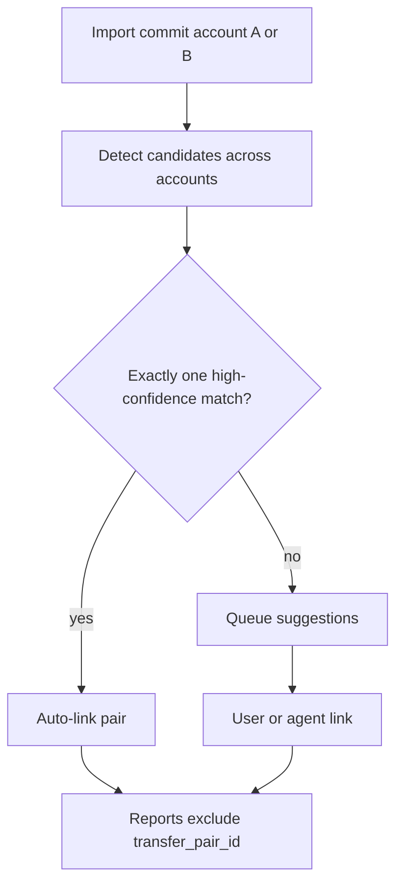

# Feat: Internal transfer detection & linking

**Target repo:** odysseus-finance  
**HomeBank source:** `homebank/src/hb-transaction.c`, `hb-transaction.h`, `hb-import.c`  
**Date:** 2026-07-17  
**Status:** Plan only — do not implement from this chat  
**Effort:** M  
**Priority:** High (blocks trustworthy agent spending answers)

---

## 1. Benefit verdict for the AI finance agent

**Yes — port this.**

### Reasoning

The finance agent’s core job is answering “how much did I spend?” and “am I over budget?” via `manage_finance` → `spending_report` / `budget_status` / `trends`.

Today Odysseus:

- Seeds a **Transfers** category (`integrations/finance/services/categories.py`) but has **no linked pair**, no `is_transfer` flag, and no peer pointer on `FinanceTransaction`.
- `spending_by_category` and `monthly_trends` in `integrations/finance/services/reports.py` sum **all** `amount_cents < 0` (and all `> 0` for income). They do **not** exclude the Transfers category or any linked transfer flag.
- Multi-account CSV/OFX import creates **both legs** of a move (checking outflow + credit-card/payment inflow). Without linking, those outflows inflate spending and inflows can inflate income.

HomeBank solves this with a strong link (`kxfer`), peer account (`kxferacc`), optional multi-currency amount (`xferamount` + `OF_ADVXFER`), and report filters that exclude `OF_INTXFER` by default (`rep-stats.c`, `rep-budget.c`, prefs `stat_includexfer` / `budg_includexfer`).

Banking research already calls this out:

- `docs/research/finance/features/spending-reports.md` — “Respect splits and exclude transfers”
- `docs/research/finance/features/category-budgets.md` — “exclude transfers”
- `docs/research/finance/features/transaction-categorization.md` — “Transfer categories vs linked transfer pairs — use `is_transfer` flag”

**Without this feature, the AI finance agent systematically lies about spending whenever the user imports more than one account.** Category-only “Transfers” is not enough: uncategorized or mis-categorized CC payments still pollute reports, and category membership is weaker than a structural pair link.

---

## 2. Detailed implementation plan

### 2.1 Problem frame

Import-first multi-account finance needs a durable way to mark two register rows as the same money movement so balances stay correct while spending/income aggregates ignore both legs.

### 2.2 Product requirements

| ID | Requirement |
|----|-------------|
| R1 | Two transactions can be linked as an internal transfer (same owner, different accounts). |
| R2 | Linked transfers are excluded from spending, income, and budget “spent” by default. |
| R3 | Detection suggests candidate pairs using date window + opposite amounts (same currency). |
| R4 | Import can auto-link high-confidence unique matches; ambiguous matches go to review / agent proposal. |
| R5 | User and agent can link, unlink, and list transfers. |
| R6 | Unlinking restores normal expense/income treatment; does not delete either row. |
| R7 | Account balances continue to include both legs (transfers move money; they do not erase it). |

### 2.3 Scope boundaries

**In scope**

- Data model for pair identity
- Match heuristics (same-currency first)
- Report/budget exclusion
- API + Finance UI affordances
- Import post-commit / cross-account detect pass
- `manage_finance` tool actions

**Out of scope / defer**

- Full HomeBank “create missing child txn” when only one leg exists (Odysseus is bank-import-first; prefer link-existing)
- Multi-currency advanced xfer (`OF_ADVXFER` / `xferamount` ±10% band) — Phase 2 unless two accounts already differ in currency and users need it immediately
- Syncing payee/memo/status/tags across legs on every edit (HomeBank `transaction_xfer_child_sync`) — keep optional light sync later
- Split-transaction interaction (splits feature not shipped)
- Household sharing of transfer links

### 2.4 Simplify vs HomeBank

| HomeBank | Odysseus choice |
|----------|-----------------|
| `kxfer` integer pair key | Shared `transfer_pair_id` (UUID string) on both legs |
| `kxferacc` peer account key | Derive from peer txn’s `account_id`; optional denormalized `transfer_peer_id` for O(1) UI |
| `xferamount` + `OF_ADVXFER` | Defer; require equal opposite cents when currencies match |
| `OF_INTXFER` flag | `transfer_pair_id IS NOT NULL` (no separate flag needed) |
| Create child if no match | Do **not** invent bank rows; leave unmatched or suggest candidates |
| GTK select-child dialog | Review list in Finance UI + agent `ask_user` / confirmation gate for write actions |
| Import OFX: exact date + opposite amt + same memo, unique only | Same high-confidence auto-link; widen day-gap for fuzzy suggest only |
| Prefs: day gap, include xfer in stats | Config: `transfer_day_gap` (default 3); reports `include_transfers=false` default |
| Memo/payee/cat sync on edit | Link only; set both to Transfers category on link; no ongoing field sync |

### 2.5 Data model

Extend `FinanceTransaction` (`integrations/finance/models.py`):

```text
transfer_pair_id   TEXT NULL   -- shared UUID; both legs have the same value
transfer_peer_id   TEXT NULL   -- other transaction id (denormalized; cleared on unlink)
```

Indexes:

- `(owner, transfer_pair_id)` where not null
- optional `(owner, date, amount_cents)` to speed candidate scans

Migration approach: plugin DB uses `create_all` today (`integrations/finance/database.py`). Add a small `ensure_schema()` alter-if-missing path (or recreate guidance for early plugin installs) so existing `finance.db` files gain columns without wiping data.

On successful link:

1. Allocate one `transfer_pair_id`.
2. Set mutual `transfer_peer_id`.
3. Optionally set both `category_id` to the owner’s Transfers category (idempotent with existing seed).

On unlink: clear `transfer_pair_id` and `transfer_peer_id` on both legs; leave categories as-is (or leave Transfers — product choice; recommend leave category unchanged so history stays readable).

### 2.6 Detection heuristics

Port the spirit of `transaction_xfer_child_might` / `hb_import_gen_xfer_eval`, simplified:

**Hard filters (candidate must pass)**

1. Same `owner`
2. Different `account_id`
3. Neither already linked (`transfer_pair_id` is null)
4. Opposite signs (`amount_cents` product &lt; 0)
5. Same-currency accounts: `abs(a.amount_cents) == abs(b.amount_cents)`
6. Date within ±`transfer_day_gap` days (default **3**; HomeBank uses pref `xfer_daygap`)

**Scoring (for ranked suggestions)**

- Start 100; subtract `|date_delta_days|`
- Subtract small penalties for payee/memo mismatch (normalized casefold compare)
- Prefer exact memo match (OFX-style)

**Auto-link (import / batch detect)**

- Only when **exactly one** candidate scores at/above auto threshold **and** hard filters pass with date delta ≤ 1 day and equal opposite amounts (mirror HomeBank import: unique match only; never auto-link when count &gt; 1)

**Do not auto-link**

- Multiple candidates
- Same-account pairs
- Already-linked either side
- Different currencies (until Phase 2)

### 2.7 Report & budget exclusion

Change `spending_by_category` and `monthly_trends` (and any budget spent calc that reuses them) to:

```text
WHERE transfer_pair_id IS NULL
```

Add optional `include_transfers: bool = False` on report APIs and tool args for power users (HomeBank “Include transfer” toggle).

Do **not** rely on category name `"Transfers"` alone; linked flag is authoritative. Category remains a UX label and a fallback for unlinked manual CC payments until the user links them.

### 2.8 API

Under `/api/finance` (`integrations/finance/routes.py`):

| Method | Path | Purpose |
|--------|------|---------|
| GET | `/transfers/candidates?tx_id=&day_gap=` | Ranked unmatched peers for one txn |
| POST | `/transfers/detect` | Body: `{ account_ids?, from?, to?, auto_link?: bool }` → `{ suggestions[], auto_linked[] }` |
| POST | `/transfers/link` | `{ tx_id_a, tx_id_b }` |
| POST | `/transfers/unlink` | `{ tx_id }` or `{ transfer_pair_id }` |
| GET | `/transactions` | Include `transfer_pair_id`, `transfer_peer_id`, `is_transfer` in `_transaction_dict` |
| GET | `/reports/spending` | Query `include_transfers=false` |

Validation: owner scope, different accounts, opposite amounts (same currency), neither already linked (or already linked to each other → idempotent success).

### 2.9 UI (`integrations/finance/static/js/index.js`)

MVP:

- Transaction list: badge “Transfer” + peer account name when linked
- Row action: Link… (opens candidate picker) / Unlink
- Import commit success: if detect found auto-links or suggestions, show “Linked N transfers; M need review”
- Reports/Budgets: copy note “Transfers excluded”; optional checkbox to include

Polish:

- Dedicated “Transfer review” strip of ambiguous suggestions
- Filter: Transfers only / Exclude transfers

### 2.10 Import integration

`integrations/finance/services/import_service.py`:

1. Keep per-account dedup as today.
2. After commit of a batch, run `detect_transfers` across **all open accounts** for the owner (or date range of imported rows ± day gap).
3. Auto-link unique high-confidence pairs.
4. Return suggestion counts in commit response for UI.

Do not require both files in one upload; cross-account detect after the second account import is the common path.

### 2.11 High-level flow



### 2.12 Implementation phases

| Phase | Deliverable |
|-------|-------------|
| **P0** | Schema columns + link/unlink service + report exclusion + tests |
| **P1** | Detect/candidates API + import post-pass + UI badge/actions |
| **P2** | Agent tool actions + confirmation gate for link/unlink + tool schema/docs |
| **P3** | Ambiguous review UI; optional multi-currency; field sync prefs |

### 2.13 Implementation units

#### U1. Schema + transfer link service

- **Goal:** Persist pair identity; link/unlink with validation.
- **Files:** `integrations/finance/models.py`, `integrations/finance/database.py`, `integrations/finance/services/transfers.py` (new), `tests/test_finance_transfers.py` (new)
- **Approach:** Pure service functions taking SQLAlchemy session; no UI.
- **Test scenarios:**
  - Link two opposite equal amounts on different accounts → shared pair id, mutual peers
  - Reject same account / same sign / already linked / wrong owner
  - Unlink clears both sides; balances unchanged (sum of amounts still includes both)
  - Idempotent re-link of already-paired peers

#### U2. Report & budget exclusion

- **Goal:** Default aggregates ignore linked transfers.
- **Files:** `integrations/finance/services/reports.py`, `integrations/finance/routes.py`, tests for reports
- **Test scenarios:**
  - Linked −$500 / +$500 pair excluded from spending and income for the month
  - Unlinked −$500 still counts as spending
  - `include_transfers=true` restores old behavior

#### U3. Detection heuristics

- **Goal:** Candidate ranking + unique auto-link.
- **Files:** `integrations/finance/services/transfers.py`, tests
- **Test scenarios:**
  - Exact opposite same day → auto-link when unique
  - Two possible peers → suggestions only, no auto-link
  - Outside day gap → no match
  - Already linked txn ignored as peer

#### U4. HTTP API + import hook

- **Goal:** Expose detect/link/unlink; run detect after import commit.
- **Files:** `integrations/finance/routes.py`, `integrations/finance/services/import_service.py`, API tests
- **Test scenarios:**
  - POST link/unlink owner-scoped
  - Import second account then auto-link unique CC payment pair
  - Commit response includes `transfers_auto_linked` / `transfers_suggestions`

#### U5. Finance UI

- **Goal:** Visible transfer state and manual link/unlink.
- **Files:** `integrations/finance/static/js/index.js`
- **Verification:** Manual smoke — badge, link picker, reports note

#### U6. Agent tools

- **Goal:** AI can detect/link/unlink and trust spending numbers.
- **Files:** `src/tools/finance.py`, `src/tool_schemas.py`, `src/tool_index.py`, `integrations/finance/confirmation_gate.py`, tests
- **Approach:** Extend `manage_finance` actions; gate write actions like `create_category`.
- **Test scenarios:**
  - `spending_report` excludes transfers without extra args
  - `detect_transfers` returns suggestions JSON/text
  - `link_transfers` requires confirmation token; unlinks too

### 2.14 File touch list

| Path | Change |
|------|--------|
| `integrations/finance/models.py` | Columns |
| `integrations/finance/database.py` | Schema ensure / migrate |
| `integrations/finance/services/transfers.py` | **New** detect/link/unlink |
| `integrations/finance/services/reports.py` | Exclude transfers |
| `integrations/finance/services/import_service.py` | Post-commit detect |
| `integrations/finance/routes.py` | Endpoints + response fields |
| `integrations/finance/static/js/index.js` | UI |
| `integrations/finance/confirmation_gate.py` | Gate link/unlink |
| `src/tools/finance.py` | Actions |
| `src/tool_schemas.py` / `src/tool_index.py` | Docs for agent |
| `integrations/finance/README.md` | Brief behavior note |
| `docs/research/finance/features/internal-transfer-linking.md` | Optional research mirror |
| `tests/test_finance_transfers.py` | **New** |

### 2.15 Patterns to follow

- Owner scoping like existing finance routes
- Confirmation gate pattern from `create_category` in `src/tools/finance.py`
- Plugin isolation: all persistence in `data/plugins/finance/finance.db`
- Cents integers (no float amounts) — unlike HomeBank `gdouble`

---

## 3. AI tool access design

### 3.1 New / extended `manage_finance` actions

| Action | Read/Write | Behavior |
|--------|------------|----------|
| `detect_transfers` | Read (+ optional auto) | Rank suggestions; `auto_link=true` only for unique high-confidence (still recommend confirmation for auto in agent path) |
| `link_transfers` | Write (gated) | Args: `tx_id_a`, `tx_id_b` (8-char prefixes OK like other finance refs) |
| `unlink_transfer` | Write (gated) | Args: `tx_id` |
| `list_transactions` | Read | Add `is_transfer` / peer hint in lines; filter `transfers_only` / `exclude_transfers` |
| `spending_report` / `budget_status` / `trends` | Read | Exclude linked transfers by default; `include_transfers=true` opt-in |

### 3.2 How reports exclude transfers

Authoritative filter: `FinanceTransaction.transfer_pair_id IS NULL`.

Category “Transfers” is secondary: useful for display and for **unlinked** payment rows the user tagged manually, but reports must not depend on name matching. Once linked, both legs drop out of spending/income regardless of category.

### 3.3 Confirmation policy

- **Detect / list / spending:** no gate
- **Link / unlink / auto_link apply:** confirmation gate (mutates classification of money; wrong link hides real spending)

Mirror `create_category`: agent proposes via `ask_user` confirmation block, then calls with `confirmation_token`.

### 3.4 Example agent workflows

**A. Monthly spend question (happy path after links exist)**

1. User: “How much did I spend in June?”
2. Agent: `manage_finance` `spending_report` `month=2026-06`
3. Engine excludes linked transfer legs → groceries/dining totals are trustworthy

**B. Post dual-account import cleanup**

1. User imports checking, then credit card
2. Agent (or UI): `detect_transfers`
3. Agent shows: “Found unique $1,200 pair Checking↔Visa on Jun 3 — link?”
4. After confirm: `link_transfers`
5. Re-run `spending_report` — spending drops by $1,200

**C. Ambiguous matches**

1. `detect_transfers` returns two $500 candidates on the same day
2. Agent does **not** auto-link; asks user which peer (or neither)
3. User picks → `link_transfers`

**D. Mistake recovery**

1. User: “That wasn’t a transfer”
2. Agent: `unlink_transfer` (gated) → spending reports include the outflow again

**E. Debugging double-count**

1. User: “Why is dining so high?”
2. Agent: `list_transactions` month filter + look for large outflows with `is_transfer=false` that look like payments
3. Agent runs `detect_transfers` focused on that txn id

---

## 4. Risks & open questions

### Risks

| Risk | Mitigation |
|------|------------|
| False auto-link hides real spending | Auto-link only unique + tight date; agent/UI confirm for fuzzy; easy unlink |
| Existing DBs lack columns | `ensure_schema` ALTER; document one-time upgrade |
| Users only use Transfers category, never link | Reports still wrong for unlinked; detect prompts after import; agent workflow B |
| Credit card “payment” vs purchase | Heuristic is amount/date/account only; payee text helps score but user confirm on ambiguity |
| Double exclusion if we also filter category name | Prefer pair-id only for exclusion to avoid dropping unlinked miscategorized spend incorrectly — **decision: exclude by `transfer_pair_id` only**; optionally also exclude category Transfers in a later polish if product wants category-as-intent |

### Open questions

1. **Should linking force both categories to Transfers?** (Recommended: yes on link)
2. **Default day gap: 3 vs HomeBank default?** Confirm pref default from HomeBank prefs init if product wants parity.
3. **Unlink category behavior:** leave Transfers vs restore previous category (no history today → leave as-is)
4. **Phase 2 multi-currency:** needed when `FinanceAccount.currency` differs across accounts?
5. **Exclude unlinked rows in category Transfers from reports?** Conservative default: no (only linked). Aggressive: yes. Recommend **linked-only** for P0 to avoid hiding real “Transfers” miscategorization bugs.
6. **Should detect run automatically on every import commit or only when ≥2 accounts exist?**

### Assumptions (planning-time)

- Same-currency equal-cents is enough for MVP.
- Do not create synthetic opposite legs.
- Account balances always include both legs.
- Plugin remains optional; tools already no-op with install message when inactive.

---

## 5. Effort & priority

| Dimension | Rating |
|-----------|--------|
| **Effort** | **M** (P0–P2 roughly 3–5 focused days; P3 polish separate) |
| **Priority** | **High** — prerequisite for trustworthy multi-account AI answers; research docs already depend on “exclude transfers” |
| **Depends on** | Existing accounts + import + categories (shipped) |
| **Unlocks** | Honest spending reports, budgets, trends, agent finance Q&A |

If forced to cut: ship **U1+U2** first (manual link + report exclusion), then detect/import, then agent tools.

---

## Sources & research

- HomeBank: `src/hb-transaction.h` (`kxfer`, `kxferacc`, `xferamount`, `OF_INTXFER`, `OF_ADVXFER`)
- HomeBank: `src/hb-transaction.c` (`transaction_xfer_child_might`, `transaction_xfer_change_to_child`, `transaction_xfer_search_or_add_child`)
- HomeBank: `src/hb-import.c` (`hb_import_gen_xfer_eval` — unique OFX match)
- HomeBank: `src/rep-stats.c` / prefs — exclude int xfer from stats by default
- Odysseus: `integrations/finance/models.py`, `services/reports.py`, `services/categories.py`, `services/import_service.py`, `src/tools/finance.py`
- Odysseus research: `docs/research/finance/features/{spending-reports,category-budgets,transaction-categorization,import-dedup-review}.md`
