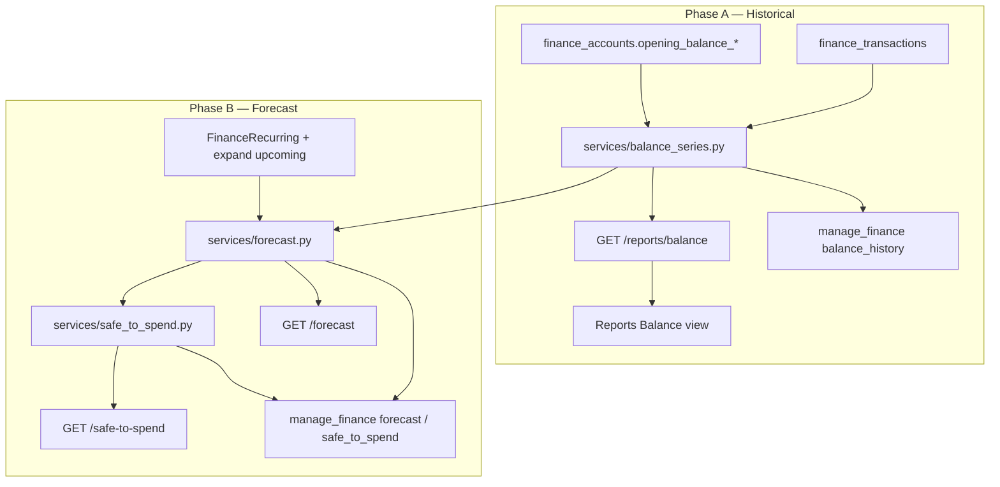

# feat: Balance-over-time & cash-flow forecast

**Target repo:** odysseus-finance  
**Product Contract preservation:** Bootstrap from docs/research/finance + HomeBank balance/forecast engines; no prior unified Product Contract for this feature.

---

## Goal Capsule

Ship historical running-balance series (HomeBank Balance report parity) and forward cash-flow projection (HomeBank Stats/Hub forecast + docs/research/finance forecast) so users and the AI agent can answer "how did my balance move?", "will I overdraft before payday?", and "how much is safe to spend?"

**Authority:** This plan > `docs/research/finance/features/cash-flow-forecasting.md` and `safe-to-spend.md` for implementation shape. HomeBank is parity reference, not a line-by-line port.

**Stop when:** Historical balance series API + Reports UI + agent actions work end-to-end; forecast + safe-to-spend ship after recurring bills land (Phase B), with tests covering both historical and projected paths.

---

## Benefit verdict (AI finance agent)

**Yes — port this feature.**

Reasoning:

1. **Agent blind spot today.** `manage_finance` exposes point-in-time balances (`list_accounts`), income/spending trends (`trends`), and category spend (`spending_report`). It cannot answer "was my checking balance dropping all month?", "will rent push me negative next week?", or "how much can I safely spend until payday?" Those are high-frequency finance questions for an AI finance agent.
2. **Historical series is unblocked now.** Balance-over-time is pure ledger math: `opening_balance_cents + cumulative Σ(amount_cents)` by interval. No new tables required. HomeBank's `rep-balance.c` proves the algorithm; Odysseus already has `account_balance_cents` as the end-of-series special case.
3. **Forecast is the agent differentiator.** Competitors (Monarch, Simplifi, PocketGuard) win on forward-looking answers. docs/research/finance lists cash-flow forecast as Phase 3 item 12 and safe-to-spend as item 14 — both explicitly AI-relevant once recurring exists.
4. **Pairs with the recurring sibling.** [Scheduled recurring bills plan](2026-07-17-001-feat-scheduled-recurring-bills-plan.md) is the hard dependency for projected balances. Shipping historical first still gives agent value immediately; forecast attaches when recurring CRUD + upcoming expansion exist.
5. **Read-only agent surface.** Balance history, forecast, and safe-to-spend are derived reads. They fit the existing ungated `manage_finance` read pattern (no confirmation gates). Low risk, high leverage.

**Verdict nuance:** Do **not** wait for forecast to ship historical balance. Split delivery: Phase A (historical) is independently valuable; Phase B (forecast + safe-to-spend) waits on recurring.

---

## Product Contract

### Problem frame

HomeBank gives users a Balance report (running balance by day/week/month per account) and a separate forecast path (expand scheduled archives into future columns in Stats / Hub Time). Odysseus Finance has only income/spending trend tables — no balance history, no projection, no safe-to-spend.

### Actors

- **A1.** End user (owner-scoped finance data)
- **A2.** AI finance agent via `manage_finance`
- **A3.** Recurring/bills subsystem (Phase B input only)

### Requirements

- **R1.** Historical running-balance series by account(s), date range, and interval (day / week / month minimum; quarter/year optional).
- **R2.** Opening stock = account `opening_balance_cents` + sum of transactions before range start (HomeBank `firstbalance`).
- **R3.** Per-bucket expense / income / ending balance; optional empty-bucket suppression.
- **R4.** Single-account overdraft markers when balance falls below a minimum threshold (use configurable floor; `credit_limit_cents` is the wrong semantic for checking overdraft — see KTD5).
- **R5.** Multi-account transfer handling: when aggregating multiple accounts, exclude internal transfers where both legs are in the selection (after transfer-linking lands; until then document caveat).
- **R6.** Forecast series: start from current balance, apply expanded recurring instances over horizon (30–90 days); mark projected points.
- **R7.** Forecast without schedules still returns flat current-balance series + disclaimer (historical burn optional later).
- **R8.** Safe-to-spend: liquid balance − sum(upcoming bills before next income) with breakdown; depends on recurring + optional income schedules.
- **R9.** Agent can query balance history, forecast, safe-to-spend, and overdraft risk as `manage_finance` actions.
- **R10.** Owner isolation and plugin gate (same as existing finance).

### Key flows

- **F1.** User opens Reports → Balance tab → sees line of checking balance over last 90 days by week.
- **F2.** Agent: "How has my checking balance changed this year?" → `balance_history` → summary of start/end/min/max + optional series.
- **F3.** Agent: "Will I overdraft before payday?" → `forecast` with schedules → first date where `balance_cents < threshold` or "no overdraft in horizon".
- **F4.** Agent: "How much can I spend?" → `safe_to_spend` → amount + breakdown (balance, bills, optional reserves).
- **F5.** User with no recurring bills still gets historical chart; forecast shows current balance flat + "add bills for projection" CTA.

### Acceptance examples

- **AE1.** Account opening $1000, three txns −200 / +50 / −100 on consecutive days → daily series ending balances 800 / 850 / 750.
- **AE2.** Range starting mid-history → opening stock includes pre-range txns; first bucket starts from that stock.
- **AE3.** Forecast with monthly rent due in 10 days → balance dips by rent amount on due date; points after today carry `projected: true`.
- **AE4.** Safe-to-spend with $2000 checking, $1200 rent before payday, no other bills → ~$800 (ignoring optional reserves).
- **AE5.** Agent forecast with `include_schedules: false` returns current-balance-only series without inventing bills.

### Scope boundaries

**In scope (Phase A — historical):** Balance series service, API, Reports UI (table + lightweight chart), agent `balance_history`, overdraft flags, interval helpers.

**In scope (Phase B — forecast):** Forecast service using recurring upcoming expansion, forecast API/UI overlay, agent `forecast` + `safe_to_spend`, low-balance warnings, last-import disclaimer.

**Deferred to follow-up:**

- Discretionary daily burn from 90-day average (`include_discretionary_burn`) — research polish
- What-if hypothetical expenses — research polish
- Persisted `finance_scheduled_items` / `finance_forecast_settings` tables (MVP: compute on read from recurring + optional in-memory settings)
- Net-worth multi-asset history snapshots (`net-worth-dashboard.md`) — related but separate
- CSV Balance-column import as historical ground truth
- Full PocketGuard goal-reserve math (goals feature not shipped)
- HomeBank fortnight / half-year intervals (add if users ask)
- Chart.js dependency unless a tiny SVG/canvas helper proves insufficient

**Outside identity:** Live bank sync; credit-score / investment forecasting; tax projection.

---

## Planning Contract

### Assumptions

- Recurring sibling plan lands before or alongside Phase B; Phase A does not block on it.
- Transfer-linking plan improves multi-account accuracy; Phase A single-account path is correct without it.
- Amounts remain integer cents; dates are calendar dates in account local (date-only, matching existing models).
- No Alembic; new optional settings table uses `create_all` + additive migrate helper if needed.
- Forecast accuracy disclaimer when last import is stale (from latest `finance_import_batches.created_at` or max txn date).

### Key technical decisions

| ID | Decision | Rationale |
|----|----------|-----------|
| **KTD1** | Separate historical vs forecast endpoints/actions | HomeBank keeps them separate (`rep-balance` vs `report_compute_forecast`); avoids mixing posted and synthetic amounts without a `projected` flag |
| **KTD2** | Compute series on read; no balance-snapshot table in MVP | Odysseus volumes are import-scale; HomeBank also computes live. Snapshots only if perf requires later |
| **KTD3** | Reuse recurring upcoming expansion (expand-on-read) for forecast events | Sibling KTD3; avoid dual materialization until polish |
| **KTD4** | Extend `manage_finance` with `balance_history`, `forecast`, `safe_to_spend` | Same pattern as `trends`; keep one finance tool |
| **KTD5** | Add optional `FinanceAccount.minimum_balance_cents` (nullable) for overdraft floor; do **not** reuse `credit_limit_cents` | Credit limit is card ceiling; HomeBank uses account `minimum` for overdraft band |
| **KTD6** | Interval set MVP: `day`, `week`, `month`; map week as ISO week | Covers HomeBank's common cases; quarter/year trivial add-ons |
| **KTD7** | Safe-to-spend MVP = liquid checking/cash balances − upcoming outflows before next income (or 30-day horizon if no income schedule) | Matches `safe-to-spend.md` MVP; goals/budgets optional later |
| **KTD8** | UI: extend Reports tab with Balance + Forecast subviews; table first, simple SVG/canvas line second | Reports today are HTML tables only; avoid heavy chart lib unless needed |
| **KTD9** | Phase A ships without schedules; Phase B gates forecast polish on recurring CRUD + `list_upcoming` | Explicit dependency edge |

### HomeBank parity vs simplify

| HomeBank | Odysseus MVP | Later |
|----------|--------------|-------|
| `rep-balance` intervals day→year | day / week / month | quarter, year, fortnight |
| `firstbalance` + tmp_income/expense + cumulative | Same algorithm in Python | — |
| Include-transfer checkbox (multi-account) | Auto-exclude linked transfers when transfer-linking exists; single-account always includes | Full checkbox UI |
| Overdraft vs account minimum/maximum | `minimum_balance_cents` only | Max / credit ceiling band |
| `transaction_is_balanceable` (skip void/remind) | Skip `status` in (`void`,) if introduced; include `scheduled` in forecast path only | Remind prefs |
| Forecast via `report_compute_forecast` + Archives | Expand `FinanceRecurring` via sibling recurrence engine | Discretionary burn |
| Chart line = running balance column | Same | Dual income/expense overlay |
| "Safe to spend" (not in HomeBank) | PocketGuard-style from docs/research/finance | Goal reserves |

### High-level technical design



**Historical algorithm (directional):**

```
opening = Σ selected accounts.opening_balance_cents
        + Σ amount_cents for txns with date < range_start on those accounts
for each txn in [range_start, range_end] on selected accounts:
    bucket = interval_index(txn.date)
    if amount < 0: expense[bucket] += amount else income[bucket] += amount
balance = opening
for i in buckets:
    balance += expense[i] + income[i]
    emit { label, expense_cents, income_cents, balance_cents, overdraft? }
```

**Forecast algorithm (directional):**

```
start_balance = account_balance_cents(account)   # current
events = expand_upcoming(recurring, horizon)     # from sibling
daily[today] = start_balance
for day in today+1 .. today+horizon:
    daily[day] = daily[day-1]
    apply events due on day (signed amount)
    mark projected
optional: flag first day where balance < minimum_balance_cents
```

---

## Implementation units

### U1. Interval helpers + historical balance series service

**Goal:** Pure functions that compute HomeBank-style running balance buckets from ledger data.  
**Requirements:** R1–R4, AE1–AE2  
**Dependencies:** None  
**Files:**

- Create: `integrations/finance/services/balance_series.py`
- Create: `tests/test_finance_balance_series.py`
- Modify (optional column): `integrations/finance/models.py` — `minimum_balance_cents`
- Modify: `integrations/finance/database.py` — additive column migrate if needed

**Approach:** Port interval positioning for day/week/month. Reuse `account_balance_cents` formula for end-of-all-time check. Exclude void status if present. Single-account overdraft when `balance < minimum_balance_cents`. Multi-account: sum openings + txns; document transfer caveat until linking ships.

**Patterns to follow:** `integrations/finance/services/reports.py` (`monthly_trends` structure); `import_service.account_balance_cents`.

**Test scenarios:**

- Happy: opening + dated txns → correct daily ending balances
- Edge: empty account → flat series at opening
- Edge: range with no in-range txns → constant opening stock across buckets
- Edge: week/month boundaries around month-end
- Edge: overdraft flag when balance dips below minimum
- Error: invalid interval / inverted date range → clear error

**Verification:** Unit tests pass without HTTP; series last point equals `account_balance_cents` when range covers all txns.

---

### U2. Balance history API + agent action

**Goal:** Expose historical series to UI and agent.  
**Requirements:** R1, R9–R10, F2, AE1  
**Dependencies:** U1  
**Files:**

- Modify: `integrations/finance/routes.py` — `GET /api/finance/reports/balance`
- Modify: `src/tools/finance.py` — action `balance_history`
- Modify: `src/tool_schemas.py` — enum + params
- Modify: `src/agent_loop.py` — `_TOOL_EXAMPLES["manage_finance"]`
- Modify: `tests/test_finance_agent_tools.py`
- Create or extend: `tests/test_finance_routes.py` / balance route tests

**Approach:** Query params: `account_id` (optional; default all open), `from`, `to`, `interval` (`day|week|month`), `include_empty` (bool). Response:

```json
{
  "account_ids": ["..."],
  "interval": "week",
  "from": "2026-01-01",
  "to": "2026-07-17",
  "opening_balance_cents": 100000,
  "buckets": [
    {"start": "2026-01-01", "label": "2026-W01", "expense_cents": -5000, "income_cents": 0, "balance_cents": 95000, "overdraft": false}
  ],
  "summary": {"min_cents": 80000, "max_cents": 110000, "end_cents": 95000, "overdraft_bucket_count": 0}
}
```

Agent formats a short natural-language summary (start/end/min/max + overdraft count); include compact series only when `detail: true` or short horizon.

**Test scenarios:**

- Happy: authenticated owner gets series for own account
- Edge: other owner's account_id → 404/empty
- Integration: agent `balance_history` mirrors API numbers
- Error: plugin inactive → install message

**Verification:** Route + agent tests green; plugin gate preserved.

---

### U3. Reports UI — Balance view

**Goal:** User-visible historical balance report.  
**Requirements:** R1, F1  
**Dependencies:** U2  
**Files:**

- Modify: `integrations/finance/static/js/index.js` — `_renderReports` Balance section
- Optional: small SVG helper in same file or `integrations/finance/static/js/charts.js`

**Approach:** Controls: account select, interval, date range presets (30/90/365 days / YTD). Table columns: Interval | Expense | Income | Balance (HomeBank list parity). Optional line chart of `balance_cents`. Show overdraft count in header when single account.

**Patterns to follow:** Existing `_renderReports()` Promise.all + table rendering.

**Test expectation:** none — manual UI smoke; logic covered in U1/U2.

**Verification:** Finance Reports tab shows Balance series for a seeded account.

---

### U4. Forecast service (with and without schedules)

**Goal:** Project daily balances over horizon using current balance ± recurring expansions.  
**Requirements:** R6–R7, F3, F5, AE3, AE5  
**Dependencies:** U1; **Phase B hard dep:** recurring sibling (CRUD + upcoming expansion)  
**Files:**

- Create: `integrations/finance/services/forecast.py`
- Create: `tests/test_finance_forecast.py`
- Read: sibling `integrations/finance/services/recurrence.py` (from recurring plan)

**Approach:**

- `include_schedules=false` → series stays at current balance (or optional future already-posted `scheduled` status txns only).
- `include_schedules=true` → merge upcoming expansions; income positive / expense negative.
- Attach `events[]` for chart markers.
- `first_overdraft_date` when crossing `minimum_balance_cents`.
- Include `last_activity_date` / stale warning metadata.

**Test scenarios:**

- Happy: rent due day 10 → balance drops by rent on that day
- Happy: no recurring → flat series + `schedules_applied: false`
- Edge: multiple bills same day → sum applied once per day
- Edge: income schedule before expense → mid-horizon recovery
- Edge: inactive recurring ignored
- Integration: uses same expansion as Bills upcoming list (no drift)

**Verification:** Forecast end balance equals start + Σ(event amounts) in horizon.

---

### U5. Forecast + safe-to-spend API, agent, UI

**Goal:** Ship Phase B user and agent surfaces.  
**Requirements:** R6–R9, F3–F4, AE3–AE4  
**Dependencies:** U4  
**Files:**

- Modify: `integrations/finance/routes.py` — `GET /forecast`, `GET /forecast/events`, `GET /safe-to-spend`
- Create: `integrations/finance/services/safe_to_spend.py`
- Modify: `src/tools/finance.py`, `src/tool_schemas.py`, `src/agent_loop.py`
- Modify: `integrations/finance/static/js/index.js` — Forecast overlay + safe-to-spend widget
- Modify: `tests/test_finance_agent_tools.py`
- Create: `tests/test_finance_safe_to_spend.py`

**Approach:** Align with research:

- `GET /api/finance/forecast?account_id=&days=30&include_schedules=true`
- `GET /api/finance/safe-to-spend?account_id=` (optional; default liquid accounts)

Safe-to-spend breakdown: `{ balance_cents, bills_cents, income_cents, reserves_cents, amount_cents, next_income_date, horizon_days, stale: bool }`.

Agent actions summarize in dollars with one-line risk ("Overdraft risk on 2026-08-01 after Rent $1,200").

**Test scenarios:**

- Happy: safe-to-spend math matches AE4
- Edge: no liquid accounts → amount 0 + explanation
- Edge: stale import warning when last txn older than N days (config, default 14)
- Integration: agent `forecast` / `safe_to_spend` match API
- Error: plugin inactive

**Verification:** End-to-end agent questions in acceptance examples return coherent numbers.

---

## AI tool access design

### Schema additions (`manage_finance` action enum)

| Action | Aliases | Params | Gated? |
|--------|---------|--------|--------|
| `balance_history` | `balance_series`, `running_balance` | `account_id?`, `from?`, `to?`, `interval?` (`day\|week\|month`), `detail?` | No |
| `forecast` | `cash_flow`, `projection` | `account_id?`, `days?` (1–90, default 30), `include_schedules?` (default true), `detail?` | No |
| `safe_to_spend` | `in_my_pocket`, `spendable` | `account_id?`, `horizon_days?` | No |

Update tool description string to mention balance trends, overdraft risk, and safe-to-spend.

### Response shapes (agent-facing)

**`balance_history` (summary mode):**

```text
Checking (••1234) weekly balance 2026-01-01 → 2026-07-17
Opening: $1,000.00 → Ending: $842.50
Min: $610.00 (2026-03-12) · Max: $1,240.00 (2026-02-01)
Overdraft buckets: 0 / 28
```

With `detail: true`, append compact CSV-like lines or JSON buckets (cap length; prefer summary for long day series).

**`forecast`:**

```json
{
  "account_id": "abc",
  "days": 30,
  "schedules_applied": true,
  "start_balance_cents": 150000,
  "end_balance_cents": 28000,
  "min_balance_cents": -12000,
  "first_overdraft_date": "2026-08-03",
  "events": [
    {"date": "2026-08-01", "name": "Rent", "amount_cents": -120000, "source": "recurring"}
  ],
  "stale": false,
  "last_activity_date": "2026-07-15"
}
```

Agent should lead with risk: overdraft date or "No overdraft expected in 30 days."

**`safe_to_spend`:**

```json
{
  "amount_cents": 80000,
  "breakdown": {
    "balance_cents": 200000,
    "bills_cents": -120000,
    "income_cents": 0,
    "reserves_cents": 0
  },
  "next_income_date": null,
  "horizon_days": 30,
  "stale": false
}
```

### Example agent invocations

```json
{"action": "balance_history", "account_id": "abc123", "interval": "month", "from": "2026-01-01"}
```

```json
{"action": "forecast", "account_id": "abc123", "days": 45, "include_schedules": true}
```

```json
{"action": "safe_to_spend"}
```

```json
{"action": "forecast", "days": 30, "include_schedules": false}
```

### Prompt / routing notes

- Extend `src/tool_index.py` keywords: overdraft, safe to spend, cash flow, projected balance, running balance.
- Keep `app_api` block on `/api/finance/*` — agent must use `manage_finance`.
- Do not invent bills when `include_schedules` is false or recurring plugin data is empty; say so explicitly.

---

## Phased delivery

| Phase | What ships | Depends on | Effort slice |
|-------|------------|------------|--------------|
| **A** | U1–U3 historical balance series | Nothing beyond current ledger | M |
| **B** | U4–U5 forecast + safe-to-spend | Recurring sibling plan (CRUD + upcoming) | M |
| **C** (follow-up) | Discretionary burn, what-if, settings table, richer chart lib, goal reserves | Goals + budgets maturity | S–M |

Recommended sequence relative to siblings:

1. Recurring bills (P1 sibling) — unblocks Phase B  
2. Transfer linking — improves multi-account historical/forecast accuracy  
3. **This feature Phase A** can parallelize with (1)  
4. This feature Phase B after (1)

---

## File touch list (summary)

| Path | Change |
|------|--------|
| `integrations/finance/services/balance_series.py` | **New** — historical series |
| `integrations/finance/services/forecast.py` | **New** — projection |
| `integrations/finance/services/safe_to_spend.py` | **New** — PocketGuard-style metric |
| `integrations/finance/models.py` | `minimum_balance_cents` optional |
| `integrations/finance/database.py` | Additive migrate |
| `integrations/finance/routes.py` | `/reports/balance`, `/forecast`, `/forecast/events`, `/safe-to-spend` |
| `integrations/finance/static/js/index.js` | Reports Balance + Forecast UI |
| `src/tools/finance.py` | New actions |
| `src/tool_schemas.py` | Schema enum/params |
| `src/agent_loop.py` | Examples |
| `src/tool_index.py` | Keywords |
| `tests/test_finance_balance_series.py` | **New** |
| `tests/test_finance_forecast.py` | **New** |
| `tests/test_finance_safe_to_spend.py` | **New** |
| `tests/test_finance_agent_tools.py` | Extend |

HomeBank reference (read-only, not copied): `src/rep-balance.c`, `src/hb-report.c` (`report_compute_forecast`).

---

## Risks & open questions

### Risks

| Risk | Mitigation |
|------|------------|
| Stale imports make forecast/safe-to-spend misleading | Always return `stale` + `last_activity_date`; agent must disclose |
| Multi-account double-count without transfer linking | Prefer single-account default; document; land transfer-linking sibling |
| Forecast vs posted `status=scheduled` double-apply | Define rule: forecast uses recurring expansion OR already-posted scheduled txns in horizon, not both for same `recurring_id`+date |
| Variable bills (utilities) | MVP fixed amount from template; later average-of-last-3 |
| Performance on day interval over years | Cap day series (e.g. max 366 points) or auto-promote interval |
| Credit cards: "balance" semantics inverted for safe-to-spend | Limit liquid set to `account_type in (checking, cash, savings)` for safe-to-spend |

### Open questions

1. **Minimum balance field:** Add `minimum_balance_cents` now (KTD5) or reuse a soft preference until reconcile lands?
2. **Default forecast horizon:** 30 vs 60 days for agent when user omits `days`?
3. **Include already-posted scheduled txns in historical series?** Recommend yes (they are ledger rows); exclude from forecast expansion via lineage.
4. **Should safe-to-spend subtract remaining category budget?** Research optional; default off for MVP to avoid double-counting bills already in recurring.
5. **Persist `finance_forecast_settings`?** Defer until users need discretionary-burn toggles.

---

## Effort & priority

| Dimension | Value | Notes |
|-----------|-------|-------|
| **Effort** | **L** overall (Phase A = **M**, Phase B = **M**) | Matches docs/research/finance forecast **L**; safe-to-spend alone is **S** once recurring exists |
| **Priority** | **P2** | Recurring sibling is **P1** (unblocks forecast). Historical Phase A can start in parallel as P2. Forecast/safe-to-spend rise to P1 once bills ship |
| **AI agent value** | High | Unlocks overdraft risk and spendable-cash answers the agent cannot give today |

---

## Verification Contract

- U1–U2: historical series matches hand-computed fixtures; last point == `account_balance_cents` for full-range queries.
- U3: manual smoke on Reports Balance.
- U4–U5: forecast with known rent schedule; safe-to-spend AE4; agent actions return matching cents; stale flag when appropriate.
- Regression: existing `trends` / `spending_report` / `list_accounts` unchanged.

## Definition of Done

- Phase A merged: balance history API + agent + Reports UI + tests.
- Phase B merged (after recurring): forecast + safe-to-spend API + agent + UI overlay + tests.
- Plan risks documented; open questions either decided in PR or listed as follow-ups.
- No confirmation-gate required for these read actions.

## Sources & Research

- `docs/research/finance/features/cash-flow-forecasting.md`
- `docs/research/finance/features/safe-to-spend.md`
- `docs/research/finance/features/recurring-bills.md`
- `docs/research/finance/00-overview.md` (Phase 2/3 ordering)
- `docs/research/finance/01-feature-inventory.md`
- HomeBank `src/rep-balance.c` (historical), `src/hb-report.c` (`report_compute_forecast`)
- Sibling: `docs/plans/finance/2026-07-17-001-feat-scheduled-recurring-bills-plan.md`
- Related: `docs/plans/finance/2026-07-17-001-feat-internal-transfer-linking-plan.md`
- Code: `integrations/finance/services/reports.py`, `import_service.account_balance_cents`, `src/tools/finance.py`
