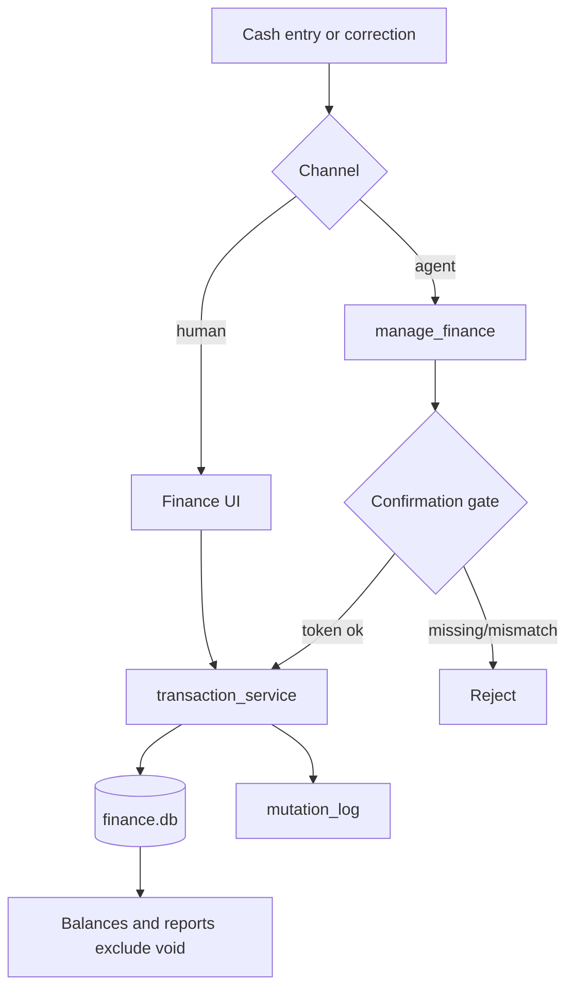

# Feat: Manual transaction CRUD (agent + API)

**Target repo:** odysseus-finance  
**HomeBank source:** `homebank/src/hb-transaction.c`, `hb-transaction.h`, `ui-transaction.c`, `dsp-account.c`  
**Date:** 2026-07-17  
**Status:** Plan only — do not implement from this chat  
**Effort:** M  
**Priority:** High (unlocks cash entries + agent ledger corrections)

**Related plans:** `docs/plans/finance/2026-07-17-001-feat-internal-transfer-linking-plan.md` (transfers — out of this scope), `docs/plans/finance/2026-07-17-001-feat-payee-registry-normalization-plan.md` (payee polish — orthogonal)

---

## 1. Benefit verdict for the AI finance agent

**Yes — port this.**

### Reasoning

The finance agent already answers spending questions and can categorize, set budgets, and create rules. It **cannot** post cash expenses, fix a wrong imported amount/date, or remove a mistaken row. That gap is structural, not a prompt problem.

Today Odysseus (`integrations/finance/`):

- Creates rows only via `POST /import/preview` → `POST /import/commit` (`services/import_service.py`).
- Exposes `PATCH /transactions/{tx_id}` for **metadata only**: `category_id`, `payee`, `memo`, `status` (`TransactionPatch` in `routes.py`). **Not** `amount_cents`, `date`, or `account_id`.
- Has **no** `POST /transactions`, **no** single-row `DELETE`, **no** void semantics. Soft-delete / audit log exist only in research notes.
- Account balance = opening + **sum of all** `amount_cents` with no status filter (`account_balance_cents`).
- Agent `manage_finance` writes: `categorize_transaction`, `set_budget`, `create_rule` (ungated) and gated `create_category` / `create_categories`. Import is UI-only. No create/update-ledger/delete actions.
- Closest “undo” is `DELETE /import/batches/{batch_id}` (hard-deletes every row in the batch).

HomeBank assumes full ledger editing: Add / Inherit / Edit / Delete with transfer pairing, void status excluded from balance, pending import/past flags, and confirmations for delete and break-transfer (`dsp-account.c`, `hb-transaction.c`).

**Without manual CRUD, the agent cannot close the loop on corrections users naturally ask for** (“I paid $40 cash for parking”, “that grocery amount should be $87.32”, “void the duplicate I entered”). Categorize-only keeps Odysseus an import annotator, not a co-pilot ledger.

---

## 2. Detailed implementation plan

### 2.1 Problem frame

Import-first finance still needs a first-class path for cash, adjustments, and corrections. Agent access must be powerful enough to help and gated hard enough that a bad tool call cannot silently rewrite the ledger.

### 2.2 Product requirements

| ID | Requirement |
|----|-------------|
| R1 | User and agent can **create** a manual transaction (account, date, signed `amount_cents`, optional payee/memo/category/status). |
| R2 | User and agent can **update** ledger fields: amount, date, account, payee, memo, category, status (owner-scoped). |
| R3 | **Void** is the default destructive action: row remains; excluded from balances and spending aggregates. |
| R4 | **Hard-delete** is allowed only for manual rows (`import_batch_id IS NULL`) with confirmation; imported rows must void (or batch rollback), not single-row hard-delete in v1. |
| R5 | Agent ledger writes go through the existing confirmation-gate pattern (`require_confirmed_action` + token). |
| R6 | Undo for void = `unvoid` / set status back to `cleared` (gated). Undo for create = void or delete the created id (gated). |
| R7 | Validation: open account, valid date, non-null amount (zero allowed), owned category if set, status enum. |
| R8 | Finance UI can add / edit / void / delete (manual) without leaving the Transactions tab. |

### 2.3 Scope boundaries

**In scope**

- Service layer for create / update / void / unvoid / delete
- Status enum + balance/report exclusion for `void`
- HTTP APIs + Finance panel UI
- `manage_finance` write actions + confirmation gates + schemas/docs
- Dedup hash for manual rows (stable, collision-resistant)
- Light audit: who/when/what on mutations (table or append-only log — see KTD)

**Out of scope / defer**

- Internal transfer create/link (separate plan)
- Split transactions
- HomeBank pending `OF_ISIMPORT` / `OF_ISPAST` approve-reject workflow for manual past-dated safety (optional later: `pending_review` status)
- Reconcile-lock prefs parity (`safe_lock_recon`) — soft rule: agent may not edit `status=reconciled` without explicit force + confirm (v1.1 if needed)
- Payee registry normalization (separate plan)
- Changing import commit path beyond sharing service helpers

### 2.4 Simplify vs HomeBank

| HomeBank | Odysseus choice |
|----------|-----------------|
| Soft trash list until file cleanup (`deltxn_list`) | Prefer **void**; hard-delete only manual rows |
| `TXN_STATUS_VOID` excludes from balance | `status == "void"` excluded in `account_balance_cents` + reports |
| Signed `gdouble` amounts | Integer `amount_cents` (expense negative, income positive) |
| Two-leg transfers on add | **Not in this plan** — single-leg only |
| Dialog sign flip by type (expense/income) | API accepts signed cents; UI uses expense/income control that sets sign |
| Create payee/category inline on save | Reuse existing category create; payee is free string until payee plan lands |
| `OF_ISIMPORT` pending balance exclusion | Import already posts `cleared`; no pending flag for CRUD v1 |

### 2.5 Key technical decisions

| Decision | Choice | Rationale |
|----------|--------|-----------|
| **KTD1 Destructive default** | Void, not hard-delete | Matches HomeBank balance semantics; recoverable; safe for agent mistakes |
| **KTD2 Imported amount/date** | Editable with confirmation | Agent correction is a primary use case; bank file remains in import batch history |
| **KTD3 Manual marker** | `import_batch_id IS NULL` (+ optional `source="manual"` string column) | Avoids inventing a parallel entity; batch rollback stays for import groups |
| **KTD4 Status enum** | Enforce `pending_review \| cleared \| reconciled \| void` on write | Today `status` is free-form; CRUD is the right moment to tighten |
| **KTD5 Agent gates** | Gate create / update_ledger / void / unvoid / delete; leave `categorize_transaction` ungated | Metadata categorize is frequent/low-risk; ledger mutation is high-risk |
| **KTD6 Confirmation payload** | Bind exact fields (account_id, date, amount_cents, tx_id, op) like category name binding | Prevents token replay with different amount/id |
| **KTD7 Dedup for manual** | Hash `account_id\|date\|amount_cents\|normalized_payee\|manual\|uuid` or include id so intentional duplicates allowed | Manual cash duplicates are real; do not block second coffee same day |
| **KTD8 Audit** | Minimal `finance_mutation_log` (owner, tx_id, action, before_json, after_json, actor=`user`\|`agent`, created_at) | Enough for “what did the agent change?” without full event sourcing |
| **KTD9 Transfers** | Out of scope | Sibling transfer-linking plan owns pair identity |

### 2.6 Data model changes

`FinanceTransaction` (`integrations/finance/models.py`):

- Keep existing columns.
- Optional: `source` (`import` \| `manual`) set at create; import path sets `import`, API create sets `manual`.
- No soft-delete column in v1 (void covers recoverability).
- Do **not** add transfer columns here (other plan).

Status writes must validate against the enum. Reads tolerate legacy free-form values until backfill (`NULL`/unknown → treat as `cleared` for balance).

### 2.7 Validation rules

| Field | Rule |
|-------|------|
| `account_id` | Owned, not closed |
| `date` | Valid ISO date; clamp or reject out-of-range if prefs added later |
| `amount_cents` | Integer; zero allowed; no float |
| `category_id` | Null OK; else owned category |
| `payee` / `memo` | Truncate 500 / 1000 (existing PATCH limits) |
| `status` | Enum above |
| Account move | Target owned + open; recompute nothing beyond account filters |
| Delete | Fail if `import_batch_id` set — instruct void or batch rollback |
| Void | Idempotent if already void |

### 2.8 API surface

| Method | Path | Behavior |
|--------|------|----------|
| `POST` | `/api/finance/transactions` | Create manual txn; body: account_id, date, amount_cents, payee?, memo?, category_id?, status? (default `cleared`) |
| `PATCH` | `/api/finance/transactions/{tx_id}` | **Extend** `TransactionPatch`: add optional `amount_cents`, `date`, `account_id`; keep existing metadata fields |
| `POST` | `/api/finance/transactions/{tx_id}/void` | Set status void (idempotent) |
| `POST` | `/api/finance/transactions/{tx_id}/unvoid` | Restore to `cleared` (or prior if logged) |
| `DELETE` | `/api/finance/transactions/{tx_id}` | Hard-delete if manual only; else 409 with guidance |

List endpoint: add `include_void` (default false) and show `source` / `is_manual` in serialization.

### 2.9 Balance & report impact

Update `account_balance_cents` and spending/trends queries to exclude `status == "void"` (and treat unknown legacy as included/`cleared`).

Coordinate with transfer-linking plan: void exclusion is independent of `transfer_pair_id` exclusion; both filters apply when both features ship.

### 2.10 UI (Finance panel)

`integrations/finance/static/js/index.js` Transactions tab:

- **Add transaction** form/dialog: account, date, amount (+ expense/income), payee, memo, category.
- Row actions: Edit (ledger fields), Void / Unvoid, Delete (manual only; confirm).
- Visual: voided rows dimmed or strikethrough; filter toggle “Show voided”.
- Keep category `<select>` PATCH path for quick categorize (no confirm needed in UI).

### 2.11 Audit & safety

```
Agent proposes → ask_user confirmation (payload binds op + fields)
  → user approves → confirmation_token
  → manage_finance write with token
  → gate validates payload ≡ args
  → service mutates + mutation_log row
  → consume_confirmation
```

Safety rules:

1. Never hard-delete imported rows via agent or single DELETE.
2. Confirmation payload must include `amount_cents` and `date` for create/update so a swapped call fails validation.
3. Prefer void over delete in tool descriptions and agent instructions.
4. Cap agent batch: one ledger mutation per confirmation token (no silent multi-edit loops in v1).
5. Optional later: block edits when `status=reconciled` unless `force=true` in confirmed payload.

### 2.12 High-level flow



### 2.13 Implementation phases

| Phase | Deliverable |
|-------|-------------|
| **P0** | Service + status enum + balance/report void exclusion + mutation log + HTTP create/extend-PATCH/void/unvoid/delete + tests |
| **P1** | Finance UI add/edit/void/delete |
| **P2** | Agent actions + confirmation gate validators + tool schema/index/docs + agent tool tests |
| **P3** | Reconcile-lock force flag; `pending_review` for past-dated manual; richer undo of field edits from log |

### 2.14 Implementation units

#### U1. Transaction service + void-aware balances

- **Goal:** Pure create/update/void/unvoid/delete with validation; balances ignore void.
- **Files:** `integrations/finance/services/transactions.py` (new), `integrations/finance/models.py`, `integrations/finance/database.py`, `integrations/finance/services/import_service.py` (balance helper move or shared), `integrations/finance/services/reports.py`, `tests/test_finance_transactions.py` (new)
- **Approach:** All routes/tools call the service; import continue to construct rows but share hash/status helpers where useful.
- **Test scenarios:**
  - Create manual → `import_batch_id` null, appears in balance
  - Void → balance drops by that amount; list default hides void
  - Unvoid → balance restored
  - Delete manual OK; delete imported → error
  - Update amount/date/account owner-scoped; closed account rejected
  - Invalid status rejected

#### U2. Mutation log

- **Goal:** Persist before/after for ledger mutations.
- **Files:** `integrations/finance/models.py`, `integrations/finance/database.py`, service from U1, tests
- **Test scenarios:**
  - Create/update/void each inserts one log row with actor
  - Log does not block mutation if write fails? (Decision: fail closed — mutation and log same transaction)

#### U3. HTTP API

- **Goal:** Expose CRUD endpoints; extend PATCH.
- **Files:** `integrations/finance/routes.py`, `tests/test_finance_routes.py`
- **Test scenarios:**
  - POST create round-trip
  - PATCH amount changes balance
  - POST void / unvoid
  - DELETE imported → 409
  - Cross-owner 404

#### U4. Finance UI

- **Goal:** Human can add/edit/void/delete without agent.
- **Files:** `integrations/finance/static/js/index.js`, CSS if needed
- **Verification:** Manual smoke — cash expense, fix amount, void, delete manual

#### U5. Agent tools + confirmation gates

- **Goal:** Gated ledger writes on `manage_finance`.
- **Files:** `src/tools/finance.py`, `src/tool_schemas.py`, `src/tool_index.py`, `integrations/finance/confirmation_gate.py`, `tests/test_finance_agent_tools.py`, `integrations/finance/README.md`
- **Execution note:** Extend existing gate registration tests first (fail on ungated create), then implement.
- **Test scenarios:**
  - `create_transaction` without token → confirmation challenge / error
  - Token payload amount ≠ args amount → reject
  - Void gated; categorize still ungated
  - Delete imported via agent → error even with token

### 2.15 File touch list

| Path | Change |
|------|--------|
| `integrations/finance/models.py` | Optional `source`; mutation log model; status docs |
| `integrations/finance/database.py` | Schema ensure |
| `integrations/finance/services/transactions.py` | **New** CRUD service |
| `integrations/finance/services/import_service.py` | Share balance helper / void filter |
| `integrations/finance/services/reports.py` | Exclude void |
| `integrations/finance/routes.py` | POST/PATCH extend/void/unvoid/DELETE |
| `integrations/finance/static/js/index.js` | Add/edit/void/delete UI |
| `integrations/finance/confirmation_gate.py` | Register ledger actions + validators |
| `src/tools/finance.py` | New actions |
| `src/tool_schemas.py` / `src/tool_index.py` | Enum + arg docs |
| `integrations/finance/README.md` | Behavior + safety notes |
| `tests/test_finance_transactions.py` | **New** |
| `tests/test_finance_routes.py` | API coverage |
| `tests/test_finance_agent_tools.py` | Gate coverage |

### 2.16 Patterns to follow

- Owner scoping like existing finance routes
- Confirmation gate pattern from `create_category` in `src/tools/finance.py` + `confirmation_gate.py`
- Cents integers; truncate payee/memo like current PATCH
- Id prefix matching for agent refs (same as categorize)
- Plugin DB isolation under `data/plugins/finance/finance.db`

---

## 3. AI tool access design

### 3.1 New / extended `manage_finance` actions

| Action | Read/Write | Gate? | Behavior |
|--------|------------|-------|----------|
| `create_transaction` | Write | **Yes** | Manual row: `account_id`, `date`, `amount_cents` (or `amount_dollars`), `payee?`, `memo?`, `category_id?`, `status?` |
| `update_transaction` | Write | **Yes** | Patch any of amount/date/account/payee/memo/category/status by `transaction_id` |
| `void_transaction` | Write | **Yes** | Set status void |
| `unvoid_transaction` | Write | **Yes** | Restore cleared (or prior from log) |
| `delete_transaction` | Write | **Yes** | Manual only; prefer directing agent to void in schema description |
| `list_transactions` | Read | No | Add `include_void`, show `status` / `is_manual`; still max 50 |
| `categorize_transaction` | Write | No | Unchanged |

### 3.2 Confirmation policy

Mirror `create_category`:

1. Agent calls write action without token → system returns confirmation challenge (via existing gate machinery / `ask_user` flow).
2. Confirmation payload includes: `action`, `transaction_id` (updates/void/delete), `account_id`, `date`, `amount_cents`, and any other mutating fields.
3. Retry with `confirmation_token`; validator rejects field drift.
4. Approve labels: e.g. “Yes, post it”, “Yes, void it”, “Yes, update it”.

**Do not gate:** list/report/budget/categorize.

**Schema description must tell the model:** prefer void over delete; never invent transfers here; use import UI for bank files.

### 3.3 Undo model

| Mistake | Recovery |
|---------|----------|
| Wrong create | `void_transaction` or `delete_transaction` (manual) |
| Wrong void | `unvoid_transaction` |
| Wrong field edit | `update_transaction` with corrected values (log retains previous for human review) |
| Wrong import batch | Existing `DELETE /import/batches/{id}` (not agent in v1 unless separately gated later) |

No automatic time-travel undo button in v1; mutation log is the support surface.

### 3.4 Schema sketch (directional)

Extend `manage_finance` action enum with the five write actions above. Add parameters:

- `date` (YYYY-MM-DD)
- `amount_cents` / `amount_dollars` (mutually documented; service normalizes to cents)
- `payee`, `memo`, `status`
- `account_id`, `transaction_id` (prefixes OK)
- `include_void` (bool) for list
- `confirmation_token` (already present)

### 3.5 Example agent workflows

**A. Cash expense**

1. User: “I spent $12 cash on coffee at Joe’s today from Cash Wallet.”
2. Agent resolves account (list_accounts), then proposes create with amount_cents=-1200.
3. User confirms → `create_transaction` with token.
4. Optional: categorize if category known.

**B. Fix amount**

1. User: “The Target charge on the 12th should be $87.32 not $873.20.”
2. Agent: `list_transactions` search=Target → finds id.
3. Confirms update `amount_cents=-8732`.
4. After token: `update_transaction`.

**C. Void mistake**

1. User: “Void that duplicate parking entry.”
2. Agent finds id → gated `void_transaction`.
3. Spending report and balance exclude it.

**D. Refuse unsafe delete**

1. User: “Delete that Wells Fargo grocery import row.”
2. Agent attempts delete → service error: imported; offer void instead (or batch rollback guidance).

**E. Unvoid**

1. User: “Bring back the parking void — that was real.”
2. Gated `unvoid_transaction`.

---

## 4. Risks & open questions

### Risks

| Risk | Mitigation |
|------|------------|
| Agent rewrites bank truth (amount/date) incorrectly | Confirmation binds amount/date; mutation log; prefer void for removals |
| Hard-delete of imported history | API + agent both reject; docs + schema steer to void/batch rollback |
| Status free-form legacy rows | Read-tolerant; write-enforced enum; treat unknown as cleared for balance |
| Double-count if void not excluded everywhere | Single helper used by balance + reports; tests for both |
| Overlap with transfer-linking edits | This plan forbids creating transfer pairs; document dependency order |
| Confirmation fatigue | Keep categorize ungated; only ledger mutations gated |
| Dedup false-positive blocking cash | Manual hashes must not collide intentional same-day duplicates |

### Open questions

1. **Should PATCH from UI require any confirm, or only agent?** (Recommended: UI confirm only for void/delete; inline edit OK for humans.)
2. **Unvoid restores prior status or always `cleared`?** (Recommended: prior from mutation log if present, else `cleared`.)
3. **Allow agent `delete_transaction` at all, or void-only for agent?** (Recommended: allow delete for manual only; schema strongly prefers void.)
4. **Add `source` column or rely solely on `import_batch_id IS NULL`?** (Recommended: both — explicit `source` is clearer in API/UI.)
5. **Ship mutation log in P0 or defer to P3?** (Recommended: P0 — cheap and safety-critical for agent writes.)
6. **Coordinate report void exclusion with transfer exclusion in one PR or sequential?** (Recommended: void filter first; transfer plan adds pair filter independently.)

### Assumptions (planning-time)

- Single-leg manual entries only; no transfer create in this feature.
- Zero-amount transactions allowed (HomeBank parity).
- Import commit path unchanged except shared void-aware balance helper.
- Plugin remains optional; tools already message when inactive.

---

## 5. Effort & priority

| Dimension | Rating |
|-----------|--------|
| **Effort** | **M** (P0–P2 roughly 3–5 focused days; P3 polish separate) |
| **Priority** | **High** — without it the agent cannot post cash or correct ledger mistakes; import-only ceiling |
| **Depends on** | Existing accounts, categories, confirmation gate, finance routes (shipped) |
| **Unlocks** | Cash/manual ledger, agent corrections, safer void-based cleanup; pairs with transfer-linking for trustworthy totals |

If forced to cut: ship **U1+U3+U5** first (API + gated agent create/void/update), then UI (U4), then richer undo/reconcile lock (P3).

---

## Sources & research

- HomeBank: `src/hb-transaction.h` (status enum, flags), `src/hb-transaction.c` (`transaction_add`, `transaction_remove`, `transaction_is_balanceable`), `src/ui-transaction.c`, `src/dsp-account.c` (delete confirm, reconcile lock)
- Odysseus: `integrations/finance/models.py`, `routes.py` (`TransactionPatch`), `services/import_service.py` (`account_balance_cents`), `confirmation_gate.py`, `src/tools/finance.py`, `src/tool_schemas.py`
- Odysseus UI: `integrations/finance/static/js/index.js` (category-only edit today)
- Related plan: `docs/plans/finance/2026-07-17-001-feat-internal-transfer-linking-plan.md`
- Research: `docs/research/finance/00-overview.md` (manual-import-first), `features/transaction-categorization.md`, `features/account-aggregation.md`
