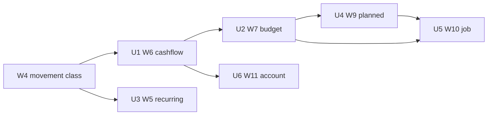

# feat: True-spend cashflow, budget, planned obligations, job overlay, recurring auto-mark, spend-by-account

**Target repo:** odysseus
**Product Contract preservation:** Bootstrap from the 2026-08-15 canvas, addendum, and settled brief. No prior unified Product Contract for this slice.
**Do not implement from this chat.** This file is the HOW. W4 (movement class) is a hard gate for any number labeled true spend.

Directional pseudo-code below is guidance, not copy-paste specification.

---

## Goal Capsule

- **Objective:** Make monthly cashflow and category budgets count true spend and true income. Keep planned future rent/utilities off the posted books. Overlay a labeled hypothetical job paycheck on observed net spend plus planned future amounts. Extend the existing recurring detector with mark-automatic. Show true spend by account as a budget filter.
- **Authority:** This plan > addendum > July 17 sibling plans. Canvas `finance-trustworthy-books` is the product picture. W4 owns movement class; this slice only consumes it.
- **Stop when:** Reports exclude transfer / pass-through / reimbursement (net). Budget spent uses that same true spend. Copy-month and income target work. Planned obligations never enter posted spend. Job overlay uses the formula below and does not write income. Recurring has three distinct states. Spend-by-account is a filter, not an importer. Tests listed in each unit pass.
- **Execution profile:** Test-first on the cashflow helper. UI can exist labeled incomplete before W4. Do not ship unmarked true-spend totals before W4.
- **Tail:** Caller owns commit / PR.

---

## Product Contract

### Summary

Today every positive amount is income and every negative amount is spend. Transfers, Zelle, processor funding, and mom reimbursements poison those totals. Category budgets inherit the lie. Recurring detection upserts `status=active` with no UI and does not mean "this will keep happening." There is nowhere to store future direct rent that stays off the ledger. There is no job-pay scenario.

This slice fixes the report and budget math after W4, then adds planned lines, a clearly labeled job overlay, recurring mark-automatic, and spend-by-account.

### Problem frame

The user needs numbers they can hand-check. Navy Fed business is personal. Navy Fed trip checking is a purpose split of the user's money: funding is a transfer, purchases are Travel. Mom pays rent and utilities today, so housing on the books is $0. Chip-in is optional support, not rent. A job may land soon. Overlay the lowest take-home on observed true spend plus typed future obligations. Do not invent income. Do not import mom.

### Requirements

**Cashflow (W6)**

- R1. Monthly cashflow uses movement class, not amount sign. Income = `movement_class=income`. Spend = `movement_class=spend`. Transfer and pass-through are excluded from both.
- R2. Reimbursement is net, not stacked. Inflows with `movement_class=reimbursement` are not income. They offset personal spend. Outflows with `movement_class=reimbursement` are not spend.
- R3. Personal totals include Navy Fed business. Wells → trip checking is not spend. Trip-checking purchases are Travel spend.
- R4. House sitting remains history on the books when it posted as income. The job overlay does not treat it as ongoing pay.

**Budget (W7)**

- R5. Category `spent_cents` uses the same true-spend definition as R1–R2.
- R6. Copy previous month's category limits (and income target) into another month.
- R7. Income target is a month-level figure. Actual income is true income for that month. It is not a spend limit.
- R8. Categories with a limit and $0 true spend this month still show. Categories with neither spend nor limit stay hidden. Provide an add-limit control so a quiet category can get a limit without waiting for spend.
- R9. Planned amounts never masquerade as posted spend on the Budget tab.

**Recurring (W5)**

- R10. Keep one detector: `integrations/finance/services/recurring.py`. Do not add a second engine.
- R11. Three states stay distinct: (a) detected (`status=active`), (b) marked automatic (`status=automatic`), (c) planned not posted (planned-obligation rows, not series status).
- R12. Mark automatic applies movement class + category to matching posted rows. Detection does not apply them.
- R13. Refuse mark-automatic for Zelle, Venmo cashout, PayPal INST XFER, transfer / pass-through / reimbursement / income series, and mom counterparties classified by W4.

**Planned + job (W9, W10)**

- R14. Planned obligations are user-entered monthly amounts. They never write `FinanceTransaction` rows. They never change posted balance, income, or spend.
- R15. Job-prep planned kinds: future direct rent, future direct utilities, insurance and Verizon only if they move to the user, reimbursement-swap (mom's current share of user-rail bills), savings funding.
- R16. Chip-in is posted Support spend. It is not a planned rent line. Overlay subtracts Support from observed spend and does not add chip-in on top of future rent.
- R17. Job overlay is labeled hypothetical. Input is lowest job take-home. It does not insert income transactions.
- R18. Overlay need = observed true spend (last complete month) − Support/chip-in in that month + sum of overlay planned lines (including savings funding). Surplus = take-home − need.

**Spend-by-account (W11)**

- R19. Spend-by-account is a filter/breakdown of true spend by `account_id`. Not a new importer. Not mom's ledger. Processor funding legs stay out because they are transfer / pass-through.

**Cross-cutting**

- R20. Agent `manage_finance` reads the same helpers as HTTP. Mark-automatic is confirmation-gated. Planned CRUD and job take-home writes are not money-moving; gate only mark-automatic and existing `set_budget`.
- R21. Owner isolation unchanged.

### Actors

- A1. End user in the Finance modal (Budget, Reports, Recurring).
- A2. AI agent via `manage_finance`.
- A3. W4 movement-class service (upstream; this slice does not own it).

### Key flows

- F1. User opens Reports → sees income, true spend, reimbursement offset, net for the month. Wells → trip checking is absent from spend. A Travel purchase on trip checking is present.
- F2. User copies last month's limits → quiet categories with limits appear at $0 spent. Income target copies too.
- F3. User marks Netflix automatic → matching posted rows get spend + Subscriptions. Zelle to mom cannot be marked; UI shows why.
- F4. User types future direct rent $X and lowest take-home $Y → overlay shows need and surplus. Posted spend does not gain a rent row. Chip-in is not added to $X.
- F5. User filters Budget by Wells → true spend that left Wells. PayPal INST XFER on Wells is not in that spend.

### Acceptance examples

- AE1. Month has −$50 grocery (spend), −$200 Wells→trip (transfer), +$1,000 house sitting (income), +$40 mom Zelle for T-Mobile (reimbursement), −$80 T-Mobile (spend). Cashflow: income $1,000, spend $130, reimbursement-in $40, personal spend $90. Trip funding $0 spend.
- AE2. Budget Groceries limit $400, $0 spent this month after copy-month. Groceries still listed. Remaining $400.
- AE3. Three Zelle-to-mom rows detect as `active`. Mark automatic returns 400 with `skip_reason=funding_or_reimbursement`. Status stays `active`.
- AE4. Planned rent $1,200. `GET /reports/trends` spending unchanged. Overlay need includes $1,200. Chip-in $150 in Support is subtracted from observed spend and not added again.
- AE5. Same Travel purchase on Navy Fed trip checking appears in unfiltered true spend and in that account's breakdown. The funding transfer does not.

### Scope boundaries

**In scope**

- True-spend cashflow and budget math.
- Copy month, income target, show budgeted quiet categories.
- Recurring UI + `automatic` status + apply movement/category + skip list.
- Planned obligation table and job-scenario overlay.
- Spend-by-account filter/breakdown.
- Agent parity for the new reads and gated mark-automatic.

**Deferred for later**

- Full cash-flow forecast engine (30–90 day daily balances).
- Safe-to-spend.
- Envelope Ready-to-Assign / assign-every-dollar.
- July 17 scheduled-template CRUD + auto-post into the ledger (`status=scheduled`).
- July 17 multi-dimensional pivot engine (`group_by=payee|year` matrix).
- Recurring upcoming expansion / calendar writeback.
- Cross-month reimbursement matching.
- 3-month average observed spend (v1 is last complete month).
- Pair-linked transfers beyond W4 movement class.

**Outside this product's identity**

- Plaid / live bank APIs.
- Household sharing, joint ledgers, importing mom's accounts.
- A second recurring detector.
- Zelle as its own account.
- Writing fake job income.
- Using chip-in as the rent line.

---

## Planning Contract

### Current behavior (file:line)

This is what ships in v0.1.0. Implementers must change these call sites, not invent parallel ones.

| Behavior | Where | What it does today |
|---|---|---|
| Monthly trends | `integrations/finance/services/reports.py:126-163` | Sums all `amount_cents > 0` as income and all `< 0` as spend. No movement class. No transfer exclusion. No split-parent skip (parent amount is the cash total). |
| Category spend + budget remaining | `integrations/finance/services/reports.py:42-123` | Outflows only (`amount_cents < 0`), splits then unsplit parents. Joins `FinanceCategoryBudget` for the month. Iterates `totals` only, so a limit with $0 spend is omitted. |
| Budget CRUD | `integrations/finance/services/budgets.py:12-42` | Upsert `(owner, month, category_id) → limit_cents`. No copy. No income target. |
| Budget HTTP | `integrations/finance/routes.py:598-624` | `GET /budgets?month=` returns `spending_by_category`. `PUT /budgets` sets one limit. |
| Reports HTTP | `integrations/finance/routes.py:626-652` | `GET /reports/spending` same payload as budgets. `GET /reports/trends`. `GET /reports/net-worth` (balances; not this slice). |
| Recurring detect | `integrations/finance/services/recurring.py:50-116` | Group by `_normalize_payee`, ≥3 txs, amount band ±20% on 2/3, cadence buckets including annual. Upsert `status="active"` or preserve existing status. |
| Recurring list/patch | `integrations/finance/services/recurring.py:119-165` | List refreshes then returns series. Patch allows `active` or `dismissed` only. |
| Recurring HTTP | `integrations/finance/routes.py:119-121, 654-674` | `GET /recurring`, `PATCH /recurring/{id}` with `{status}`. |
| Recurring agent | `src/tools/finance.py:613-641` | `list_recurring` treats `status==active` as "recurring bills" and sums monthly normalized. No mark action. |
| Budget UI | `integrations/finance/static/js/index.js:526-566` | Current calendar month only (`toISOString().slice(0,7)`). Table of this month's outflow categories. Save loops `PUT /budgets`. |
| Reports UI | `integrations/finance/static/js/index.js:568-595` | Category spend table + 6-month income/spend table. No transfer callout. |
| Tabs | `integrations/finance/static/js/index.js:89-96, 597-604` | Transactions, Import, Budget, Reports. No Recurring tab. Toolbar account select does not filter Budget/Reports. |
| Model: budget | `integrations/finance/models.py:115-125` | `finance_category_budgets(owner, month, category_id, limit_cents)`. |
| Model: recurring | `integrations/finance/models.py:128-147` | `finance_recurring_series` unique `(owner, normalized_payee)`. `status` default `active`. No category_id, no movement_class. |
| Model: txn | `integrations/finance/models.py:80-102` | No `movement_class` (W4). `category_id` is a label. `status` default `cleared`. |
| Transfers category | `integrations/finance/services/categories.py:21-34` | Seeded `Transfers` with `is_income=False`. Reports do not special-case it. |
| Agent spend/budget | `src/tools/finance.py:409-437` | `spending_report` and `budget_status` both call `spending_by_category`. |
| Tests | `tests/test_finance_recurring.py` | Detect monthly, preserve dismissed, monthly normalize. No report/budget true-spend tests. `tests/test_finance_routes.py:214-230` covers net-worth only. |

### Assumptions

- W4 adds `movement_class` on `FinanceTransaction` (`spend` \| `income` \| `transfer` \| `pass_through` \| `reimbursement`) and a consumer helper this slice imports. If W4 names the module differently, keep one adapter in `reports.py`.
- Splits inherit the parent's movement class in v1 unless W4 stores class on splits.
- SQLite `create_all` creates new tables. New columns on `finance_recurring_series` need an additive migrate helper next to `_migrate_unique_dedup_index` in `integrations/finance/database.py`.
- Default category `Support` is added for chip-in. Overlay subtracts true spend in that category. If the user leaves chip-in uncategorized, overlay overstates need.
- Last complete calendar month is the overlay observation window. Today 2026-08-15 → 2026-07.
- Reimbursement-swap planned lines are the increment (mom's current share), not the full bill already partly in observed net spend.
- Mom's display name is not hardcoded. Skip uses movement class + funding-rail payee tokens.
- July 17 `FinanceRecurring` template table is not created here. Planned (c) is `finance_planned_obligations`.

### Key technical decisions

- KTD1. Consume W4 movement class; do not exclude by category name `Transfers`. Governs R1, R2, R5. `(session-settled: user-directed — chosen over sign-of-amount and over category-name filters: signed totals include Zelle/funding; a Transfers label is optional and missable.)`
- KTD2. Keep `FinanceCategoryBudget`. Do not migrate to research `finance_budget_periods` / `finance_budget_lines`. Copy-month is a service function over existing rows. Governs R6, R8.
- KTD3. Income target lives on `finance_month_settings(owner, month, income_target_cents)`, not as a budget line on an income category. `spending_by_category` only sees outflows. Governs R7.
- KTD4. Recurring `status=active` stays (a) detected. Add `automatic` for (b). Do not add `planned` to the series enum. Governs R10, R11. `(session-settled: user-directed — chosen over renaming active→detected and over a second detector: existing tests and API use active; addendum forbids a second engine.)`
- KTD5. Planned obligations are their own table. They never auto-post. This constrains July 17 KTD4 for this slice: do not write `status=scheduled` rent into `finance_transactions`. Governs R9, R14.
- KTD6. Job overlay is one row per owner (`finance_job_scenarios`) plus computed read. It does not write transactions. Governs R17. `(session-settled: user-directed — chosen over posting fake income and over treating house sitting as ongoing pay.)`
- KTD7. Overlay formula excludes Support/chip-in and does not add chip-in to future rent. Governs R16, R18. `(session-settled: user-directed — chosen over using chip-in as the housing stand-in and over stacking both.)`
- KTD8. Spend-by-account is `account_id` on the existing budget/report queries plus a breakdown array. Not a new book. Governs R19. `(session-settled: user-directed — chosen over a processor/mom importer.)`
- KTD9. Personal cashflow does not drop Navy Fed business or trip-checking purchases. It drops transfer/pass-through/reimbursement-out. Governs R3. `(session-settled: user-directed — chosen over a separate business book and over treating trip funding as spend.)`
- KTD10. Mark-automatic is confirmation-gated like `categorize_transaction`. Planned CRUD and job take-home are ungated writes (user-typed paper figures). Governs R12, R20.
- KTD11. Agent `list_recurring` copy changes: `active` = detected, not "bills." Only `automatic` series are described as marked bills. Governs R11, R20.

**Rejected alternatives**

| Rejected | Why |
|---|---|
| Second detector / `POST /recurring/detect` engine | Addendum: extend `recurring.py`. |
| `status=planned` on `FinanceRecurringSeries` | (c) is not detected history. Mixes detector upserts with user-entered future rent. |
| Research period+line budget tables | Already have unique `(owner, month, category_id)`. Extra join for no gain. |
| Exclude `Transfers` category by name | Misses uncategorized Zelle and mis-filed funding. W4 class is the rule. |
| July 17 auto-post scheduled txns | Would inflate spend with rent the user does not pay today. |
| Full forecast / safe-to-spend / envelopes | Explicitly out of scope this slice. |
| Hardcode payee `MOM` | Brittle. Movement class + ZELLE/CASHOUT/INST XFER tokens. |
| Observed income in the overlay | House sitting would look like a job. Overlay income is typed take-home only. |
| Default planned rent = mom's full rent | User types the future direct amount. |
| W11 as PayPal/Google/mom import | Filter of true spend only. |

**Conflict call-out (suboptimal-but-workable):** July 17 transfer-linking wants pair IDs. This slice is correct if W4 sets movement class even without pairs. Pair linking can land later without changing report helpers.

### Data model (smallest)

New tables:

```
finance_month_settings (
  id TEXT PK,
  owner TEXT NOT NULL,
  month TEXT NOT NULL,              -- YYYY-MM
  income_target_cents INTEGER NOT NULL DEFAULT 0,
  UNIQUE(owner, month)
)

finance_planned_obligations (
  id TEXT PK,
  owner TEXT NOT NULL,
  name TEXT NOT NULL,               -- "Direct rent", "Utilities", "Verizon if moved", ...
  kind TEXT NOT NULL,               -- rent | utilities | insurance | telecom | reimbursement_swap | savings_funding | other
  amount_cents INTEGER NOT NULL,    -- monthly
  cadence TEXT NOT NULL DEFAULT 'monthly',
  starts_on TEXT,                   -- YYYY-MM nullable
  include_in_job_overlay INTEGER NOT NULL DEFAULT 1,
  is_funding INTEGER NOT NULL DEFAULT 0,  -- 1 for savings: overlay need only, never spend
  notes TEXT DEFAULT ''
)

finance_job_scenarios (
  id TEXT PK,
  owner TEXT NOT NULL UNIQUE,       -- v1: one hypothetical scenario
  take_home_cents INTEGER NOT NULL DEFAULT 0,
  label TEXT NOT NULL DEFAULT 'Hypothetical job'
)
```

Extend `finance_recurring_series`:

```
category_id TEXT NULL FK finance_categories.id
movement_class TEXT NULL            -- applied when status=automatic
-- status remains TEXT; allowed: active | automatic | dismissed
```

Extend `DEFAULT_CATEGORIES` with `("Support", False, ...)`.

No chip-in row in planned obligations. No planned status on series. No envelope tables. No `finance_scheduled_items`. No `finance_forecast_settings`.

W4 column consumed (not defined here): `finance_transactions.movement_class`.

### W4 dependency and incomplete UI

Hard gate: any figure labeled "true spend", "personal spend", or "true income" requires W4 movement class on the rows being summed.

| UI | Before W4 | After W4 |
|---|---|---|
| Recurring list (detected / dismissed) | Allowed. Banner: "Detected history only. Mark automatic waits on movement class." Mark button disabled. | Mark automatic enabled; skip reasons live. |
| Planned obligation CRUD | Allowed. Banner: "Not posted spend." | Same. Overlay math becomes honest. |
| Job overlay panel | Allowed as labeled hypothetical. Banner: "Incomplete: spend still counts transfers." Or hide the computed surplus until W4. | Show surplus from the formula. |
| Copy month / income target / add-limit | Allowed. Spent column is still signed outflows. Banner: "Limits save. Spent is incomplete until movement class." | Spent is true spend. |
| Reports trends claiming true spend | Do not. Keep today's lying table behind "Incomplete — counts all inflows/outflows" or wait. | Ship R1–R3. |
| Spend-by-account | Do not claim true spend. Account register already exists. | Budget filter + breakdown. |

Do not silently show today's signed totals under a "true spend" heading.

### Sequencing



U4 CRUD can be coded in parallel with U1 if the Budget tab labels planned lines as not posted. Overlay compute in U5 still waits on U1 + U4.

### High-level technical design

One cashflow helper. Budget, reports, agent, overlay, and account breakdown all call it.

```
reports.py
  month_cashflow(owner, month, account_id=None) -> totals
  spending_by_category(...) -> uses true_spend per category
  monthly_trends(...) -> maps month_cashflow
  spend_by_account(owner, month) -> group true spend

movement adapter (W4)
  is_true_spend / is_true_income / is_reimbursement_in / is_reimbursement_out / is_excluded

budgets.py
  upsert, copy_month, upsert_income_target

planned.py (new)
  list/upsert/delete obligations
  job_overlay(owner) -> computed dict
```

Toolbar account select today only drives the Transactions tab. Budget/Reports keep their own account filter (All accounts vs one). Do not silently reuse `_activeAccountId` for true-spend totals or Navy Fed business will vanish when the user is looking at Wells.

### Pseudo-code sketches (directional)

Framed as direction, not implementation specification.

**Monthly cashflow**

```
function month_cashflow(db, owner, month, account_id=None):
    start, end = month_bounds(month)
    txs = transactions in [start, end] for owner
    if account_id: txs = txs where account_id matches

    income = spend = reimb_in = reimb_out = 0
    for tx in txs:
        cls = movement_class(tx)          # W4; missing => treat as unclassified, exclude from "true" totals
        if cls == "income": income += tx.amount_cents
        elif cls == "spend" and tx.amount_cents < 0: spend += abs(tx.amount_cents)
        elif cls == "reimbursement" and tx.amount_cents > 0: reimb_in += tx.amount_cents
        elif cls == "reimbursement" and tx.amount_cents < 0: reimb_out += abs(tx.amount_cents)
        # transfer, pass_through: skip
        # unclassified: skip true totals (do not fall back to sign)

    personal_spend = spend - reimb_in     # may be negative if reimbursement timing mismatches; show it
    return {
      month,
      income_cents: income,
      spending_cents: spend,              # gross true spend
      reimbursement_in_cents: reimb_in,
      reimbursement_out_cents: reimb_out,
      personal_spend_cents: personal_spend,
      net_cents: income - personal_spend,
    }
```

Unclassified rows stay visible in the register. They do not inflate true spend. That is safer than falling back to sign.

**Budget spent**

```
function spending_by_category(db, owner, month, account_id=None):
    start, end = month_bounds(month)
    spent_map = {}   # category_id -> (cents, count)

    # splits: parent movement class, split category/amount
    for split in splits joined to parent in month:
        if account_id and parent.account_id != account_id: continue
        if not is_true_spend(parent): continue
        spent_map[split.category_id] += abs(split.amount_cents) if split.amount_cents < 0 else 0

    # unsplit parents
    for tx in txs in month not in split_parents:
        if account_id and tx.account_id != account_id: continue
        if not is_true_spend(tx): continue
        spent_map[tx.category_id] += abs(tx.amount_cents)

    # offset reimbursement inflows that share a category (T-Mobile net)
    for tx in txs in month where is_reimbursement_in(tx):
        if account_id and tx.account_id != account_id: continue
        spent_map[tx.category_id] -= tx.amount_cents

    rows = []
    for cat_id, (spent, count) in spent_map:
        rows.append(cat_id, spent, budget.limit if any)

    # union categories that have a limit this month even if spent == 0
    for budget in budgets(owner, month):
        if budget.category_id not in rows: append with spent 0

    omit rows with spent==0 and limit is None
    return rows
```

**Job overlay formula**

```
function job_overlay(db, owner):
    scenario = job_scenario(owner) or take_home=0
    obs_month = previous_complete_month(today)   # 2026-08-15 → 2026-07
    cf = month_cashflow(db, owner, obs_month)    # all personal accounts; no account filter
    support = true_spend_in_category(owner, obs_month, name="Support")
    observed = cf.personal_spend_cents - support

    planned_need = 0
    for line in planned_obligations(owner) where include_in_job_overlay:
        # skip chip-in: there is no chip-in kind
        planned_need += line.amount_cents   # includes savings_funding

    needed = observed + planned_need
    return {
      hypothetical: true,
      observation_month: obs_month,
      take_home_cents: scenario.take_home_cents,
      observed_true_spend_cents: cf.personal_spend_cents,
      chip_in_excluded_cents: support,
      observed_after_chip_in_cents: observed,
      planned_need_cents: planned_need,
      needed_cents: needed,
      surplus_cents: scenario.take_home_cents - needed,
      # do not include house-sitting / any observed income
    }
```

**Skip Zelle / mom on auto-mark**

```
FUNDING_TOKENS = ("ZELLE", "VENMO CASHOUT", "PAYPAL INST XFER")

function skip_reason(series, member_txs):
    classes = [movement_class(tx) for tx in member_txs]
    majority = most_common(classes)
    if majority in ("transfer", "pass_through", "reimbursement", "income"):
        return "movement_class"
    payee = series.normalized_payee
    if any(tok in payee for tok in FUNDING_TOKENS):
        return "funding_rail"
    return None

function mark_automatic(db, owner, series_id, category_id, movement_class):
    series = get(series_id)
    members = txs where normalize(payee) == series.normalized_payee
    reason = skip_reason(series, members)
    if reason: raise Rejected(reason)
    if movement_class != "spend":
        raise Rejected("automatic_bills_are_spend")   # income series are not bills
    series.status = "automatic"
    series.category_id = category_id
    series.movement_class = movement_class
    for tx in members:
        if movement_class_missing_or_unclassified(tx):
            tx.movement_class = movement_class
        if tx.category_id is None:
            tx.category_id = category_id
    # do not override a user-set category or a W4 class already transfer/reimbursement
```

Detection still upserts `active`. Refresh must not demote `automatic` to `active` (same preserve pattern as dismissed at `recurring.py:93-99`).

**Spend-by-account**

```
function spend_by_account(db, owner, month):
    cf_all = []
    for acct in open accounts(owner):
        cf = month_cashflow(db, owner, month, account_id=acct.id)
        cf_all.append({account_id, name, personal_spend_cents: cf.personal_spend_cents})
    return cf_all

# Budget tab filter
GET /budgets?month=2026-08&account_id=<wells>
  → spending_by_category(..., account_id=wells)
```

---

## Implementation Units

### U1. W6 monthly cashflow on movement class

- **Goal:** `monthly_trends` and category spending use true income/spend and reimbursement net.
- **Requirements:** R1, R2, R3, R4 (books side), R20
- **Files:**
  - Modify: `integrations/finance/services/reports.py`
  - Modify: `integrations/finance/routes.py` (trends payload fields; optional `GET /reports/cashflow`)
  - Modify: `src/tools/finance.py` (`trends`, `spending_report`)
  - Modify: `integrations/finance/static/js/index.js` (`_renderReports`)
  - Create: `tests/test_finance_reports.py`
- **Patterns:** Keep `month_bounds` / split-parent handling. Import W4 helpers; do not reimplement classifiers.
- **Approach:** Add `month_cashflow`. Point `monthly_trends` at it. Point `spending_by_category` spend math at true spend + category-level reimbursement offset. Unclassified rows excluded from true totals. Include all owner accounts (Navy Fed business in, trip purchases in, trip funding out via class).
- **Dependencies:** W4 landed (or adapter + fixture movement_class in tests).
- **Test scenarios:**
  - Grocery spend + transfer out + income → income and spend ignore the transfer.
  - T-Mobile spend + mom reimbursement in → personal spend is net; income does not include the Zelle.
  - User Zelle to mom (reimbursement out) → $0 spend, $0 income.
  - Wells → trip checking transfer → $0 spend; trip purchase → Travel spend.
  - Navy Fed business grocery → included in unfiltered personal spend.
  - House sitting income → in `income_cents`; overlay tests in U5 prove it is not overlay pay.
  - Split parent true-spend uses split category amounts.
  - Unclassified outflow does not count as true spend.
- **Verification:** `pytest tests/test_finance_reports.py tests/test_finance_routes.py tests/test_finance_agent_tools.py -q`

### U2. W7 budget on true spend, copy month, income target

- **Goal:** Budget spent matches U1. Copy month. Income target. Quiet budgeted categories visible.
- **Requirements:** R5–R9
- **Files:**
  - Modify: `integrations/finance/services/budgets.py` (copy + income target)
  - Modify: `integrations/finance/models.py` (`FinanceMonthSettings`)
  - Modify: `integrations/finance/database.py` (create_all + any migrate)
  - Modify: `integrations/finance/routes.py` (`POST /budgets/copy`, `PUT` income target, `GET /budgets` extra fields)
  - Modify: `integrations/finance/services/reports.py` (union limits into category rows)
  - Modify: `integrations/finance/static/js/index.js` (`_renderBudget`: month picker, copy button, income target, add-limit dropdown)
  - Modify: `src/tools/finance.py` (`budget_status` shows target vs actual)
  - Modify: `integrations/finance/confirmation_gate.py` if copy is not gated (leave ungated)
  - Modify: `integrations/finance/services/categories.py` (add Support)
  - Create: `tests/test_finance_budgets.py`
- **Patterns:** `upsert_budget_for_owner`. Confirmation gate stays on `set_budget` only.
- **Approach:** Copy duplicates `limit_cents` and `income_target_cents` from `from_month` to `to_month` (overwrite dest limits for copied categories; do not delete dest-only categories). GET budgets returns `income_target_cents`, `income_actual_cents`, `personal_spend_cents`. UI month picker replaces hardcoded `new Date().toISOString().slice(0,7)`.
- **Dependencies:** U1
- **Test scenarios:**
  - Spent ignores transfer categorized as Groceries if movement is transfer (class wins).
  - Limit on Dining, $0 spend → row present, remaining = limit.
  - Unbudgeted category $0 spend → still hidden.
  - Copy June → July copies limits and income target.
  - Income target 300000, true income 100000 → remaining/gap shown; not mixed into spent.
  - Planned rent (U4) does not change `spent_cents`.
- **Verification:** `pytest tests/test_finance_budgets.py -q`

### U3. W5 recurring detect → mark automatic → apply

- **Goal:** Same detector. Distinct (a)/(b). Apply class+category. Skip funding/mom. UI.
- **Requirements:** R10–R13, R20
- **Files:**
  - Modify: `integrations/finance/models.py` (category_id, movement_class on series)
  - Modify: `integrations/finance/database.py` (ALTER columns)
  - Modify: `integrations/finance/services/recurring.py` (`automatic` status, `skip_reason`, `mark_automatic`)
  - Modify: `integrations/finance/routes.py` (`RecurringPatch` fields)
  - Modify: `integrations/finance/static/js/index.js` (Recurring tab)
  - Modify: `src/tools/finance.py` + `src/tool_schemas.py` (`mark_recurring_automatic`, list copy)
  - Modify: `integrations/finance/confirmation_gate.py`
  - Modify: `tests/test_finance_recurring.py`
  - Modify: `tests/test_finance_agent_tools.py`
- **Patterns:** Preserve status on refresh (`recurring.py:93-99`). Payee normalize `_normalize_payee`. Gate like `categorize_transaction`.
- **Approach:** PATCH `status=automatic` requires `category_id` + `movement_class`. Compute `skip_reason` on list so the UI can disable the button. Do not auto-promote detected → automatic.
- **Dependencies:** W4 (apply + skip by class). List UI can ship incomplete before W4.
- **Test scenarios:**
  - Detect still upserts `active` after ≥3 similar payees.
  - Dismissed and automatic both survive refresh.
  - Mark Netflix automatic sets category+class on unclassified members; leaves a user-set category.
  - Zelle payee series: detect may create `active`; mark raises; status stays `active`.
  - `VENMO CASHOUT` / `PAYPAL INST XFER` mark refused.
  - Majority reimbursement class refused even if payee token missing.
  - Agent without confirmation_token on mark → rejected.
  - Agent list wording: detected vs automatic.
- **Verification:** `pytest tests/test_finance_recurring.py tests/test_finance_agent_tools.py -q`

### U4. W9 planned obligations off posted spend

- **Goal:** User-entered future direct amounts. Never ledger rows.
- **Requirements:** R9, R14, R15
- **Files:**
  - Modify: `integrations/finance/models.py`
  - Create: `integrations/finance/services/planned.py`
  - Modify: `integrations/finance/routes.py`
  - Modify: `integrations/finance/static/js/index.js` (Budget section "Planned — not posted")
  - Modify: `src/tools/finance.py` + `src/tool_schemas.py` (`list_planned`, `upsert_planned`)
  - Create: `tests/test_finance_planned.py`
- **Patterns:** Owner-scoped CRUD like budgets. Integer cents.
- **Approach:** Kinds enum as in the data model. `is_funding=1` for savings. No kind `chip_in`. Starts_on is informational in v1 (overlay includes all overlay-flagged lines; do not wait on a job-start date).
- **Dependencies:** U2 for Budget tab placement. CRUD itself does not need U1.
- **Test scenarios:**
  - Create rent 120000 → trends spending unchanged, net_worth unchanged, transaction count unchanged.
  - Savings funding line `is_funding=1` → still absent from spend; present in overlay need (U5).
  - Delete line → overlay need drops (U5).
  - Owner isolation: other owner cannot read.
- **Verification:** `pytest tests/test_finance_planned.py tests/test_finance_reports.py -q`

### U5. W10 hypothetical job overlay

- **Goal:** Lowest take-home vs observed net + planned. Labeled hypothetical. No fake income.
- **Requirements:** R4, R16–R18
- **Files:**
  - Modify: `integrations/finance/models.py` (`FinanceJobScenario`)
  - Modify: `integrations/finance/services/planned.py` (`job_overlay`)
  - Modify: `integrations/finance/routes.py` (`GET/PUT /job-scenario`)
  - Modify: `integrations/finance/static/js/index.js` (panel title must contain "Hypothetical")
  - Modify: `src/tools/finance.py` (`job_scenario` read)
  - Modify: `tests/test_finance_planned.py` or create `tests/test_finance_job.py`
- **Patterns:** Computed on read. Do not persist surplus.
- **Approach:** Observation month = last complete calendar month. Subtract Support true spend. Add overlay planned lines. Do not add observed income. PUT only stores `take_home_cents` (and optional label).
- **Dependencies:** U1, U4, Support category from U2
- **Test scenarios:**
  - Observed personal $800 including $150 Support, planned rent $1200, utilities $200, savings $100, take-home $3000 → need = (800-150)+1200+200+100 = 2150, surplus 850.
  - Same with chip-in also entered as a planned line (if someone tries) → still only one housing add: there is no chip_in kind; extra `other` with `include_in_job_overlay=0` is ignored.
  - House sitting $1000 in observation month → `income_cents` 1000, overlay take-home still the typed figure, need ignores the $1000.
  - Insurance/Verizon planned only when the user added those lines (no auto-pull from mom).
  - GET overlay does not insert transactions.
- **Verification:** `pytest tests/test_finance_job.py tests/test_finance_planned.py -q`

### U6. W11 spend-by-account filter

- **Goal:** True spend by rail on the Budget tab.
- **Requirements:** R19
- **Files:**
  - Modify: `integrations/finance/services/reports.py` (`account_id` on cashflow/category; `spend_by_account`)
  - Modify: `integrations/finance/routes.py` (`account_id` query on GET `/budgets` and `/reports/spending`; `GET /reports/spend-by-account`)
  - Modify: `integrations/finance/static/js/index.js` (Budget account filter + breakdown table)
  - Modify: `src/tools/finance.py` (`budget_status` / `spending_report` honor `account_id`)
  - Modify: `tests/test_finance_reports.py`, `tests/test_finance_budgets.py`
- **Patterns:** Same `account_id` prefix match as `apply_transaction_filters` in `integrations/finance/services/transactions.py:35-37`.
- **Approach:** Do not bind this to the toolbar account select. Explicit All vs one account on Budget/Reports. Breakdown lists each open account's `personal_spend_cents`.
- **Dependencies:** U1
- **Test scenarios:**
  - Wells grocery true spend appears under Wells; PayPal INST XFER on Wells (pass-through/transfer) does not.
  - Trip checking Travel purchase in trip account bucket; Wells funding transfer in neither spend bucket.
  - Unfiltered total of account buckets equals unfiltered `personal_spend_cents` (reimbursement allocated to the account the reimbursement posted on).
  - `account_id` prefix match owner-scoped; other owner's account 404/empty.
- **Verification:** `pytest tests/test_finance_reports.py tests/test_finance_budgets.py -q`

---

## UI

Keep existing tabs. Add Recurring. Do not hide Navy Fed business behind the toolbar account select.

**Budget tab**

- Month picker (YYYY-MM), Copy previous month, Add category limit.
- Income target vs actual true income (separate from spend table).
- Category table: spent (true), limit, remaining. Includes $0-spend rows that have limits.
- Account filter: All | per account. Breakdown table under the category table: true spend by account.
- Section heading: `Planned — not posted spend`. List rent/utilities/insurance/telecom/swap/savings. Savings labeled funding, not expense.
- Banner before W4: spent incomplete.

**Reports tab**

- Month cashflow: income, true spend, reimbursement in/out, personal spend, net.
- 6-month trends using the same fields.
- Category table = true spend (same helper as Budget).
- Banner before W4: do not title it true spend.

**Recurring tab**

- Groups: Detected (`active`), Automatic, Dismissed.
- Detected row: Mark automatic (category + movement=spend), Dismiss. Disabled + skip reason when blocked.
- Automatic row: shows applied category/class. Unmark back to `active` without deleting the series.
- Copy: `Detected means history looks repeating. It is not marked automatic.`

**Job overlay (on Budget, below planned)**

- Visible title: `Hypothetical job scenario — not income on the books`.
- Input: lowest take-home (dollars).
- Read-only breakdown: observation month, observed personal spend, minus Support, plus each planned overlay line, equals need, minus take-home, equals surplus/deficit.
- Do not show house sitting as a paycheck line.

---

## Verification Contract

| Command | Proves |
|---|---|
| `pytest tests/test_finance_reports.py -q` | W6 cashflow + W11 grouping |
| `pytest tests/test_finance_budgets.py -q` | W7 true spent, copy, income target, quiet limits, account filter |
| `pytest tests/test_finance_recurring.py -q` | W5 detect / mark / skip / preserve status |
| `pytest tests/test_finance_planned.py tests/test_finance_job.py -q` | W9 off-ledger + W10 formula |
| `pytest tests/test_finance_routes.py tests/test_finance_agent_tools.py -q` | HTTP + agent parity, mark gate |
| `pytest tests/test_finance_recurring.py tests/test_finance_reports.py tests/test_finance_budgets.py tests/test_finance_planned.py -q` | Slice regression bundle |

No `release:validate` extra. No browser suite required for v1; Recurring tab and Hypothetical heading are code-inspected via JS string tests only if a JS harness already exists (`area_js`). Prefer API tests as the gate.

---

## Definition of Done

- U1–U6 test scenarios pass.
- Reports and budget share one cashflow helper. No second spend definition.
- `status=active` still means detected. Automatic is a separate status. Planned is a separate table.
- Job overlay cannot insert `FinanceTransaction` rows (assert row count in U5).
- Chip-in is not added to future rent in overlay fixtures.
- Zelle/cashout/INST XFER cannot mark automatic.
- Spend-by-account adds no importer and no mom account type.
- Abandoned experiments (second detector, scheduled auto-post, envelope tables) are absent from the diff.
- UI labels: `Planned — not posted spend`, `Hypothetical job scenario — not income on the books`.

---

## Risks and dependencies

| Risk | Mitigation |
|---|---|
| W4 not merged | Incomplete UI table. Do not relabel signed totals as true spend. |
| Reimbursement in a different month than the bill | v1 nets inside the month. Timing glitches show as negative personal spend. Matching later. |
| Chip-in left uncategorized | Support category + Budget copy hint. Overlay docs. |
| July 17 auto-post lands in parallel | This plan forbids scheduled ledger rows for rent. Call it out in review. |
| Toolbar account select filters personal totals | Separate Budget/Reports filter; default All. |

**Upstream:** W4 movement class, W2 books (Navy Fed business personal, trip checking user-owned). This slice does not staff W1 processor import, W3 ledger, or W8 pins.

---

## Sources

- Canvas: finance-trustworthy-books (product picture, formula, incomplete features).
- `docs/plans/finance/2026-08-15-addendum-planned-obligations-recurring-account-budget.md`
- `integrations/finance/services/reports.py`, `budgets.py`, `recurring.py`
- `integrations/finance/static/js/index.js` Budget/Reports
- `docs/plans/finance/2026-07-17-001-feat-scheduled-recurring-bills-plan.md` (constrained: no auto-post)
- `docs/research/finance/features/category-budgets.md` (copy-month idea; not the period/line schema)
- `docs/research/finance/features/cash-flow-forecasting.md` (out of scope engine)
- `docs/plans/finance/2026-07-17-001-feat-multi-dimensional-reports-plan.md` (deferred pivot; W11 is a filter)
- `docs/plans/finance/2026-07-17-001-feat-internal-transfer-linking-plan.md` (why category-name exclusion fails)

---

## Appendix: workstream map

| ID | Unit | Phase (addendum) |
|---|---|---|
| W6 Cashflow | U1 | 4 |
| W7 Budget | U2 | 5 |
| W5 Recurring | U3 | 1 after W4 |
| W9 Planned | U4 | 5 |
| W10 Job | U5 | 5 |
| W11 Account spend | U6 | 5 after W4+W6 |
