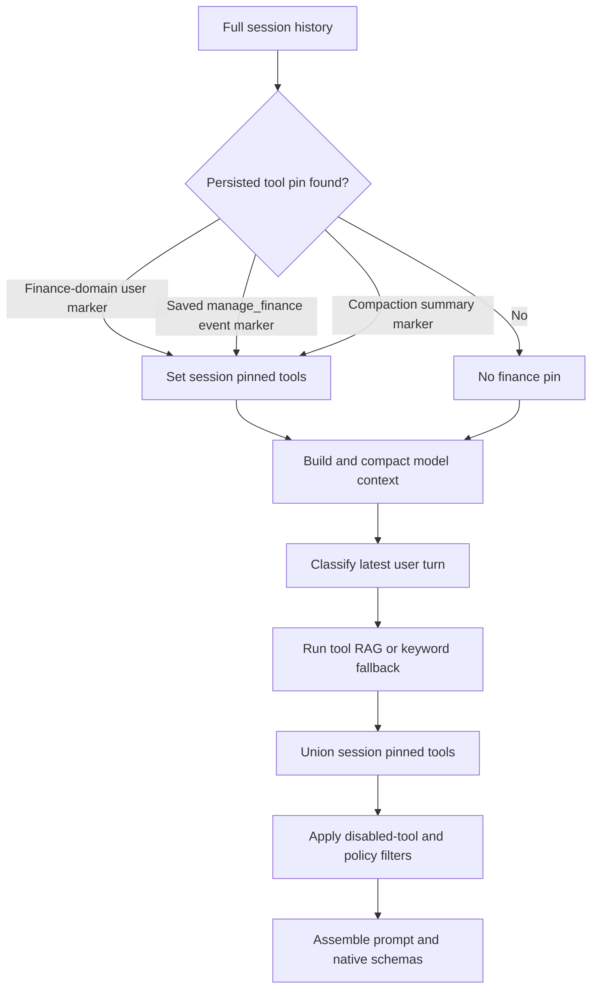
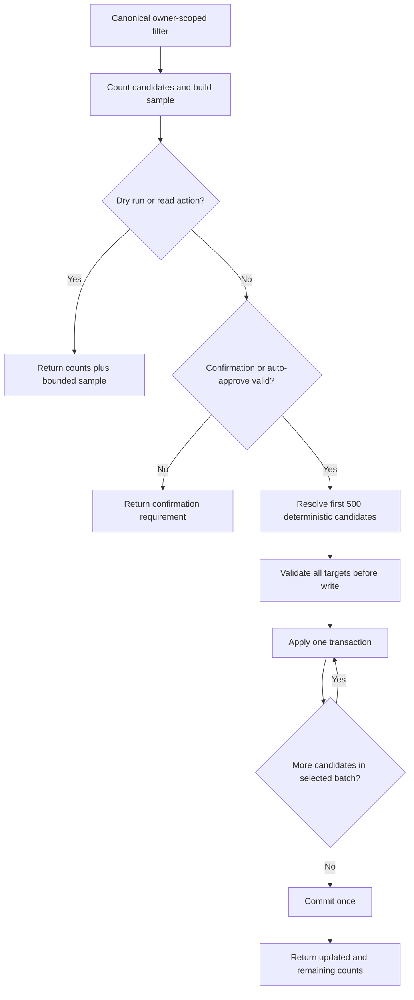
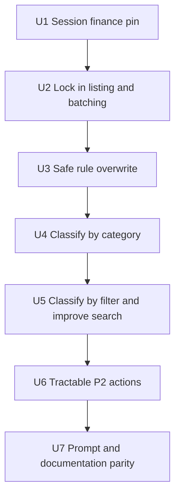

# Finance agent tool pinning and bulk actions - Plan

## Goal Capsule

**Objective:** Keep `manage_finance` available for the lifetime of a finance chat and close the highest-value finance-agent tooling gaps without exposing thousands of transactions to the model.

**Authority:**

1. The requirements and scope decisions in this plan.
2. The user-provided finance tool-gap recommendations.
3. Current behavior on the checked-out branch, including the batching work in commit `6d4cbd1`.
4. Earlier finance plans for movement-class meaning and report integrity.

**Execution profile:**

- Preserve and test the batching work already on the branch.
- Implement session pinning, listing safety, and overwrite behavior first.
- Add classification by category and filter next.
- Add the tractable P2 actions last.
- Use existing owner scoping and confirmation-gate infrastructure.

**Stop conditions:**

- Do not add `manage_finance` to `ALWAYS_AVAILABLE` or `_ADMIN_TOOLS`.
- Do not create a second finance tool.
- Do not return all transactions from a large book to the model.
- Do not add a persistent finance-job subsystem, category schema migration, or advanced rule-condition schema in this pass.
- Do not change movement-class accounting semantics established by `docs/plans/finance/2026-08-15-001-feat-movement-class-books-plan.md`.

---

## Product Contract

### Summary

Finance tool retrieval currently depends mostly on the latest user message.
The branch now supports batched row updates, but a finance discussion can still lose `manage_finance` on natural follow-ups such as “Discord is entertainment,” “how about now?”, or a Google Voice story.
Several high-value operations also require the model to collect transaction IDs before it can act.

This plan makes finance selection sticky within one chat, preserves the new batching contract, and adds compact server-side actions for rule overwrite and continuation, category-based classification, filter-based classification, remaining-work status, and rule previews.
All mutations remain owner-scoped and confirmation-gated unless Finance AI auto-approve is enabled.

### Problem Frame

The current continuation helper recognizes categorization typos and narrow retry language.
It does not represent the stronger product rule that finance stays active once selected in a chat.
Adding finance globally would solve availability at the cost of bloating unrelated new chats, so the pin must be session-local.

The current agent can list and batch-update rows, but recategorizing an existing merchant rule is unsafe or inefficient.
Rule application skips rows that already have a category.
Search only checks payee text and does not tolerate punctuation between search terms.
There is no compact action for applying a movement class to a category or filtered set, and no compact remaining-work view.

### Current State and Target State

| Feature | Current state on this branch | Target state for this plan |
|---|---|---|
| Finance tool retrieval | `_is_finance_context_continuation()` recognizes categorization/retry follow-ups only. | Any finance-domain selection or recorded `manage_finance` use activates a chat-local pin through the end of that chat. |
| Unrelated new chats | Tool RAG omits finance when the latest turn has no finance signal. | Preserve this behavior; a new “what’s the weather” chat does not receive `manage_finance`. |
| Transaction listing | Batching work raised the agent cap to 200, added `offset`, `unclassified`, and `movement_class`, and prints class per row. | Keep a small default, align the agent hard cap with HTTP at 500, clamp invalid ranges, preserve totals, and strengthen paging/filter tests. |
| HTTP bulk update | `POST /transactions/bulk` and `bulk_classify_transactions()` already support class, category, and `apply_to_payee`. | Preserve the endpoint contract and use the service as the shared mutation primitive. |
| Agent bulk update | Commit `6d4cbd1` added multi-ID classify/categorize, mixed `bulk_update_transactions`, a 500-ID cap, one confirmation, and `apply_to_payee`. | Treat this as shipped branch baseline; close validation, atomicity, exact-payee, owner-scope, expansion-cap, and regression-test gaps without reintroducing per-row loops. |
| Rule apply-existing | `apply_rules_to_transactions()` skips every transaction that already has `category_id`; the agent rule action requires category and can synchronously scan all owner rows. | Default to fill-only per target field, add explicit overwrite, apply only the newly created rule, cap a call at 500 changes, and add `apply_rule` for bounded continuation. |
| Rule movement class | The database model, service, and HTTP route support `movement_class`; the agent action and schema do not. | Let `manage_finance.create_rule` accept category, movement class, or both. |
| Rule preview | No agent dry run reports rule collisions before mutation. | Add `test_rule` with compact counts and a bounded sample; use the same matcher as live rule application. |
| Class by category | No action maps category meaning to movement class. | Add `classify_by_category` with conservative sign/payee/Transfers-label guards, dry run, overwrite control, and a 500-row synchronous cap. Category display names never imply `pass_through`. |
| Class by filter | The agent must list IDs before mutation. | Add `classify_by_filter` for search, date, sign, account, and category filters, with dry run and overwrite control. |
| Search | `apply_transaction_filters()` applies one payee-only `ILIKE`. | Agent reads search payee or memo with punctuation-tolerant token matching; HTTP remains payee-only unless an explicit scope opts in. Mutation callers can narrow `search_scope`. |
| Remaining work | Reports expose some unclassified totals, but `manage_finance` has no compact status action. | Add `classification_status` with aggregate counts only. |
| Payee heuristics | `apply_payee_heuristics()` exists and is tested at service level. | Keep it service-only; agent exposure is cut from this pass. |
| Advanced rule conditions | No exclusion, amount, sign, or type condition columns exist. | Defer model/schema/UI work for conditions and exception rules. |
| Category default class | `FinanceCategory` has no movement-class default. | Defer the persistent default; use deterministic inference in `classify_by_category` for this pass. |
| Background bulk jobs | No durable finance bulk-job lifecycle exists. | Defer; synchronous filter actions update at most 500 rows and report remaining work. |

### Requirements

**Session-local tool availability**

- R1. A new chat without a finance signal must omit `manage_finance`.
- R2. A chat becomes finance-active when the current or any earlier user turn is classified into the finance domain, or persisted tool metadata records a `manage_finance` call.
- R3. A finance-active chat must include `manage_finance` on every later agent turn until that chat ends, including off-topic and low-signal turns.
- R4. Session pinning must not rewrite the latest retrieval query, force a finance tool call, or add finance to `ALWAYS_AVAILABLE` or `_ADMIN_TOOLS`.

**Listing and batching**

- R5. `list_transactions` must support `offset`, `unclassified`, `movement_class`, category, date, amount, and search filters and print each row’s movement class.
- R6. Agent listing must default to 25 rows and return at most 500 rows per call, with total count and the next offset when more rows exist.
- R7. Batched classify/categorize must accept up to 500 IDs in one call, and mixed targets must use one `bulk_update_transactions` request.
- R8. `apply_to_payee` must expand by exact normalized payee equality within the same owner only; it must not use substring or fuzzy matching.
- R9. Bulk mutations must validate all category references, movement classes, ID prefixes, duplicate targets, and confirmation payloads before committing any group; ambiguous category names/prefixes and contradictory updates to one row must fail the whole call.

**Rule creation and overwrite**

- R10. `create_rule.apply_existing=true` with `overwrite=false` must fill only target fields that are null; a populated category must not block filling a missing movement class.
- R11. `create_rule` with `overwrite=true` must replace only the category and/or movement-class fields supplied by the new rule on matching rows.
- R12. Create-and-apply must evaluate the newly created rule, not rerun unrelated older rules against the candidate rows.
- R13. `test_rule` must use the live payee-rule matcher and return total matches, fill-only eligible matches, overwrite changes, and at most 10 unique-payee representatives without mutating data. Rule guidance must prefer longer, anchored, or otherwise more-specific patterns and priorities when previews expose collisions.

**Server-side classification**

- R14. `classify_by_category` must never derive `pass_through` from a category display name. `pass_through` is an account-purpose storage result produced by `resolve_stored_class()`. Income categories may infer `income`; ordinary expense categories may infer `spend` only for outflows that do not contain existing P2P/funding tokens. Transfers-label rows are always skipped in this action to avoid the legacy post-write override.
- R15. Category classification must update only null classes by default and only null or safely different classes when `overwrite=true`, while preserving protected `reimbursement`, `transfer`, and `pass_through` values from inferred `spend`. The response and remaining count must describe the value actually stored.
- R16. `classify_by_filter` must support account, category, start/end date, signed amount range, `amount_sign`, tokenized search, and `search_scope`.
- R17. Filter classification must reject a mutation with no narrowing filter, exclude void rows by default, and update only null classes unless overwrite is explicit.
- R18. Agent search terms must match payee or memo and tolerate punctuation between tokens, so `GOOGLE VOICE` can match `GOOGLE *VOICE`. HTTP search remains payee-only unless `search_scope=payee_or_memo` is explicit. An empty search or a one-token search without any second narrowing filter is invalid for writes.

**Status, heuristics, and safety**

- R19. `classification_status` must return aggregate counts by movement class, null-class direction, category status, and account without returning transaction rows.
- R20. Agent exposure for `apply_payee_heuristics` is explicitly out of scope for this pass.
- R21. `test_rule`, `classification_status`, transaction listing, and classification dry runs are read-only and need no confirmation.
- R22. `create_rule`, `apply_rule`, `classify_by_category`, `classify_by_filter`, and all existing bulk mutations require confirmation unless Finance AI auto-approve is enabled.
- R23. Every agent-triggered synchronous set-based mutation must disclose matched/eligible counts and unique-payee samples before writing, update at most 500 unique rows, report how many matching rows remain, and be safe to repeat. One confirmation token may authorize all pages of one payload-bound logical mutation; continuation must not require a new human approval per 500-row page.
- R24. Every read and write must retain owner scoping and must not reveal another owner’s counts, samples, payees, categories, or transaction IDs.
- R25. `create_rule.apply_existing` and `apply_rule` must each change at most 500 eligible rows, return remaining-work counts, and let repeated `apply_rule` calls make deterministic progress without creating duplicate rules.

### Acceptance Examples

- AE1. Covers R1. In a brand-new chat, “what’s the weather?” leaves `manage_finance` out of the selected tool set.
- AE2. Covers R2-R4. After “show my Wells Fargo transactions,” “Discord is entertainment” still receives `manage_finance`, while the retrieval query remains the Discord sentence.
- AE3. Covers R2-R4. A persisted assistant message whose `metadata.tool_events` includes `tool=manage_finance` pins finance even when the original activating user text is no longer in the trimmed model context.
- AE4. Covers R2-R4. “class,” “subcategory,” “how about now?”, and a Google Voice story keep finance available in an already active finance chat without adding those phrases as global finance keywords.
- AE5. Covers R5-R6. A 3,347-row book returns 25 rows by default, never more than 500, states the full match count, and gives `offset=25` for the next page.
- AE6. Covers R7-R9. One mixed batch classifies pass-through, income, and spend groups atomically; an invalid category in any group causes zero updates.
- AE7. Covers R8. Applying a Discord category to payee `DISCORD` updates other owner-matching `DISCORD` rows but not `DISCORD OVERDRAFT`, `ARX MEDIA SDN BHD`, or another owner’s rows.
- AE8. Covers R10-R13 and R25. A new `DISCORD` rule with `overwrite=false` leaves a carefully categorized Discord row unchanged; the same rule with `overwrite=true` and explicit confirmation moves at most 500 eligible rows to Entertainment, then its returned rule ID can be passed to `apply_rule` until remaining work is zero.
- AE9. Covers R13. Testing `ARX MEDI` shows both `ARX MEDI` and `ARX MEDIA SDN BHD` in the bounded sample, allowing the agent to propose an anchored pattern before any write.
- AE10. Covers R14-R15. `classify_by_category` does not map a category named Family Transfers to `pass_through`, does not spend-class a Zelle reimbursement in Subscriptions, skips Transfers-label rows, and reports a processor-account resolution honestly.
- AE11. Covers R16-R18. A dry run for search `GOOGLE VOICE`, outflows, and a date range counts rows where either payee or memo contains the normalized tokens, including `GOOGLE *VOICE`.
- AE12. Covers R19. `classification_status` reports 3,347 total rows and remaining aggregate counts without placing any transaction list in the response.
- AE13. Covers R21-R24. A category or filter classification larger than 500 rows discloses its match count and unique-payee sample once, consumes one logical confirmation across continuation pages, and reaches `remaining=0`.

### Scope Boundaries

#### In Scope for This Implementation Pass

- Durable session-local pinning derived from full chat history.
- Regression hardening for the batching and listing work already on the branch.
- Explicit rule overwrite and field-wise fill behavior.
- Agent rule support for movement class.
- `test_rule`, `apply_rule`, `classify_by_category`, `classify_by_filter`, and `classification_status`.
- Payee-or-memo tokenized search for agent listing and classification filters; HTTP opts in explicitly and otherwise stays payee-only.
- Confirmation-gate and auto-approve parity for every new mutation.
- Tool schema, prompt guidance, finance docs, and tests.

#### Deferred to Follow-Up Work

- `exclude_pattern`, amount bounds, transaction type, and other persisted rule conditions.
- First-class exception-rule semantics such as an OVERDRAFT exclusion before a DISCORD rule.
- A `default_movement_class` column on categories and its migration, CRUD, and UI.
- Durable background jobs, progress, cancellation, retries, and resume for operations over thousands of rows.
- Fuzzy merchant clustering or payee-registry normalization.
- UI controls for the new agent-only actions.
- Agent exposure for `apply_payee_heuristics`.

#### Outside This Pass

- Live bank APIs, import redesign, new accounting classes, or report-math changes.
- Global finance-tool availability in every chat.
- Removal of confirmation gates or owner isolation.

### Input Evidence and Batching Reconciliation

The named local Cursor transcript and canvas were not present in this cloud workspace.
The accessible cloud-agent metadata identifies the batching run as “Finance categorization process” on the same branch and still reports it as waiting for background work, but exposes no transcript diff.
The checked-out commit and current code are therefore the authoritative batching evidence.

Commit `6d4cbd1` already added or changed:

- Multi-ID `classify_transaction` and `categorize_transaction`.
- Mixed `bulk_update_transactions`.
- `apply_to_payee` in the agent schema and execution path.
- A 500-ID mutation cap and one confirmation gate for a batch.
- Deferred commit support in `bulk_classify_transactions()` so mixed groups commit together.
- `offset`, `unclassified`, `movement_class`, class rendering, total count, and next-page guidance in `list_transactions`.
- A 200-row agent listing cap.
- Prompt and schema guidance that forbids per-row classification loops.
- Agent-tool tests for batch classify, batch categorize, mixed updates, payee expansion, confirmation, the 500-ID limit, and class rendering.

Still missing after that batching work:

- Session-lifetime finance pinning.
- Rule overwrite of existing categories.
- Agent `create_rule` support for movement class.
- Category-based and filter-based classification actions.
- Memo-aware punctuation-tolerant search.
- Rule dry run, remaining-work status, and agent exposure for payee heuristics.
- Atomic failure for missing/ambiguous batch references, conflict detection across groups, a true 500-row cap after payee expansion, and correct final-page guidance.
- Advanced conditions, category defaults, and background jobs.

---

## Planning Contract

### Key Technical Decisions

- KTD1. **Persist an allowlisted tool-pin marker in chat-message metadata and carry it through compaction.** Put finance text detection, marker normalization, and full-history scanning in a small `src/tool_pins.py` module shared by chat persistence and the agent classifier. Only server-recognized `manage_finance` may enter the session-pinnable allowlist; arbitrary metadata cannot expose another tool. Mark a finance-domain user turn in agent mode with `pinned_tools=["manage_finance"]`, add the same marker when saved tool events record actual finance use, and union summarized messages’ pin markers onto both the returned and persisted compaction summaries. Compute request pins from full session history before context compaction, carry them on `ChatContext`, and union them into tool-RAG results inside `stream_agent_loop()`. This survives repeated compaction, trimming, and restart without adding a database column or a process-global pin map.
- KTD2. **Pin tool availability, not task intent.** The latest user text remains the retrieval query and `_classify_agent_request()` remains current-turn intent. The pin only unions `manage_finance` into the selected tool set after retrieval. This reduces stale-finance behavior on off-topic turns.
- KTD3. **Align the agent and HTTP read caps at 500 while keeping the agent default at 25; keep the synchronous write cap at 500.** Set-based actions remove the need to list thousands of IDs before a write.
- KTD4. **Use one owner-scoped filter pipeline for list and set-based classification without changing HTTP defaults.** Extend `apply_transaction_filters()` with tokenized search, `search_scope`, and `amount_sign`; agent callers default to payee-or-memo, while HTTP callers default to payee-only unless they opt in.
- KTD5. **Make agent set-based writes idempotent, truthful, and bounded.** Default classification selects null targets. Overwrite selects null or safely different targets. Payee expansion skips already-satisfied rows. Each page takes the first deterministic 500 unique candidates, updates them atomically, and reports the count still needing the effective stored target. Transfers-label rows are skipped by category classification instead of being silently rewritten by `maybe_class_from_transfers_category()`. A logical-operation marker lets the same payload-bound confirmation authorize all continuation pages.
- KTD6. **Apply one rule directly and field by field.** Extract one shared payee matcher, apply the newly created or explicitly selected rule to candidate rows, and preserve the existing ordered multi-rule function for import-time fill-only categorization. Unspecified fields never clear or overwrite data. `create_rule` returns its rule ID; `apply_rule` continues a capped apply-existing operation without creating another rule.
- KTD7. **Treat pattern rules as payee regex rules in this pass.** `test_rule` uses exactly the same regex-with-literal-fallback behavior as live application. Memo search does not silently expand rule scope. The preview makes collisions such as `ARX MEDI` versus `ARX MEDIA SDN BHD` visible.
- KTD8. **Use existing confirmation and auto-approve semantics.** New write actions register validators in the finance gate. Validators compare canonical filters, resolved rule/category/transaction IDs, rule pattern and targets, target class, overwrite, and cap. Read actions and explicit dry runs bypass the gate because they do not mutate.
- KTD9. **Defer schema-heavy and weakly gated P2 work.** Existing columns are enough for movement-class rules, previews, and status. Agent heuristics, rule-condition columns, category defaults, and durable jobs remain separate follow-up work.

### High-Level Technical Design

#### Session pin lifecycle

The full-history scan happens before `maybe_compact()` and `trim_for_context()`.
Compaction unions pin metadata from summarized messages onto the replacement summary, so the pin remains discoverable after the activating turn and tool event are removed.
The pin is recomputed per request from persisted history, so no explicit unpin lifecycle is needed.
Deleting or starting a chat naturally removes the source history.

#### Bounded mutation flow

Mutation responses contain aggregate counts, not transaction dumps.
Dry-run samples contain at most 10 rows and show enough current category/class data to expose dangerous matches.

### Action and Schema Contract

`manage_finance` remains the only native finance tool.
The schema exposes canonical action names; existing internal aliases remain backward compatible but are not promoted as separate actions.

| Action | Kind | Required inputs | Optional inputs | Output contract |
|---|---|---|---|---|
| `list_transactions` | Read | None | `account_id`, `category_id`, `month`, `start_date`, `end_date`, `min_amount_cents`, `max_amount_cents`, `search`, `search_scope`, `uncategorized`, `unclassified`, `movement_class`, `offset`, `limit` | At most 500 formatted rows, total, and next offset |
| `classify_transaction` | Write | `transaction_ids`, `movement_class` | `apply_to_payee` | Batched matched, updated, and remaining counts |
| `categorize_transaction` | Write | `transaction_ids`, `category_id` | `apply_to_payee` | Batched matched, updated, and remaining counts |
| `bulk_update_transactions` | Write | `updates` | Per-group class, category, and `apply_to_payee` | Atomic mixed matched, updated, and remaining counts |
| `create_rule` | Write | `pattern` and at least one of `category_id` or `movement_class` | `priority`, `apply_existing`, `overwrite`, `max_updates` | Rule ID plus matched, changed, and remaining counts |
| `test_rule` | Read | `pattern` | `category_id`, `movement_class`, `overwrite` | Total/fill-only/overwrite counts plus at most 10 samples |
| `apply_rule` | Write | `rule_id` | `overwrite`, `max_updates` | Rule ID plus matched, changed, and remaining counts |
| `classify_by_category` | Dry run or write | `category_id` | `movement_class`, `overwrite`, `dry_run`, `max_updates` | Inferred target, matched, eligible, updated, and remaining counts; sample only on dry run |
| `classify_by_filter` | Dry run or write | `movement_class` and at least one narrowing filter | `account_id`, `category_id`, `start_date`, `end_date`, `min_amount_cents`, `max_amount_cents`, `amount_sign`, `search`, `search_scope`, `overwrite`, `dry_run`, `max_updates` | Canonical filter, matched, eligible, updated, and remaining counts; sample only on dry run |
| `classification_status` | Read | None | `account_id`, `start_date`, `end_date` | Aggregate totals by class, direction, category state, and at most 25 accounts |

Shared fields:

- `overwrite`: boolean, default false.
- `dry_run`: boolean, default false; honored only by the two set-based classification actions.
- `max_updates`: integer from 1 through 500, default 500; used by rule application, category/filter classification, and payee heuristics.
- `apply_existing`: boolean, default true for `create_rule`.
- `priority`: integer, default 100; lower values retain existing earlier-rule precedence.
- `pattern`: nonblank payee regex/literal-fallback string, maximum 200 characters.
- `category_id`: accepts a full ID, unique ID prefix, unique leaf name, or unique formatted category path.
- `rule_id`: accepts a full ID or unique prefix; every ambiguous reference fails rather than selecting an arbitrary row.
- `amount_sign`: `inflow`, `outflow`, or `zero`.
- `search_scope`: `payee_or_memo` by default for agent calls, with `payee` and `memo` as narrower options. HTTP callers default to `payee`.
- `movement_class`: one of `spend`, `income`, `transfer`, `pass_through`, or `reimbursement`.

### Confirmation and Auto-Approve Contract

Read-only actions remain ungated:

- `list_transactions`
- `test_rule`
- `classification_status`
- `classify_by_category` with `dry_run=true`
- `classify_by_filter` with `dry_run=true`

Write actions use the existing `finance/manage_finance` gate:

- `create_rule`
- `apply_rule`
- `classify_by_category`
- `classify_by_filter`
- Existing category, budget, ledger, classify, categorize, bulk, link, and pin actions

For `create_rule`, the confirmation payload must include the normalized pattern, resolved category ID when present, validated movement class when present, priority, `apply_existing`, `overwrite`, and `max_updates`.
For `apply_rule`, it must include the resolved owner-scoped rule ID, overwrite value, and `max_updates`.
For set-based classification, the payload must include the complete canonical filter, resolved target, overwrite value, and `max_updates`.
The gate payload also binds the server-computed matched/eligible count, bounded unique-payee sample, and a logical-operation marker. Changing any of those values after approval invalidates the token. The marker remains valid for continuation pages of the same operation until `remaining=0`; it cannot authorize changed filters, targets, overwrite behavior, or caps.

Finance AI auto-approve continues to bypass soft confirmation for these actions.
It does not bypass owner checks, input validation, the 500-row cap, or existing hard-gated actions.

### Sequencing

The implementer must re-read the batching helpers before U2 because another agent produced them on this branch.
U2 is a baseline-hardening unit, not a rewrite.

### Risks and Mitigations

| Risk | Failure mode | Mitigation |
|---|---|---|
| Finance becomes overly sticky | An off-topic weather turn carries finance rules and schema after earlier finance work. | Pin only the tool; keep the latest turn as retrieval intent; do not force a call; test fresh-chat and off-topic behavior separately. |
| Rule overwrite destroys careful categories | A broad regex recategorizes rows the user had reviewed. | Default overwrite false; provide `test_rule`; require overwrite in the confirmation payload; cap synchronous writes at 500. |
| `ARX MEDI` collides with `ARX MEDIA SDN BHD` | Substring-like regex behavior matches both merchants. | Use live matcher in preview; show bounded representative rows; document anchoring; do not add fuzzy matching. |
| Memo search expands matches | A generic term appears in many memos and broadens a mutation. | Require a narrowing filter, support `search_scope`, use dry-run counts/samples, and include the canonical filter in confirmation. |
| Payee propagation expands too far | Similar merchant names are treated as equal. | Use exact normalized equality only; do not use the search matcher for `apply_to_payee`. |
| Partial large-book progress is confusing | More than 500 rows need the same update. | Report matched, updated, and remaining counts; select only rows still needing the target so repeated calls are idempotent. |
| One row appears in conflicting bulk groups | Group order silently decides the final class or category. | Canonicalize prepared groups before confirmation and reject incompatible targets for the same transaction; deduplicate identical targets. |
| Dry-run count changes before execution | Imports or edits alter the candidate set between preview and confirmation. | Re-evaluate under owner scope at execution, validate targets again, commit one bounded batch, and report actual counts. |
| Auto-approve hides destructive breadth | An enabled preference permits a broad overwrite without a click. | Keep dry-run guidance in the finance prompt and enforce the same filters, owner scope, validation, and caps even when approval is bypassed. |
| Current branch contains unrelated work | A finance implementation accidentally reverts Docker, UI, or other changes in `6d4cbd1`. | Restrict edits to the files named by each unit and review the final diff against current HEAD, not an older base. |

---

## Implementation Units

### U1. Pin finance tooling to an activated chat

**Goal:** Make `manage_finance` available on every later agent turn in a finance-active chat without changing global tool availability.

**Requirements:** R1-R4.

**Dependencies:** None.

**Files:**

- `src/agent_loop.py`
- `src/tool_pins.py` (new)
- `routes/chat_helpers.py`
- `routes/chat_routes.py`
- `src/context_compactor.py`
- `routes/history/history_routes.py`
- `tests/test_agent_loop.py`
- `tests/test_tool_pins.py` (new)
- `tests/test_chat_helpers.py`
- `tests/test_context_compactor.py`

**Approach:**

1. Move the current direct finance-domain text checks from `_classify_agent_request()` into a pure `finance_domain_matches()` predicate in `src/tool_pins.py`, then call that predicate from the classifier so current-turn classification and activation marking cannot drift.
2. Define a session-pinnable allowlist containing only `manage_finance`; marker readers must intersect persisted values with this allowlist.
3. Pass `agent_mode` into `add_user_message()` and, only for an agent-mode user turn that directly selects finance, merge `pinned_tools=["manage_finance"]` with attachment metadata before the message is persisted.
4. When `save_assistant_response()` persists effective tool events from either its argument or `last_metrics`, add the same pin marker when any event has `tool="manage_finance"`.
5. Before replacing older messages, compute their pin union once in `maybe_compact()`, add it to the returned summary-message metadata, and pass it to `_update_session_history()` for the persisted `ChatMessage` metadata.
6. Add `pinned_tools_from_history()` that reads both `ChatMessage` and dictionary forms, recognizes markers, and provides a legacy fallback for retained finance user text or retained `manage_finance` tool events.
7. Compute the pinned tool set in `build_chat_context()` after adding the current user turn but before `maybe_compact()`, and store it on `ChatContext`.
8. Pass the set from the agent-mode call in `routes/chat_routes.py` into a new optional `pinned_tools` argument on `stream_agent_loop()`.
9. Before the direct low-signal early return, suppress that shortcut when an allowlisted session pin exists. After retrieval, domain seeding, model-specific tool clamps, and other tool composition, initialize a missing retrieval result safely and union allowlisted session pins before final prompt/schema filtering. Explicit disabled-tool, guide-only, plan-mode, plugin, and public-user policies still win.
10. Keep confirmation-token pinning intact as a separate one-turn safety path.
11. Pin the finance schema without attaching finance-domain prompt rules to a currently unrelated turn.
12. Preserve pin metadata in both `src/context_compactor.py` summarizers and the manual compactor in `routes/history/history_routes.py`.
13. Do not modify `src/tool_index.py` `ALWAYS_AVAILABLE`, `ASSISTANT_ALWAYS_AVAILABLE`, or `_ADMIN_TOOLS`.

**Patterns to follow:**

- `ChatContext` already carries request-scoped context from full session history into `stream_agent_loop()`.
- `_confirmation_pinned_tools()` already demonstrates a narrow tool-union step after retrieval.
- Persisted tool execution evidence lives in assistant message `metadata.tool_events`.
- `maybe_compact()` and `context_compactor._update_session_history()` build separate returned and persisted summary messages, so both metadata copies must receive the union.

**Test scenarios:**

- A fresh weather-only history produces no finance pin.
- A current finance request pins `manage_finance` on its first turn.
- A prior finance request pins a later “Discord is entertainment” turn.
- A prior `manage_finance` tool event pins finance even when no retained user content contains a finance keyword.
- “class,” “subcategory,” “how about now?”, and a Google Voice story pin only when finance was activated earlier.
- A finance-active chat followed by a weather question keeps the tool pin but classifies the latest query as web rather than rewriting it to finance.
- Two separate chat histories do not share a pin.
- A first compaction transfers the pin to summary metadata, and a later compaction preserves it again.
- Context trimming does not remove the pin because the scan happens on persisted history before trimming.
- Legacy sessions without pin metadata still activate from retained finance user text or a retained `manage_finance` tool event.
- A forged or stale marker naming another tool is ignored by the session-pinnable allowlist.
- A non-agent finance discussion does not create a domain-selection marker, but a later recorded `manage_finance` event still does.
- Model-specific tool clamps do not erase an allowed finance pin; explicit tool policy still can.
- A disabled finance tool remains excluded after policy filtering.

**Verification:** Captured relevant tools contain `manage_finance` for every activated-history case and omit it for a new unrelated chat; retrieval-query assertions show no stale-context rewrite.

### U2. Lock in context-safe listing and atomic batching

**Goal:** Preserve the other agent’s batching work and close P0 validation and paging gaps.

**Requirements:** R5-R9, R23-R24.

**Dependencies:** U1.

**Files:**

- `src/tools/finance.py`
- `src/tool_schemas.py`
- `integrations/finance/confirmation_gate.py`
- `tests/test_finance_agent_tools.py`

**Approach:**

1. Raise `_MAX_TX_LIMIT` to 500, keep `_MAX_BULK_TX=500`, the 25-row list default, and the current bulk action names.
2. Parse list pagination once: omitted `limit` becomes 25, numeric values below 1 become 1, values above 500 become 500, negative offsets become zero, and malformed non-integers return a validation error.
3. Preserve total count and emit `next_offset=offset+len(page)` only when that value is below total; an empty or final page has no next-page hint and never prints unseen IDs.
4. Retain `_execute_bulk_finance_updates()` as the one agent execution path for same-target and mixed updates.
5. Validate every group and resolve every category/class before the first mutation. Harden category resolution so a full ID, unique ID prefix, unique leaf name, or unique formatted category path resolves, while ambiguous references fail instead of selecting `.first()`.
6. Canonicalize transaction IDs across groups, then repeat conflict detection after payee expansion. Deduplicate identical assignments and reject any explicit or expanded transaction that receives conflicting category or class targets.
7. Preserve `apply_to_payee`, using `_normalize_payee()` equality rather than token, substring, or fuzzy search. Query likely candidate payees under owner scope where practical, then apply the shared Python normalizer as the final equality check.
8. Before confirmation, build one deterministic, deduplicated candidate sequence across direct IDs and payee expansions and disclose the exact match count plus a bounded unique-payee sample. Skip rows already equal to every supplied target, update at most 500 unique rows across the whole call, and report matched, updated, and remaining counts so repeating the action progresses under the same logical confirmation.
9. Keep one database commit after all prepared groups and pass explicit selected IDs to `bulk_classify_transactions(..., apply_to_payee=False, commit=False)` so service-side expansion cannot bypass the agent cap.
10. Keep existing aliases for compatibility while describing only canonical schema actions.
11. Update tool and prompt descriptions only where tests show drift from the live contract.

**Execution note:** Start by running the existing batching tests against current HEAD; change implementation only for an uncovered contract failure or the bounded-query improvement.

**Patterns to follow:**

- `_parse_bulk_groups()`, `_resolve_transactions()`, `_bulk_gate_args()`, and `_execute_bulk_finance_updates()` in `src/tools/finance.py`.
- `bulk_classify_transactions(..., commit=False)` followed by one commit.
- Existing finance confirmation validators for category, class, IDs, and payee expansion.

**Test scenarios:**

- A missing limit returns 25 rows and a next offset when total exceeds 25.
- Requested limits of zero, a negative number, 200, and more than 200 produce bounded behavior and never dump the full book.
- A near-final page advertises the real next offset only when rows remain; the final and beyond-end pages advertise none.
- `offset`, `unclassified`, `movement_class`, category, date, and amount filters compose correctly.
- Each rendered row contains class, category, account, short ID, payee, amount, and date.
- A 500-ID same-target update succeeds in one call; 501 IDs fail before mutation.
- A mixed batch commits all valid groups together.
- An invalid class, missing ID, ambiguous transaction prefix, ambiguous category name/prefix, or another owner’s category in any group produces the documented error and no partial updates.
- Identical duplicate group targets are deduplicated; conflicting category or class targets for one row reject the whole call.
- Two `apply_to_payee` groups whose exact-payee expansions overlap with conflicting targets reject before any mutation.
- `apply_to_payee` updates exact case/whitespace-normalized matches for the owner and does not update substring matches or another owner’s rows.
- A payee expansion with more than 500 eligible rows updates 500 unique rows, reports the remainder, and advances on a repeated call instead of selecting the already-correct first page.
- The confirmation payload for a mixed batch must exactly match grouped IDs, classes, categories, and payee-expansion flags.

**Verification:** Existing batching tests remain green, new boundary tests pass, and a large seeded book produces bounded output while bulk actions mutate no more than 500 rows.

### U3. Add safe rule overwrite semantics

**Goal:** Let an approved rule move already-categorized transactions while preserving fill-only behavior by default.

**Requirements:** R10-R12, R22-R25.

**Dependencies:** U2.

**Files:**

- `integrations/finance/services/categories.py`
- `src/tools/finance.py`
- `src/tool_schemas.py`
- `integrations/finance/confirmation_gate.py`
- `tests/test_finance_categories.py`
- `tests/test_finance_agent_tools.py`

**Approach:**

1. Extract `rule_matches_payee()` so preview, single-rule application, and ordered import application preserve the same regex matching and invalid-regex literal fallback.
2. Add `apply_rule_to_transactions()` for one persisted rule, with owner scope, `overwrite`, `max_updates`, and default-true `commit`; return structured matched, eligible, changed, and remaining counts.
3. Make fill-only behavior field-specific: a populated category blocks only category assignment, and a populated class blocks only class assignment. Movement-class rule assignment must use the same processor-account stored-target resolution as direct classification.
4. Add a default-true `commit` option to `create_rule_for_owner()`, and add `overwrite` to the agent action with default false.
5. During `create_rule.apply_existing`, apply only the newly created rule to owner-scoped rows.
6. When overwrite is true, replace only fields supplied on that rule; never clear an unspecified category or movement class.
7. Select deterministic active, non-void candidates that need at least one supplied field, apply at most `max_updates`, and return matched, changed, and remaining counts so “matched but already correct” is not reported as a mutation.
8. In the agent path, create and flush the rule without committing, apply the single-rule helper with `commit=False`, then commit both the rule and bounded transaction changes once. An application failure rolls back the new rule as well as row changes; existing HTTP callers retain the service’s default commit behavior.
9. Add canonical `apply_rule`, resolving an existing owner-scoped rule by full ID or unique prefix and applying the same helper with `overwrite` and `max_updates`. Repeated calls skip satisfied rows and do not create another rule.
10. Preserve `apply_rules_to_transactions()` as the ordered, fill-only import path and preserve its existing categorized-count return contract. Resolve category and movement class independently: the first matching rule that supplies each still-null field wins by priority, and evaluation stops only when no target field remains unresolved.
11. Extend `_validate_create_rule()` so the confirmation token binds `apply_existing`, `overwrite`, and `max_updates` as well as pattern, target, and priority. Add `_validate_apply_rule()` to bind canonical rule ID, overwrite, and cap.
12. Validate movement class at the service boundary, and constrain rule patterns to the HTTP contract’s nonblank 200-character maximum.
13. Ship `test_rule` in this unit, before overwrite is exposed. It must use the exact live matcher and sample unique payees so collisions such as `GOOGLE ARX MEDI` versus `ARX MEDIA SDN BHD` remain visible.
14. Expose `movement_class` on agent `create_rule`, and guide the model toward longer or anchored patterns plus explicit priority for collision-prone merchants.

**Patterns to follow:**

- Owner and category validation in `create_rule_for_owner()`.
- Existing `require_confirmed_action()` and `consume_confirmation()` flow in `src/tools/finance.py`.
- Existing priority ordering in `apply_rules_to_transactions()`.

**Test scenarios:**

- `apply_existing=false` creates a rule and changes no transaction.
- Fill-only category rule categorizes an uncategorized match.
- Fill-only category rule leaves an existing different category unchanged.
- Fill-only movement rule fills a missing class even when category is populated.
- Separate matching category-only and movement-class-only rules fill their respective null fields by priority; a category-only match does not stop later class resolution.
- A movement-class rule targeting `transfer` stores `pass_through` on a processor account and reports eligibility against that resolved value.
- Overwrite category rule recategorizes a matching categorized row and leaves class unchanged when the rule omits class.
- Overwrite with both fields changes both; an already-correct row counts as matched but not changed.
- Create-and-apply does not let an older unrelated higher-priority rule claim the candidate.
- A failure during create-and-apply leaves neither a partially applied row set nor a newly persisted rule.
- Invalid regex uses the same literal fallback as before.
- Another owner’s matching payee remains unchanged.
- A confirmation minted without `overwrite=true` cannot authorize an overwrite call.
- More than 500 eligible matches change 500 during create-and-apply; repeated `apply_rule` calls use the returned rule ID, create no duplicate rules, and reach zero remaining.
- An ambiguous or another owner’s rule reference fails without mutation.
- Void matching rows remain unchanged.
- Auto-approve permits the same operation but still honors validation and owner scope.

**Verification:** Rule service and agent tests prove fill-only compatibility, explicit recategorization, single-rule application, exact gate binding, and no cross-owner writes.

### U4. Classify transactions by category

**Goal:** Apply movement class to a category without listing or pasting transaction IDs.

**Requirements:** R14-R15, R21-R24.

**Dependencies:** U3.

**Files:**

- `integrations/finance/services/movements.py`
- `integrations/finance/services/categories.py`
- `src/tools/finance.py`
- `src/tool_schemas.py`
- `src/agent_loop.py`
- `integrations/finance/confirmation_gate.py`
- `tests/test_finance_movements.py`
- `tests/test_finance_agent_tools.py`

**Approach:**

1. Add `infer_movement_class_for_category()` using semantic fields rather than category display names: `FinanceCategory.is_income` or an Income-prefixed path may infer `income`; ordinary expense categories may infer `spend`. It must never infer `pass_through`.
2. Skip Transfers-label rows entirely in this action so `maybe_class_from_transfers_category()` cannot rewrite an explicit or inferred target behind the tool's response.
3. Resolve category name, ID, or unique prefix through the existing category resolver.
4. Query owner-scoped, non-void rows whose direct `FinanceTransaction.category_id` is the resolved category. Exclude split-only membership because one split parent can contain multiple categories while movement class belongs to the whole transaction.
5. Preload the owner’s account-purpose map and derive each row’s effective stored target once, including `transfer` becoming `pass_through` on processor accounts, rather than issuing an account lookup per row.
6. For inferred spend, skip non-outflows and existing funding/P2P token payees such as Zelle, Venmo, Cash App, and PayPal instant transfers. An inferred spend overwrite must also preserve existing `reimbursement`, `transfer`, and `pass_through`.
7. For default mode, select null classes only. For overwrite mode, select null or safely different classes. Counts, response text, and remaining work all use the effective stored target.
8. Implement the query and mutation contract in `classify_transactions_by_category()`, returning counts and at most 10 samples for `dry_run=true`.
9. For a write, validate confirmation, update at most `max_updates`, commit once, and return updated and remaining counts.
10. Register `_validate_classify_by_category()` so approval binds resolved category ID, resolved target class, overwrite, and max updates.

**Patterns to follow:**

- `validate_movement_class()` and `resolve_stored_class()` for class validation and processor-account behavior.
- `_resolve_category()` for agent-friendly references.
- `apply_transaction_filters()` category semantics.

**Test scenarios:**

- Family Transfers does not infer `pass_through` from its name.
- Transfers-label rows are skipped rather than silently rewritten.
- A top-level or nested income category infers `income`.
- A normal expense category infers `spend` only for safe outflows.
- Zelle/funding payees and positive rows in an expense category remain unclassified under inferred spend.
- An explicit valid class overrides inference.
- A transaction that contains the category only in one split is not classified by category inference.
- Dry run returns counts and samples without changing rows or requiring confirmation.
- Default write updates only null-class rows.
- Overwrite updates null or different rows and ignores already-correct rows.
- A category with more than 500 eligible rows updates 500, reports remaining work, and makes progress when repeated.
- Processor-account transfer resolution remains consistent with `resolve_stored_class()`.
- Invalid category/class, another owner’s category, and a mismatched confirmation token fail without mutation.

**Verification:** Service and agent tests prove every mapping branch, dry-run immutability, overwrite behavior, owner isolation, and bounded repeatability.

### U5. Classify by filter and make search memo-aware

**Goal:** Mutate a bounded transaction set from search/date/sign/category filters without exposing IDs to the model.

**Requirements:** R16-R18, R21-R24.

**Dependencies:** U4.

**Files:**

- `integrations/finance/services/transactions.py`
- `integrations/finance/services/movements.py`
- `integrations/finance/routes.py`
- `src/tools/finance.py`
- `src/tool_schemas.py`
- `src/agent_loop.py`
- `integrations/finance/confirmation_gate.py`
- `tests/test_finance_transactions.py`
- `tests/test_finance_routes.py`
- `tests/test_finance_movements.py`
- `tests/test_finance_agent_tools.py`

**Approach:**

1. Extend `apply_transaction_filters()` with `search_scope` and `amount_sign`, backed by a reusable `tokenize_transaction_search()` helper.
2. Tokenize search into nonempty alphanumeric terms. Reject more than eight terms, any term longer than 64 characters, or a supplied search value that yields no terms; punctuation-only input must never become an unfiltered query.
3. Build escaped literal `ILIKE` predicates with no user-controlled `%` or `_` wildcards. For `payee_or_memo`, require the complete token set to match payee or the complete token set to match memo; do not satisfy half the terms from each field.
4. Preserve the existing owner, account, category, month/date, amount, status, uncategorized, and class filters. Resolve the agent’s category reference once and pass its canonical ID through `apply_transaction_filters()` instead of applying the current ad hoc `startswith` query. Category filters retain existing direct-or-split membership semantics; unlike U4 inference, an explicit filter may select a split parent transaction.
5. Default agent list and classification search to `payee_or_memo`. Keep existing HTTP search payee-only unless the request explicitly sends `search_scope=payee_or_memo`.
6. Add owner-scoped `classify_transactions_by_filter()` in `integrations/finance/services/movements.py`; it must call `apply_transaction_filters()` for both dry run and write rather than reconstructing filter semantics.
7. Reject a write unless at least one meaningful narrowing filter is present; an invalid or empty tokenized search does not count. A one-token search is insufficient by itself and requires a second filter. Account, category, date bound, amount bound, amount sign, or a multi-token search are accepted narrowing fields.
8. Preload account purposes and apply the same per-row stored-target and null-only versus null-or-different rules used by category classification.
9. Order candidates deterministically, update at most 500, commit once, and return remaining count.
10. Add `_validate_classify_by_filter()` to bind the complete canonical filter and target in the confirmation validator.
11. Keep samples to 10 dry-run rows and return no transaction list after a write.

**Patterns to follow:**

- Existing `apply_transaction_filters()` composition in HTTP and agent list handlers.
- Existing list-route total-before-limit behavior.
- U4 bounded mutation and confirmation shape.

**Test scenarios:**

- `GOOGLE VOICE` matches payee `GOOGLE *VOICE`.
- `GOOGLE VOICE` matches a plain memo when payee does not match.
- Every token must match; `GOOGLE STORAGE` does not match a row containing only GOOGLE.
- A row with GOOGLE only in payee and VOICE only in memo does not match the combined default scope.
- `search_scope=payee` excludes memo-only matches, and `search_scope=memo` excludes payee-only matches.
- `%` and `_` in user text do not become uncontrolled SQL wildcards.
- Punctuation-only search, a ninth token, or a token over 64 characters returns validation error and cannot authorize a broad write.
- Search, account, category, date range, amount range, and sign intersect rather than replace each other.
- `amount_sign=outflow`, `inflow`, and `zero` select the correct signed rows.
- A write with no narrowing filter is rejected.
- Dry run reports matches and samples without confirmation or mutation.
- Default write updates null classes only; overwrite updates different classes too.
- Void rows and another owner’s rows remain untouched.
- More than 500 candidates produce bounded, repeatable progress.
- HTTP list and agent list both gain payee-or-memo punctuation-tolerant behavior.

**Verification:** Shared-filter tests prove search semantics and composition, and agent tests prove a filter can classify a large matching set without listing IDs or returning excessive context.

### U6. Add compact classification status

**Goal:** Let the model report progress without paging or collecting transaction IDs.

**Requirements:** R13, R19-R24.

**Dependencies:** U5.

**Files:**

- `integrations/finance/services/categories.py`
- `integrations/finance/services/movements.py`
- `src/tools/finance.py`
- `src/tool_schemas.py`
- `src/agent_loop.py`
- `src/tool_index.py`
- `integrations/finance/confirmation_gate.py`
- `tests/test_finance_categories.py`
- `tests/test_finance_movements.py`
- `tests/test_finance_agent_tools.py`
- `tests/test_finance_routes.py`

**Approach:**

1. Keep `movement_class` and `test_rule` with U3 so overwrite never ships without its safety preview.
2. Add `classification_status_counts()` using SQL aggregate queries rather than loading all rows or calling `review_queues()`, which materializes row details.
4. Include total active non-void rows, counts per class, null-class inflow/outflow/zero counts, uncategorized count, categorized-but-unclassified count, and per-account counts. Treat a row with a direct category or any split as categorized.
5. Return at most 25 account groups ordered by row count then stable account ID, plus an omitted-account count and aggregate for any remainder.
6. Keep status output compact and owner-scoped.
7. Do not add agent heuristics, rule-condition columns, or category-default columns.

**Patterns to follow:**

- Existing `FinanceCategorizationRule.movement_class`.
- Existing HTTP `RuleCreate` and `create_rule_for_owner()` support for category-or-class rules.
- Existing `unclassified_counts()` behavior.

**Test scenarios:**

- Agent creates a movement-class-only rule.
- Agent creates a rule containing both category and class.
- Agent rejects a rule containing neither.
- Invalid movement class fails before confirmation consumption.
- `test_rule` mutates nothing and reports bounded collision samples for `ARX MEDI`.
- Preview counts distinguish null-field eligibility from overwrite changes.
- Status counts class values, null-class directions, uncategorized rows, and account groups correctly.
- Split-categorized parents count as categorized, and void rows do not contribute to status.
- Status returns no transaction IDs or unbounded payee arrays.
- More than 25 accounts produce 25 groups plus omitted-account metadata.
- Status and preview exclude another owner’s data.

**Verification:** Agent action coverage matches service behavior, every write remains present in the finance gate registry, and read actions produce compact owner-scoped output.

### U7. Synchronize prompts and finance documentation

**Goal:** Make the model’s guidance match the final action, safety, and pagination contracts.

**Requirements:** R4-R8, R13-R25.

**Dependencies:** U6.

**Files:**

- `src/agent_loop.py`
- `src/tool_index.py`
- `src/tool_schemas.py`
- `docs/features/finance.md`
- `integrations/finance/README.md`
- `tests/test_finance_agent_tools.py`

**Approach:**

1. Update the finance domain rules and tool section with canonical action names and read/write distinctions as soon as set-based actions land.
2. Tell the agent to prefer `classification_status`, category/filter dry runs, and set-based writes over paging through thousands of IDs.
3. Require `test_rule` before a proposed overwrite, use `apply_rule` to continue a capped rule application, and warn that rule patterns are payee regexes.
4. Document the 500-row read cap, global 500-unique-row agent write cap, remaining-count loop under one logical confirmation, and exact semantics of `apply_to_payee`.
5. Keep the personal-assistant availability behavior unchanged.
6. Add a concise finance feature-doc summary and point detailed behavior to the plugin README.
7. Keep schema enum, prompt action list, gate registry, and read-action test allowlist synchronized.

**Patterns to follow:**

- `_DOMAIN_RULES["finance"]`, `TOOL_SECTIONS["manage_finance"]`, and `TOOL_DESCRIPTIONS["manage_finance"]`.
- `test_every_manage_finance_write_action_is_gated()` as a drift detector.

**Test scenarios:**

- Every schema write action is either registered in the finance gate or explicitly listed as a non-ledger paper write under existing policy.
- New read actions do not appear as missing writes in the gate test.
- Prompt text names the 500/500 caps and does not instruct per-row loops.
- Prompt text distinguishes exact payee propagation from tokenized search.
- `ALWAYS_AVAILABLE` remains exactly the existing ambient primitives and does not gain finance.

**Verification:** Schema, prompt, gate, and documentation describe the same canonical actions and limits; drift tests pass.

---

## Verification Contract

### Automated Test Gates

| Gate | Command | Proves |
|---|---|---|
| Session pinning | `pytest -q tests/test_tool_pins.py tests/test_agent_loop.py tests/test_chat_helpers.py tests/test_context_compactor.py tests/test_history_routes.py` | Finance activation, chat isolation, allowlisting, low-signal survival, off-topic behavior, full-history pin computation, and pin preservation across both compaction paths |
| Agent finance contract | `pytest -q tests/test_finance_agent_tools.py` | Action schemas, listing limits, batching, gates, auto-approve, rule overwrite, previews, status, and new actions |
| Rule services | `pytest -q tests/test_finance_categories.py` | Matcher parity, fill-only behavior, overwrite, single-rule application, and bounded continuation |
| Movement services | `pytest -q tests/test_finance_movements.py` | Category/filter classification, sign/P2P/Transfers-label skips, 500-row bounds, and processor resolution |
| HTTP/shared filters | `pytest -q tests/test_finance_transactions.py tests/test_finance_routes.py` | Payee-or-memo token search, filter composition, totals, offsets, and bulk endpoint compatibility |
| Focused finance regression | `pytest -q tests/test_finance_agent_tools.py tests/test_finance_categories.py tests/test_finance_movements.py tests/test_finance_transactions.py tests/test_finance_routes.py tests/test_tool_pins.py tests/test_agent_loop.py tests/test_chat_helpers.py tests/test_context_compactor.py tests/test_history_routes.py` | Cross-layer finance behavior on the final diff |
| Live DeepSeek Pro | Production Odysseus app, or a local harness around `src.agent_loop.stream_agent_loop`, with `OPENROUTER_API_KEY="$OPENROUTER_API_KEY"`, base URL `https://openrouter.ai/api/v1`, and model `deepseek/deepseek-v4-pro-0813` | Real native tool selection, pin follow-ups, one bulk/list/unclassified path, and provider model lock |

### Review Gates

- Compare the final implementation diff against current HEAD so batching code is preserved.
- Confirm no change adds `manage_finance` to `ALWAYS_AVAILABLE` or `_ADMIN_TOOLS`.
- Confirm every new write action is in `register_finance_confirmation_gate()`.
- Confirm dry-run branches return before confirmation and before mutation.
- Confirm all candidate queries include owner and default non-void filtering.
- Confirm transaction samples are bounded at 10 and list output at 500.
- Confirm all agent mutation pages commit once and stop at 500 unique rows, including payee expansion and rule continuation.
- Confirm no active-scope change adds a finance database migration.

### Behavioral Walkthrough

Use one existing finance-enabled account and two separate chats:

1. In chat A, ask a finance question and verify `manage_finance` runs or is selected.
2. Follow with merchant, class, subcategory, retry, and Google Voice-style turns and verify finance remains available.
3. Ask an off-topic question in chat A and verify finance stays available without being forced.
4. In fresh chat B, ask the same off-topic question and verify finance is absent.
5. Dry-run a category and a memo-aware filter, confirm the bounded counts/sample, approve one mutation, and verify updated/remaining counts.
6. Preview a collision-prone rule, then create it fill-only; repeat with explicit overwrite, use `apply_rule` if more rows remain, and verify only intended fields move.
7. Request `classification_status` and verify it reports aggregates without a transaction dump.

### Mandatory live DeepSeek Pro verification

Run this only after the automated gates pass. Supply the OpenRouter key out of band as `$OPENROUTER_API_KEY`; never put its value in the repository, fixtures, tests, screenshots, transcripts, evidence, or PR text. Use only `https://openrouter.ai/api/v1` and `deepseek/deepseek-v4-pro-0813`. Record the requested and provider-reported model IDs and fail if either differs.

Prefer the real Odysseus application. If it cannot boot, use a minimal local harness around production `stream_agent_loop` with the production finance schema/executor and a disposable finance database. A playground, direct chat-completions toy, or mocked model does not pass. Try app startup, local production-loop harness, and service/config remediation before declaring the gate blocked.

At minimum, in one finance-activated chat run the exact follow-ups “Dice & Drip is entertainment”, “GOOGLE VOICE was a one-time thing”, “set the class's”, and “How about now?” and verify `manage_finance` remains available and is used to re-read or mutate finance state. In another path, verify `list_transactions` uses real offsets with `unclassified=true`, renders `movement_class`, and exercise one bounded bulk or classify action with no more than one confirmation for the logical mutation. Also verify a fresh weather-only chat does not receive finance.

Save only sanitized model/tool evidence: user turns, exact requested/reported model IDs, tool names and arguments, confirmation boundaries, concise results, and assertions. Before handoff, scan the repository, staged diff, and evidence for OpenRouter key-like strings. If the app and production-loop harness remain impossible after three concrete remediations, report the gate blocked with those attempts; do not mark it passed.

---

## Definition of Done

- U1 is done when finance activation persists for a chat across natural and off-topic follow-ups, survives trimming, and does not affect a fresh chat.
- U2 is done when the current branch’s batching features remain intact, list output is bounded at 500 and pageable, payee expansion is exact and owner-scoped, conflicting groups fail atomically, and no agent batch updates more than 500 unique rows.
- U3 is done when rule application is field-wise fill-only by default, explicit overwrite safely recategorizes existing rows, and `apply_rule` can finish bounded remaining work without duplicate rules.
- U4 is done when conservative category inference and bounded category classification work in dry-run and write modes without display-name pass-through inference, unsafe spend guesses, Transfers-label rewrites, or dishonest remaining counts.
- U5 is done when filter classification uses shared search/date/sign/category semantics and `GOOGLE VOICE` finds `GOOGLE *VOICE` in payee or memo.
- U6 is done when compact classification status is available through `manage_finance`; movement-class rules and rule preview are completed with U3.
- U7 is done when schema, prompt, gate, and documentation contracts agree.
- All verification commands pass.
- No transaction or category data crosses owner boundaries.
- No response can dump a 3,347-row book into model context.
- No `manage_finance` write bypasses confirmation unless existing Finance AI auto-approve authorizes it.
- Deferred schema/job features remain out of the implementation diff.
- The mandatory DeepSeek Pro gate passes on `deepseek/deepseek-v4-pro-0813`, or is explicitly reported blocked only after the app and production-loop fallback have each been remediated as far as this environment allows.
- Abandoned or duplicate implementation attempts are removed before handoff.

---

## Appendix

### Relevant Code

- `src/agent_loop.py`: `_classify_agent_request()`, `_is_finance_context_continuation()`, tool-RAG composition, `_confirmation_pinned_tools()`, `_DOMAIN_RULES`, and finance prompt sections.
- `src/tool_pins.py` (new): session-pinnable allowlist, shared finance text predicate, metadata normalization, and full-history pin scan.
- `routes/chat_helpers.py`: `ChatContext` and `build_chat_context()` before compaction.
- `routes/chat_routes.py`: the agent-mode `stream_agent_loop()` invocation.
- `src/context_compactor.py`: summary replacement and persisted history compaction.
- `src/tool_index.py`: `ALWAYS_AVAILABLE`, `ASSISTANT_ALWAYS_AVAILABLE`, finance keyword hints, and tool descriptions.
- `src/tools/finance.py`: list handling, bulk parsing/resolution/execution, rule action, and action aliases.
- `src/tool_schemas.py`: the single native `manage_finance` schema.
- `integrations/finance/services/movements.py`: `bulk_classify_transactions()`, `resolve_stored_class()`, `apply_payee_heuristics()`, and unclassified aggregates.
- `integrations/finance/services/categories.py`: `apply_rules_to_transactions()` and `create_rule_for_owner()`.
- `integrations/finance/services/transactions.py`: `apply_transaction_filters()`.
- `integrations/finance/routes.py`: list and bulk HTTP endpoints.
- `integrations/finance/confirmation_gate.py`: finance action validators and gate registration.

### Recommended Follow-Up Order

1. Add persisted rule conditions and exception semantics together so priority, exclusions, amount/sign filters, and dry-run behavior share one matcher.
2. Add category default movement class with migration, category CRUD, UI, and rule/classification integration.
3. Add durable finance bulk jobs only after defining job identity, progress, cancellation, retry, owner visibility, and confirmation behavior.
