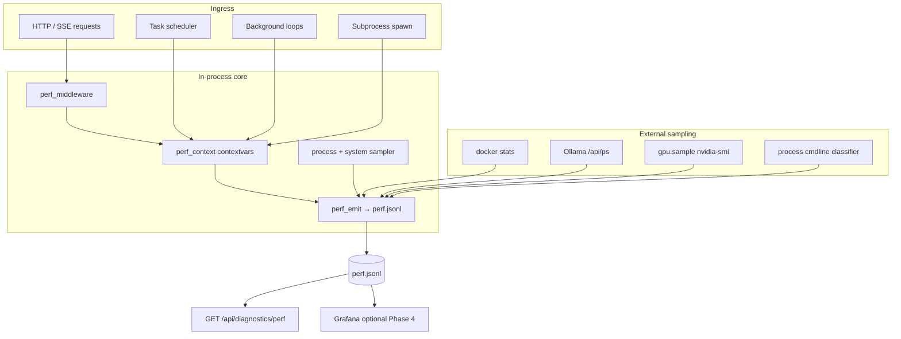

# Odysseus performance tracking — implementation roadmap

**Date:** 2026-06-27  
**Status:** On trunk (formerly `feat/performance-tracking`); Phases 1–4 base tracking implemented  
**Feature guide:** [`docs/features/performance.md`](../../features/performance.md)  
**Operator setup:** [`docs/performance-tracking.md`](../../performance-tracking.md)  
**Audience:** Engineers implementing attribution for `python.exe` CPU spikes and cross-process CPU/RAM/GPU correlation

---

## 1. Executive summary

### Problem

When Odysseus runs, Task Manager often shows **`python.exe` at 100% CPU with no caller label**. The app has stdlib logging and chat-side SSE metrics, but nothing ties resource use to a specific HTTP request, scheduled task, background loop, embedding batch, or subprocess spawn.

LLM token generation usually runs **out of process** (Ollama, vLLM, llama-server). When `python.exe` spikes, the cause is almost always **in-process** work: FastEmbed ONNX, email IMAP sync, tool-index embedding, RAG indexing, scheduled tasks, or `asyncio.to_thread` thread-pool work. Without correlation IDs and a unified event sink, operators cannot answer: *what was Odysseus doing when CPU hit 100%?*

### Goal

Build a **unified performance event bus** that:

- Emits structured events to `{DATA_DIR}/logs/perf.jsonl`
- Propagates **correlation IDs** across HTTP, tasks, agent runs, and subprocess spawns
- Samples CPU/RAM (process + system) and GPU (machine-level) on an interval
- Correlates in-process work with external processes (Ollama, Docker containers, Cookbook serves, Playwright MCP)
- Exposes admin diagnostics (and optionally Grafana) for post-hoc and live investigation

### Success criteria (MVP)

| Criterion | How to verify |
|-----------|---------------|
| Every HTTP request has `request_id` | Response header `X-Request-ID`; events in `perf.jsonl` |
| Scheduled task runs have `run_id` | `task.run.lifecycle` events join to `TaskRun` row |
| Top CPU suspects emit events | Email sync, tool index, embeddings, LLM calls log duration + caller |
| Background loops are named | `bg.work.completed` with `workload_name` |
| Admin can tail recent events | `GET /api/diagnostics/perf` (admin-gated) |
| Spike investigation playbook works | Given timestamp + `perf.jsonl`, identify overlapping `run_id` / `workload_name` |

---

## 2. Architecture overview

### Unified event bus

All subsystems write to a **single append-only JSONL sink**:

```
{DATA_DIR}/logs/perf.jsonl
```

Optional secondary sinks (Phase 4+): ring buffer in memory, SQLite `perf_events`, Prometheus `/metrics`, Grafana dashboards.

**Emitter module (new):** `core/perf_emit.py` — thin wrapper: validate schema version, append line, rotate via existing log patterns. No structlog/OpenTelemetry in Phase 1.

### Correlation ID model

| ID | Scope | Assigned by | Propagated via |
|----|-------|-------------|----------------|
| `request_id` | Single HTTP request / SSE stream | ASGI perf middleware | `request.state`, response header `X-Request-ID`, contextvars |
| `run_id` | Scheduled task execution (`TaskRun`) | `TaskScheduler._execute_task_locked` | contextvars, `TaskRun.metrics_json` |
| `task_id` | Scheduled task definition | DB | lifecycle events |
| `session_id` | Chat session | session routes | agent loop, subprocess tools, bg jobs |
| `job_id` | Detached `#!bg` bash job | `bg_jobs.launch` | `bg_jobs.json`, bg monitor follow-ups |
| `workload_name` | Named asyncio loop or startup task | lifespan / loop wrappers | contextvars (`core/perf_context.py`) |

**Parent linking:** `parent_operation_id` / `parent_run_id` for nested work (agent step under task run; LLM call under HTTP request).

### Context propagation (`contextvars`)

New module **`core/perf_context.py`** (pattern from `src/user_time.py`, `src/tool_execution.py`):

```python
# Conceptual — not implemented yet
request_id: ContextVar[str | None]
run_id: ContextVar[str | None]
session_id: ContextVar[str | None]
workload_kind: "http" | "bg_loop" | "startup" | "scheduler" | "poller" | "mcp_bootstrap"
workload_name: str  # e.g. "task_scheduler._loop", "email.poller.scheduled"
operation_stack: list[str]  # for asyncio.to_thread attribution
```

Read at emit sites: `llm_core`, `agent_loop`, `embeddings`, `email_local_store`, subprocess spawn hooks.

### System snapshot attachment

Background sampler (30–60s) writes `app.state.system_snapshot`:

```json
{
  "available_ram_gb": 22.1,
  "gpu_util_pct": [45, 12],
  "gpu_mem_used_mb": [8192, 1024],
  "sampled_at": "2026-06-27T15:04:05.123Z"
}
```

Reuse/extend `services/hwfit/hardware.py` (24h cache today). Attach **latest snapshot** to HTTP and task events as `system_at_start` / `system_at_end`. GPU reflects **machine state**, not per-request GPU accounting.

### Data flow (high level)



### Deployment awareness

Tag every event with `deployment`: `docker-compose` | `native` | `portable`. In Docker, main uvicorn runs **inside** `odysseus-odysseus-1`; host `python.exe` is CLI/agent tools, not the server. See [processes/05-docker-services.md](./processes/05-docker-services.md).

---

## 3. Phased implementation plan

### Phase 1 — Foundation (MVP attribution)

**Goal:** Any HTTP request and any `asyncio.to_thread` call can be traced in `perf.jsonl`.

| Deliverable | Details |
|-------------|---------|
| **`core/perf_emit.py`** | Append JSONL; schema version `v: 1`; thread-safe |
| **`core/perf_context.py`** | contextvars: `request_id`, `run_id`, `workload_*`, operation stack |
| **`core/perf_middleware.py`** | Pure ASGI (not BaseHTTPMiddleware); assign `request_id`; `X-Request-ID`, `X-Process-Time`; exclude `/static/*` noise |
| **`asyncio.to_thread` wrapper** | `core/async_thread.py` or monkey-patch site: log `thread.work.started/completed` with caller, func name, duration |
| **Process sampler** | Lifespan task: `process.sample` every 30–60s (RSS via `resource`; optional psutil if approved) |
| **Register middleware** | `app.py`: after auth, alongside timeout middleware |
| **Shared constants** | Sink path, stream prefixes mirror `_TIMEOUT_EXEMPT_PREFIXES` |

**Exit criteria:** Load test one chat stream; grep `perf.jsonl` for matching `request_id` on `http.request.*` and `stream.*` events.

### Phase 2 — Task and background instrumentation

**Goal:** Non-HTTP CPU (the main blind spot) gets labeled.

| Deliverable | Details |
|-------------|---------|
| **Wrap `_execute_task_locked`** | `src/task_scheduler.py`: context manager emits `task.run.lifecycle` (started/completed/failed) |
| **Extend `TaskRun`** | Add `metrics_json` column (or reuse `steps`); populate peak RSS, duration, `tokens_used` from agent metrics |
| **Name asyncio tasks** | `app.py` lifespan: `create_task(..., name="startup.tool_index_warmup")` |
| **Instrument background loops** | Wrap: `bg_monitor`, `email_pollers`, `task_scheduler._loop`, `cookbook_serve_lifecycle`, keepalive, null-owner sweep, skill audit |
| **Subprocess spawn logging** | `subprocess.spawned/completed` from `subprocess_tools.py`, `bg_jobs.py`; pass `request_id` through `tool_execution` |
| **Chat correlation** | `routes/chat_routes.py` → `agent_runs` / `agent_loop` with `request_id` |
| **Agent + LLM events** | `agent.prep.completed`, `llm.inference` in `agent_loop.py`, `llm_core.py` |

**Exit criteria:** Trigger manual task run + email poller tick; see `task.run.lifecycle` and `bg.work.completed` without any HTTP traffic.

### Phase 3 — External process sampling

**Goal:** Correlate app events with Ollama, Docker, GPU, and host process tree.

| Deliverable | Details |
|-------------|---------|
| **`docker stats` sampler** | `core/container_stats.py`: `container.sample` every 30–60s when docker.sock present; gate with `ODYSSEUS_CONTAINER_STATS=1` |
| **Ollama `/api/ps` poller** | On LLM stream start/end + background interval when Ollama configured; event `ollama.ps` |
| **`gpu.sample`** | Factor nvidia-smi from `routes/cookbook_routes.py`; join with `/api/ps` |
| **Process cmdline classifier** | `core/process_sampler.py`: WMI (Win) / `/proc` (Linux); regex → `process_class` (`playwright_mcp`, `ollama_runner`, `vllm`, …) |
| **Embedding + email phase timings** | `embedding.batch`, `email.sync` with `phases_ms` |
| **Cookbook serve events** | `serve_phase` on status poll phase change; optional `cookbook_serve.jsonl` |
| **MCP connect timing** | `mcp.connect`, `mcp.npx.spawn/skipped`, `mcp.tool.completed` for `builtin_browser` |

**Exit criteria:** During chat + Ollama inference, `perf.jsonl` contains overlapping `llm.inference`, `ollama.ps`, and `gpu.sample` timestamps.

### Phase 4 — Admin UI, diagnostics API, optional Grafana

**Goal:** Operators investigate without SSH or manual log grep.

| Deliverable | Details |
|-------------|---------|
| **`GET /api/diagnostics/perf`** | Admin-gated; tail `perf.jsonl` (limit, filter by event type, time window) |
| **`GET /api/diagnostics/subprocesses`** | Running fg children + bg jobs with PIDs |
| **`GET /api/diagnostics/containers`** | Latest `container.sample` rows |
| **`GET /api/tasks/runs/recent` + metrics** | Optional `?run_id=` resource overlay |
| **Frontend perf panel** | Extend chat metrics UI: `agent_prep_breakdown`, live perf SSE stream |
| **Grafana (optional)** | Host sidecar: Prometheus + Loki or JSONL shipper; dashboard rows: containers, host PIDs, GPU, SLO overlay |
| **Env flags** | `ODYSSEUS_PERF=1`, `ODYSSEUS_PROFILE=1` (dev), `ODYSSEUS_PERF_SUBPROC=1` |

**Exit criteria:** Admin UI shows last 100 events and active subprocesses; spike investigation needs no repo checkout.

---

## 4. Priority file changes

Consolidated from all investigation docs. **New files first**, then highest-impact edits.

| Priority | File | Change | Phase |
|----------|------|--------|-------|
| P0 | **`core/perf_emit.py`** (new) | JSONL emitter, schema `v: 1` | 1 |
| P0 | **`core/perf_context.py`** (new) | contextvars + helpers | 1 |
| P0 | **`core/perf_middleware.py`** (new) | Pure ASGI middleware, request_id | 1 |
| P0 | **`app.py`** | Register middleware; lifespan sampler; name startup tasks | 1–2 |
| P0 | **`core/async_thread.py`** (new) or central `to_thread` wrapper | Thread-pool attribution | 1 |
| P1 | **`src/task_scheduler.py`** | Wrap `_execute_task_locked`; lifecycle events | 2 |
| P1 | **`core/database.py`** | `TaskRun.metrics_json` (migration) | 2 |
| P1 | **`routes/chat_routes.py`** | Propagate `request_id` to agent | 2 |
| P1 | **`src/agent_loop.py`** | `request_id`, `agent.prep.completed`, workload tags | 2 |
| P1 | **`src/llm_core.py`** | `llm.inference` events; Ollama `/api/ps` hook | 2–3 |
| P1 | **`src/embeddings.py`**, **`src/embedding_lanes.py`** | `embedding.batch` events | 2–3 |
| P1 | **`routes/email_local_store.py`** | `email.sync` with phase timings | 2–3 |
| P2 | **`src/agent_tools/subprocess_tools.py`**, **`src/bg_jobs.py`**, **`src/tool_execution.py`** | PID + spawn/complete events | 2 |
| P2 | **`src/bg_monitor.py`**, **`routes/email_pollers.py`** | Loop instrumentation | 2 |
| P2 | **`core/subprocess_perf.py`** (new) | Shared subprocess event helpers | 2 |
| P2 | **`routes/diagnostics_routes.py`** | `/api/diagnostics/perf`, subprocesses, containers | 4 |
| P3 | **`core/container_stats.py`** (new) | docker stats parser | 3 |
| P3 | **`core/process_sampler.py`** (new) | Host process classifier | 3 |
| P3 | **`routes/cookbook_routes.py`**, **`src/cookbook_serve_lifecycle.py`** | Serve phase + poll metrics | 3 |
| P3 | **`src/builtin_mcp.py`**, **`src/mcp_manager.py`** | NPX spawn + tool timing | 3 |
| P3 | **`services/hwfit/hardware.py`** | Lightweight GPU query for sampler (extend cache) | 3 |
| P4 | **`docker-compose.yml`** | Optional `com.odysseus.performance.*` labels | 3–4 |
| P4 | **`scripts/diffusion_server.py`** | Share perf_middleware if diffusion latency matters | 4 |
| P4 | **`static/js/`** (chat/admin) | Perf panel SSE consumer | 4 |

### Reuse — do not duplicate

| File | Reuse for |
|------|-----------|
| `core/log_safety.py` | Redact URLs in logged paths |
| `src/service_health.py` | Bounded probe pattern; extend with container stats |
| `services/hwfit/hardware.py` | System/GPU snapshot |
| `core/platform_compat.py` | PID alive, detach kwargs (no psutil today) |

---

## 5. Event schema registry

All events use envelope fields where applicable:

```json
{
  "v": 1,
  "event": "<namespace>.<action>",
  "ts": "ISO8601",
  "deployment": "docker-compose|native|portable",
  "request_id": "optional",
  "run_id": "optional",
  "session_id": "optional",
  "workload_name": "optional"
}
```

### HTTP / streaming (Phase 1)

| Event | Key fields |
|-------|------------|
| `http.request.started` | `method`, `path`, `route`, `user`, `auth` |
| `http.request.completed` | `status`, `duration_ms`, `rss_start_kb`, `rss_end_kb`, `rss_delta_kb`, `system_snapshot` |
| `http.request.timeout` | `duration_ms`, `status: 504` |
| `stream.started` | `path`, exempt_timeout |
| `stream.first_byte` | `ttfb_ms` |
| `stream.ended` | `duration_ms`, `events_emitted`, `disconnect_reason` |

### Process / system (Phase 1–3)

| Event | Key fields |
|-------|------------|
| `process.sample` | `pid`, `role`, `cpu_percent`, `rss_mb`, `num_threads`, `asyncio_tasks`, `named_tasks` |
| `gpu.sample` | `source`, `gpus[]`, `processes[]`, optional `ollama_ps` |
| `container.sample` | `compose_service`, `cpu_percent`, `mem_usage_bytes`, `pids`, `source: docker_stats` |
| `process.attributed` | `process_class`, `pid`, `cpu_pct`, `rss_mb`, `cmdline_preview` |

### Tasks / background (Phase 2)

| Event | Key fields |
|-------|------------|
| `task.run.lifecycle` | `run_id`, `task_id`, `task_name`, `task_type`, `action`, `phase`, `trigger`, `source`, `duration_ms`, `error` |
| `task.run.resource_sample` | `run_id`, `process`, `system`, `gpu[]` |
| `task.run.agent_step` | `run_id`, `round`, `tool`, `duration_ms`, `exit_code` |
| `bg.work.started` / `bg.work.completed` | `workload_kind`, `workload_name`, `duration_ms`, `outcome`, `detail` |
| `bg.tick` | `workload_name`, `duration_ms` (loop iteration) |

### LLM / agent / embeddings (Phase 2–3)

| Event | Key fields |
|-------|------------|
| `llm.inference` | `provider`, `model`, `caller`, `latency_ms.ttfb/total`, `tokens`, `throughput`, `endpoint_host` |
| `llm.stream.chunk` | optional 1/N sampling |
| `agent.prep.completed` | `prep_timings`, `request_id`, `session_id` |
| `embedding.batch` | `lane`, `backend`, `batch_size`, `caller`, `latency_ms`, `dimension` |
| `chroma.op` | `collection`, `op`, `count`, `latency_ms`, `healthy` |

### Email / subprocess / MCP (Phase 2–3)

| Event | Key fields |
|-------|------------|
| `email.sync` | `account_id`, `folder`, `phases_ms`, `counts`, `backfill_complete` |
| `email.imap` | connect/fetch sub-ops |
| `subprocess.spawned` | `spawn_path` (B1/B2/B3), `child_pid`, `tool`, `command_preview`, `job_id` |
| `subprocess.completed` | `duration_ms`, `exit_code`, `timed_out` |
| `subprocess.rejected` | concurrency limit hit |
| `subprocess.progress` | `elapsed_s`, `tail_lines` |
| `bg_job.launched` / `bg_job.completed` | `job_id`, `session_id`, `pid`, `status` |
| `mcp.connect` | `server_id`, `duration_ms`, `child_pid`, `ok` |
| `mcp.npx.spawn` / `mcp.npx.skipped` | `package`, `fix_hint` |
| `mcp.tool.completed` | `server_id`, `tool_name`, `duration_ms`, `request_id` |

### Ollama / Cookbook (Phase 3)

| Event | Key fields |
|-------|------------|
| `ollama.ps` | `models[]`, `total_vram`, `host` |
| `ollama.server.up` | `model_count`, `host` |
| `serve_phase` | `session_id`, `backend`, `phase`, `port`, `elapsed_ms`, `remote` |
| `subprocess.spawn` | Cookbook/MCP spawn: `cmd` basename, `pid` |

---

## 6. Quick wins vs longer-term items

### Quick wins (days, high ROI)

| Item | Why |
|------|-----|
| **`perf.jsonl` + `perf_emit`** | Single sink; matches existing `search_analytics.json` pattern |
| **Pure ASGI middleware + `request_id`** | Covers 40+ routes without per-route edits |
| **`asyncio.to_thread` wrapper** | Attributes email sync, tool index, IMAP — top unexplained CPU |
| **Wrap `_execute_task_locked`** | One hook captures all scheduled task types |
| **Name lifespan `create_task` calls** | Enables `asyncio.all_tasks()` introspection |
| **Log subprocess PID at spawn** | Enables ad hoc `py-spy -p <pid>` |
| **`GET /api/diagnostics/perf` tail** | Admin can investigate without shell |
| **Env bisection toggles** | `ODYSSEUS_INPROCESS_POLLERS=0`, `ODYSSEUS_INPROCESS_TASKS=0`, `ODYSSEUS_DISABLE_MCP=1` isolate subsystems today |

### Medium term (1–2 weeks)

| Item | Why |
|------|-----|
| Embedding + email phase timings | Pinpoints FastEmbed vs IMAP vs SQLite |
| Ollama `/api/ps` on LLM stream | Correlates wait time vs VRAM |
| Background loop wrappers | Explains 100% CPU with no HTTP |
| `TaskRun.metrics_json` | UI Activity panel + post-hoc graphs |
| Process sampler + `gpu.sample` | Machine-level overlay on events |
| Cookbook `serve_phase` events | Time-to-ready per backend |

### Longer term (optional / heavier)

| Item | Why |
|------|-----|
| OpenTelemetry traces | Cross-service (Chroma, diffusion, remote Ollama) |
| Prometheus + Grafana stack | Fleet monitoring, SLO dashboards |
| psutil / py3nvml dependencies | Finer CPU/thread/GPU vs subprocess nvidia-smi |
| Global subprocess concurrency caps | Policy + `subprocess.rejected` metrics |
| SQLite `perf_events` table | Queryable history vs raw JSONL |
| cAdvisor sidecar in Compose | Time-series container metrics |
| Multi-worker uvicorn support | File-backed store required if workers > 1 |

---

## 7. Testing and validation strategy

### Unit tests

| Area | Test |
|------|------|
| `perf_emit` | Append line, rotation, malformed event rejected |
| `perf_middleware` | Assigns `request_id`; streams emit `stream.first_byte`; static paths excluded |
| `perf_context` | contextvars propagate across `async` boundaries; cleared in `finally` |
| `to_thread` wrapper | Emits start/complete; attributes caller module |
| Task instrumentation | Mock scheduler: lifecycle phases on success/fail/abort |

### Integration tests

| Scenario | Assert |
|----------|--------|
| `POST /api/chat_stream` | `perf.jsonl` contains `http.request.*`, `stream.*`, shared `request_id` |
| Manual `POST /api/tasks/{id}/run` | `task.run.lifecycle` + optional `request_id` link |
| `sync_local_emails` task or `POST /local/sync` | `email.sync` with `phases_ms` |
| Agent bash tool | `subprocess.spawned` + `completed` with PID |
| Docker compose up | `container.sample` when `ODYSSEUS_CONTAINER_STATS=1` |

Existing: `tests/test_chat_metrics.py` — extend for server-side perf events where applicable.

### Manual validation playbook

1. **Confirm process identity** — port 7000 listener = A1 uvicorn; distinguish from `ollama.exe`, MCP children.
2. **Baseline idle** — 5 min idle; count `process.sample` rate; note background loop cadences (5s bg_monitor, 30s email poller, 60s keepalive).
3. **HTTP path** — single chat message; join `request_id` across HTTP + `agent.prep` + `llm.inference`.
4. **Background path** — run scheduled task; verify no HTTP but `task.run.lifecycle` present.
5. **CPU spike reproduction** — trigger tool-index query or email sync; verify `embedding.batch` or `email.sync` overlaps high `process.sample.cpu_percent`.
6. **External correlation** — during Ollama chat, confirm `ollama.ps` + `gpu.sample` align with `llm.inference` timestamps.
7. **py-spy confirmation** — `py-spy record --pid <A1> --duration 30 --subprocesses`; stacks match `workload_name` from JSONL.
8. **Docker mode** — high CPU in `odysseus-odysseus-1` vs host `python.exe`; use `docker top` not host py-spy.

### Performance guardrails

- JSONL append must not block event loop (buffered write or `to_thread` for flush).
- Exclude `/static/*` from HTTP events to limit volume.
- GPU/Ollama/docker sampling: 5–30s intervals, not per-request.
- PII: log route template and username only; follow `core/log_safety.py`.

---

## 8. Detailed documentation index

### Top-level findings (Agents 1–5)

| Doc | Focus |
|-----|-------|
| [01-api-server-layer.md](./01-api-server-layer.md) | FastAPI middleware, SSE, lifespan, HTTP event schemas, system snapshot |
| [02-tasks-jobs-system.md](./02-tasks-jobs-system.md) | TaskScheduler, cron/event triggers, `_execute_task_locked`, CPU tier list |
| [03-llm-inference-integrations.md](./03-llm-inference-integrations.md) | LLM, embeddings, email sync, GPU vs CPU, attribution checklist |
| [04-python-process-inventory.md](./04-python-process-inventory.md) | All Python PIDs (A1–D36), spawn mechanisms, 7-agent assignment |
| [05-node-docker-shell-processes.md](./05-node-docker-shell-processes.md) | Docker/Node/Ollama launch trees, unified dashboard architecture |

### Process-level deep dives (`processes/`)

| Doc | Focus |
|-----|-------|
| [processes/01-core-uvicorn.md](./processes/01-core-uvicorn.md) | A1 main process: lifespan loops, py-spy, workload_name hooks |
| [processes/02-builtin-mcp.md](processes/02-builtin-mcp.md) | Python MCP children A2–A5 (image_gen, memory, rag, email) |
| [processes/03-agent-tools-bg-jobs.md](./processes/03-agent-tools-bg-jobs.md) | B1–B3 bash/python/bg jobs, PID logging, concurrency limits |
| [processes/04-cookbook-serves.md](./processes/04-cookbook-serves.md) | B4–B6, C1–C5 serves, tmux/PID files, GPU/port correlation |
| [processes/05-docker-services.md](./processes/05-docker-services.md) | Compose services, docker stats, cAdvisor, host vs container Python |
| [processes/06-node-ollama-external.md](./processes/06-node-ollama-external.md) | Playwright MCP, Ollama `/api/ps`, apfel, gpu.sample joins |

---

## 9. Operational attribution cheat sheet

When **`python.exe` @ 100%**:

```
1. Confirm A1 (uvicorn app:app on port 7000) vs ollama.exe vs MCP child
2. Read perf.jsonl for overlapping bg.work.started / task.run.lifecycle (no completed yet)
3. Check cadence: 5s bg_monitor | 30s email poller | 20m sync_local_emails | startup tool_index
4. py-spy --subprocesses on A1 PID
5. If Docker: docker stats odysseus-odysseus-1, then docker top
```

**Join keys for cross-doc investigation:** `request_id`, `run_id`, `job_id`, `session_id`, `workload_name`, `session_id` (Cookbook serve).

---

## 10. Next actions (recommended order)

1. ~~Create `core/perf_emit.py`, `core/perf_context.py`, `core/perf_middleware.py`~~ **Done**
2. ~~Wire middleware + sampler in `app.py` lifespan~~ **Done**
3. ~~Add `to_thread` wrapper at highest-traffic call sites~~ **Done** (`core/async_thread.py`)
4. ~~Wrap `_execute_task_locked` + name startup tasks~~ **Done**
5. ~~Thread `request_id` through chat → agent → subprocess~~ **Done**
6. ~~Add `GET /api/diagnostics/perf`~~ **Done**
7. ~~Layer embedding/email/LLM events~~ **Done**
8. ~~Add docker stats + Ollama `/api/ps` + gpu.sample~~ **Done**
9. Instrument MCP children per `processes/02-builtin-mcp.md` (PID logging, `_do_call` latency)

### Per-task resource sampling (implemented)

See **`06-per-task-performance-plan.md`** for the full design. Shipped on this branch:

- `core/perf_runs.py` — active-run registry + peak/avg aggregates
- `core/cpu_meter.py` — CPU% via psutil (optional) or `os.times` fallback
- `core/process_sampler.py` — adaptive 2s/30s cadence, `task.run.resource_sample` events
- `src/task_scheduler.py` — `run_id` context for full execution; `metrics_json` on all exit paths
- `routes/task_routes.py` — `metrics` on run APIs; `GET .../runs/{run_id}/samples`
- `static/js/tasks.js` — Activity + run history perf badge + sparkline

---

*This roadmap synthesizes all `docs/research/performance/` investigation docs on trunk. Phases 1–4 base tracking and per-task sampling are implemented.*
